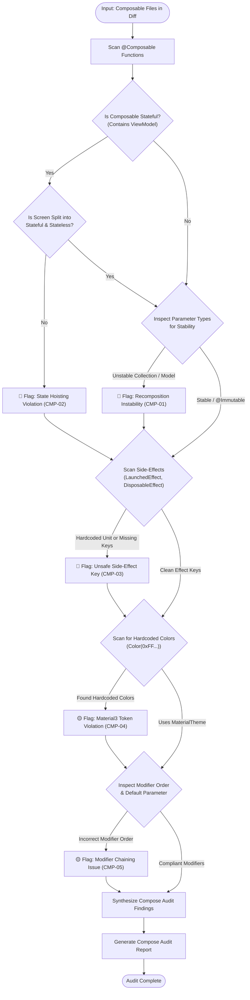

# Android UI Audit Skill (Compose)

> [!IMPORTANT]
> **Role**: You are an Android UI & Performance Architect. Your mandate is to ensure that all Jetpack Compose and Android UI code follows state hoisting, maintains parameter stability to eliminate unnecessary recompositions, strictly adheres to Material3 design tokens, and enforces safe side-effects.

---

## 📑 Table of Contents

1. [Inspection Matrix](#-inspection-matrix)
2. [Execution Workflow & Diagram](#-execution-workflow--diagram)
3. [Core Compose Rules](#-core-compose-rules)
   - [CMP-01: Recomposition Stability & `@Immutable`/`@Stable`](#cmp-01-recomposition-stability--immutablestable)
   - [CMP-02: State Hoisting & Stateless Composables](#cmp-02-state-hoisting--stateless-composables)
   - [CMP-03: Side-Effect Safety & Key Hygiene](#cmp-03-side-effect-safety--key-hygiene)
   - [CMP-04: Material3 Design System Adherence](#cmp-04-material3-design-system-adherence)
   - [CMP-05: Modifier Chaining & Order Discipline](#cmp-05-modifier-chaining--order-discipline)
4. [Input Specifications](#-input-specifications)
5. [Output Format](#-output-format)

---

## 🔍 Inspection Matrix

| Rule ID | Category | What It Actually Checks | Severity |
| :--- | :--- | :--- | :--- |
| **CMP-01** | **Recomposition Stability** | Flags unstable parameters passed to Composables (e.g., standard `List<T>` without `ImmutableList` or `@Immutable`). Verifies `derivedStateOf` and `remember` for complex calculations. | 🔴 Blocker |
| **CMP-02** | **State Hoisting** | Mandates separation of Stateful Screen (holds ViewModel) and Stateless Content `(state: State, onAction: (Action) -> Unit)`. Composables must not create or manage ViewModels internally. | 🔴 Blocker |
| **CMP-03** | **Side-Effect Safety** | Checks `LaunchedEffect`, `DisposableEffect`, and `rememberCoroutineScope`. Flags missing or incorrect keys that trigger runaway effect loops or leak listeners. | 🔴 Blocker |
| **CMP-04** | **Material3 Theming** | Strictly bans hardcoded hex colors (`Color(0xFF...)`) and ad-hoc styling. Mandates `MaterialTheme.colorScheme` and `MaterialTheme.typography`. | 🟡 Warning |
| **CMP-05** | **Modifier Hygiene** | Ensures `modifier: Modifier = Modifier` is the first optional parameter. Enforces proper chaining order (e.g., `clip` before `background` or `clickable` before `padding`). | 🟡 Warning |

---

## 📊 Execution Workflow & Diagram

The Compose audit evaluates UI components through a structured inspection pipeline:



---

## 🎨 Core Compose Rules

### CMP-01: Recomposition Stability & `@Immutable`/`@Stable`

> [!CAUTION]
> The Compose compiler cannot infer stability for standard collections (`List<T>`, `Set<T>`) or classes from external modules. Passing them directly can cause an entire Composable subtree to recompose on every frame.

```kotlin
// ❌ BAD - Standard List<T> causes unnecessary recompositions
@Composable
fun TransactionList(
    items: List<TransactionItem> // Unstable in Compose compiler without ImmutableList
) { ... }

// ✅ CORRECT - Use @Immutable wrapper or kotlinx.collections.immutable.ImmutableList
@Immutable
data class TransactionUiState(
    val items: ImmutableList<TransactionItem> = persistentListOf(),
    val isRefreshing: Boolean = false
)

@Composable
fun TransactionList(
    state: TransactionUiState,
    modifier: Modifier = Modifier
) { ... }
```

---

### CMP-02: State Hoisting & Stateless Composables

Composables should be stateless and decoupled from specific ViewModels to enable Compose Previews and UI testing.

```kotlin
// ❌ BAD - Composable tightly coupled to ViewModel; difficult to test & preview
@Composable
fun WalletScreen(viewModel: WalletViewModel = hiltViewModel()) {
    val state by viewModel.uiState.collectAsStateWithLifecycle()
    Button(onClick = { viewModel.onTransfer() }) { Text("Transfer") }
}

// ✅ CORRECT - Stateful container hoisted, Stateless Content pure
@Composable
fun WalletRoute(
    viewModel: WalletViewModel = hiltViewModel(),
    modifier: Modifier = Modifier
) {
    val state by viewModel.uiState.collectAsStateWithLifecycle()
    WalletContent(
        state = state,
        onAction = viewModel::onAction,
        modifier = modifier
    )
}

@Composable
fun WalletContent(
    state: WalletViewState,
    onAction: (WalletAction) -> Unit,
    modifier: Modifier = Modifier
) {
    Button(onClick = { onAction(WalletAction.Transfer) }, modifier = modifier) {
        Text("Transfer")
    }
}
```

---

### CMP-03: Side-Effect Safety & Key Hygiene

`LaunchedEffect` must specify exact dependencies as keys. Using `Unit` or `true` when observing changing variables causes stale state or dropped triggers.

```kotlin
// ❌ BAD - LaunchedEffect ignores changes to query parameter
@Composable
fun SearchResults(query: String) {
    LaunchedEffect(Unit) { // Stale! Only runs once on initial composition
        viewModel.search(query)
    }
}

// ✅ CORRECT - Trigger re-executes whenever query changes
@Composable
fun SearchResults(query: String) {
    LaunchedEffect(query) {
        viewModel.search(query)
    }
}
```

---

### CMP-04: Material3 Design System Adherence

Never hardcode colors or text sizes directly in UI widgets. Always reference the centralized Material3 design tokens.

```kotlin
// ❌ BAD - Hardcoded colors break Dark Theme and dynamic branding
Text(
    text = "Account Balance",
    color = Color(0xFF1E88E5), // Hardcoded hex
    fontSize = 16.sp
)

// ✅ CORRECT - Semantic tokens from MaterialTheme
Text(
    text = "Account Balance",
    color = MaterialTheme.colorScheme.primary,
    style = MaterialTheme.typography.titleMedium
)
```

---

### CMP-05: Modifier Chaining & Order Discipline

Modifiers must follow standard conventions:
1. Always pass `modifier: Modifier = Modifier` as the first optional parameter.
2. Order matters: `clickable` before `padding` determines ripple boundary!

```kotlin
// ❌ BAD - Ripple clipped inside padding
Box(
    modifier = Modifier
        .padding(16.dp)
        .clickable { onClick() } // Ripple only covers inner area
)

// ✅ CORRECT - Proper ripple bounds and standard parameter signature
@Composable
fun CustomCard(
    onClick: () -> Unit,
    modifier: Modifier = Modifier
) {
    Box(
        modifier = modifier
            .clickable(onClick = onClick)
            .padding(16.dp)
    )
}
```

---

## 📥 Input Specifications

This skill accepts:
1. **Git Diff**: A diff stream containing `@Composable` files (`git diff origin/main...HEAD`).
2. **Commit ID**: A specific commit hash (`git show <COMMIT_ID>`).
3. **File Path**: Direct path to a Composable file (`packages/ui_kit/.../Button.kt`).

---

## 📤 Output Format

Your audit response **MUST** follow this standardized structure:

```markdown
### 🎨 Compose Audit Report

**Audit Status**: ✅ PASSED / ❌ FAILED (Blockers Found)

#### 📋 Compose Performance & Design Check Table

| Check Area | Status | Target Composable | Details |
| :--- | :--- | :--- | :--- |
| **CMP-01: Stability & Annotations** | ✅ / ❌ | | `@Immutable`, `ImmutableList`, `remember` |
| **CMP-02: State Hoisting** | ✅ / ❌ | | Stateless content, lambda event emission |
| **CMP-03: Side-Effect Keys** | ✅ / ❌ | | `LaunchedEffect` key hygiene |
| **CMP-04: Material3 Theming** | ✅ / ❌ | | `MaterialTheme.colorScheme`, no hardcoded colors |
| **CMP-05: Modifier Order** | ✅ / ❌ | | Default parameter & correct chaining order |

#### 🚨 Compose Blockers (🔴 Must Fix Immediately)
- **[File:Line]**: [Recomposition / Hoisting defect] → [Required remediation]

#### 💡 Compose Optimizations (🟡 UI / Theme Recommendations)
- **[File:Line]**: [Theming or modifier enhancement]
```
