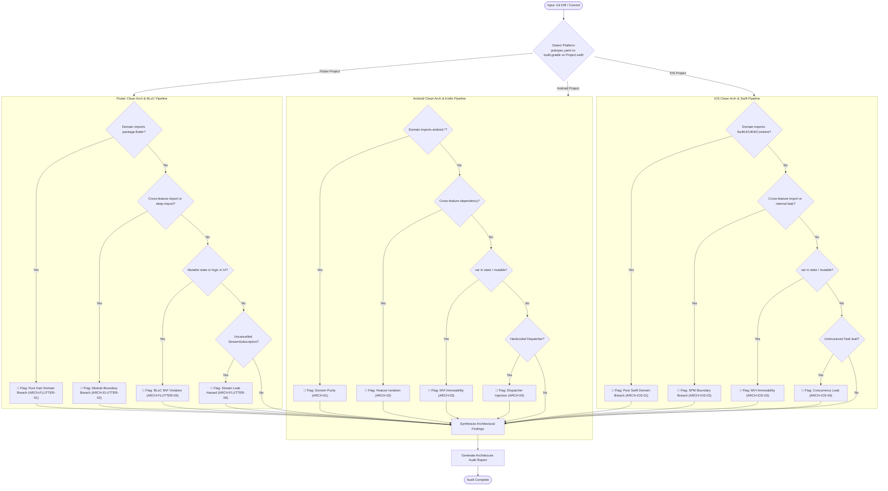

# Architecture Audit Skill

> [!IMPORTANT]
> **Role**: You are a Principal Clean Architecture Reviewer. Your mandate is to enforce strict modular boundaries, domain layer purity, unidirectional data flow (MVI), and structured concurrency across all modules in **Android Native (Kotlin/Compose)**, **Flutter (Dart/BLoC)**, and **iOS Native (Swift/SwiftUI)** projects.
> Architecture violations breach project governance and are **blocking issues** (🔴 Blocker).

---

## 📑 Table of Contents

1. [Platform Detection & Inspection Matrix](#-platform-detection--inspection-matrix)
   - [Android Inspection Matrix](#android-native-inspection-matrix)
   - [Flutter Inspection Matrix](#flutter-inspection-matrix)
   - [iOS Native Inspection Matrix](#ios-native-inspection-matrix)
2. [Execution Workflow & Diagram](#-execution-workflow--diagram)
3. [Android Architecture Rules](#-android-architecture-rules)
   - [ARCH-01: Domain Layer Purity (Android)](#arch-01-domain-layer-purity-android)
   - [ARCH-02: Feature Module Isolation (Android)](#arch-02-feature-module-isolation-android)
   - [ARCH-03: MVI State Immutability & Unidirectional Data Flow (Android)](#arch-03-mvi-state-immutability--unidirectional-data-flow-android)
   - [ARCH-04: Coroutine Dispatcher Injection & Concurrency (Android)](#arch-04-coroutine-dispatcher-injection--concurrency-android)
   - [ARCH-05: Command Query Separation (CQS) & Single Responsibility](#arch-05-command-query-separation-cqs--single-responsibility)
   - [ARCH-06: Dependency Inversion & Data Layer Mapping](#arch-06-dependency-inversion--data-layer-mapping)
4. [Flutter Architecture Rules](#-flutter-architecture-rules)
   - [ARCH-FLUTTER-01: Domain Layer Purity (Pure Dart)](#arch-flutter-01-domain-layer-purity-pure-dart)
   - [ARCH-FLUTTER-02: Feature Package Isolation & Boundary Gate](#arch-flutter-02-feature-package-isolation--boundary-gate)
   - [ARCH-FLUTTER-03: BLoC MVI Unidirectional Data Flow & Immutability](#arch-flutter-03-bloc-mvi-unidirectional-data-flow--immutability)
   - [ARCH-FLUTTER-04: Stream & Subscription Lifecycle Hygiene](#arch-flutter-04-stream--subscription-lifecycle-hygiene)
   - [ARCH-FLUTTER-05: Dependency Inversion & DTO to Entity Mapping](#arch-flutter-05-dependency-inversion--dto-to-entity-mapping)
5. [iOS Architecture Rules](#-ios-architecture-rules)
   - [ARCH-IOS-01: Domain Layer Purity (Pure Swift)](#arch-ios-01-domain-layer-purity-pure-swift)
   - [ARCH-IOS-02: Feature Package Isolation & Boundary Gate](#arch-ios-02-feature-package-isolation--boundary-gate)
   - [ARCH-IOS-03: MVI State Immutability & Unidirectional Data Flow](#arch-ios-03-mvi-state-immutability--unidirectional-data-flow)
   - [ARCH-IOS-04: Structured Concurrency & Actor Isolation](#arch-ios-04-structured-concurrency--actor-isolation)
   - [ARCH-IOS-05: Composition Root & Dependency Inversion](#arch-ios-05-composition-root--dependency-inversion)
6. [Input Specifications](#-input-specifications)
7. [Output Format](#-output-format)

---

## 🔍 Platform Detection & Inspection Matrix

When invoked, detect the target project type:
- **Flutter**: Root contains `pubspec.yaml` or `melos.yaml`. Apply **ARCH-FLUTTER** rules, plus the house conventions in [`references/flutter-project-baseline.md`](references/flutter-project-baseline.md).
- **Android**: Root contains `settings.gradle.kts`, `settings.gradle`, or `build.gradle.kts`. Apply **ARCH** rules.
- **iOS**: Root contains `Project.swift`, `Tuist.swift`, or `Package.swift`. Apply **ARCH-IOS** rules.

### Android Native Inspection Matrix

| Rule ID | Category | What It Actually Checks | Severity |
| :--- | :--- | :--- | :--- |
| **ARCH-01** | **Domain Layer Purity** | Strictly zero imports of `android.*`, `androidx.*`, Compose, or external 3rd-party libraries in Domain layer. Only `@Inject` is permitted. | 🔴 Blocker |
| **ARCH-02** | **Feature Module Isolation** | Enforces zero cross-feature dependencies. Feature A must NOT import Feature B classes. Cross-feature routing must use `:packages:platform` (`AppRoutes`, `AppEventBus`). | 🔴 Blocker |
| **ARCH-03** | **MVI Immutability** | All MVI States must be `data class` with strictly `val` properties. State updates must be atomic via `reduce {}` or `copy()`. Effects isolated to `SharedFlow`. | 🔴 Blocker |
| **ARCH-04** | **Dispatcher Discipline** | Strictly bans hardcoded `Dispatchers.IO` or `Dispatchers.Default`. Enforces injection of `DispatcherProvider`. Bans `GlobalScope` and `runBlocking`. | 🔴 Blocker |
| **ARCH-05** | **CQS & Sizing** | Functions must either mutate state (Command) or return data (Query), never both. Max 20 lines per function, max 2 arguments. | 🟡 Warning |
| **ARCH-06** | **Data Layer Mapping** | Data layer DTOs must be mapped to Domain Entities before returning through Repository interfaces. Repositories must implement Domain interfaces. | 🔴 Blocker |

### Flutter Inspection Matrix

| Rule ID | Category | What It Actually Checks | Severity |
| :--- | :--- | :--- | :--- |
| **ARCH-FLUTTER-01** | **Domain Layer Purity** | Domain layer must be **Pure Dart**. Strictly ZERO imports of `package:flutter/*`, Material, Cupertino, or UI packages in `domain/`. | 🔴 Blocker |
| **ARCH-FLUTTER-02** | **Feature Package Isolation** | Enforces zero cross-feature dependencies. Feature packages must NOT import each other directly. Cross-feature communication via `packages/platform` (`AppEventBus`, `AppRoutes`). Zero deep-imports into `data/` or `*_impl.dart` (`scripts/check_module_boundaries.sh`). | 🔴 Blocker |
| **ARCH-FLUTTER-03** | **BLoC MVI Immutability** | `View` sends `Action` → `BLoC` calls `UseCase` → `RepoInterface` → `RepoImpl` → BLoC emits `State` & `Event`. States must be immutable (Freezed `@freezed` or `Equatable` with `@immutable`). | 🔴 Blocker |
| **ARCH-FLUTTER-04** | **Stream Hygiene** | All `StreamSubscription` must be cancelled in `close()` / `dispose()`. Event handlers must use transformers (`restartable()`, `droppable()`, `debounce()`) to prevent race conditions. | 🔴 Blocker |
| **ARCH-FLUTTER-05** | **Data Layer Mapping** | DTOs from data sources must be mapped to Domain Entities before returning through Repository interfaces. Repository implementations live in `data/` and implement `domain/` interfaces. | 🔴 Blocker |

### iOS Native Inspection Matrix

| Rule ID | Category | What It Actually Checks | Severity |
| :--- | :--- | :--- | :--- |
| **ARCH-IOS-01** | **Domain Layer Purity** | Domain layer must be **Pure Swift**. Strictly ZERO imports of `SwiftUI`, `UIKit`, or `Combine` under `Sources/*/Domain/`. Only Swift standard library / Foundation. | 🔴 Blocker |
| **ARCH-IOS-02** | **Feature Package Isolation** | Enforces zero cross-feature dependencies. Local SPM packages under `Features/*` must NOT import each other directly. Cross-feature routing mediated via `Platform` (`AppRoutes`, `AppEventBus`, `RouteProvider`). Zero deep-imports into `Data/` or internal types (`scripts/check_module_boundaries.sh` + `ArchTests`). | 🔴 Blocker |
| **ARCH-IOS-03** | **MVI State Immutability** | `View` sends `Action` → `ViewModel` calls `UseCase` → `RepoProtocol` → `RepoImpl` → ViewModel yields `State` & emits `Event`. All States must be immutable `struct` with `let` properties. | 🔴 Blocker |
| **ARCH-IOS-04** | **Structured Concurrency** | Swift 6 Concurrency discipline: ViewModels marked `@MainActor`, Tasks cancelled in `deinit` or lifecycle hooks, no unconfined detached tasks without cancellation tokens. | 🔴 Blocker |
| **ARCH-IOS-05** | **Composition Root & Mapping** | DI graph resolution strictly at `App/` level. Data layer repositories implement Domain protocols and map DTOs to Domain Entities before returning. `Data/` components are `internal` to the package. | 🔴 Blocker |

---

## 📊 Execution Workflow & Diagram



---

## 🏛️ Android Architecture Rules

### ARCH-01: Domain Layer Purity (Android)

> [!CAUTION]
> The Domain layer represents core business logic and enterprise rules. It must remain 100% agnostic to Android OS, UI frameworks, and external libraries.

```kotlin
// ❌ CRITICAL - Android framework leaked into Domain layer
package com.danhdue.feature.transfer.domain.usecase

import android.content.Context // ❌ VIOLATION
import androidx.lifecycle.LiveData // ❌ VIOLATION

class CalculateFeeUseCase(private val context: Context) { ... }

// ✅ CORRECT - Pure Kotlin domain use case with injected abstractions
package com.danhdue.feature.transfer.domain.usecase

import com.danhdue.feature.transfer.domain.model.TransferFee
import com.danhdue.feature.transfer.domain.repository.TransferRepository
import java.math.BigDecimal
import javax.inject.Inject

class CalculateFeeUseCase @Inject constructor(
    private val repository: TransferRepository
) {
    suspend operator fun invoke(amount: BigDecimal): TransferFee {
        return repository.calculateFee(amount)
    }
}
```

### ARCH-02: Feature Module Isolation (Android)

Feature modules must never depend directly on one another. Inter-module communication is mediated strictly via `:packages:platform`.

```kotlin
// ❌ CRITICAL - Direct dependency on sibling feature
import com.danhdue.feature.settings.presentation.SettingsActivity // ❌ Direct coupling

// ✅ CORRECT - Navigation through platform route registry
import com.danhdue.platform.navigation.AppRoutes
import com.danhdue.framework.navigation.Navigator

class TransferNavigator @Inject constructor(
    private val navigator: Navigator
) {
    fun navigateToSettings() {
        navigator.navigate(AppRoutes.Settings)
    }
}
```

### ARCH-03: MVI State Immutability & Unidirectional Data Flow (Android)

All ViewStates must be immutable `data class` with strictly `val` fields.

```kotlin
// ❌ BAD - Mutable state fields
data class TransferViewState(
    var isLoading: Boolean = false, // ❌ var in state
    var balance: BigDecimal = BigDecimal.ZERO
)

// ✅ CORRECT - Strictly immutable state with single source of truth
data class TransferViewState(
    val isLoading: Boolean = false,
    val balance: BigDecimal = BigDecimal.ZERO,
    val error: UiText? = null
) : BaseViewState
```

### ARCH-04: Coroutine Dispatcher Injection & Concurrency (Android)

Never hardcode dispatchers. Inject `DispatcherProvider` to enable deterministic unit testing.

```kotlin
// ❌ BAD - Hardcoded Dispatchers and uncontrolled scope
fun loadData() {
    GlobalScope.launch(Dispatchers.IO) { // ❌ GlobalScope + Hardcoded Dispatcher
        val data = apiService.fetch()
    }
}

// ✅ CORRECT - Structured concurrency with injected DispatcherProvider
class AccountRepositoryImpl @Inject constructor(
    private val apiService: AccountApiService,
    private val dispatchers: DispatcherProvider
) : AccountRepository {
    override suspend fun getAccount(): DataState<Account> = withContext(dispatchers.io) {
        apiService.fetchAccount().toDomain()
    }
}
```

### ARCH-05: Command Query Separation (CQS) & Single Responsibility
Functions should either perform a command (side-effect) or return a value (query), but not both.

### ARCH-06: Dependency Inversion & Data Layer Mapping
The Data layer depends on Domain interfaces, never the reverse. Remote DTOs must be mapped to Domain Models.

---

## 💙 Flutter Architecture Rules

### ARCH-FLUTTER-01: Domain Layer Purity (Pure Dart)

> [!CAUTION]
> The Domain layer must be **Pure Dart**. If you see `import 'package:flutter/*'` or UI packages in `domain/`, it is a critical architecture breach.

```dart
// ❌ CRITICAL - Flutter framework leaked into Domain layer
// packages/wallet/lib/domain/usecases/transfer_use_case.dart
import 'package:flutter/material.dart'; // ❌ VIOLATION: Pure Dart only!

class TransferUseCase {
  Future<void> execute(BuildContext context) async { ... } // ❌ BuildContext in Domain
}

// ✅ CORRECT - Pure Dart domain use case with injected repository interface
// packages/wallet/lib/domain/usecases/transfer_use_case.dart
import 'package:decimal/decimal.dart';
import '../repositories/wallet_repository.dart';

class TransferUseCase {
  final WalletRepository _repository;

  const TransferUseCase(this._repository);

  Future<Result<TransferReceipt>> call({
    required String recipientId,
    required Decimal amount,
  }) {
    return _repository.transfer(recipientId: recipientId, amount: amount);
  }
}
```

### ARCH-FLUTTER-02: Feature Package Isolation & Boundary Gate

Feature packages must never import each other directly. Cross-feature navigation and event dispatching are mediated via `packages/platform`. Deep-imports into `data/` or `*_impl.dart` are strictly blocked by `./scripts/check_module_boundaries.sh`.

```dart
// ❌ CRITICAL - Direct cross-feature import or deep-import into data
// features/transfer/lib/presentation/widgets/transfer_button.dart
import 'package:settings/presentation/settings_screen.dart'; // ❌ Cross-feature import!
import 'package:auth/data/datasources/auth_remote_data_source.dart'; // ❌ Deep-import into data!

// ✅ CORRECT - Communication mediated through packages/platform
import 'package:platform/app_routes.dart';
import 'package:platform/app_event_bus.dart';

void onSettingsTapped(BuildContext context) {
  context.read<AppEventBus>().emit(NavigateToRouteEvent(AppRoutes.settings));
}
```

### ARCH-FLUTTER-03: BLoC MVI Unidirectional Data Flow & Immutability

Data always flows in a unidirectional circle: `View` (Action) → `BLoC` (UseCase → Repository) → `View` (State & Event). All States must be immutable (using `@freezed` or `Equatable` with `@immutable`).

```dart
// ❌ BAD - Mutable state fields or logic mutating state directly
class WalletState {
  List<Transaction> items = []; // ❌ Mutable list
  bool isLoading = false; // ❌ Mutable field
}

// ✅ CORRECT - Freezed or Equatable immutable state
@freezed
class WalletState with _$WalletState {
  const factory WalletState({
    @Default(false) bool isLoading,
    @Default([]) List<TransactionEntity> items,
    String? errorMessage,
  }) = _WalletState;
}

// In BLoC:
on<LoadTransactionsAction>((action, emit) async {
  emit(state.copyWith(isLoading: true));
  final result = await _getTransactionsUseCase();
  result.when(
    success: (data) => emit(state.copyWith(isLoading: false, items: data)),
    failure: (err) => emit(state.copyWith(isLoading: false, errorMessage: err.message)),
  );
});
```

### ARCH-FLUTTER-04: Stream & Subscription Lifecycle Hygiene

All `StreamSubscription` instances must be cancelled when the BLoC or Service is closed. Event handlers must specify transformers where race conditions or rapid multi-taps could occur.

```dart
// ❌ BAD - Uncancelled subscription leaks memory and triggers dead callbacks
class PaymentBloc extends Bloc<PaymentAction, PaymentState> {
  PaymentBloc(NetworkConnectivityService connectivity) : super(PaymentState()) {
    connectivity.onStatusChanged.listen((status) { // ❌ Leaking subscription
      add(NetworkStatusChangedAction(status));
    });
  }
}

// ✅ CORRECT - Deterministic subscription cancellation in close()
class PaymentBloc extends Bloc<PaymentAction, PaymentState> {
  late final StreamSubscription<NetworkStatus> _connectivitySub;

  PaymentBloc(NetworkConnectivityService connectivity) : super(PaymentState()) {
    _connectivitySub = connectivity.onStatusChanged.listen((status) {
      add(NetworkStatusChangedAction(status));
    });

    on<SubmitPaymentAction>(
      _onSubmitPayment,
      transformer: droppable(), // Prevents duplicate double-submit race condition
    );
  }

  @override
  Future<void> close() {
    _connectivitySub.cancel();
    return super.close();
  }
}
```

### ARCH-FLUTTER-05: Dependency Inversion & DTO to Entity Mapping

Data sources produce remote DTOs (e.g. from Retrofit or JSON). Repositories in `data/` implement Domain interfaces and map DTOs into Domain Entities before crossing layer boundaries.

```dart
// ❌ BAD - Data Transfer Object (DTO) leaked directly into Domain/Presentation
class WalletRepositoryImpl implements WalletRepository {
  @override
  Future<UserResponseDto> getUser() => _api.getUser(); // ❌ Leaking DTO!
}

// ✅ CORRECT - Clean boundary with mapper extension
class WalletRepositoryImpl implements WalletRepository {
  final WalletRemoteDataSource _remote;

  WalletRepositoryImpl(this._remote);

  @override
  Future<Result<UserEntity>> getUser() async {
    try {
      final dto = await _remote.getUser();
      return Result.success(dto.toEntity()); // ✅ Mapped to Domain Entity
    } catch (e) {
      return Result.failure(AppException.from(e));
    }
  }
}
```

---

## 🍎 iOS Architecture Rules

### ARCH-IOS-01: Domain Layer Purity (Pure Swift)

> [!CAUTION]
> The Domain layer must be **Pure Swift**. Any `import SwiftUI`, `import UIKit`, or `import Combine` under `Sources/*/Domain/` is a critical architecture breach — it binds enterprise rules to a UI framework and makes the layer untestable off-device.

```swift
// ❌ CRITICAL - UI framework leaked into Domain layer
// Features/Transfer/Sources/Domain/UseCases/CalculateFeeUseCase.swift
import SwiftUI   // ❌ VIOLATION
import Combine   // ❌ VIOLATION: Combine is a framework dependency

struct CalculateFeeUseCase {
    func callAsFunction(amount: Decimal) -> AnyPublisher<TransferFee, Error> { ... } // ❌
}

// ✅ CORRECT - Pure Swift use case, Foundation only, async/await
// Features/Transfer/Sources/Domain/UseCases/CalculateFeeUseCase.swift
import Foundation

public struct CalculateFeeUseCase: Sendable {
    private let repository: TransferRepositoryProtocol

    public init(repository: TransferRepositoryProtocol) {
        self.repository = repository
    }

    public func callAsFunction(amount: Decimal) async throws -> TransferFee {
        try await repository.calculateFee(amount: amount)
    }
}
```

### ARCH-IOS-02: Feature Package Isolation & Boundary Gate

Local SPM packages under `Features/*` must never import one another. Cross-feature navigation and
event dispatch are mediated strictly through `Platform` (`AppRoutes`, `AppEventBus`,
`RouteProvider`). Deep-imports into another package's `Data/` layer or internal types are blocked
by `scripts/check_module_boundaries.sh` and `ArchTests`.

```swift
// ❌ CRITICAL - Direct cross-feature import or reach into another package's Data layer
import FeatureSettings                     // ❌ Cross-feature import!
@testable import FeatureAuth               // ❌ Reaching into internals
let ds = AuthRemoteDataSource()            // ❌ Deep-import into Data/

// ✅ CORRECT - Routing mediated through the Platform package
import Platform

public struct TransferCoordinator {
    private let eventBus: AppEventBus

    public func openSettings() {
        eventBus.emit(.navigate(AppRoutes.settings))
    }
}
```

### ARCH-IOS-03: MVI State Immutability & Unidirectional Data Flow

Data flows in one direction: `View` sends `Action` → `ViewModel` calls `UseCase` →
`RepositoryProtocol` → `RepositoryImpl` → ViewModel yields `State` and emits `Event`. All States
must be immutable `struct`s with `let` properties, replaced wholesale rather than mutated field by
field.

```swift
// ❌ BAD - Mutable state and business logic in the View
struct TransferState {
    var isLoading: Bool = false      // ❌ var in state
    var balance: Decimal = 0         // ❌ mutated piecemeal from the View
}

// ✅ CORRECT - Immutable state, replaced as a whole via a reducer
public struct TransferState: Equatable, Sendable {
    public let isLoading: Bool
    public let balance: Decimal
    public let error: AppError?

    public init(isLoading: Bool = false, balance: Decimal = 0, error: AppError? = nil) {
        self.isLoading = isLoading
        self.balance = balance
        self.error = error
    }

    func with(isLoading: Bool? = nil, balance: Decimal? = nil, error: AppError?? = nil) -> Self {
        .init(isLoading: isLoading ?? self.isLoading,
              balance: balance ?? self.balance,
              error: error ?? self.error)
    }
}
```

### ARCH-IOS-04: Structured Concurrency & Actor Isolation

> [!CAUTION]
> Under Swift 6 strict concurrency, an unstructured `Task` that outlives its owner keeps state alive and delivers results into a dead view. Every long-lived task must be cancellable and cancelled.

```swift
// ❌ BAD - Detached task, no cancellation, cross-actor mutation
final class TransferViewModel {
    func load() {
        Task.detached {                       // ❌ Escapes actor isolation and structure
            let data = try await api.fetch()
            self.state = TransferState(balance: data.balance)  // ❌ Data race
        }
    }
}

// ✅ CORRECT - MainActor-isolated ViewModel with a cancellable, structured task
@MainActor
public final class TransferViewModel: ObservableObject {
    @Published public private(set) var state = TransferState()
    private var loadTask: Task<Void, Never>?

    public func send(_ action: TransferAction) {
        switch action {
        case .load:
            loadTask?.cancel()
            loadTask = Task { [weak self] in
                guard let self else { return }
                await self.load()
            }
        }
    }

    deinit { loadTask?.cancel() }   // ✅ Deterministic cancellation
}
```

### ARCH-IOS-05: Composition Root & Dependency Inversion

The DI graph is resolved strictly at the `App/` level. Data-layer repositories implement Domain
protocols and map DTOs to Domain entities before crossing the layer boundary; `Data/` types stay
`internal` to their package so no consumer can bind to them.

```swift
// ❌ BAD - DTO leaked across the boundary, concrete type resolved inside the feature
public final class TransferRepositoryImpl: TransferRepositoryProtocol {
    public func fetch() async throws -> TransferResponseDTO { // ❌ Leaking DTO!
        try await AuthRemoteDataSource().fetch()              // ❌ Constructed in place
    }
}

// ✅ CORRECT - Internal data types, injected dependencies, mapped at the boundary
internal struct TransferResponseDTO: Decodable { /* internal to the package */ }

public final class TransferRepositoryImpl: TransferRepositoryProtocol {
    private let remote: TransferRemoteDataSourceProtocol

    public init(remote: TransferRemoteDataSourceProtocol) {   // ✅ Injected
        self.remote = remote
    }

    public func fetch() async throws -> Transfer {
        try await remote.fetch().toDomain()                    // ✅ Mapped to Domain entity
    }
}

// App/Sources/CompositionRoot.swift — the only place concrete types are wired
container.register(TransferRepositoryProtocol.self) {
    TransferRepositoryImpl(remote: TransferRemoteDataSource(client: $0.resolve(HTTPClient.self)))
}
```

---

## 📥 Input Specifications

This skill accepts:
1. **Git Diff**: A diff stream between branches or commits (`git diff origin/main...HEAD` or `git diff origin/develop...HEAD`).
2. **Commit ID**: A specific commit hash (`git show <COMMIT_ID>`).
3. **Module / Package Path**: Specific directory path for structural audit (`packages/core` or `features/transfer`).

---

## 📤 Output Format

Your audit response **MUST** follow this standardized structure:

```markdown
### 🏛️ Architecture Audit Report

**Target Platform**: 🤖 Android Native / 💙 Flutter / 🍎 iOS Native
**Audit Status**: ✅ PASSED / ❌ FAILED (Blockers Found)

#### 📋 Architectural Gate Summary

| Check Area | Status | Target Files / Module | Details |
| :--- | :--- | :--- | :--- |
| **Domain Purity** | ✅ / ❌ | | Zero framework imports (Pure Dart / Pure Kotlin) |
| **Feature Isolation** | ✅ / ❌ | | Zero cross-feature imports, module boundaries pass |
| **MVI Immutability** | ✅ / ❌ | | Immutable state (Freezed / val), unidirectional flow |
| **Concurrency & Lifecycle** | ✅ / ❌ | | Injected dispatchers / Cancelled stream subscriptions |
| **Data Layer Mapping** | ✅ / ❌ | | DTO to Domain Entity boundary mapping |

#### 🚨 Architectural Blockers (🔴 Must Fix Immediately)
- **[File:Line]**: [Architecture breach description] → [Required structural fix]

#### 💡 Architectural Suggestions (🟡 Recommendations)
- **[File:Line]**: [Decoupling or abstraction improvement]
```
