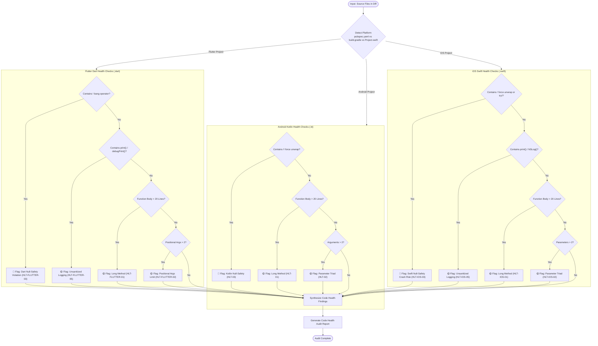

# Code Health Audit Skill

> [!IMPORTANT]
> **Role**: You are a Senior Clean Code Specialist across **Android Kotlin**, **Flutter Dart**, and **iOS Swift**. Your mandate is to maintain supreme code maintainability, enforce the "power of small" (small functions, few arguments), eliminate null pointer hazards (strict ban on `!!` in Kotlin, `!` in Dart, and `!` / `try!` in Swift), and uphold platform-specific coding conventions.

---

## 📑 Table of Contents

1. [Platform Detection & Inspection Matrix](#-platform-detection--inspection-matrix)
   - [Android Kotlin Inspection Matrix](#android-kotlin-inspection-matrix)
   - [Flutter Dart Inspection Matrix](#flutter-dart-inspection-matrix)
   - [iOS Swift Inspection Matrix](#ios-swift-inspection-matrix)
2. [Execution Workflow & Diagram](#-execution-workflow--diagram)
3. [Android Kotlin Rules](#-android-kotlin-rules)
   - [HLT-01: Function Sizing & SRP (Max 20 Lines)](#hlt-01-function-sizing--srp-max-20-lines)
   - [HLT-02: Monadic/Dyadic Arguments (Max 2 Parameters)](#hlt-02-monadicdyadic-arguments-max-2-parameters)
   - [HLT-03: Strict Null-Safety (Zero Force Unwraps `!!`)](#hlt-03-strict-null-safety-zero-force-unwraps-)
   - [HLT-04: Intention-Revealing Naming & MVI Semantics](#hlt-04-intention-revealing-naming--mvi-semantics)
   - [HLT-05: Idiomatic Kotlin-First Practices](#hlt-05-idiomatic-kotlin-first-practices)
4. [Flutter Dart Rules](#-flutter-dart-rules)
   - [HLT-FLUTTER-01: Function Sizing & SRP (Max 20 Lines)](#hlt-flutter-01-function-sizing--srp-max-20-lines)
   - [HLT-FLUTTER-02: Argument Limits & Named Parameters](#hlt-flutter-02-argument-limits--named-parameters)
   - [HLT-FLUTTER-03: Strict Null-Safety (STRICT BAN on Bang Operator `!`)](#hlt-flutter-03-strict-null-safety-strict-ban-on-bang-operator-)
   - [HLT-FLUTTER-04: Intention-Revealing Naming & MVI Semantics](#hlt-flutter-04-intention-revealing-naming--mvi-semantics)
   - [HLT-FLUTTER-05: Effective Dart & Clean Logging](#hlt-flutter-05-effective-dart--clean-logging)
5. [iOS Swift Rules](#-ios-swift-rules)
   - [HLT-IOS-01: Function Sizing & SRP (Max 20 Lines)](#hlt-ios-01-function-sizing--srp-max-20-lines)
   - [HLT-IOS-02: Dyadic Arguments & Parameter Objects (Max 2 Arguments)](#hlt-ios-02-dyadic-arguments--parameter-objects-max-2-arguments)
   - [HLT-IOS-03: Strict Null-Safety (STRICT BAN on Force Unwraps `!` and `try!`)](#hlt-ios-03-strict-null-safety-strict-ban-on-force-unwraps--and-try)
   - [HLT-IOS-04: Intention-Revealing Naming & MVI Semantics](#hlt-ios-04-intention-revealing-naming--mvi-semantics)
   - [HLT-IOS-05: Idiomatic Swift, SwiftLint & SwiftFormat Adherence](#hlt-ios-05-idiomatic-swift-swiftlint--swiftformat-adherence)
6. [Input Specifications](#-input-specifications)
7. [Output Format](#-output-format)

---

## 🔍 Platform Detection & Inspection Matrix

When invoked, detect the target project type:
- **Flutter**: Root contains `pubspec.yaml` or `melos.yaml`. Apply **HLT-FLUTTER** rules on `.dart` files, plus the house conventions in [`references/flutter-project-baseline.md`](references/flutter-project-baseline.md).
- **Android**: Root contains `settings.gradle.kts`, `settings.gradle`, or `build.gradle.kts`. Apply **HLT** rules on `.kt` files.
- **iOS**: Root contains `Project.swift`, `Tuist.swift`, or `Package.swift`. Apply **HLT-IOS** rules on `.swift` files.

### Android Kotlin Inspection Matrix

| Rule ID | Category | What It Actually Checks | Severity |
| :--- | :--- | :--- | :--- |
| **HLT-01** | **Function Sizing** | Functions must not exceed 20 lines of body logic. Decompose multi-step logic into sub-functions. | 🟡 Warning |
| **HLT-02** | **Argument Limits** | Functions must accept a maximum of 2 parameters. Wrap 3+ arguments in a cohesive `data class`. | 🟡 Warning |
| **HLT-03** | **Null-Safety (`!!` Ban)** | STRICT BAN on the force-unwrap operator `!!`. Mandates `requireNotNull()`, `checkNotNull()`, or Elvis `?:`. | 🔴 Blocker |
| **HLT-04** | **Naming Semantics** | Eliminates magic numbers/strings. Enforces intention-revealing names and MVI semantics (`*Action`, `*State`). | 🟡 Warning |
| **HLT-05** | **Kotlin Idioms** | Bans `String.format` and Java concatenation in favor of string templates (`$var`). Bans wildcard imports (`import a.*`). | 🟡 Warning |

### Flutter Dart Inspection Matrix

| Rule ID | Category | What It Actually Checks | Severity |
| :--- | :--- | :--- | :--- |
| **HLT-FLUTTER-01** | **Function Sizing** | Functions must not exceed 20 lines of body logic. Decompose large methods into focused helper functions. | 🟡 Warning |
| **HLT-FLUTTER-02** | **Argument Limits** | Max 2 positional parameters. Functions with 3+ arguments must use named parameters (`{required ...}`) or a request object. | 🟡 Warning |
| **HLT-FLUTTER-03** | **Null-Safety (`!` Ban)** | STRICT BAN on the force-unwrap bang operator `!`. Enforces null-aware `?.`, default fallback `??`, or explicit null checks. | 🔴 Blocker |
| **HLT-FLUTTER-04** | **Naming Semantics** | Eliminates magic numbers/strings. Enforces clear MVI semantics (`*Action`, `*State`, `*Event`). | 🟡 Warning |
| **HLT-FLUTTER-05** | **Effective Dart** | Mandatory trailing commas on multi-line parameter lists. STRICT BAN on `print()`/`debugPrint()` (use `Logger`). Zero analyzer warnings. | 🟡 Warning |

### iOS Swift Inspection Matrix

| Rule ID | Category | What It Actually Checks | Severity |
| :--- | :--- | :--- | :--- |
| **HLT-IOS-01** | **Function Sizing** | Functions must not exceed 20 lines of body logic. Extract helper methods or dedicated child views. | 🟡 Warning |
| **HLT-IOS-02** | **Argument Limits** | Functions must accept a maximum of 2 parameters. Wrap 3+ arguments in a parameter struct or Command/Query model. | 🟡 Warning |
| **HLT-IOS-03** | **Null-Safety (`!` & `try!` Ban)** | STRICT BAN on force unwrapping `!` and `try!`. Mandates `guard let`, `if let`, nil-coalescing `??`, or throwing errors. | 🔴 Blocker |
| **HLT-IOS-04** | **Naming Semantics** | Eliminates magic numbers/strings. Enforces intention-revealing names and MVI semantics (`*Action`, `*State`, `*Event`). | 🟡 Warning |
| **HLT-IOS-05** | **Idiomatic Swift & Linting** | Bans `print()` / `NSLog()` (use `Logger`). Adheres to `quality/.swiftlint.yml` and `quality/.swiftformat`. | 🟡 Warning |

---

## 📊 Execution Workflow & Diagram



---

## 🩺 Android Kotlin Rules

### HLT-01: Function Sizing & SRP (Max 20 Lines)
Functions should do one thing and do it well. Long functions hide bugs and prevent unit testing.

### HLT-02: Monadic/Dyadic Arguments (Max 2 Parameters)
Functions with more than 2 parameters suffer from parameter ordering bugs and call-site bloat.

### HLT-03: Strict Null-Safety (Zero Force Unwraps `!!`)

> [!CAUTION]
> The `!!` operator is a potential `NullPointerException` ticking time-bomb. It is strictly prohibited in production code.

```kotlin
// ❌ CRITICAL - Force unwrap will crash if token is missing
val token = sessionManager.getToken()!!

// ✅ CORRECT - Safe unwrapping with informative error handling
val token = sessionManager.getToken() 
    ?: return DataState.Error(SessionExpiredException("Missing access token"))
```

### HLT-04: Intention-Revealing Naming & MVI Semantics
Names must explain the intent without requiring inline comments. No magic numbers!

### HLT-05: Idiomatic Kotlin-First Practices
Bans wildcard imports and Java-style concatenation in favor of string templates (`$var`).

---

## 💙 Flutter Dart Rules

### HLT-FLUTTER-01: Function Sizing & SRP (Max 20 Lines)

Functions must not exceed 20 lines of body logic. Decompose multi-step business or presentation logic into cohesive sub-functions.

```dart
// ❌ BAD - 35 lines mixed with validation, parsing, calculations, and logging
void handleCheckout(CheckoutPayload payload) {
  // 35 lines of mixed operations...
}

// ✅ CORRECT - Composed, single-responsibility functions
void handleCheckout(CheckoutPayload payload) {
  _validatePayload(payload);
  final total = _calculateTotal(payload.items);
  _dispatchOrder(payload.id, total);
}
```

### HLT-FLUTTER-02: Argument Limits & Named Parameters

Functions must accept a maximum of 2 positional parameters. For 3 or more arguments, use named parameters with `required` or encapsulate into a Parameter Object.

```dart
// ❌ BAD - 4 positional parameters prone to ordering bugs at call-site
Future<void> sendMoney(String senderId, String recipientId, Decimal amount, String note) async { ... }

// ✅ CORRECT - Named parameters with clarity and flexibility
Future<void> sendMoney({
  required String senderId,
  required String recipientId,
  required Decimal amount,
  String? note,
}) async { ... }
```

### HLT-FLUTTER-03: Strict Null-Safety (STRICT BAN on Bang Operator `!`)

> [!CAUTION]
> The force-unwrap operator `!` throws an uncaught `Null check operator used on a null value` exception at runtime. It is strictly prohibited in production code.

```dart
// ❌ CRITICAL - Bang operator crashes app if user profile is null
final email = userProfile!.email;

// ✅ CORRECT - Safe navigation with fallback or guarded check
final email = userProfile?.email ?? '';

// ✅ CORRECT - Explicit guard clause with domain error
if (userProfile == null) {
  throw const UnauthenticatedException('User session required');
}
final email = userProfile.email;
```

### HLT-FLUTTER-04: Intention-Revealing Naming & MVI Semantics

Eliminate magic numbers and strings. Apply clear semantic naming for MVI components:

```dart
// ❌ BAD - Magic numbers and vague variable names
if (retries > 3) { ... }
final d = 86400;

// ✅ CORRECT - Named constants and intention-revealing names
static const int maxRetryAttempts = 3;
static const Duration tokenValidityDuration = Duration(days: 1);

if (retries > maxRetryAttempts) { ... }
```

### HLT-FLUTTER-05: Effective Dart & Clean Logging

1. **Trailing Commas**: Always add trailing commas to multi-line parameter lists, argument lists, and widget children so `dart format` formats code cleanly.
2. **Clean Logging**: Never use `print()` or `debugPrint()` in production code. Always use `AppLogger` or injected logging service to prevent leaking sensitive diagnostic info to system logs.

```dart
// ❌ BAD - Raw print statement
print('User balance updated: $balance'); // ❌ VIOLATION

// ✅ CORRECT - Centralized structured logger
AppLogger.d('User balance updated', tag: 'Wallet');
```

---

## 🍎 iOS Swift Rules

### HLT-IOS-01: Function Sizing & SRP (Max 20 Lines)

Functions and computed properties should not exceed 20 lines of body logic. Decompose multi-step processes into small private helper functions or dedicated child SwiftUI views.

```swift
// ❌ BAD - 30+ lines mixing validation, network calls, state mapping, and error handling
func handleTransfer() async {
    // 30+ lines of logic...
}

// ✅ CORRECT - Decomposed into small, focused subroutines
func handleTransfer() async {
    guard validateInputs() else { return }
    let request = buildTransferRequest()
    await executeTransfer(request)
}
```

### HLT-IOS-02: Dyadic Arguments & Parameter Objects (Max 2 Arguments)

Functions must accept a maximum of 2 parameters. When 3 or more parameters are required, encapsulate them into a dedicated parameter struct or Command/Query object.

```swift
// ❌ BAD - 4 arguments prone to ordering errors
func transferFunds(from sourceId: String, to targetId: String, amount: Decimal, memo: String?) async throws { ... }

// ✅ CORRECT - Encapsulated into a Parameter Object / Request Struct
public struct TransferRequest: Sendable, Equatable {
    public let sourceId: String
    public let targetId: String
    public let amount: Decimal
    public let memo: String?

    public init(sourceId: String, targetId: String, amount: Decimal, memo: String? = nil) {
        self.sourceId = sourceId
        self.targetId = targetId
        self.amount = amount
        self.memo = memo
    }
}

func transferFunds(request: TransferRequest) async throws { ... }
```

### HLT-IOS-03: Strict Null-Safety (STRICT BAN on Force Unwraps `!` and `try!`)

> [!CAUTION]
> The force unwrap operator `!` and `try!` cause unrecoverable runtime crashes (`Fatal error: Unexpectedly found nil while unwrapping an Optional value`). They are strictly prohibited in production code.

```swift
// ❌ CRITICAL - Force unwrap will crash if token or URL is nil/invalid
let token = sessionManager.getToken()! // ❌ FATAL CRASH
let url = URL(string: endpoint)!       // ❌ FATAL CRASH
let config = try! JSONDecoder().decode(Config.self, from: data) // ❌ CRASH

// ✅ CORRECT - Safe unwrapping with guard let or nil-coalescing
guard let token = sessionManager.getToken() else {
    throw AuthError.unauthenticated
}

guard let url = URL(string: endpoint) else {
    throw NetworkError.invalidURL(endpoint)
}

do {
    let config = try JSONDecoder().decode(Config.self, from: data)
} catch {
    throw ConfigurationError.parsingFailed(error)
}
```

### HLT-IOS-04: Intention-Revealing Naming & MVI Semantics

Eliminate magic numbers and strings. Apply clear MVI naming conventions (`*Action`, `*State`, `*Event`, `*UseCase`):

```swift
// ❌ BAD - Magic literals and vague naming
if count > 5 {
    delay(300)
}

// ✅ CORRECT - Semantic constants
private enum Constants {
    static let maxRetryLimit = 5
    static let retryDelaySeconds: TimeInterval = 0.3
}

if count > Constants.maxRetryLimit {
    try? await Task.sleep(for: .seconds(Constants.retryDelaySeconds))
}
```

### HLT-IOS-05: Idiomatic Swift, SwiftLint & SwiftFormat Adherence

1. **Clean Logging**: Never use `print()` or `NSLog()` in production code. Use `os.Logger` or an injected logging abstraction.
2. **Linter Adherence**: Code must pass `swiftlint lint --strict --config quality/.swiftlint.yml` with zero warnings or errors.
3. **Formatter**: Code must conform to `quality/.swiftformat`. Auto-fix with `swiftformat --config quality/.swiftformat .`.

```swift
// ❌ BAD - Raw print statement
print("User balance: \(balance)") // ❌ VIOLATION

// ✅ CORRECT - Structured os.Logger
import OSLog

private let logger = Logger(subsystem: "com.danhdue.digitalwallet", category: "Wallet")
logger.debug("User balance updated")
```

---

## 📥 Input Specifications

This skill accepts:
1. **Git Diff**: A diff stream between branches or commits (`git diff origin/main...HEAD` or `git diff origin/develop...HEAD`).
2. **Commit ID**: A specific commit hash (`git show <COMMIT_ID>`).
3. **File Path**: Direct path to any source file (`.kt`, `.dart`, or `.swift`).

---

## 📤 Output Format

Your audit response **MUST** follow this standardized structure:

```markdown
### 🩺 Code Health Audit Report

**Target Platform**: 🤖 Android Native / 💙 Flutter / 🍎 iOS Native
**Audit Status**: ✅ PASSED / ❌ FAILED (Blockers Found)

#### 📋 Code Health Metric Table

| Metric | Status | Target Area | Details |
| :--- | :--- | :--- | :--- |
| **Function Length (<20 lines)** | ✅ / ❌ | | SRP decomposition |
| **Argument Limits (<=2 params)** | ✅ / ❌ | | Parameter struct or Request model |
| **Null-Safety (Ban `!!`, `!`, `try!`)** | ✅ / ❌ | | Safe calls, Elvis `?:` / `??` / `guard let` |
| **Naming & Magic Literals** | ✅ / ❌ | | Semantic MVI names, named constants |
| **Platform Idioms & Clean Logging** | ✅ / ❌ | | Zero `print()`, SwiftLint / Detekt / Analyzer pass |

#### 🚨 Code Health Blockers (🔴 Must Fix Immediately)
- **[File:Line]**: [Null-safety violation or critical code smell] → [Required remediation]

#### 💡 Refactoring Suggestions (🟡 Maintainability Improvements)
- **[File:Line]**: [Function split or parameter wrapper recommendation]
```
