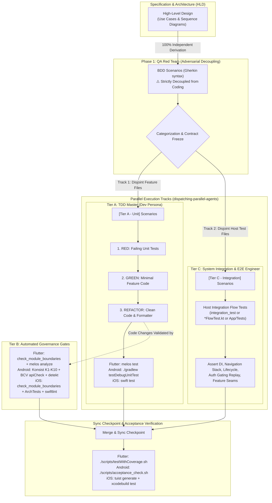

# Epic Designer

## Overview
This skill transforms high-level product or technical requirements into a structured, developer-ready Epic for **Android Native**, **Flutter**, and **iOS Native** projects. It creates a centralized High-Level Design (HLD) document and breaks the work down into granular Kanban tasks enforcing Behavior-Driven Development (BDD), Test-Driven Development (TDD), and strict Definition of Done (DoD), fully aligned with `epic-implementation`'s Tri-Persona workflow (QA Red Team + TDD Master + System Integration Engineer).

This skill is **Stage 2** of the Epic Lifecycle. The surrounding stages, the four approval
gates, and what each stage hands over are owned by the
[`epic-lifecycle`](../epic-lifecycle/SKILL.md) skill. Gate 2 (task breakdown confirmed) is
enforced below, at the Checkpoint before task files are written.

## When to Use
- When the user provides a high-level requirement or problem statement and asks for a technical design or task breakdown.
- When starting a new major feature, epic, or large-scale refactoring.
- When generating architecture diagrams (Use Cases, Sequence, Architecture) and converting them into actionable tasks.
- When the `brainstorming` skill routes here after spec approval, for a spec it judged epic-scale.

## Input

This skill can start from either:

1. **A raw high-level requirement** given directly by the user (standalone use).
2. **An approved spec from the `brainstorming` skill** (preferred entry point — the spec has already been through clarifying questions, alternatives, and user approval). For epic-scale work, `brainstorming` relocates the spec file into this epic's own directory, `.devtool/epic/<epic_name>/<same-filename>.md`, before invoking this skill — so the spec already lives alongside the HLD and task files this skill generates.

When invoked with an approved spec, **treat it as the source of truth for scope and decisions already made** — do not re-litigate architecture choices or trade-offs the user already approved. Your job is to *formalize* it: translate its architecture/components/data-flow into the Mermaid diagrams and structured sections below, and break it into Kanban tasks. If the spec is missing something this skill requires (e.g., a rollout strategy), fill the gap, but don't override decisions the spec already made.

Record the link back to the source in the Epic's **Meta Data** section, e.g. `Source Spec: [<topic>-design.md](<file>.md)` — a same-directory link, since the spec already lives in this epic's directory — so the HLD and the original spec stay traceable to each other without leaving `.devtool/epic/<epic_name>/`. If there is no source spec (standalone use), omit this field.

If the original brainstorming request was decomposed into multiple sub-project specs, each spec maps to **its own separate epic** — never merge multiple specs into one epic directory.

## Workflow / Prompt Instructions

When invoked, you MUST strictly follow this exact 3-step workflow to organize the user's requirements:

### Step 0: Detect Target Platform
Detect whether the active project is Flutter, Android Native, or iOS Native:
- **Flutter**: Root contains `pubspec.yaml` or `melos.yaml`.
- **Android Native**: Root contains `settings.gradle.kts`, `settings.gradle`, or `build.gradle.kts` (without root `pubspec.yaml`).
- **iOS Native**: Root contains `Project.swift`, `Tuist.swift`, or `Package.swift`.

### Step 1: Create the Epic Overview Document (HLD/RFC)
Generate the Epic Overview documents inside a dedicated directory: `.devtool/epic/<epic_name>/`.

**Self-sufficiency check (source spec placement)**: if this epic has a source spec and it is not already inside `.devtool/epic/<epic_name>/` — e.g. it is still at `docs/superpowers/specs/<file>.md` because `brainstorming`'s Routing After Approval relocation step was skipped, or this skill was invoked directly with a spec path outside the epic directory — relocate it now, before writing anything else: `git mv` the file into `.devtool/epic/<epic_name>/<same-filename>`, then check every relative link inside it (e.g. links into `packages/`, `lib/`, `features/`) still resolves from the new location and fix any that don't. Commit this move on its own, before generating the HLD. Never leave a source spec split across `docs/` and `.devtool/epic/`.

You MUST generate two language variants for the overview document:
- English: `.devtool/epic/<epic_name>/<epic_name>.en.md`
- Vietnamese: `.devtool/epic/<epic_name>/<epic_name>.vi.md`

Each document MUST contain the following sections:

1. **Meta Data**: Epic name, Status, Target Release, Platform (`Flutter`, `Android Native`, or `iOS Native`), and `Source Spec` link if this epic was derived from an approved brainstorming spec.
2. **Background (Bối cảnh)**: The problem statement or context (Why are we doing this?).
3. **Goals & Non-Goals**: Clearly define what is expected to be achieved and what is strictly out of scope to avoid scope creep.
4. **Architecture & Technical Design**:
   - **High-Level Architecture**: Use a `mermaid graph TD` to show component interactions.
   - **Use Cases**: Use a `mermaid flowchart` to define Actors and their interactions with the system.
   - **Sequence Diagram**: Use a `mermaid sequenceDiagram` to show the step-by-step lifecycle of the primary flow.
   - **Comprehensive BDD Test Scenarios**: A detailed Gherkin suite (`Given - When - Then`) covering all Use Cases and Sequence Diagram flows.
5. **BDD Output in Epic Directory (`bdd_scenarios.md`)**:
   - In addition to embedding in the Epic Overview, generate a dedicated `bdd_scenarios.md` file located at `.devtool/epic/<epic_name>/bdd_scenarios.md`.
   - **Dual Value Purpose**:
     1. *Human Maintenance (Living Documentation)*: Enables any incoming developer to instantly comprehend the business intent, state transitions, boundary limits, and resilience rules without wading through implementation code.
     2. *Instant AI Agent Context Injection*: Provides a dense, unambiguous behavioral contract that can be loaded into an AI Agent's context window in one shot, eliminating hallucinations and ensuring rigorous compliance during implementation or bug fixes.
6. **Rollout Strategy & Mitigation**: Describe how to deploy this safely (e.g., phased rollout, feature flags) and fallback plans.
7. **Kanban Tasks Breakdown**: A list of links pointing to the individual task files created in Step 2.

**Canonical language**: The `.en.md` variant is the source of truth for tooling/agents — always write and update it first. The `.vi.md` variant is a translation for local team communication and MUST be kept in sync whenever the `.en.md` changes; never let the two diverge in structure or facts.

### Checkpoint: Confirm Task Breakdown Before Writing Task Files
Before generating any task file, list the proposed tasks as a short numbered summary (title + one-line scope each) and ask the user to confirm the breakdown and granularity. This is a lightweight check, not a full brainstorming dialogue — the architecture is already approved (from the spec or from this skill's own Step 1); only the *task split* is new and unapproved. Only proceed to write task files once the user confirms or adjusts the list.

### Concurrent-Epic Backlog Rule
Before writing any task file, check `.devtool/features/*.md` (excluding the `done/` and `archived/` subfolders) for a task whose `epic:` frontmatter field names a *different* epic and whose `status` is `todo`, `in-progress`, or `review` — that means another epic is actively being worked on right now. If so:
- Set every task this run generates for the new epic to `status: "backlog"` instead of the usual default `"todo"`, so it's queued rather than shown as ready-to-pick-up while the other epic is still active.
- Note in the new Epic Overview's Meta Data **Status** field that the epic is queued behind the other epic by name (e.g. `Status: Queued (backlog) — behind logging-refactor`).
- This skill does not flip tasks from `backlog` to `todo` itself later — that's a human call once the blocking epic's tasks all reach `done`.

If no other epic has any active (`todo`/`in-progress`/`review`) task, generate tasks with the normal default `status: "todo"` as usual.

### Step 2: Generate LachyFS Kanban Tasks
Break the Epic down into granular implementation tasks. **Crucially, each task must be structured around Behavior-Driven Development (BDD), Test-Driven Development (TDD), and Integration Flow Testing** to feed directly into the Tri-Persona (QA Red Team + TDD Master + System Integration Engineer) execution workflow in `epic-implementation`. Wherever the task produces testable behavior, generate Markdown task files located at `.devtool/features/task_<number>_<name>.md` (and mirrored in `.devtool/epic/<epic_name>/task_<number>_<name>.md` as permanent epic outputs).

#### Mandatory 3-Tier Testing Standard in Task Breakdown
Every Epic breakdown MUST explicitly structure and address all 3 testing tiers across the Tri-Persona system based on the target platform:

##### 💙 For Flutter Projects:
- **Tier A (Unit / Package Tests)**: Tasks covering module/feature logic, BLoCs, UseCases, Repositories, Parsers with isolated unit tests (`fvm flutter test` or `melos test` using `bloc_test`, Mocktail). Executed by the **TDD Master (Dev Persona)**.
- **Tier B (Tooling & Governance Tests)**: Tasks that touch feature packages or public APIs MUST verify module boundaries (`./scripts/check_module_boundaries.sh`), license headers (`./scripts/check_license_header.sh`), code formatting (`melos format`), and static analysis (`melos analyze`).
- **Tier C (Acceptance & App Tests)**: Every Epic MUST include an explicit final integration task (e.g. `Task N: Host App Integration & Acceptance Tests`) verifying the Host composition root (`lib/` composition, `AppRoutes`, `AppEventBus`), full end-to-end user navigation flows, and running the automated acceptance/integration harness (`fvm flutter test integration_test` or `./scripts/testWithCoverage.sh`). Executed by the **System Integration Engineer (Integration Persona)**.

##### 🤖 For Android Native Projects:
- **Tier A (Unit / Package Tests)**: Tasks covering module/feature logic, MVI ViewModels, UseCases, Repositories, Parsers with isolated unit tests (`./gradlew testDebugUnitTest` using JUnit, MockK, Turbine). Executed by the **TDD Master (Dev Persona)**.
- **Tier B (Tooling & Governance Tests)**: Tasks that touch architectural rules, convention plugins, or public API signatures MUST include verification with Konsist rules K1–K10 (`./gradlew :konsist-test:test`) and BCV public ABI checks (`./gradlew apiCheck`), Detekt, and Spotless (`./gradlew check`).
- **Tier C (Acceptance & App Tests)**: Every Epic MUST include an explicit final integration task verifying Host composition root (`:app` + `:shell`), full end-to-end user navigation flows, DFM on-demand splits, and running the automated acceptance harness (`./scripts/acceptance_check.sh`). Executed by the **System Integration Engineer (Integration Persona)**.

##### 🍎 For iOS Native Projects:
- **Tier A (Unit / Package Tests)**: Tasks covering module/feature logic, MVI ViewModels, UseCases, Repositories, Parsers with isolated unit tests (`swift test --package-path <PackagePath>` using Swift Testing `@Test` or XCTest). Executed by the **TDD Master (Dev Persona)**.
- **Tier B (Tooling & Governance Tests)**: Tasks that touch feature packages or public API contracts MUST verify module boundaries (`bash scripts/check_module_boundaries.sh`), AST architecture governance rules K1–K10 (`swift test --package-path ArchTests`), static analysis (`swiftlint lint --strict --config quality/.swiftlint.yml`), and code formatting (`swiftformat --config quality/.swiftformat . --lint`).
- **Tier C (Acceptance & App Tests)**: Every Epic MUST include an explicit final integration task verifying Host composition root (`App/` + `Shell/`), `AppRoutes`, RouteProvider registration, end-to-end user navigation flows, and running the automated acceptance harness (`tuist generate --no-open && xcodebuild test ...`). Executed by the **System Integration Engineer (Integration Persona)**.



> [!IMPORTANT]
> ### ⚡ PARALLEL EXECUTION RULES (TIER A & TIER C CONCURRENCY)
> When executing via `dispatching-parallel-agents`, the Lead Agent may dispatch **Subagent 1 (Dev Persona — Tier A)** and **Subagent 2 (SDET Persona — Tier C)** concurrently, provided these 3 inviolable rules are satisfied:
> 
> 1. **Rule 1: Strict Contract Freeze (Zero Contract Drift)**:
>    - All public interface contracts (`AppRoutes`, `AppEventBus`, DTOs, State/Action contracts) must be locked during Phase 1 BDD authoring.
>    - Neither agent is permitted to rename, alter types, or mutate public contract signatures during parallel execution without a synchronized pause.
> 
> 2. **Rule 2: Disjoint File Sets (Zero Git Merge Conflicts)**:
>    - **Subagent 1 (Dev)**: Restricted strictly to feature/package sources (`features/{name}/**`, `packages/{package}/**` in Flutter; `:features:*`, `:packages:*` in Android; `Features/{Name}/**`, `Packages/{Name}/**` in iOS).
>    - **Subagent 2 (SDET)**: Restricted strictly to Host App integration testbeds (`integration_test/**` in Flutter; `app/src/test/**`, `shell/src/test/**` in Android; `App/Tests/**`, `Shell/Tests/**` in iOS).
>    - **NEITHER agent** may modify shared root build or workspace files (`pubspec.yaml`, `melos.yaml` in Flutter; `settings.gradle.kts`, `buildSrc/**` in Android; `Project.swift`, `Workspace.swift`, `Tuist.swift` in iOS) concurrently.
> 
> 3. **Rule 3: ATDD Sync Checkpoint & Verification**:
>    - Subagent 2's integration flow tests initially act as **ATDD Red Tests** (failing while Subagent 1's code is in-flight).
>    - Once both subagents report completion, the Lead Agent performs the **Sync Checkpoint**: merges the branches, validates that the integration tests turn **GREEN**, and runs the Tier C acceptance check.

Task files are English-only — do not generate a `.vi.md` variant for tasks and do not mix Vietnamese prose into section headers or body. The English/Vietnamese pairing applies only to the Epic Overview document from Step 1.

Each task file MUST adhere to this exact structure:

1. **YAML Frontmatter (LachyFS Kanban Markdown compatible)**:
   ```yaml
   ---
   id: "task_<number>_<name>"
   status: "todo"          # one of: backlog | todo | in-progress | review | done — see Concurrent-Epic Backlog Rule above
   priority: "high"        # one of: low | medium | high
   assignee: null
   epic: "<epic_name>"
   dueDate: null
   created: "<ISO-8601 timestamp, set once at creation>"
   modified: "<ISO-8601 timestamp, update on every edit>"
   completedAt: null       # set to an ISO-8601 timestamp only when status becomes "done"
   labels: ["architecture", "feature"]
   order: "a<number>"
   ---
   ```
2. **Title**: `# Task <number>: <Task Name>`
3. **Epic Reference**: A link back to the parent HLD, e.g. `Epic: [<epic_name>](../epic/<epic_name>/<epic_name>.en.md)`. This is the agent's entry point back to architecture/diagram context.
4. **Requirement Analysis**: Context and requirements specific to this task.
5. **Relevant Files & Context Pointers**: An explicit bullet list of exact file/directory paths this task reads or modifies.
6. **Design Rationale**: Architecture decisions or design patterns chosen. **Crucially, review the available skills in `.agents/skills/` and explicitly note applicable skills here**:
   - **For Flutter Tasks**: `flutter-ui-audit`, Mason bricks (`mason make pac_mvi_feature`), `build_runner`.
   - **For Android Tasks**: `android-ui-audit`, `android-api-integration`, `moshi_dto_generator`.
   - **For iOS Tasks**: `ios-ui-audit`, Tuist (`tuist generate`), `ArchTests`.
7. **BDD Scenarios & Acceptance Criteria (The QA Persona)**:
   Document this section under the markdown heading `### BDD SCENARIOS`.
   Define behavioral scenarios using Gherkin syntax (`Given - When - Then`).

   **Strict Adversarial Independence Mandate**:
   - The QA Persona MUST author BDD scenarios **completely decoupled from implementation code**.
   - Do NOT base scenarios on implementation ease or existing code internals. Base them **PURELY on the Epic's HLD specifications, Use Cases (flowchart), and Sequence Diagrams**.
   - The QA Persona's sole objective is to act as an adversarial quality gate: expose all unhandled edge cases, boundaries, race conditions, and system failure modes before any coding begins.

   **Mandatory Self-Review**: Cross-check these scenarios directly against the Use Cases (flowchart) and Sequence Diagrams defined in the Epic's HLD document (`<epic_name>.en.md`) to guarantee zero missing requirements.
   Exhaustively apply Boundary Value Analysis & Equivalence Partitioning across 5 dimensions:
   - **Happy Paths**: Normal data flow and standard successful outcomes.
   - **Edge Cases & Boundaries**: Null inputs, empty arrays/collections, malformed payloads, boundary numbers.
   - **State Transitions**: Valid and invalid state transitions (MVI Action -> State / Event).
   - **Async / Race Conditions**: Rapid consecutive user interactions (debouncing, stream transformers, cancellation).
   - **Failures & Storage/Network Resilience**: Timeouts, 4xx/5xx HTTP errors, offline states, corrupted storage/DB.

   **Tier Categorization Tagging**: Explicitly tag each scenario:
   - `[Tier A - Unit]`: Scenarios covering class/function level logic, BLoCs/ViewModels, UseCases, Repositories, Parsers, and Guards.
   - `[Tier C - Integration]`: Scenarios covering end-to-end user navigation, Host App lifecycle, Tab switching, Auth Gating & Replay.

8. **Test & Verification Checklist**:
   - **For Flutter Tasks (Dev Persona / Integration Persona)**:
     - [ ] **RED**: Translate all `[Tier A - Unit]` BDD scenarios into failing unit/BLoC tests (`bloc_test`, Mocktail). Confirm tests fail for the right reasons before writing implementation code.
     - [ ] **GREEN**: Write minimal implementation code to satisfy the tests (use Mason `pac_mvi_feature` if creating a new feature package).
     - [ ] **REFACTOR**: Optimize performance (`const` constructors), format (`melos format` / `dartfmt.sh`), check module boundaries (`./scripts/check_module_boundaries.sh`), and verify zero linter warnings (`melos analyze`).
     - [ ] **Tier C (Integration)**: Configure Host App integration testbed (`integration_test/`), assert navigation, lifecycle, and run `./scripts/testWithCoverage.sh`.
   - **For Android Tasks (Dev Persona / Integration Persona)**:
     - [ ] **RED**: Translate all `[Tier A - Unit]` BDD scenarios into failing unit tests (`./gradlew testDebugUnitTest`).
     - [ ] **GREEN**: Write minimal implementation code to satisfy the tests.
     - [ ] **REFACTOR**: Format (`./gradlew spotlessApply`), check lint (`./gradlew detekt`), and verify Konsist (`./gradlew :konsist-test:test`).
     - [ ] **Tier C (Integration)**: Host App composition testbed (`:app` / `:shell`), assert user flows, and run `./scripts/acceptance_check.sh`.
   - **For iOS Tasks (Dev Persona / Integration Persona)**:
     - [ ] **RED**: Translate all `[Tier A - Unit]` BDD scenarios into failing Swift unit tests (`swift test --package-path <PackagePath>`). Confirm tests fail for the right reasons before writing implementation code.
     - [ ] **GREEN**: Write minimal Swift implementation code to satisfy the tests (Clean Architecture + MVI, pure Swift domain).
     - [ ] **REFACTOR**: Optimize SwiftUI body re-evaluation, format (`swiftformat --config quality/.swiftformat .`), lint (`swiftlint lint --strict --config quality/.swiftlint.yml`), verify module boundaries (`bash scripts/check_module_boundaries.sh`), and verify AST rules (`swift test --package-path ArchTests`).
     - [ ] **Tier C (Integration)**: Host App composition testbed (`App/Tests` + `Shell/Tests`), assert user flows, and run simulator acceptance check (`tuist generate --no-open && xcodebuild test ...`).

   **TDD Adaptation**: For tasks that are pure refactors or config changes with no new behavior, state the adaptation explicitly (e.g., "run existing test suite / analyzer to confirm zero regressions").
9. **Definition of Done (DoD)**: Acceptance criteria (100% scenario coverage, passes Tier A/B/C verification, clean git status).
10. **Dependencies & Blockers**: Link to blocking/blocked task files as markdown links (e.g. `Blocked by [Task 1](task_1_create_package.md)`).
11. **References & Rollback**: Links to docs, APIs, and a rollback strategy if this specific task fails.

### Step 3: Finalize & Commit
After the Epic Overview and all confirmed task files are written (or updated), commit them to git:
- Read `.agents/config.json` — check the `auto_commit` setting.
- If `auto_commit: true`: stage exactly the generated/modified paths (the epic's `.devtool/epic/<epic_name>/` directory and each new/modified `.devtool/features/task_*.md` file). Then commit:
  - New epic: `git commit -m "docs: generate epic and tasks for <epic_name>"`
  - Update to an existing epic: `git commit -m "docs: add tasks to epic <epic_name>"`
- If `auto_commit: false`: skip staging and committing entirely.

### Updating an Existing Epic
When new requirements arrive for an epic already in progress, append new task files continuing the sequence, and append links to the Epic Overview's Kanban Tasks Breakdown section (in both `.en.md` and `.vi.md`). Update the Mermaid diagrams if architecture changes.

## Red Flags - STOP and Start Over
- Writing task files before the user has confirmed the task breakdown checkpoint.
- Omitting the final Tier C (Acceptance & App Tests) task from the Epic breakdown.
- Generating tasks without BDD scenarios / edge case specifications or without a TDD checklist.
- Using Android test commands (`./gradlew`) on a Flutter/iOS project, or Flutter test commands (`melos test`) on Android/iOS, or iOS test commands (`swift test`) on Flutter/Android.
- Creating the Epic overview in the project root instead of `.devtool/epic/<epic_name>/`.
- Defaulting new tasks to `status: "todo"` without checking for another epic's active tasks first.
- Mixing languages within a single task file.
