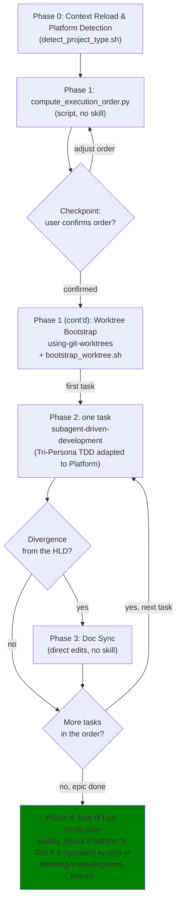

# Epic Implementation

## Overview

Runs an already-approved epic's Kanban tasks end-to-end: reload the epic's own docs for context, detect the platform (Flutter, Android Native, or iOS Native), compute a dependency-safe execution order, bootstrap one worktree that can actually build this project, then drive each task sequentially through `subagent-driven-development` with exactly one commit per task.

**Core principle:** One worktree, one task at a time, one commit per task, docs stay truthful.

**Announce at start:** "I'm using the epic-implementation skill to implement the `<epic_slug>` epic."

## Two Placeholders, Not One

This skill uses two distinct placeholders, and **they are usually different strings** — do not substitute one for the other:

| Placeholder | What it is | Where it appears | Worked example |
|-------------|-----------|------------------|----------------|
| `<epic_dir>` | The epic's directory name on disk | `.devtool/epic/<epic_dir>/<epic_dir>.en.md`, the worktree directory name | `logging_refactor` (underscores) |
| `<epic_slug>` | The epic's frontmatter `epic:` value | The calculator's CLI arg, matching `epic:` in `task_*.md`, the `epic/<epic_slug>` branch name, the `[EPIC_NAME]` commit prefix | `logging-refactor` (hyphens) |

Read both values off disk at the start — never derive one from the other by guessing the separator.

## When to Use

- The epic has a `.devtool/epic/<epic_dir>/<epic_dir>.en.md` HLD and one or more `.devtool/features/task_*.md` files with `epic: "<epic_slug>"` in frontmatter, and a human has already approved that design.
- You are about to implement more than one task from that epic in this session.

**Don't use when:** the epic/tasks don't exist yet (use `brainstorming` then `epic-designer` first), or you're implementing a single one-off task with no epic context (just use `subagent-driven-development` directly).

## Process

This skill is **Stage 3** of the Epic Lifecycle. The surrounding stages, the four approval
gates, and what each stage hands over are owned by the
[`epic-lifecycle`](../epic-lifecycle/SKILL.md) skill. Gate 3 (execution order confirmed) is
enforced below, in Phase 1.



### Phase 0 — Context Reload & Platform Detection (once, not per task)

1. Read, in full:
   - `.devtool/epic/<epic_dir>/<epic_dir>.en.md` (the canonical HLD — never `.vi.md` for decisions, that's a synced translation).
   - Every `.devtool/features/task_*.md` whose frontmatter `epic:` matches `<epic_slug>`.
   - Any spec file(s) linked from the HLD's Meta Data section.
2. Resolve the two paths the rest of this skill uses. `SKILL_DIR` is the directory this
   `SKILL.md` was loaded from — vendored under `.agents/skills/` in some projects, inside a
   plugin install in others, so never hardcode it:
   ```bash
   SKILL_DIR=<absolute path of the directory containing this SKILL.md>
   REPO_ROOT=$(git rev-parse --show-toplevel)
   ```
3. Detect the platform:
   ```bash
   PROJECT_TYPE=$("$SKILL_DIR"/resources/scripts/detect_project_type.sh "$REPO_ROOT")
   echo "Detected project type: $PROJECT_TYPE"
   ```
   - **`flutter`**: Flutter monorepo (`melos`, `fvm`, BLoC, Dart).
   - **`android`**: Android Native (`gradlew`, Kotlin, Compose).
   - **`ios`**: iOS Native (`Project.swift`, `Tuist.swift`, Swift 6, SwiftUI).

### Phase 1 — Execution Plan

1. Run (note: the argument is the **slug**, not the directory name):
   ```bash
   python3 "$SKILL_DIR"/resources/scripts/compute_execution_order.py <epic_slug>
   ```
   Check the scan summary line it prints first (`Scanned N task_*.md files; M matched epic ...; K had no parseable frontmatter or a different epic.`). If `M` is smaller than the number of tasks you read in Phase 0, a task file has broken frontmatter or the wrong `epic:` value — fix that before going any further.
2. Read the "Manual review advised" section of the output (if any) and cross-check it against what you read in Phase 0. Adjust the flattened order by hand if a prose note should win.
3. **Checkpoint:** present the final order (with any manual adjustment explained) to the user and get confirmation before creating any worktree or dispatching any subagent.

#### Phase 1 (continued) — Worktree Bootstrap, once the order is confirmed

4. Create one worktree for the whole epic, following `using-git-worktrees`. Spell the base ref out explicitly:
   ```bash
   git worktree add .worktrees/<epic_dir> -b epic/<epic_slug> develop
   ```
5. Bootstrap the worktree so it can actually build:
   - **For Flutter Projects**:
     ```bash
     "$SKILL_DIR"/resources/scripts/bootstrap_worktree.sh <worktree_path>
     ```
     This copies `secureFiles/` in, runs `copy_secure_configurations`, and runs `melos bootstrap`. It does **not** run `pod install` (uses Swift Package Manager, not CocoaPods).
     Verify the bootstrap:
     ```bash
     ls <worktree_path>/android/app/src/dev/google-services.json   # placed by copy_secure_configurations
     ls <worktree_path>/.dart_tool/package_config.json             # written by melos bootstrap
     ```
   - **For Android Native Projects**:
     Copy `secureFiles/` in, run `copy_secure_configurations`, and trigger Gradle sync (`./gradlew --version`).
   - **For iOS Native Projects**:
     Copy `secureFiles/` in if present, run `tuist install && tuist generate --no-open` in the worktree directory.
     Verify the bootstrap:
     ```bash
     ls <worktree_path>/*.xcworkspace
     ```
6. Do not copy or symlink `.dart_tool/`, `/build/`, `ios/Flutter/ephemeral/Packages/`, `.build/`, or any `android/**/.cxx/` directory from another checkout into this worktree — these embed the source checkout's absolute paths and will corrupt the build.

### Phase 2 — Sequential Task Execution

For each task in the confirmed order, follow `subagent-driven-development`.

1. **Live Kanban Status**: Before dispatching, edit — **do not commit** — that task's frontmatter in `.devtool/features/task_<n>.md` to `status: "in-progress"`.

   **CRITICAL TRI-PERSONA DISPATCH**: When dispatching the implementer subagent, inject the Tri-Persona instructions adapted to the detected platform:

   ##### 💙 If Project Type is `flutter`:
   > You are a tri-persona system operating across the Flutter 3-Tier Testing Standard:
   > 1. **Expert QA (Red Team Persona)**: Authors BDD Scenarios and categorizes them into Unit (Tier A) vs Integration (Tier C).
   > 2. **Principal Mobile Engineer (TDD Master Persona — Tier A)**: Implements package/feature logic, BLoCs, UseCases, Repositories, and unit tests using `bloc_test` and Mocktail.
   > 3. **System Integration & E2E Engineer (Tier C Persona)**: Implements host integration flow tests (`integration_test/`) connecting DI, Navigation, and AppEventBus.
   > 
   > Follow these phases sequentially:
   > 
   > # PHASE 1: BDD SCENARIOS & TIER CATEGORIZATION (The QA Persona)
   > ⚠️ **STRICT ADVERSARIAL INDEPENDENCE MANDATE (DECOUPLED FROM CODING)**:
   > - You MUST author BDD scenarios in complete isolation from coding.
   > - Derive scenarios PURELY from the Epic's HLD specifications, Use Cases (flowchart), and Sequence Diagrams.
   > - Categorize each scenario:
   >   - `[Tier A - Unit]`: Class/function logic, BLoCs, UseCases, Repositories, Parsers, Guards.
   >   - `[Tier C - Integration]`: End-to-end flows, cross-module interactions, AppRoutes navigation, Tab switching, Auth Gating & Replay.
   > - Output this phase in a markdown block titled "### BDD SCENARIOS".
   > 
   > # PHASE 2: TDD UNIT IMPLEMENTATION (The Dev Persona — For Tier A Tasks)
   > 1. Target language/framework: Dart / Flutter (Clean Architecture + MVI/BLoC, Freezed/Equatable).
   > 2. Use Mocking to simulate API responses with artificial Delays to test Race Conditions.
   > 3. Verify that all StreamSubscriptions are properly cancelled in `close()`.
   > 4. Test BLoC State & Event emissions in exact order (`bloc_test`).
   > 5. RED-GREEN-REFACTOR: Verify tests FAIL first (RED), write minimal code (GREEN — use Mason `pac_mvi_feature` when creating a new feature package), format (`melos format` / `dartfmt.sh`), verify module boundaries (`./scripts/check_module_boundaries.sh`), and verify zero analyzer warnings (`melos analyze`).
   > 
   > # PHASE 3: SYSTEM INTEGRATION & E2E FLOW IMPLEMENTATION (The Integration Persona — For Tier C Tasks)
   > 1. Translate all `[Tier C - Integration]` scenarios into real Integration Flow Tests in `integration_test/`.
   > 2. Initialize the real or semi-real Composition Root / DI Graph.
   > 3. Assert full user flows (Navigation, Auth Gating replay via `AppEventBus`, deep link fallbacks).
   > 4. Verify that tests pass under `fvm flutter test integration_test` or `./scripts/testWithCoverage.sh`.

   ##### 🤖 If Project Type is `android`:
   > You are a tri-persona system operating across the Android Gradle 3-Tier Testing Standard:
   > 1. **Expert QA (Red Team Persona)**: Authors BDD Scenarios (`[Tier A - Unit]` vs `[Tier C - Integration]`).
   > 2. **Principal Mobile Engineer (TDD Master Persona — Tier A)**: Implements module unit tests and feature code in Kotlin (Compose, Coroutines, Flow, Hilt).
   > 3. **System Integration & E2E Engineer (Tier C Persona)**: Implements host integration flow tests (`*FlowTest.kt` in `:app` / `:shell`).
   > 
   > Follow these phases sequentially:
   > - **PHASE 1**: BDD Scenarios purely derived from HLD diagrams.
   > - **PHASE 2**: TDD Unit Implementation (RED failing test -> GREEN Kotlin code -> REFACTOR `./gradlew spotlessApply` + `./gradlew detekt`).
   > - **PHASE 3**: System Integration (`*FlowTest.kt`, cold/warm start, DFM split resolution, `./scripts/acceptance_check.sh`).

   ##### 🍎 If Project Type is `ios`:
   > You are a tri-persona system operating across the iOS Tuist & SwiftPM 3-Tier Testing Standard:
   > 1. **Expert QA (Red Team Persona)**: Authors BDD Scenarios (`[Tier A - Unit]` vs `[Tier C - Integration]`).
   > 2. **Principal Mobile Engineer (TDD Master Persona — Tier A)**: Implements module unit tests and feature code in Swift 6 (SwiftUI, MVI `MviViewModel`, Pure Swift Domain, local SPM packages).
   > 3. **System Integration & E2E Engineer (Tier C Persona)**: Implements host integration flow tests (`App/Tests` / `Shell/Tests`) wiring DI, `AppRoutes`, and RouteProvider registration.
   > 
   > Follow these phases sequentially:
   > - **PHASE 1**: BDD Scenarios purely derived from HLD diagrams (`bdd_scenarios.md`).
   > - **PHASE 2**: TDD Unit Implementation (RED failing test: `swift test --package-path <Path>` -> GREEN Swift code -> REFACTOR `swiftformat --config quality/.swiftformat .`, `swiftlint lint --strict --config quality/.swiftlint.yml`, `bash scripts/check_module_boundaries.sh`, `swift test --package-path ArchTests`).
   > - **PHASE 3**: System Integration (`App/Tests`, RouteProvider registration, `tuist generate --no-open && xcodebuild test ...`).

2. Once the implementer reports `DONE`, edit frontmatter to `status: "review"` before dispatching reviewers.
3. If review finds issues, cycle between `status: "in-progress"` and `status: "review"` through the fix loop.
4. Only once both reviews pass, update frontmatter: `status: "done"`, `completedAt: "<ISO-8601 now>"`.
5. Make exactly one commit staging code and task file:
   ```bash
   git status                                    # check nothing unrelated is pending
   git add -A                                    # code changes + .devtool/features/task_<n>.md
   git commit -m "[EPIC_NAME] <task_title>"
   ```
6. If implementation diverged from HLD, perform Phase 3 Doc Sync before next task.

### Phase 3 — Doc Sync on Divergence

Only when Phase 2 flags divergence:
1. Update the epic's Mermaid diagrams in **both** `.devtool/epic/<epic_dir>/<epic_dir>.en.md` and `.vi.md`.
2. Update the affected task file(s)' prose.
3. Commit separately:
   ```bash
   git commit -m "[EPIC_NAME] docs: sync HLD after <task_title>"
   ```

### Phase 4 — End of Epic Verification (@quality_check)

Once every task is `done`, run the comprehensive **`@quality_check`** skill on the epic worktree before finishing the branch.

The `@quality_check` skill automatically detects the platform and executes:
- **Flutter**: Runs `melos test`, `melos analyze`, `check_module_boundaries.sh`, `check_license_header.sh`, and the 4 Flutter semantic audits (`@security-audit`, `@architecture-audit`, `@flutter-ui-audit`, `@code-health-audit`).
- **Android**: Runs `./gradlew check :konsist-test:test apiCheck`, `./scripts/acceptance_check.sh`, the 4 Android semantic audits (`@security-audit`, `@architecture-audit`, `@android-ui-audit`, `@code-health-audit`), followed by `cleanup-java`.
- **iOS**: Runs `swiftlint lint --strict`, `swiftformat --lint`, `check_module_boundaries.sh`, `swift test --package-path ArchTests`, simulator acceptance tests, and the 4 iOS semantic audits (`@security-audit`, `@architecture-audit`, `@ios-ui-audit`, `@code-health-audit`).

Only when `@quality_check` reports **🟢 LGTM (All checks passing)**, use `finishing-a-development-branch` on the epic branch (base = `develop`).

## Quick Reference

| Step | Flutter Tool | Android Tool | iOS Tool |
|------|--------------|--------------|----------|
| Platform Detection | `detect_project_type.sh .` | `detect_project_type.sh .` | `detect_project_type.sh .` |
| Compute execution order | `compute_execution_order.py <epic_slug>` | `compute_execution_order.py <epic_slug>` | `compute_execution_order.py <epic_slug>` |
| Create epic worktree | `git worktree add .worktrees/<epic_dir> -b epic/<epic_slug> develop` | Same | Same |
| Bootstrap worktree | `bootstrap_worktree.sh <worktree_path>` | Platform bootstrap + Gradle sync | `tuist install && tuist generate --no-open` |
| Run each task | `subagent-driven-development` | `subagent-driven-development` | `subagent-driven-development` |
| Per-task TDD | `test-driven-development` (Dart/BLoC) | `test-driven-development` (Kotlin/Compose) | `test-driven-development` (Swift/SwiftUI) |
| End-of-epic verification | `@quality_check` (Flutter 3-Tier + 4 Audits) | `@quality_check` (Gradle 3-Tier + 4 Audits + cleanup-java) | `@quality_check` (iOS 3-Tier + 4 Audits) |
| Finish epic branch | `finishing-a-development-branch` | Same | Same |

## Red Flags
- Committing before updating the task file's frontmatter.
- Creating a worktree per task or dispatching concurrent implementation subagents without disjoint contracts.
- Skipping the Phase 1 confirmation checkpoint before touching git.
- Running cross-platform commands inappropriately (e.g., Gradle on Flutter/iOS, Melos on Android/iOS, Tuist/Swift on Flutter/Android).
- Merging to `develop` without passing `@quality_check` (🟢 LGTM).
