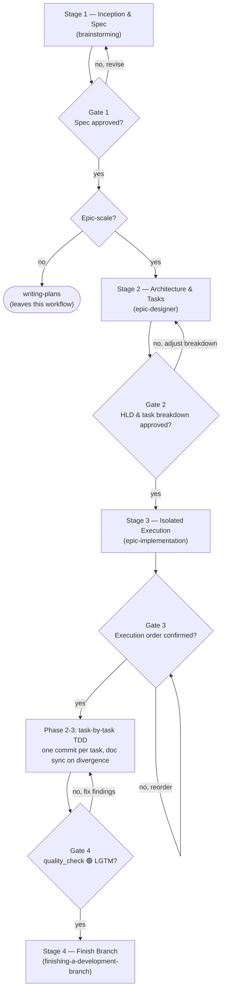

# Epic Lifecycle

The orchestrator for epic-scale work. It owns **sequence and gates only** — each stage's *how*
stays in that stage's own skill. If you need to know how to run a stage, open its skill; if you
need to know what runs next or what must be true before it does, stay here.

**Announce at start:** "I'm using the epic-lifecycle skill to orchestrate the `<epic_slug>` epic."

## When NOT to use this

- Single-component feature, bugfix, or anything one implementation plan covers → `brainstorming`
  then `writing-plans`. Do not open an epic for it.
- You are already mid-stage and know exactly which stage → go straight to that stage's skill.

## The Sequence

## The Four Gates

Every gate is a **human approval** except Gate 4, which is a machine verdict. Never cross one
on your own judgement.

| Gate | Name | Approver | Enforced in | Handoff artefact |
|------|------|----------|-------------|------------------|
| **1** | Spec Approved | User | end of `brainstorming` | `<epic_dir>/YYYY-MM-DD-<topic>-design.md` |
| **2** | HLD & Task Breakdown | User | `epic-designer` task-breakdown checkpoint | `<epic_dir>.en.md` + `.vi.md` + `bdd_scenarios.md` + `task_*.md` |
| **3** | Execution Order | User | `epic-implementation` Phase 1 checkpoint | confirmed order + bootstrapped worktree |
| **4** | Quality LGTM | `quality_check` | `epic-implementation` Phase 4 | 🟢 report + merge-ready branch |

## Stages

### Stage 1 — Inception & Spec → `brainstorming`

**Entry:** a raw idea or requirement.
**Exit (Gate 1):** the user has approved a written spec that passed self-review.

**Routing decision, made here and nowhere else.** Once the spec is approved, choose:

- **Epic-scale** — multiple independent components/services, needs Kanban breakdown plus
  architecture/use-case/sequence diagrams, or the user called it an epic or large feature.
  → relocate the spec from `docs/superpowers/specs/` into `.devtool/epic/<epic_dir>/<same-filename>`
  (create the directory if needed), fix relative links inside the moved file, then go to Stage 2
  passing that new path.
- **Everything else** → `writing-plans`. This leaves the epic lifecycle; the remaining gates do
  not apply.

When in doubt, ask the user rather than guessing.

If brainstorming decomposed the request into several sub-project specs, **route each one
independently**. Each spec keeps its own spec → design → implementation lineage and gets its own
epic directory. Never merge multiple specs into one epic.

### Stage 2 — Architecture & Tasks → `epic-designer`

**Entry:** a Gate 1 spec, already sitting in `.devtool/epic/<epic_dir>/`.
**Exit (Gate 2):** the user has confirmed the proposed task list and granularity.

Treat the approved spec as the source of truth for scope and decisions already made — formalize
it, do not re-litigate it. Gate 2 is a lightweight confirmation of the *task split* only; the
architecture was already approved at Gate 1.

### Stage 3 — Isolated Execution → `epic-implementation`

**Entry:** Gate 2 passed; HLD and `task_*.md` files exist.
**Exit (Gate 4):** `quality_check` reports 🟢 LGTM.

Gate 3 sits inside this stage, at the end of Phase 1: present the computed execution order and
get confirmation **before** creating any worktree or dispatching any subagent.

Then one worktree, one task at a time, one commit per task, docs kept truthful. On divergence
from the HLD, sync the epic docs before starting the next task.

### Stage 4 — Finish Branch → `finishing-a-development-branch`

**Entry:** Gate 4 passed.
**Exit:** epic branch integrated into `develop`.

## When a Gate Fails

| Gate | On failure, return to |
|------|----------------------|
| 1 | Stage 1 — revise the spec, re-run its self-review |
| 2 | Stage 2 — adjust the breakdown; only revisit Stage 1 if scope itself was wrong |
| 3 | Stage 3 Phase 1 — reorder by hand; prose notes in task files outrank the calculator |
| 4 | Stage 3 Phase 2 — fix findings in the worktree, then re-run `quality_check` in full |

Never advance on a partial pass, and never re-run only the previously failing check at Gate 4 —
the 🟢 verdict must come from a complete run.

## Red Flags

- Routing an approved spec straight to an implementation skill, skipping Stage 2 for epic-scale work.
- Merging several sub-project specs into one epic directory.
- Creating a worktree or dispatching a subagent before Gate 3.
- Merging to `develop` without a 🟢 from Gate 4.
- Leaving a spec split across `docs/superpowers/specs/` and `.devtool/epic/<epic_dir>/`.

## Stage Skills

| Stage | Skill | Gate it enforces |
|-------|-------|------------------|
| 1 | `brainstorming` | 1 |
| 2 | `epic-designer` | 2 |
| 3 | `epic-implementation` | 3, and triggers 4 |
| 3 (verification) | `quality_check` | 4 |
| 4 | `finishing-a-development-branch` | — |
