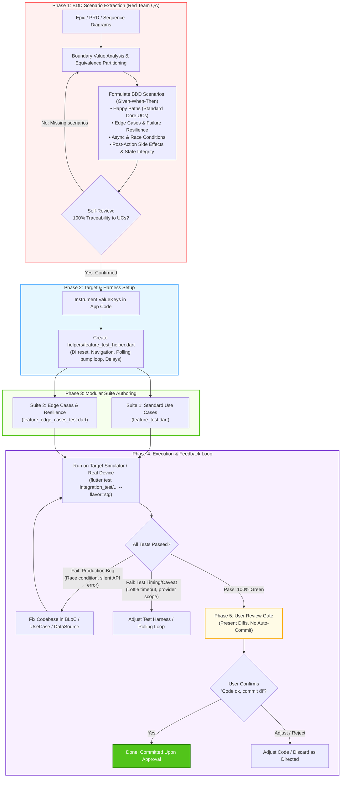

# Implementing Flutter Integration Tests

## Contents
- [Expert QA (Red Team) Role & Use Case Analysis](#expert-qa-red-team-role--use-case-analysis)
  - [Phase 1: BDD Scenario Extraction (The QA Persona)](#phase-1-bdd-scenario-extraction-the-qa-persona)
  - [Phase 2: Integration Test Implementation (The Automation Engineer Persona)](#phase-2-integration-test-implementation-the-automation-engineer-persona)
- [Project Setup and Dependencies](#project-setup-and-dependencies)
- [Interactive Exploration via MCP](#interactive-exploration-via-mcp)
- [Test Authoring Guidelines](#test-authoring-guidelines)
- [Edge Cases & Post-Action Side Effects Verification](#edge-cases--post-action-side-effects-verification)
- [Real-World Caveats and Pitfalls](#real-world-caveats-and-pitfalls)
- [Execution and Profiling](#execution-and-profiling)
- [Workflow: End-to-End Integration Testing](#workflow-end-to-end-integration-testing)
- [Examples](#examples)

## Expert QA (Red Team) Role & Use Case Analysis

When authoring Flutter integration tests, you MUST adopt a **Dual-Persona Protocol**:
1. **Persona 1: Expert QA (Red Team)** — Analyzes requirements strictly from Use Cases and specifications, designing comprehensive BDD scenarios before touching any test code.
2. **Persona 2: Automation Test Engineer** — Translates BDD scenarios into reliable, modular, executable integration test suites.



### Phase 1: BDD Scenario Extraction (The QA Persona)

Before writing any test code, thoroughly analyze the Epic, PRD, Acceptance Criteria, and Sequence Diagrams. Identify all possible scenarios using **Gherkin syntax** (`Given - When - Then`).

You MUST exhaustively apply **Boundary Value Analysis & Equivalence Partitioning** to derive:
- **Happy Paths (Standard Core Use Cases)**:
  - Nominal data flow and standard user journeys.
  - Same-option selection (no-ops).
  - Cached/bundled optimistic transitions.
  - Remote on-demand data/asset downloads.
- **Edge Cases & Failure Resilience**:
  - Network timeouts, 4xx/5xx errors, corrupted local cache, offline states.
  - Silent server failures (e.g., HTTP 200 with `{"success": false, "message": "..."}`).
  - Safe state rollback and error message surfacing (SnackBar/Dialog).
  - Rapid UI recomposition (e.g., immediately reopening bottom sheets or modal dialogs).
- **Async & Race Conditions**:
  - Consecutive/rapid triggers (e.g., user rapidly triggers Action A then Action B $\rightarrow$ only the latest selection must win; the earlier in-flight request must be cancelled or discarded without state corruption).
- **Post-Action Side Effects & State Integrity**:
  - Late-arrival response absorption (cooldown observation to guarantee old requests don't overwrite current state).
  - Persistence vs. Memory synchronization (`SharedPreferences` / SQLite vs. in-memory state).
  - UI Liveness / No-Deadlock verification (ensuring modal barriers and loading overlays are not leaked).
  - Cold-start restoration from storage on initial boot.

> **CRITICAL SELF-REVIEW**: Cross-check these scenarios against the Epic's use cases, sequence diagrams, and acceptance criteria. Ensure 100% requirements traceability before proceeding to Phase 2.

### Phase 2: Integration Test Implementation (The Automation Engineer Persona)

Translate EVERY scenario from Phase 1 into executable Flutter integration tests:
- **Modular Suite Structure**:
  - Separate tests into:
    1. `<feature>_test.dart`: Standard Use Cases (Happy paths, instant switches, simple no-ops).
    2. `<feature>_edge_cases_test.dart`: Edge Cases & Resilience (Race conditions, download failures, rapid recompositions, cold boot persistence).
    3. `helpers/<feature>_test_helper.dart`: Shared harness for app boot, navigation, DI reset, polling loops, and human-visible pacing.
- **Traceability**: Reference the explicit Use Case ID in every test name (e.g., `testWidgets('Use Case 1 (UC-03C): ...')`, `testWidgets('Edge Case 1 (BDD-08): ...')`).

## Project Setup and Dependencies

Configure the project to support integration testing and Flutter Driver extensions.

1. Add required development dependencies to `pubspec.yaml`:
   ```bash
   flutter pub add 'dev:integration_test:{"sdk":"flutter"}'
   flutter pub add 'dev:flutter_test:{"sdk":"flutter"}'
   ```
2. Enable the Flutter Driver extension in your application entry point (typically `lib/main.dart` or a dedicated `lib/main_test.dart`):
   - Import `package:flutter_driver/driver_extension.dart`.
   - Call `enableFlutterDriverExtension();` before `runApp()`.
3. Add `Key` parameters (e.g., `ValueKey('login_button')`) to critical widgets in the application code to ensure reliable targeting during tests.

## Interactive Exploration via MCP

Use the Dart/Flutter MCP server tools to interactively explore and manipulate the application state before writing static tests.

- **Launch**: Execute `launch_app` with `target: "lib/main_test.dart"` to start the application and acquire the DTD URI.
- **Inspect**: Execute `get_widget_tree` to discover available `Key`s, `Text` nodes, and widget `Type`s.
- **Interact**: Execute `tap`, `enter_text`, and `scroll` to simulate user flows.
- **Wait**: Always execute `waitFor` or verify state with `get_health` when navigating or triggering animations.
- **Troubleshoot Unmounted Widgets**: If a widget is not found in the tree, it may be lazily loaded in a `SliverList` or `ListView`. Execute `scroll` or `scrollIntoView` to force the widget to mount before interacting with it.

## Test Authoring Guidelines

Structure integration tests using the `flutter_test` API paradigm. 

- Create a dedicated `integration_test/` directory at the project root.
- Name all test files using the `<name>_test.dart` convention.
- Initialize the binding by calling `IntegrationTestWidgetsFlutterBinding.ensureInitialized();` at the start of `main()`.
- Load the application UI using `await tester.pumpWidget(MyApp());`.
- Trigger frames and wait for animations to complete using `await tester.pumpAndSettle();` after interactions like `tester.tap()`.
- Assert widget visibility using `expect(find.byKey(ValueKey('foo')), findsOneWidget);` or `findsNothing`.
- Scroll to specific off-screen widgets using `await tester.scrollUntilVisible(itemFinder, 500.0, scrollable: listFinder);`.

**Conditional Logic for Legacy `flutter_driver`:**
- If maintaining or migrating legacy `flutter_driver` tests, use `driver.waitFor()`, `driver.waitForAbsent()`, `driver.tap()`, and `driver.scroll()` instead of the `WidgetTester` APIs.

## Edge Cases & Post-Action Side Effects Verification

When testing complex asynchronous interactions (e.g., rapid consecutive actions, race conditions, remote downloads, network failures), asserting the immediate widget state is insufficient. Integration tests must observe post-action side effects:

1. **Late-Arrival Request Overwrite (Out-of-Order Execution):**
   - In rapid switching or debouncing scenarios, earlier in-flight requests may resolve after the latest request has completed.
   - **Pattern**: Introduce a cooldown pause (`await Future.delayed(const Duration(seconds: 2));` or polling) after the primary interaction completes, then re-assert that the latest state has NOT been overwritten by delayed responses.

2. **Disk vs. RAM Synchronization:**
   - In-memory state (BLoC / Manager) can update optimistically while persistent storage (`SharedPreferences`, SQLite) fails or writes asynchronously out-of-order.
   - **Pattern**: Read directly from the persistent storage layer (`SharedPreferences.getInstance()`) and verify that persistent keys match in-memory state.

3. **UI Liveness & Modal Leak Checks (No Deadlocks):**
   - Rapid actions can cause duplicate dialog triggers where one dialog is dismissed but a modal barrier remains, freezing user interaction.
   - **Pattern**: Execute a subsequent interaction (such as navigating to another tab and returning) to guarantee that no transparent barriers or orphan overlays block the UI tree.

4. **Cross-Module Reactive Events:**
   - Actions publishing to an `EventBus` should be validated across all observing modules (e.g., verify bottom navigation tab labels, header profile labels).

## Real-World Caveats and Pitfalls

1. **Infinite Animations and `pumpAndSettle()` Timeout:**
   - `tester.pumpAndSettle()` waits until no frames are scheduled. If a screen shows a looping animation (such as a Lottie animation `repeat: true` or indefinite progress indicator), `pumpAndSettle()` will throw `PumpAndSettleTimedOutException`.
   - **Fix**: Use a polling pump loop instead:
     ```dart
     int attempts = 0;
     while (find.byType(CustomLoadingWidget).evaluate().isNotEmpty && attempts < 30) {
       await tester.pump(const Duration(milliseconds: 400));
       attempts++;
     }
     expect(find.byType(CustomLoadingWidget), findsNothing);
     await tester.pumpAndSettle();
     ```

2. **Resetting Dependency Injection (DI) Across `testWidgets`:**
   - Flutter integration test runners reuse the same Dart VM process across multiple `testWidgets` in a file. Singletons registered in `GetIt` remain registered from preceding tests.
   - **Fix**: Always call `await GetIt.instance.reset();` before calling `app.main()` in test setup.

3. **Scoped `BuildContext` in MVI Pages (`BaseMviPage`):**
   - In architectures where the `BlocProvider` is initialized inside the `Page.build()` method, `tester.element(find.byType(MyPage))` references a node *above* the `BlocProvider`. Calling `.read<MyBloc>()` on it will throw a `ProviderNotFoundException`.
   - **Fix**: Retrieve the context from an inner descendant widget that has a unique `Key`:
     ```dart
     final bloc = tester.element(find.byKey(const ValueKey('my_child_item'))).read<MyBloc>();
     ```

4. **Human-Visible Pacing on Real Simulators:**
   - Standard integration tests execute faster than human visual comprehension. When running on simulators for live observation or demonstration recordings, insert deliberate pauses:
     ```dart
     await Future.delayed(const Duration(milliseconds: 1000));
     ```

## Execution and Profiling

Execute tests using the `flutter drive` command. Require a host driver script located in `test_driver/integration_test.dart` that calls `integrationDriver()`.

**Conditional Execution Targets:**
- **If testing on Chrome:** Launch `chromedriver --port=4444` in a separate terminal, then run:
  `flutter drive --driver=test_driver/integration_test.dart --target=integration_test/app_test.dart -d chrome`
- **If testing headless web:** Run with `-d web-server`.
- **If testing on Android (Local):** Run `flutter drive --driver=test_driver/integration_test.dart --target=integration_test/app_test.dart`.
- **If testing on Firebase Test Lab (Android):** 
  1. Build debug APK: `flutter build apk --debug`
  2. Build test APK: `./gradlew app:assembleAndroidTest`
  3. Upload both APKs to the Firebase Test Lab console.

## Workflow: End-to-End Integration Testing

Copy and follow this checklist to implement and verify integration tests.

- [ ] **Phase 1: BDD Scenario Extraction (The QA Persona / Red Team)**
  - [ ] Analyze Epic Use Cases, Sequence Diagrams, and Acceptance Criteria.
  - [ ] Apply Boundary Value Analysis & Equivalence Partitioning.
  - [ ] Specify BDD Scenarios (Given - When - Then) covering Happy Paths, Edge Cases, Race Conditions, Side Effects.
  - [ ] Self-Review: Cross-check against Epic documents to ensure 100% requirements coverage.
- [ ] **Phase 2: Setup & Target Instrumentation**
  - [ ] Add `integration_test` and `flutter_test` to `pubspec.yaml`.
  - [ ] Create `test_driver/integration_test.dart` with `integrationDriver()`.
  - [ ] Instrument critical widgets with stable `ValueKey`s (e.g., navigation tabs, picker items).
- [ ] **Phase 3: Modular Suite Authoring**
  - [ ] Create `integration_test/helpers/<feature>_test_helper.dart` (DI reset, navigation, polling loops, visual delays).
  - [ ] Author `<feature>_test.dart` for Standard Use Cases (Happy path, no-ops, optimistic switches).
  - [ ] Author `<feature>_edge_cases_test.dart` for Edge Cases & Post-Action Side Effects.
- [ ] **Phase 4: Execution & Feedback Loop**
  - [ ] Run on real device or simulator (`flutter test integration_test/<file> --flavor=<env>`).
  - [ ] Observe live interactions on screen.
  - [ ] **Feedback Loop**: If test fails, determine if it reveals a production bug (e.g., race condition, silent API failure) or test timing caveat $\rightarrow$ fix root cause and re-verify until 100% pass.
- [ ] **Phase 5: Transparent Bug Fix Review & User Approval Gate (No Auto-Commit)**
  - [ ] NEVER auto-commit changes. Keep all bug fixes and test files uncommitted in Working Tree.
  - [ ] Present clear, structured diff breakdown to user (Bug root cause, files touched, lines changed).
  - [ ] Direct user to review visually via IDE Source Control (`Cmd/Ctrl + Shift + G`) or `git diff`.
  - [ ] Await user explicit confirmation ("Code ok, commit đi") before executing any commit.

## Examples


### Standard Integration Test (`integration_test/app_test.dart`)

```dart
import 'package:flutter/material.dart';
import 'package:flutter_test/flutter_test.dart';
import 'package:integration_test/integration_test.dart';
import 'package:my_app/main.dart';

void main() {
  IntegrationTestWidgetsFlutterBinding.ensureInitialized();

  group('End-to-end test', () {
    testWidgets('tap on the floating action button, verify counter', (tester) async {
      // Load app widget.
      await tester.pumpWidget(const MyApp());

      // Verify the counter starts at 0.
      expect(find.text('0'), findsOneWidget);

      // Find the floating action button to tap on.
      final fab = find.byKey(const ValueKey('increment'));

      // Emulate a tap on the floating action button.
      await tester.tap(fab);

      // Trigger a frame and wait for animations.
      await tester.pumpAndSettle();

      // Verify the counter increments by 1.
      expect(find.text('1'), findsOneWidget);
    });
  });
}
```

### Host Driver Script (`test_driver/integration_test.dart`)

```dart
import 'package:integration_test/integration_test_driver.dart';

Future<void> main() => integrationDriver();
```

### Performance Profiling Driver Script (`test_driver/perf_driver.dart`)

Use this driver script if you wrap your test actions in `binding.traceAction()` to capture performance metrics.

```dart
import 'package:flutter_driver/flutter_driver.dart' as driver;
import 'package:integration_test/integration_test_driver.dart';

Future<void> main() {
  return integrationDriver(
    responseDataCallback: (data) async {
      if (data != null) {
        final timeline = driver.Timeline.fromJson(
          data['scrolling_timeline'] as Map<String, dynamic>,
        );

        final summary = driver.TimelineSummary.summarize(timeline);

        await summary.writeTimelineToFile(
          'scrolling_timeline',
          pretty: true,
          includeSummary: true,
        );
      }
    },
  );
}
```
