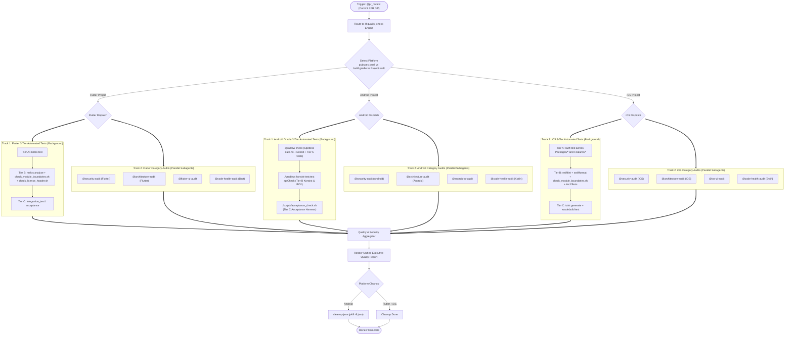

# Pull Request Review Skill

> [!IMPORTANT]
> **Unified Architecture**: PR Review is powered by the Central Orchestrator **[`@quality_check`](../quality_check/SKILL.md)**.
> It combines the automated **3-Tier Testing Standard** (Flutter Melos / Android Gradle / iOS Tuist & SwiftPM) with the **4 Specialized Category Audit Skills** executed in parallel.

---

## 📑 Table of Contents

1. [Platform-Aware Inspection Matrix & Category Audit Delegation](#-platform-aware-inspection-matrix--category-audit-delegation)
2. [PR Review Lifecycle Diagram](#-pr-review-lifecycle-diagram)
3. [Input Methods](#-input-methods)
4. [Review Workflow](#-review-workflow)
5. [Unified Executive Quality Report Format](#-unified-executive-quality-report-format)

---

## 🔍 Platform-Aware Inspection Matrix & Category Audit Delegation

PR review delegates semantic code inspection to 4 focused specialist skills while concurrently validating the platform's 3-Tier suite:

| Inspection Pillar | Delegated Skill | Target Area & Focus | Severity |
| :--- | :--- | :--- | :--- |
| **Fintech & Security** | **[`@security-audit`](../security-audit/SKILL.md)** | OWASP Mobile Top 10 (2024), strictly `Decimal` (Dart/Swift) / `BigDecimal` (Kotlin), no PII in logs, secure storage, TLS/Cert pinning. | 🔴 Blocker |
| **Clean Architecture** | **[`@architecture-audit`](../architecture-audit/SKILL.md)** | Domain layer purity (zero framework imports), feature package isolation, MVI state immutability, concurrency discipline. | 🔴 Blocker |
| **UI & Performance** | **[`@flutter-ui-audit`](../flutter-ui-audit/SKILL.md)** (Flutter) **[`@android-ui-audit`](../android-ui-audit/SKILL.md)** (Android) **[`@ios-ui-audit`](../ios-ui-audit/SKILL.md)** (iOS) | Rebuild / recomposition / re-evaluation optimization, state hoisting, controller/.task disposal, design system tokens. | 🔴 Blocker / 🟡 Warning |
| **Code Health & Safety** | **[`@code-health-audit`](../code-health-audit/SKILL.md)** | Function sizing (<20 lines), param limits (<=2), strict ban on `!` / `!!` / `try!` force unwraps, clean logging. | 🔴 Blocker / 🟡 Warning |
| **Automated 3-Tier Gates** | **[`@quality_check`](../quality_check/SKILL.md)** | Tier A (Unit Tests), Tier B (Architecture Boundaries, AST & Linter), Tier C (Acceptance Harness & Integration Tests). | 🔴 Blocker |

---

## 📊 PR Review Lifecycle Diagram

---

## 📥 Input Methods

PR Review supports multiple input channels:

| Input Type | Description | Command / Usage |
| :--- | :--- | :--- |
| **Working Diff** | Review staged or uncommitted local changes | `@pr_review` (analyzes current `git diff`) |
| **Commit ID** | Review changes introduced by a specific commit | `git show <COMMIT_ID>` or `@pr_review commit=<COMMIT_ID>` |
| **PR Number / Diff** | Review Pull Request changes via GitHub CLI | `gh pr diff <PR_NUMBER> \| pbcopy` |
| **Branch Range** | Review changes against the base branch | `git diff origin/main...HEAD` or `git diff origin/develop...HEAD` |

---

## 🔄 Review Workflow

1. **Detect Platform**:
   - Check if workspace is Flutter (`pubspec.yaml`/`melos.yaml`), Android (`build.gradle.kts`/`settings.gradle.kts`), or iOS (`Project.swift`/`Tuist.swift`/`Package.swift`).
2. **Invoke Quality Orchestration via `@quality_check`**:
   - Run the automated 3-Tier suite in the background.
   - Concurrently inspect the diff with the 4 Category Audit skills via `dispatching-parallel-agents`:
     - `@security-audit`
     - `@architecture-audit`
     - **Flutter**: `@flutter-ui-audit` | **Android**: `@android-ui-audit` | **iOS**: `@ios-ui-audit`
     - `@code-health-audit`
3. **Run Acceptance Verification (Tier C)**:
   - For all PRs targeting `main`, `develop`, or release branches.
4. **Synthesize & Report**:
   - Aggregate test status, OWASP compliance, architectural gates, and code health metrics.
   - Assign clear verdict: 🟢 LGTM / 🟡 NEEDS WORK / 🔴 BLOCKED.
5. **Resource Cleanup**:
   - If Android: run `cleanup-java` (`pkill -9 java`).

---

## 📤 Unified Executive Quality Report Format

Refer to **[`@quality_check` Output Format](../quality_check/SKILL.md#-unified-executive-quality-report-format)** for the comprehensive report structure required for all Pull Request reviews.
