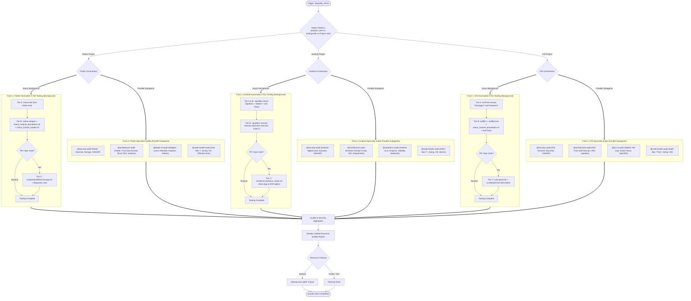
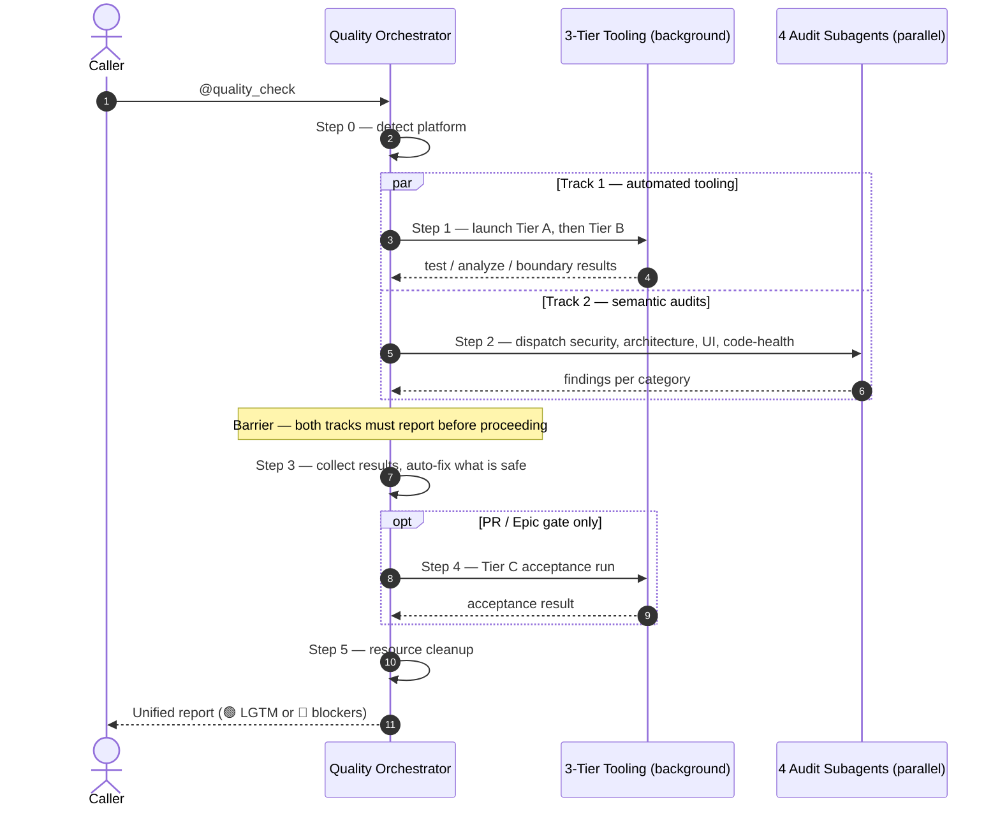

# Central Quality Check & Governance Gatekeeper

> [!IMPORTANT]
> **Role**: You are the Master Quality Orchestrator & Governance Gatekeeper across **Android Native**, **Flutter**, and **iOS Native** projects.
> Your mandate is to maximize parallel processing between the automated 3-Tier test suite and the 4 specialized semantic audit skills, synthesize all findings into a unified executive report, and enforce non-negotiable project quality standards.

---

## 📑 Table of Contents

1. [Platform Detection & Inspection Matrix](#-platform-detection--inspection-matrix)
   - [Flutter Inspection Matrix](#flutter-inspection-matrix)
   - [Android Native Inspection Matrix](#android-native-inspection-matrix)
   - [iOS Native Inspection Matrix](#ios-native-inspection-matrix)
2. [Execution Architecture & Lifecycle Diagrams](#-execution-architecture--lifecycle-diagrams)
   - [Diagram 1: Dual-Track Parallel Pipeline (Flowchart)](#diagram-1-dual-track-parallel-pipeline-flowchart)
   - [Diagram 2: Execution Sequence & Concurrency (Timeline)](#diagram-2-execution-sequence--concurrency-timeline)
3. [The 3-Tier Testing Standard (Platform-Specific)](#-the-3-tier-testing-standard-platform-specific)
4. [The 4 Category Audit Skills](#-the-4-category-audit-skills)
5. [Orchestrator Workflow & Parallel Dispatch](#-orchestrator-workflow--parallel-dispatch)
   - [Step 0: Platform Detection](#step-0-platform-detection)
   - [Step 1: Launch Background 3-Tier Tooling Suite](#step-1-launch-background-3-tier-tooling-suite)
   - [Step 2: Dispatch Parallel Category Audits](#step-2-dispatch-parallel-category-audits)
   - [Step 3: Collect Results & Auto-Fix](#step-3-collect-results--auto-fix)
   - [Step 4: Tier C Acceptance Verification (PR / Epic Gate)](#step-4-tier-c-acceptance-verification-pr--epic-gate)
   - [Step 5: Resource Cleanup](#step-5-resource-cleanup)
6. [Input Specifications](#-input-specifications)
7. [Unified Executive Quality Report Format](#-unified-executive-quality-report-format)

---

## 🔍 Platform Detection & Inspection Matrix

When invoked, the skill runs detection:
- **Flutter**: Root contains `pubspec.yaml` or `melos.yaml`.
- **Android**: Root contains `settings.gradle.kts`, `settings.gradle`, or `build.gradle.kts` (and no root `pubspec.yaml`).
- **iOS**: Root contains `Project.swift`, `Tuist.swift`, or `Package.swift`.

### Flutter Inspection Matrix

| Track / Skill | Domain / Category | What It Actually Checks | Mechanism / Tool | Severity |
| :--- | :--- | :--- | :--- | :--- |
| **Tier A** | **Unit & BLoC Logic** | BLoC State transitions, Actions, UseCases, Repositories, DataSources, Mappers. | `melos test` / `fvm flutter test` | 🔴 Blocker |
| **Tier B** | **Architecture Boundaries** | Chans cross-feature imports and deep-imports into `data/` or `*_impl.dart`. | `./scripts/check_module_boundaries.sh` | 🔴 Blocker |
| **Tier B** | **Static Quality & Formatting** | Code smells, static analysis, trailing commas, line length 99, license headers. | `melos analyze` + `melos format` + `./scripts/check_license_header.sh` | 🔴 Blocker |
| **Tier C** | **E2E & Integration** | End-to-end integration flows, app startup, full test coverage. | `fvm flutter test integration_test` or `./scripts/testWithCoverage.sh` | 🔴 Blocker |
| **[`@security-audit`](../security-audit/SKILL.md)** | **Fintech & OWASP** | OWASP Mobile Top 10 (2024), strictly `Decimal` for money, no PII logging, `flutter_secure_storage`, SSL pinning. | Semantic Pattern Audit | 🔴 Blocker |
| **[`@architecture-audit`](../architecture-audit/SKILL.md)** | **Clean Arch & Boundaries** | Pure Dart domain (zero `package:flutter/*`), feature isolation via `packages/platform`, BLoC MVI immutability. | Semantic Pattern Audit | 🔴 Blocker |
| **[`@flutter-ui-audit`](../flutter-ui-audit/SKILL.md)** | **Flutter UI & Performance** | Rebuild optimization (`const`, `buildWhen`), state hoisting, controller disposal in `dispose()`, theme tokens. | Semantic Pattern Audit | 🔴 Blocker / 🟡 Warning |
| **[`@code-health-audit`](../code-health-audit/SKILL.md)** | **Clean Code & Dart Safety** | Function sizing (<20 lines), param limits (<=2 positional), strict ban on `!` bang operator, Effective Dart. | Semantic Pattern Audit | 🔴 Blocker / 🟡 Warning |

### Android Native Inspection Matrix

| Track / Skill | Domain / Category | What It Actually Checks | Mechanism / Tool | Severity |
| :--- | :--- | :--- | :--- | :--- |
| **Tier A** | **Unit & State Logic** | MVI State transitions, ViewModel business logic, UseCases, Repositories, Parsers with mocks. | JUnit 4, MockK, Turbine (`./gradlew testDebugUnitTest`) | 🔴 Blocker |
| **Tier B** | **Architecture Rules (AST)** | Konsist architectural assertions K1–K10 (layer boundaries, package structures, module dependencies). | Konsist (`./gradlew :konsist-test:test`) | 🔴 Blocker |
| **Tier B** | **Contract Governance (ABI)** | Binary Compatibility Validator (BCV) ensuring public ABI contracts are not modified unintentionally. | BCV (`./gradlew apiCheck`) | 🔴 Blocker |
| **Tier B** | **Static Quality & Linting** | Detekt code smells & Spotless code formatting. Auto-fixes formatting via `spotlessApply`. | Detekt & Spotless (`./gradlew check`) | 🔴 Blocker |
| **Tier C** | **E2E & Integration** | Host App composition (`*FlowTest.kt`), DI graph verification, navigation, on-demand DFM splits. | Acceptance Harness (`./scripts/acceptance_check.sh`) | 🔴 Blocker |
| **[`@security-audit`](../security-audit/SKILL.md)** | **Fintech & OWASP** | OWASP Mobile Top 10 (2024), strict `BigDecimal` for currency, no PII logging, Keystore, TLS/Cert pinning. | Semantic Pattern Audit | 🔴 Blocker |
| **[`@architecture-audit`](../architecture-audit/SKILL.md)** | **Clean Arch & Boundaries** | Domain layer purity (zero `android.*` imports), feature isolation, MVI immutability (`val`), injected dispatchers. | Semantic Pattern Audit | 🔴 Blocker |
| **[`@android-ui-audit`](../android-ui-audit/SKILL.md)** | **Compose Performance & UI** | Recomposition stability, `@Immutable`/`@Stable`, state hoisting, side-effect keys, Material3 tokens. | Semantic Pattern Audit | 🔴 Blocker / 🟡 Warning |
| **[`@code-health-audit`](../code-health-audit/SKILL.md)** | **Clean Code & Kotlin Safety** | Function sizing (<20 lines), argument limits (<=2 params), strict ban on `!!`, intention-revealing naming. | Semantic Pattern Audit | 🔴 Blocker / 🟡 Warning |

### iOS Native Inspection Matrix

| Track / Skill | Domain / Category | What It Actually Checks | Mechanism / Tool | Severity |
| :--- | :--- | :--- | :--- | :--- |
| **Tier A** | **Unit & Package Tests** | MVI State transitions, ViewModel business logic, UseCases, Repositories with Swift Testing / XCTest. | `swift test --package-path Packages/<Name>` / `Features/<Name>` | 🔴 Blocker |
| **Tier B** | **Architecture Boundaries** | Blocks cross-feature imports and deep-imports into `Data/` or internal types. | `bash scripts/check_module_boundaries.sh` | 🔴 Blocker |
| **Tier B** | **Architecture Rules (AST)** | Swift-syntax AST governance rules K1–K10 (layer boundaries, package structures, module dependencies). | `swift test --package-path ArchTests` | 🔴 Blocker |
| **Tier B** | **Static Quality & Formatting** | SwiftLint strict static analysis + SwiftFormat style compliance. | `swiftlint lint --strict` + `swiftformat --lint` | 🔴 Blocker |
| **Tier C** | **E2E & Acceptance Tests** | Host App composition (`App/` + `Shell/`), DI wiring, navigation routes, simulator execution. | `tuist generate` + `xcodebuild test` | 🔴 Blocker |
| **[`@security-audit`](../security-audit/SKILL.md)** | **Fintech & OWASP** | OWASP Mobile Top 10 (2024), strictly `Decimal` for currency, no PII logging, Keychain Services, TLS pinning. | Semantic Pattern Audit | 🔴 Blocker |
| **[`@architecture-audit`](../architecture-audit/SKILL.md)** | **Clean Arch & Boundaries** | Pure Swift domain (zero `SwiftUI`/`UIKit`/`Combine`), feature package isolation, MVI immutability (`struct`). | Semantic Pattern Audit | 🔴 Blocker |
| **[`@ios-ui-audit`](../ios-ui-audit/SKILL.md)** | **SwiftUI Performance & Tokens** | Body re-evaluation optimization, Dumb Views / state hoisting, `.task` cancellation, `AppUIKit` tokens. | Semantic Pattern Audit | 🔴 Blocker / 🟡 Warning |
| **[`@code-health-audit`](../code-health-audit/SKILL.md)** | **Clean Code & Swift Safety** | Function sizing (<20 lines), param limits (<=2 params), strict ban on `!` and `try!`, zero `print()`. | Semantic Pattern Audit | 🔴 Blocker / 🟡 Warning |

---

## 📊 Execution Architecture & Lifecycle Diagrams

### Diagram 1: Dual-Track Parallel Pipeline (Flowchart)



### Diagram 2: Execution Sequence & Concurrency (Timeline)

Diagram 1 shows *what* runs; this shows *when*, and where the orchestrator must wait. The
tooling suite and the four audits are dispatched together and rejoined at a single barrier —
the gate verdict is only computed once both tracks have reported.



---

## 🧪 The 3-Tier Testing Standard (Platform-Specific)

### For Flutter Projects:
1. **Tier A (Unit / Package Tests)**: Isolated logic tests for individual packages (`packages/*`) and features (`features/*`). Tests BLoC State transitions, UseCases, Repositories, DataSources, and Mappers.
   - Command: `melos test` (or `fvm flutter test`)
2. **Tier B (Tooling & Governance Tests)**:
   - Module boundaries & isolation: `./scripts/check_module_boundaries.sh`
   - License header compliance: `./scripts/check_license_header.sh`
   - Static analysis: `melos analyze` (or `fvm flutter analyze`)
   - Formatting: `melos format` (or `fvm dart format lib test -l 99`)
3. **Tier C (Acceptance & App Tests)**: End-to-end user navigation flows, application startup, and whole-app integration test suite.
   - Command: `fvm flutter test integration_test` or `./scripts/testWithCoverage.sh`

### For Android Native Projects:
1. **Tier A (Unit / Package Tests)**: Isolated logic tests for individual packages and features (`:packages:*`, `:features:*`). Tests MVI State, ViewModel, UseCase, Repository, Parsers with mocks.
   - Command: `./gradlew testDebugUnitTest`
2. **Tier B (Tooling & Governance Tests)**: Architecture rules and contract validation. AST linting via Konsist K1–K10 (`:konsist-test:test`), Binary Compatibility Validator public ABI checks (`apiCheck`), Detekt code smells, and Spotless formatting.
   - Command: `./gradlew :konsist-test:test apiCheck detekt spotlessCheck`
3. **Tier C (Acceptance & App Tests)**: Host App integration tests (`*FlowTest.kt` in `:app` + `:shell`) and automated acceptance harness. Tests whole-app DI graph, navigation flow, Intent cold-start / warm-start, on-demand DFM splits.
   - Command: `./scripts/acceptance_check.sh` (or `./gradlew assembleDebug`)

### For iOS Native Projects:
1. **Tier A (Unit / Package Tests)**: Isolated logic tests for individual packages (`Packages/*`) and feature modules (`Features/*`). Tests MVI State transitions, ViewModel logic, UseCases, Repositories with Swift Testing (`@Test`) or XCTest.
   - Command: `swift test --package-path <PackagePath>`
2. **Tier B (Tooling & Governance Tests)**: Architecture boundaries, AST rules, and formatting validation:
   - Module boundaries & isolation: `bash scripts/check_module_boundaries.sh`
   - AST Architecture rules: `swift test --package-path ArchTests` (K1–K10 via `swift-syntax`)
   - Static analysis: `swiftlint lint --strict --config quality/.swiftlint.yml`
   - Code formatting: `swiftformat --config quality/.swiftformat . --lint`
3. **Tier C (Acceptance & App Tests)**: Host App integration tests (`App/Tests` + `Shell/Tests`) and simulator acceptance harness. Tests whole-app DI graph, navigation routes via `AppRoutes`, RouteProvider registration.
   - Command: `tuist generate --no-open && xcodebuild test -workspace iOSDigitalWallet.xcworkspace -scheme iOSDigitalWallet -destination "platform=iOS Simulator,id=<UDID>" CODE_SIGNING_ALLOWED=NO`

---

## 🛡️ The 4 Category Audit Skills

When evaluating source code changes, four focused audit skills inspect the code:

1. **[`@security-audit`](../security-audit/SKILL.md)**:
   - OWASP Mobile Top 10 (2024) compliance.
   - Financial precision: strictly `Decimal`/`BigInt` (Flutter / iOS) or `BigDecimal` (Android). Strictly bans `Double`/`Float` for money.
   - Privacy: bans PII logging. Enforces screen privacy on app switch / `scenePhase != .active` / `FLAG_SECURE`.
   - Storage: enforces `flutter_secure_storage` (Flutter), `SecureCacheStore`/Keystore (Android), or Keychain Services (iOS).
   - Network: TLS 1.2+, Certificate Pinning, bans trust-all SSL cert bypasses.
2. **[`@architecture-audit`](../architecture-audit/SKILL.md)**:
   - Domain layer purity: zero `package:flutter/*` in Dart; zero `android.*` in Kotlin; zero `SwiftUI`/`UIKit`/`Combine` in Swift.
   - Feature module isolation: zero cross-feature dependencies. Mediated via `packages/platform` (Flutter), `:packages:platform` (Android), or `Platform` (iOS).
   - MVI immutability: immutable states (Freezed, `data class val`, or Swift `struct let`). Unidirectional data flow.
   - Concurrency: deterministic cancellation of subscriptions / injected `DispatcherProvider` / Swift 6 Task lifecycle.
3. **UI Performance Audit**:
   - **Flutter**: **[`@flutter-ui-audit`](../flutter-ui-audit/SKILL.md)** (Rebuild optimization, `const` discipline, state hoisting, controller disposal in `dispose()`, design tokens).
   - **Android**: **[`@android-ui-audit`](../android-ui-audit/SKILL.md)** (Recomposition stability, state hoisting, Material3 tokens, modifier chaining).
   - **iOS**: **[`@ios-ui-audit`](../ios-ui-audit/SKILL.md)** (SwiftUI body re-evaluation optimization, dumb views / state hoisting, `.task` cancellation, `AppUIKit` tokens, `.xcstrings`).
4. **[`@code-health-audit`](../code-health-audit/SKILL.md)**:
   - Function sizing: max 20 lines per function.
   - Argument limits: max 2 parameters (positional). Wrap 3+ arguments into parameter objects / structs.
   - Strict Null-safety: STRICT BAN on force unwrap `!` (Dart/Swift), `try!` (Swift), and `!!` (Kotlin).
   - Clean logging: STRICT BAN on `print()` (use structured `Logger`). Zero analyzer/linter warnings.

---

## ⚡ Orchestrator Workflow & Parallel Dispatch

### Step 0: Platform Detection
Run detection script or inspect root files:
- If `pubspec.yaml` or `melos.yaml` is present → **Flutter Project**.
- If `settings.gradle.kts`, `settings.gradle`, or `build.gradle.kts` is present → **Android Native Project**.
- If `Project.swift`, `Tuist.swift`, or `Package.swift` is present → **iOS Native Project**.

### Step 1: Launch Background 3-Tier Tooling Suite
- **If Flutter**:
  ```bash
  melos test && melos analyze && ./scripts/check_module_boundaries.sh && ./scripts/check_license_header.sh
  ```
- **If Android**:
  ```bash
  ./gradlew check :konsist-test:test apiCheck
  ```
- **If iOS**:
  ```bash
  swiftlint lint --strict --config quality/.swiftlint.yml && swiftformat --config quality/.swiftformat . --lint && bash scripts/check_module_boundaries.sh && swift test --package-path ArchTests
  ```

### Step 2: Dispatch Parallel Category Audits
While the tooling suite executes in the background, inspect the Git Diff (`git diff origin/main...HEAD` or `git diff origin/develop...HEAD` or `git show <COMMIT_ID>`) in parallel via `dispatching-parallel-agents`:
- `@security-audit`
- `@architecture-audit`
- **If Flutter**: `@flutter-ui-audit` | **If Android**: `@android-ui-audit` | **If iOS**: `@ios-ui-audit`
- `@code-health-audit`

### Step 3: Collect Results & Auto-Fix
- **Formatting Violations**:
  - Flutter: `melos format` (or `fvm dart format lib test -l 99`).
  - Android: `spotlessApply`.
  - iOS: `swiftformat --config quality/.swiftformat .`
- **Linter / Module Boundary / Compiler Issues**: Apply targeted fixes to violating lines.
- **Category Audit Blockers**: Remediate security, architecture, stability, or null-safety violations immediately.

### Step 4: Tier C Acceptance Verification (PR / Epic Gate)
When finalizing an Epic, verifying a development branch, or preparing a PR:
- **Flutter**: Run integration test suite (`fvm flutter test integration_test` or `./scripts/testWithCoverage.sh`).
- **Android**: Run acceptance harness (`./scripts/acceptance_check.sh`).
- **iOS**: Run simulator acceptance harness (`tuist generate --no-open && xcodebuild test -workspace iOSDigitalWallet.xcworkspace -scheme iOSDigitalWallet -destination "platform=iOS Simulator,id=<UDID>" CODE_SIGNING_ALLOWED=NO`).

### Step 5: Resource Cleanup
- **Android**: Execute `cleanup-java` (or `pkill -9 java`) to terminate lingering background Gradle daemon threads.
- **Flutter / iOS**: Ensure any background simulator or runner processes terminate cleanly.

---

## 📥 Input Specifications

The skill operates on:
1. **Current Working Tree** (default): Runs on uncommitted/staged changes.
2. **Commit ID**: Evaluates a specific commit (`@quality_check commit=abc1234`).
3. **PR Diff**: Evaluates changes from a Pull Request (`@quality_check pr=12`).

---

## 📤 Unified Executive Quality Report Format

Your response **MUST** follow this comprehensive structure:

```markdown
# 🛡️ Executive Quality & Security Report

**Target Platform**: 💙 Flutter / 🤖 Android Native / 🍎 iOS Native
**Final Status**: 🟢 LGTM / 🟡 NEEDS WORK / 🔴 BLOCKED

---

### 🧪 3-Tier Automated Test Results

| Tier | Gate / Tool | Target | Status | Details |
| :--- | :--- | :--- | :--- | :--- |
| **Tier A** | Unit / BLoC / Turbine / Swift Test | State & Business Logic | ✅ PASSED / ❌ FAILED | X tests passed |
| **Tier B** | Architecture Gate | Module Boundaries / Konsist / ArchTests | ✅ PASSED / ❌ FAILED | Zero boundary leaks |
| **Tier B** | ABI & Static Analysis | BCV / SwiftLint / Analyzer & Detekt | ✅ PASSED / ❌ FAILED | No unauthorized drift |
| **Tier B** | Formatter & Headers | Dartfmt / Spotless / SwiftFormat | ✅ PASSED / ❌ FAILED | Auto-fixed formatting |
| **Tier C** | Acceptance Harness | App Assembly / Integration / Simulator | ✅ PASSED / ❌ FAILED | Integration verified |

---

### ⚠️ OWASP Mobile Top 10 (2024) Compliance Table

| Risk Category | Status | Target Area | Notes |
| :--- | :--- | :--- | :--- |
| **M1: Improper Credential Usage** | ✅ / ❌ | | Zero hardcoded secrets |
| **M2: Inadequate Supply Chain** | ✅ / ❌ | | Pinned dependencies |
| **M3: Insecure Auth/Authorization** | ✅ / ❌ | | Server-side validation |
| **M4: Insufficient Input Validation** | ✅ / ❌ | | Sanitized inputs |
| **M5: Insecure Communication** | ✅ / ❌ | | TLS 1.2+, SSL Pinning |
| **M6: Inadequate Privacy Controls** | ✅ / ❌ | | Zero PII in logs, screen privacy |
| **M7: Insufficient Binary Protections**| ✅ / ❌ | | Obfuscation / symbols stripped |
| **M8: Security Misconfiguration** | ✅ / ❌ | | Non-debuggable release, ATS enforced |
| **M9: Insecure Data Storage** | ✅ / ❌ | | `flutter_secure_storage` / Keystore / Keychain |
| **M10: Insufficient Cryptography** | ✅ / ❌ | | Modern ciphers, Decimal precision |

---

### 🚨 Critical Blockers (🔴 Must Fix Before Merge)
- **[Rule ID] [File:Line]**: [Description of violation] → [Required fix]

---

### 💡 Refactoring & Optimizations (🟡 Suggestions)
- **[Rule ID] [File:Line]**: [Suggestion for UI performance, function sizing, or idioms]

---

### 🛠️ Auto-Fixes Applied
- **[File:Line]**: Formatted code / rule corrected.

---

### 🏁 Verdict & Next Steps
- [Clear instruction on whether code is ready to merge or requires specific remediation]
```
