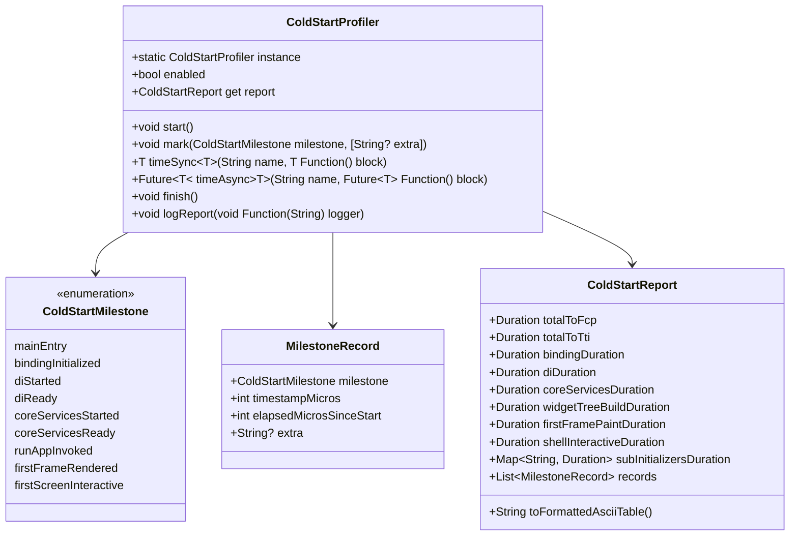
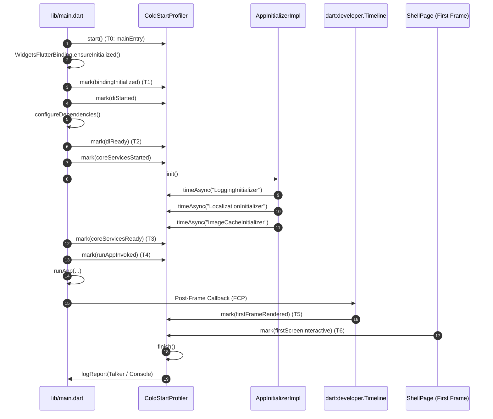

# Cold Start Performance Measurement & Telemetry Design Spec

- **Date**: 2026-09-17
- **Topic**: `cold_start_measurement`
- **Platform**: Flutter
- **Target Release**: v1.1.0

---

## 1. Context & Objectives

Following cold start optimizations in `develop` (lazy indexing, deferred deep-linking, single Scaffold, static cached theme, and two-stage navigation bar rendering), developers need empirical, reproducible timing data to determine exactly which startup phase and which initialization steps consume the most time.

### Objectives
1. Provide millisecond-level precision timing across all cold start milestones:
   - OS/Dart VM Entry -> Flutter Binding.
   - Dependency Injection graph compilation (`GetIt`).
   - Theme loading & Core services (`AppInitializer`).
   - Individual sub-initializer breakdown (`Logging`, `Localization`, `ThemeManager`, `Environment`, `ImageCache`, etc.).
   - Widget tree mounting (`runApp`).
   - First Contentful Paint (`FCP` - first frame rendered).
   - Time To Interactive (`TTI` - `ShellPage` and initial tab fully mounted).
2. Integrate with `dart:developer.Timeline` so phase intervals appear natively on Flutter DevTools Performance Timeline.
3. Print a structured, human-readable ASCII report to developer console and `Talker` logger at completion of the first frame.
4. Provide a programmatic query API (`ColdStartProfiler.instance.report`) to enable automated test assertions on performance budgets.
5. Guarantee zero runtime overhead in production releases when profiling is disabled.

---

## 2. Scope & Boundaries

### Goals
- Create a reusable, decoupled `ColdStartProfiler` service in `packages/core/lib/telemetry/`.
- Instrument `lib/main.dart` with milestone timestamps.
- Instrument `AppInitializerImpl` to measure the individual duration of each sub-initializer.
- Instrument `ShellPage` to capture the settled first-screen interactive milestone.
- Add formatted ASCII summary logging to Talker and standard debug console.
- Add comprehensive unit and integration tests verifying timing accuracy and report formatting.

### Non-Goals
- Modifying UI layouts or changing business logic of tabs.
- Writing native platform C++/Kotlin/Swift code (this spec focuses on Dart engine to initial interactive frame).

---

## 3. Architecture & Technical Design

### Class Architecture (`packages/core/lib/telemetry/`)



### Milestone Sequence



---

## 4. Visual Log Output

At the conclusion of the startup sequence, `ColdStartProfiler` formats and emits a high-visibility summary banner:

```text
┌──────────────────────────────────────────────────────────────┐
│ 🚀 COLD START PERFORMANCE TELEMETRY REPORT                   │
├──────────────────────────────────────┬─────────────┬─────────┤
│ Milestone / Phase                    │ Time (ms)   │ % Total │
├──────────────────────────────────────┼─────────────┼─────────┤
│ 1. Engine & Binding Init             │       14 ms │    3.8% │
│ 2. Dependency Injection (GetIt)      │       48 ms │   13.0% │
│ 3. Core Services & Initializers      │      125 ms │   33.8% │
│    ├─ ThemeManager.init              │       22 ms │    5.9% │
│    ├─ LoggingInitializer             │       18 ms │    4.9% │
│    ├─ LocalizationInitializer        │       65 ms │   17.6% │
│    └─ Other Initializers             │       20 ms │    5.4% │
│ 4. Widget Tree Build (runApp)        │       32 ms │    8.6% │
│ 5. First Contentful Paint (FCP)      │       98 ms │   26.5% │
│ 6. Shell & First Screen Interactive  │       53 ms │   14.3% │
├──────────────────────────────────────┼─────────────┼─────────┤
│ 🏁 TOTAL COLD START TIME (to FCP)    │      317 ms │         │
│ 🎯 TIME TO INTERACTIVE (TTI)         │      370 ms │  100.0% │
└──────────────────────────────────────┴─────────────┴─────────┘
```

---

## 5. Automated Verification Plan

1. **Unit Tests (`packages/core/test/telemetry/cold_start_profiler_test.dart`)**:
   - Verify `mark()`, `timeSync()`, and `timeAsync()` accurately record delta timestamps.
   - Verify `ColdStartReport` computes correct phase durations and percentages.
   - Verify `toFormattedAsciiTable()` produces non-empty, expected output.
   - Verify safe behavior when `enabled == false` (no-op, zero errors).
2. **Component Tests (`test/core/app_initializer/app_initializer_impl_telemetry_test.dart`)**:
   - Verify `AppInitializerImpl` delegates each sub-initializer through the profiler's `timeAsync`.
3. **Integration / Acceptance Test (`integration_test/cold_start_telemetry_test.dart`)**:
   - Verify running host app triggers all milestones through `firstScreenInteractive`.
   - Assert that `ColdStartProfiler.instance.report.totalToFcp` is greater than 0 and under acceptable test budget threshold.
