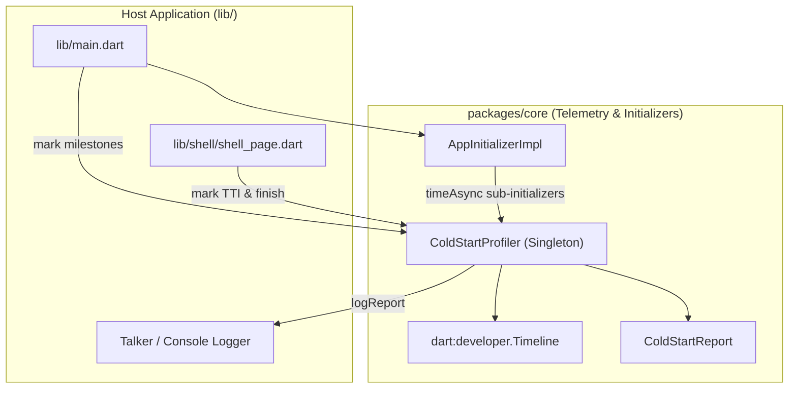
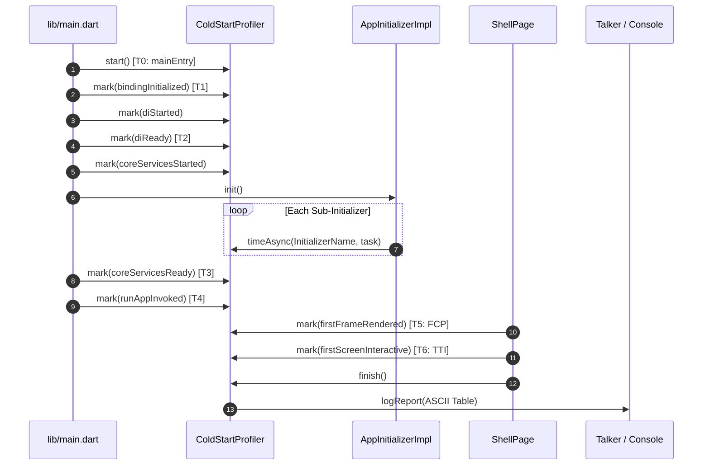

# Cold Start Performance Measurement & Telemetry — High-Level Design (HLD)

## Meta Data
- **Epic**: `cold_start_measurement`
- **Status**: done
- **Target Release**: v1.1.0
- **Platform**: Flutter
- **Source Spec**: [2026-09-17-cold-start-measurement-and-profiling-design.md](2026-09-17-cold-start-measurement-and-profiling-design.md)

---

## 1. Background
Following initial cold start optimizations (lazy tab indexing, deferred deep linking, single Scaffold, cached theme data, and two-stage bottom navigation bar rendering), developers require rigorous, empirical timing data to measure the precise impact of each startup phase and pinpoint the exact bottlenecks in the initialization sequence.

---

## 2. Goals & Non-Goals

### Goals
- Implement a decoupled, high-precision `ColdStartProfiler` service in `packages/core/lib/telemetry/`.
- Provide milestone markers and duration calculations for all critical startup phases (Engine -> Binding -> DI -> Core Initializers -> runApp -> FCP -> TTI).
- Micro-benchmark each individual sub-initializer in `AppInitializerImpl` (Logging, Localization, ThemeManager, Environment, ImageCache, etc.).
- Emit `dart:developer.TimelineTask` traces for visual debugging in Flutter DevTools Performance view.
- Print a formatted ASCII summary table to the console and Talker logger upon completing the first interactive frame.
- Expose a queryable `ColdStartReport` API for test assertions and performance budgets.

### Non-Goals
- Modifying UI layouts or tab styling.
- Adding native C++/Kotlin/Swift code (Dart-level engine-to-first-paint profiling only).
- Changing business logic of feature modules.

---

## 3. Architecture & Technical Design

### High-Level Architecture

### Milestone & Sequence Flow

---

## 4. BDD Test Scenarios Overview

See [.devtool/epic/cold_start_measurement/bdd_scenarios.md](bdd_scenarios.md) for full Gherkin specifications covering:
1. **Happy Path**: Complete cold start milestone capture and report generation.
2. **Sub-Initializer Telemetry**: Correct measurement of individual initializers with concurrent execution.
3. **Fail-Safe & Toggle**: Zero runtime overhead and graceful handling when profiling is disabled.
4. **Timeline Trace Integration**: Native Flutter Timeline events dispatched without exceptions.
5. **Report Integrity**: Valid duration calculations, percentages, and ASCII table rendering.

---

## 5. Rollout Strategy & Mitigation

- **Bypass in Release**: Default to active in Debug and Profile modes, and controlled by `EnvironmentConfig.enableProfiling` in Production builds.
- **Fail-Safe Execution**: All timing code is wrapped in try-catch/null-safe blocks ensuring that telemetry errors never break the app startup flow.

---

## 6. Kanban Tasks Breakdown

- [task_01_core_cold_start_profiler.md](task_01_core_cold_start_profiler.md) — Core `ColdStartProfiler` & `ColdStartReport` engine in `packages/core`
- [task_02_sub_initializers_benchmarking.md](task_02_sub_initializers_benchmarking.md) — Micro-benchmarking for `AppInitializerImpl` in `packages/core`
- [task_03_host_app_instrumentation.md](task_03_host_app_instrumentation.md) — Host app instrumentation & logging in `lib/main.dart` & `lib/shell/shell_page.dart`
- [task_04_acceptance_telemetry_tests.md](task_04_acceptance_telemetry_tests.md) — Acceptance and performance integration tests
