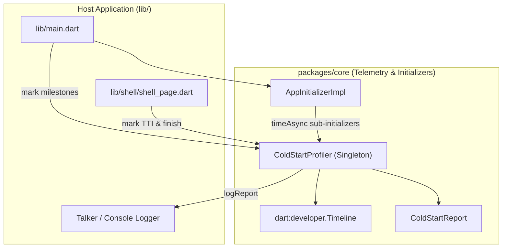
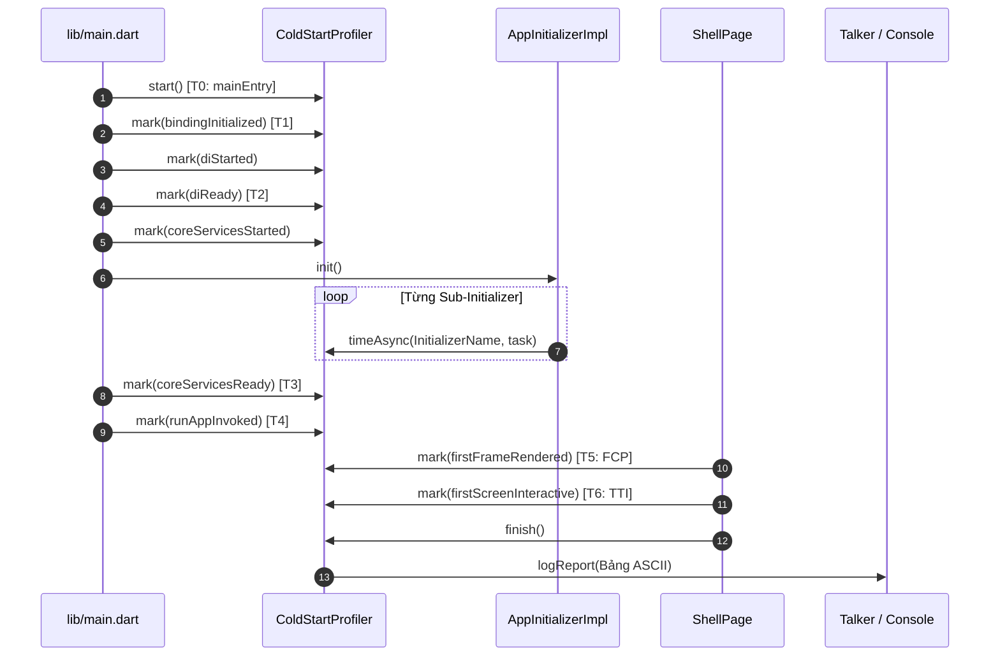

# Đo Đạc Hiệu Năng Khởi Động (Cold Start Telemetry & Profiling) — High-Level Design (HLD)

## Meta Data
- **Epic**: `cold_start_measurement`
- **Trạng thái**: done
- **Phiên bản mục tiêu**: v1.1.0
- **Nền tảng**: Flutter
- **Tài liệu Spec nguồn**: [2026-09-17-cold-start-measurement-and-profiling-design.md](2026-09-17-cold-start-measurement-and-profiling-design.md)

---

## 1. Bối cảnh
Sau khi hoàn thành các đợt tối ưu hóa cold start ban đầu (lazy tab indexing, hoãn khởi tạo deep link, loại bỏ Scaffold lồng nhau, cache theme data tĩnh, và render bottom nav bar 2 giai đoạn), lập trình viên cần có dữ liệu đo đạc thực nghiệm, chính xác đến từng millisecond để định lượng tác động của từng giai đoạn khởi động và xác định chính xác nút thắt cổ chai trong quy trình khởi tạo.

---

## 2. Mục tiêu & Giới hạn phạm vi

### Mục tiêu
- Xây dựng dịch vụ `ColdStartProfiler` độc lập, độ chính xác cao trong `packages/core/lib/telemetry/`.
- Cung cấp các mốc thời gian và tính toán duration cho toàn bộ các giai đoạn khởi động trọng yếu (Engine -> Binding -> DI -> Core Initializers -> runApp -> FCP -> TTI).
- Đo đạc chi tiết (micro-benchmark) từng Initializer con trong `AppInitializerImpl` (Logging, Localization, ThemeManager, Environment, ImageCache, v.v.).
- Phát sự kiện `dart:developer.TimelineTask` hiển thị trực quan trên Flutter DevTools Performance view.
- In bảng tổng kết ASCII sắc nét ra console và Talker logger ngay khi hoàn thành render frame tương tác đầu tiên.
- Cung cấp API `ColdStartReport` cho các bài kiểm thử tự động (automated tests) assert ngân sách hiệu năng.

### Giới hạn phạm vi (Non-Goals)
- Không thay đổi layout hay style của các màn hình tab.
- Không viết mã native C++/Kotlin/Swift (tập trung đo đạc từ Dart VM engine đến first interactive paint).
- Không thay đổi nghiệp vụ của các feature module.

---

## 3. Kiến trúc & Thiết kế kỹ thuật

### Kiến trúc tổng thể (High-Level Architecture)

### Luồng mốc thời gian & trình tự (Milestone & Sequence Flow)

---

## 4. Kịch bản kiểm thử BDD

Xem chi tiết tại [.devtool/epic/cold_start_measurement/bdd_scenarios.md](bdd_scenarios.md) cho các đặc tả Gherkin:
1. **Happy Path**: Ghi nhận đầy đủ các mốc khởi động và xuất báo cáo.
2. **Sub-Initializer Telemetry**: Đo đạc chính xác từng initializer chạy song song.
3. **Fail-Safe & Toggle**: Không tốn chi phí runtime và xử lý an toàn khi tắt profiling.
4. **Tích hợp Timeline Trace**: Sự kiện Timeline được phát an toàn không gây exception.
5. **Tính toàn vẹn của Báo cáo**: Tính toán chính xác thời lượng, phần trăm và in bảng ASCII chuẩn.

---

## 5. Chiến lược Rollout & Giảm thiểu rủi ro

- **Vô hiệu hóa trong Release**: Mặc định kích hoạt trong Debug và Profile mode, và điều khiển bằng `EnvironmentConfig.enableProfiling` trong bản Production.
- **Thực thi an toàn (Fail-Safe)**: Toàn bộ mã đo đạc được bọc try-catch/null-safe đảm bảo telemetry không bao giờ làm gián đoạn luồng khởi động chính.

---

## 6. Phân rã đầu việc Kanban

- [task_01_core_cold_start_profiler.md](task_01_core_cold_start_profiler.md) — Xây dựng engine `ColdStartProfiler` & `ColdStartReport` trong `packages/core`
- [task_02_sub_initializers_benchmarking.md](task_02_sub_initializers_benchmarking.md) — Đo đạc chi tiết từng `AppInitializerImpl` trong `packages/core`
- [task_03_host_app_instrumentation.md](task_03_host_app_instrumentation.md) — Gắn telemetry & logging trong `lib/main.dart` & `lib/shell/shell_page.dart`
- [task_04_acceptance_telemetry_tests.md](task_04_acceptance_telemetry_tests.md) — Viết bộ test nghiệm thu và đo đạc tích hợp
