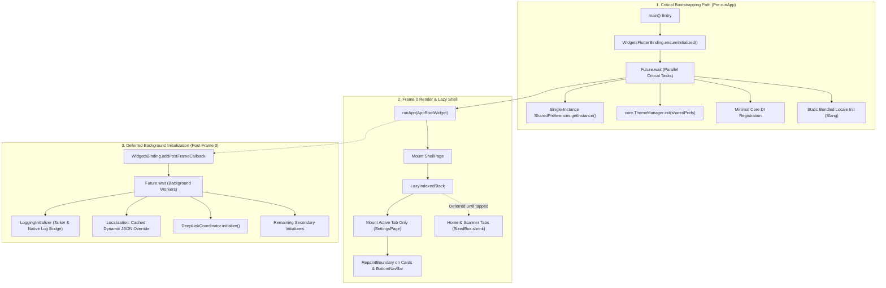

# Cold Start & Graphics Optimization Design Spec

## 1. Executive Summary & Problem Statement

### 1.1. Context & Problem
In the Flutter Super-App (`d3_nexus_shield`), cold start latency and initial frame rendering are noticeably slow when launching the application. Inspection of the codebase reveals two major compounding factors:
1. **Pre-Frame Dart I/O Bottlenecks**: A serial chain of asynchronous operations (`await`) executes inside `main()` prior to calling `runApp()`. This includes redundant disk I/O for `SharedPreferences`, synchronous file/cache deserialization of dynamic localization JSON strings across multiple packages, and platform channel queries for deep links.
2. **First-Frame GPU Rasterization & Over-mounting**:
   - The shell navigation container (`ShellPage`) utilizes a standard `IndexedStack`, which eagerly instantiates and mounts all tabs (`HomeDashboardPage`, `ScannerPage`, and `SettingsPage`) simultaneously in Frame 0.
   - The active tab (`SettingsPage`) and the bottom navigation bar contain multiple cards and circular floating action buttons adorned with `BoxShadow` using heavy `blurRadius` (10–12px). Lacking `RepaintBoundary` isolation, the GPU engine (Impeller / Skia) undergoes multi-pass offscreen convolution passes and pipeline setup in Frame 0, and repeatedly re-convolves the shadows during scrolling and UI state transitions.

### 1.2. Objectives & Target KPIs
- **TTID (Time to Initial Display / Cold Start Time)**: Reduce from ~1,500ms to **< 450ms**.
- **First Frame GPU Raster Time**: Reduce from > 35ms (jank threshold) to **< 12ms** (smooth 60/120fps budget).
- **First Frame Element Count**: Reduce initial widget mount count in `ShellPage` by **~66%** by lazily mounting only the active tab.
- **Visual Integrity**: Preserve 100% of the existing glassmorphic aesthetics, soft shadows, and vibrant glowing elements without degradation.

---

## 2. Architectural Solution



---

## 3. Detailed Component Designs

### 3.1. Non-blocking Parallel Bootstrapping (`lib/main.dart` & `AppInitializer`)

#### Current Bottleneck
In `lib/main.dart`, sequential `await` calls block `runApp()`:
```dart
await configureDependencies();
await core.ThemeManager.instance.init();
await getIt<core.AppInitializer>().init();
await getIt<DeepLinkCoordinator>().initialize();
```
`AppInitializerImpl` further blocks on a sequential loop of 6 initializers.

#### Optimized Design
1. **Single SharedPreferences Resolution**:
   - Resolve `SharedPreferences.getInstance()` once in `main()` and register it directly into `GetIt`.
   - Pass this resolved instance into `ThemeManager.instance.initWithPrefs(prefs)` to eliminate duplicate method channel calls.
2. **Slang Static Fast-Path**:
   - Load the saved language code and initialize Slang statically using bundled localizations.
   - Defer reading cached dynamic JSON files and calling `overrideTranslationsFromMap` until after the first frame has rendered via `addPostFrameCallback`.
3. **Deferred Initializers**:
   - Execute non-critical tasks (`LoggingInitializer`, `DeepLinkCoordinator.initialize()`, `EnvironmentInitializer`, `MemoryPressureObserver`) asynchronously in parallel using `Future.wait` after `runApp()` has scheduled the first frame.

### 3.2. Lazy Navigation Shell (`lib/shell/shell_page.dart`)

#### Current Bottleneck
`IndexedStack` eagerly evaluates `children: [HomeDashboardPage(), ScannerPage(), SettingsPage()]`. Since `defaultTabIndex = 2`, `SettingsPage` is shown, but `ScannerPage` and `HomeDashboardPage` construct their subtrees and initialize BLoC states immediately.

#### Optimized Design
Create a reusable, zero-dependency `LazyIndexedStack` widget in `packages/ui_kit`:
- **State Preservation**: Maintains an internal `Set<int> _activatedIndices = {currentIndex}`.
- **Lazy Instantiation**: For index `i`, if `_activatedIndices.contains(i)`, build the child widget; otherwise render `const SizedBox.shrink()`.
- When switching tabs, the new index is added to `_activatedIndices`, mounting the child on-demand while existing children remain in the tree without resetting state.

### 3.3. GPU Rasterization & Shadow/Blur Optimization

#### Current Bottleneck
`BoxShadow(blurRadius: 10, offset: Offset(0, 2))` on 4 settings sections and `blurRadius: 12` on `_CenterNavItem` trigger multi-pass GPU convolution shaders. Without boundary isolation, any frame tick or scroll repaints the entire layer.

#### Optimized Design
1. **RepaintBoundary Layer Isolation**:
   - Wrap `CustomBottomNavBar` in a `RepaintBoundary`. The navigation bar and floating QR button are rendered to a dedicated GPU display list and composited at 0ms raster cost during page scroll.
   - Wrap each `SettingsSectionWidget` in a `RepaintBoundary`. State changes (such as toggling Dark Mode or Debug Mode) only invalidate that individual section's layer.
2. **Decoration Constness & Caching**:
   - Extract shadow definitions into `const` / static instances to avoid recreation and heap allocations during build cycles.

---

## 4. Error Handling & Resilience

- **Cold Start Fallback for Localization**: If the background dynamic JSON fetch/parse fails or is delayed, the app continues functioning seamlessly using bundled Slang translations.
- **DeepLink Buffering**: Inbound deep links arriving during deferred initialization are buffered in `DeepLinkCoordinator._stagedInitialLink` and dispatched once `markRouterReady()` fires.
- **Memory Pressure**: `MemoryPressureObserver` remains active to trim image caches if low memory signals occur during warm-up.

---

## 5. Verification & Testing Plan

### 5.1. Automated Unit & Widget Tests
- **`LazyIndexedStackTest`**:
  - Verify that upon initial render with `index: 2`, only child at index 2 is mounted; children 0 and 1 are not mounted.
  - Verify that changing `index` to 0 mounts child 0 while retaining state in child 2.
- **`MainBootstrappingTest`**:
  - Verify that `configureDependencies()` and initializers resolve properly under the parallelized pipeline.

### 5.2. Performance Benchmarking
- Run `fvm flutter run --profile` on a physical device / simulator.
- Use Flutter DevTools Timeline to measure:
  - Time from `main()` to first frame rasterization (`WidgetsBinding.firstFrameRasterized`).
  - GPU Raster thread duration per frame during cold start and scrolling.

---

## 6. Implementation Task Breakdown

1. **Task 1: Lazy Navigation Shell (`LazyIndexedStack`)**:
   - Create `LazyIndexedStack` in `packages/ui_kit`.
   - Update `ShellPage` to use `LazyIndexedStack`.
   - Add unit/widget tests verifying lazy mount and state preservation.
2. **Task 2: GPU Layer & RepaintBoundary Optimization**:
   - Add `RepaintBoundary` and cached decoration definitions to `SettingsSectionWidget` and `CustomBottomNavBar`.
   - Verify zero visual regression and profile GPU raster cache behavior.
3. **Task 3: Parallelized & Non-blocking Bootstrapping**:
   - Refactor `main.dart` and `AppInitializerImpl` to parallelize I/O and defer non-critical services.
   - Share resolved `SharedPreferences` across GetIt and `ThemeManager`.
   - Verify deep-link reception and translation hot-swapping post-frame.
4. **Task 4: Performance Verification & Quality Gate**:
   - Profile cold start timeline metrics.
   - Run `@quality_check` suite across all packages.
