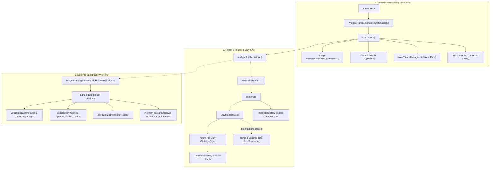
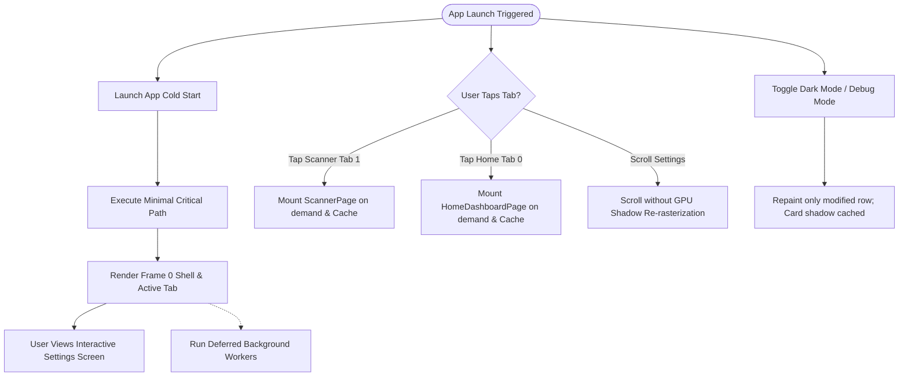
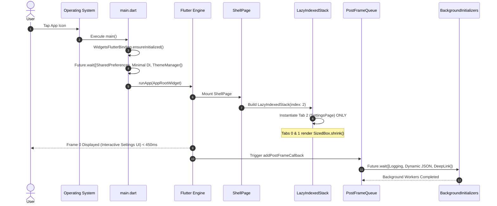

# Epic: Cold Start & Graphics Optimization (HLD)

## 1. Meta Data
- **Epic Name**: `cold_start_optimization`
- **Status**: Done
- **Target Release**: `v1.1.0`
- **Platform**: `Flutter` (Melos Monorepo)
- **Source Spec**: [2026-09-17-cold-start-optimization-design.md](2026-09-17-cold-start-optimization-design.md)

---

## 2. Background
In the Flutter Super-App (`d3_nexus_shield`), application launch (cold start) experiences perceptible delays before rendering interactive UI. Analysis reveals two root causes:
1. **Pre-`runApp` Serial I/O Bottlenecks**: `lib/main.dart` sequentially awaits multiple asynchronous services before invoking `runApp()`. This blocks the Flutter engine from displaying Frame 0 while disk I/O (`SharedPreferences`), JSON translation file parsing, and platform channel queries (`app_links`) execute serially.
2. **First-Frame GPU Convolution & Eager Mounting**:
   - `ShellPage` uses `IndexedStack`, which eagerly mounts the widget and BLoC trees of all 3 tabs (`HomeDashboardPage`, `ScannerPage`, `SettingsPage`) on Frame 0, despite default landing on tab 2 (`SettingsPage`).
   - The active `SettingsPage` and `CustomBottomNavBar` feature multiple soft `BoxShadow` definitions with heavy `blurRadius` (10–12px). Without `RepaintBoundary` isolation, Flutter's rendering engine (Impeller/Skia) creates multiple offscreen buffers and Gaussian convolution passes in Frame 0, and recalculates these convolutions during scrolling or toggle state changes.

---

## 3. Goals & Non-Goals

### 3.1. Goals
- **TTID (Time to Initial Display)**: Reduce cold start time from ~1,500ms to **< 450ms**.
- **First Frame GPU Raster Time**: Reduce first-frame raster duration from > 35ms to **< 12ms**.
- **Eager Widget Mount Reduction**: Lazily instantiate only the active tab in `ShellPage`, reducing initial shell element allocation by **~66%**.
- **GPU Raster Isolation**: Wrap `CustomBottomNavBar` and `SettingsSectionWidget` in `RepaintBoundary` to leverage GPU layer caching and eliminate jank during scrolling and toggle transitions.
- **Non-blocking Bootstrapping**: Parallelize critical startup path and defer non-critical initialization (`LoggingInitializer`, dynamic translation overrides, `DeepLinkCoordinator`) to run post-Frame 0 via `addPostFrameCallback`.
- **100% Visual Preservation**: Retain exact design aesthetics, soft shadows, rounded borders, and blue glow effects without visual degradation.

### 3.2. Non-Goals
- Modifying UI layouts, color palettes, or deleting shadows.
- Altering business logic in domain use cases or BLoC state schemas.
- Upgrading Flutter SDK version or modifying native engine embedding.

---

## 4. Architecture & Technical Design

### 4.1. High-Level Architecture

### 4.2. Use Cases Flowchart

### 4.3. Sequence Diagram (Cold Start Lifecycle)

### 4.4. Shift-Left Impact Analysis (Check 1)
- **Planned Target Files**:
  - `lib/main.dart`
  - `packages/ui_kit/lib/widgets/lazy_indexed_stack.dart` [NEW]
  - `lib/shell/shell_page.dart`
  - `lib/shell/widgets/custom_bottom_nav_bar.dart`
  - `features/settings/lib/presentation/settings/widgets/settings_section_widget.dart`
- **Blast Radius**: Isolated to startup orchestration, navigation shell container, and UI decoration layer. Zero breaking API changes to domain use cases or data repositories.
- **Cross-Platform Bridges**: Zero mutations to MethodChannel signatures.

---

## 5. Comprehensive BDD Test Scenarios

The complete 5-dimension BDD specification is maintained in [bdd_scenarios.md](bdd_scenarios.md).

Summary of Scenarios:
1. **Happy Paths**:
   - `Scenario: Cold start renders Frame 0 within 450ms with active tab only`
   - `Scenario: Switching tabs lazily mounts target tab and preserves state`
2. **Edge Cases & Boundaries**:
   - `Scenario: Initial index out of bounds clamped to valid tab range`
   - `Scenario: Rapid tab switching does not duplicate mounted widgets`
3. **State Transitions**:
   - `Scenario: Toggling dark mode re-renders isolated section without repainting other cards`
4. **Async & Race Conditions**:
   - `Scenario: Deep link arrives before background coordinator initialization finishes`
5. **Failures & Storage Resilience**:
   - `Scenario: Background dynamic translation JSON load fails gracefully to static Slang`

---

## 6. Rollout Strategy & Mitigation

- **Graceful Fallback**: If background dynamic translation fails, bundled static localizations keep the UI operational.
- **Buffering Inbound Deep Links**: Deep links arriving before `DeepLinkCoordinator` completes are queued in memory and dispatched when the router is marked ready.
- **Safety Rollback**: Because `LazyIndexedStack` conforms to `IndexedStack`'s signature, rolling back to eager mounting requires only a single widget name change if regressions occur.

---

## 7. Kanban Tasks Breakdown

The work is partitioned into 4 granular, test-driven tasks:
- **[Task 1: Lazy Navigation Shell (`LazyIndexedStack`)](task_01_lazy_indexed_stack_and_shell_navigation.md)**: Create `LazyIndexedStack` in `packages/ui_kit`, integrate into `ShellPage`, and verify lazy mount behavior.
- **[Task 2: GPU Layer & RepaintBoundary Optimization](task_02_repaint_boundary_and_gpu_shadow_caching.md)**: Add `RepaintBoundary` to `CustomBottomNavBar` and `SettingsSectionWidget`, and cache decoration objects.
- **[Task 3: Non-blocking Bootstrapping & Deferred I/O](task_03_non_blocking_bootstrapping_and_deferred_io.md)**: Parallelize `main.dart`, share single `SharedPreferences` instance, and defer dynamic localization and logging.
- **[Task 4: Host Acceptance Tests & Performance Benchmark](task_04_host_acceptance_tests_and_performance_benchmark.md)**: Profile cold start timeline, verify TTID < 450ms, and execute full `@quality_check` suite.
