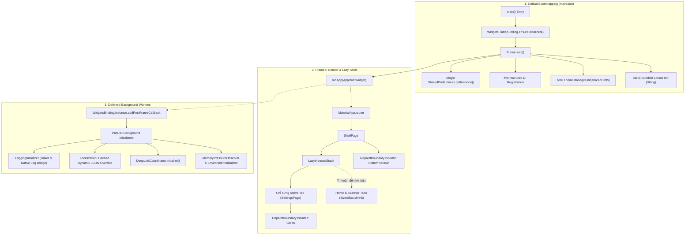
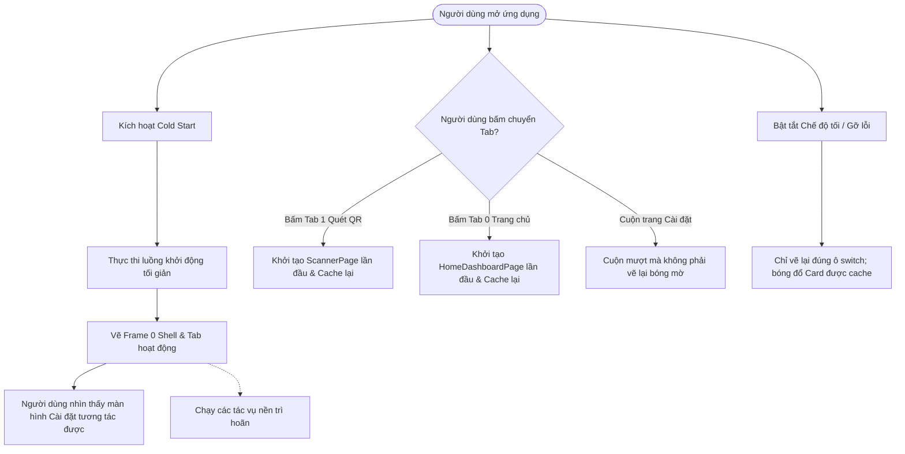
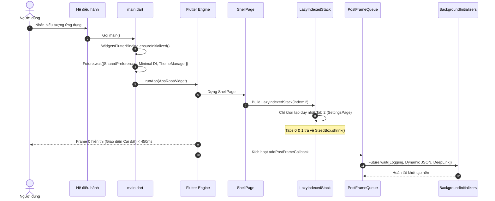

# Epic: Tối Ưu Hóa Cold Start & Hiệu Năng Đồ Họa (HLD)

## 1. Thông Tin Chung (Meta Data)
- **Tên Epic**: `cold_start_optimization`
- **Trạng thái**: Done
- **Phiên bản mục tiêu**: `v1.1.0`
- **Nền tảng**: `Flutter` (Melos Monorepo)
- **Tài liệu thiết kế gốc (Source Spec)**: [2026-09-17-cold-start-optimization-design.md](2026-09-17-cold-start-optimization-design.md)

---

## 2. Bối Cảnh (Background)
Trong dự án Flutter Super-App (`d3_nexus_shield`), quá trình khởi động ứng dụng (cold start) xuất hiện độ trễ đáng kể trước khi hiển thị giao diện tương tác. Phân tích mã nguồn chỉ ra 2 nguyên nhân cốt lõi:
1. **Nút thắt I/O tuần tự trước `runApp`**: Tệp `lib/main.dart` thực thi chuỗi `await` tuần tự nhiều dịch vụ trước khi gọi `runApp()`. Điều này khiến Flutter engine không thể vẽ Frame 0 trong lúc phải chờ các tác vụ đọc ghi đĩa (`SharedPreferences`), phân tích tệp JSON ngôn ngữ động, và truy vấn platform channel (`app_links`).
2. **Quá tải GPU Rasterization & Khởi tạo Eager Tabs**:
   - `ShellPage` sử dụng `IndexedStack`, vốn khởi tạo (mount) đồng thời toàn bộ widget tree và BLoC của cả 3 tabs (`HomeDashboardPage`, `ScannerPage`, `SettingsPage`) ngay ở Frame 0, dù app mở mặc định vào tab 2 (`SettingsPage`).
   - Màn hình `SettingsPage` và thanh điều hướng `CustomBottomNavBar` có nhiều `BoxShadow` với `blurRadius` lớn (10–12px). Khi thiếu vùng đệm cách ly `RepaintBoundary`, engine đồ họa của Flutter (Impeller/Skia) phải tạo nhiều offscreen render buffer và thực thi giải thuật Gaussian convolution đa tầng trong Frame 0, đồng thời phải tính toán lại bóng mờ liên tục khi cuộn trang hoặc đổi trạng thái toggle switch.

---

## 3. Mục Tiêu & Giới Hạn (Goals & Non-Goals)

### 3.1. Mục Tiêu (Goals)
- **TTID (Time to Initial Display / Thời gian khởi động)**: Giảm từ ~1,500ms xuống **< 450ms**.
- **GPU First Frame Raster Time**: Giảm thời gian vẽ frame đầu tiên trên GPU từ > 35ms xuống **< 12ms**.
- **Giảm số lượng widget khởi tạo ban đầu**: Chỉ nạp tab đang hoạt động trên `ShellPage`, giảm **~66%** số lượng phần tử dựng sẵn.
- **Cách ly vùng vẽ GPU (Repaint Isolation)**: Bọc `CustomBottomNavBar` và `SettingsSectionWidget` bằng `RepaintBoundary` để tái sử dụng GPU raster cache, triệt tiêu giật lag khi cuộn trang và đổi trạng thái.
- **Khởi động không chặn (Non-blocking Bootstrapping)**: Song song hóa các tác vụ bắt buộc và dời các tác vụ phụ (`LoggingInitializer`, nạp JSON ngôn ngữ động, `DeepLinkCoordinator`) sang chạy ngầm sau Frame 0 thông qua `addPostFrameCallback`.
- **Giữ nguyên 100% thẩm mỹ (Pixel-Perfect)**: Bảo toàn toàn bộ phong cách thiết kế glassmorphic, bóng đổ mềm mại và quầng sáng nút QR.

### 3.2. Ngoài Phạm Vi (Non-Goals)
- Thay đổi bố cục UI, đổi bảng màu hoặc loại bỏ bóng đổ.
- Thay đổi logic nghiệp vụ trong các use cases hoặc cấu trúc BLoC state.
- Nâng cấp phiên bản Flutter SDK hay can thiệp vào tầng embedding native.

---

## 4. Kiến Trúc & Thiết Kế Kỹ Thuật

### 4.1. Kiến Trúc Tổng Thể (High-Level Architecture)

### 4.2. Sơ Đồ Ca Sử Dụng (Use Cases Flowchart)

### 4.3. Sơ Đồ Trình Tự (Sequence Diagram)

### 4.4. Phân Tích Tác Động Shift-Left (Check 1)
- **Tệp tin mục tiêu**:
  - `lib/main.dart`
  - `packages/ui_kit/lib/widgets/lazy_indexed_stack.dart` [TẠO MỚI]
  - `lib/shell/shell_page.dart`
  - `lib/shell/widgets/custom_bottom_nav_bar.dart`
  - `features/settings/lib/presentation/settings/widgets/settings_section_widget.dart`
- **Phạm vi tác động (Blast Radius)**: Giới hạn trong luồng khởi động app, bộ khung điều hướng shell và tầng giao diện hiển thị. Hoàn toàn không phá vỡ hợp đồng dữ liệu với các use cases hoặc repositories.
- **Cầu nối Native (Cross-Platform Bridges)**: Không làm thay đổi interface MethodChannel.

---

## 5. Kịch Bản Kiểm Thử BDD (Comprehensive BDD Scenarios)

Toàn bộ đặc tả 5 chiều BDD được lưu trữ tại [bdd_scenarios.md](bdd_scenarios.md).

Tóm tắt các nhóm kịch bản:
1. **Happy Paths (Luồng chuẩn)**:
   - Khởi động lạnh hiển thị Frame 0 trong vòng 450ms chỉ với tab active.
   - Chuyển tab khởi tạo lười (lazy mount) và giữ nguyên trạng thái khi chuyển qua lại.
2. **Edge Cases & Boundaries (Biên & Ngoại lệ)**:
   - Chỉ mục tab vượt ngoài phạm vi được clamp về chỉ mục hợp lệ.
   - Chuyển tab liên tục với tốc độ cao không gây nhân bản widget.
3. **State Transitions (Chuyển trạng thái MVI)**:
   - Bật tắt chế độ tối chỉ repaint vùng switch mà không vẽ lại bóng mờ của toàn bộ card.
4. **Async & Race Conditions (Bất đồng bộ & Tranh chấp)**:
   - Deep link đến sớm trước khi coordinator hoàn tất nạp ngầm được xếp hàng đợi và điều hướng an toàn.
5. **Failures & Storage Resilience (Khả năng phục hồi)**:
   - Nạp tệp JSON ngôn ngữ động thất bại vẫn fallback an toàn về từ điển tĩnh Slang có sẵn.

---

## 6. Chiến Lược Triển Khai & Giảm Thiểu Rủi Ro

- **Fallback an toàn**: Nếu nạp ngôn ngữ động thất bại, từ điển tĩnh Slang tích hợp sẵn bảo đảm UI luôn hoạt động trơn tru.
- **Đệm DeepLink**: Link mở app được lưu tạm trong bộ nhớ đệm và chỉ điều hướng khi router sẵn sàng.
- **Khả năng rollback**: `LazyIndexedStack` có giao diện tương thích 100% với `IndexedStack`, cho phép rollback nhanh chóng chỉ bằng cách đổi tên widget nếu phát sinh sự cố.

---

## 7. Phân Bổ Công Việc Kanban (Kanban Tasks Breakdown)

Công việc được chia thành 4 task rõ ràng theo chuẩn TDD & BDD:
- **[Task 1: Khung điều hướng Shell lười (`LazyIndexedStack`)](task_01_lazy_indexed_stack_and_shell_navigation.md)**: Xây dựng `LazyIndexedStack` trong `packages/ui_kit`, tích hợp vào `ShellPage` và viết unit/widget tests.
- **[Task 2: Tối ưu lớp vẽ GPU & RepaintBoundary](task_02_repaint_boundary_and_gpu_shadow_caching.md)**: Thêm `RepaintBoundary` vào `CustomBottomNavBar`, `SettingsSectionWidget` và cache các đối tượng decoration.
- **[Task 3: Khởi động không chặn & Trì hoãn I/O](task_03_non_blocking_bootstrapping_and_deferred_io.md)**: Song song hóa `main.dart`, chia sẻ instance `SharedPreferences` và dời nạp JSON động, logging sang background.
- **[Task 4: Kiểm thử tích hợp Host & Đo lường hiệu năng](task_04_host_acceptance_tests_and_performance_benchmark.md)**: Chạy profile timeline, xác thực chỉ số TTID < 450ms và chạy toàn bộ bộ kiểm thử chất lượng `@quality_check`.
