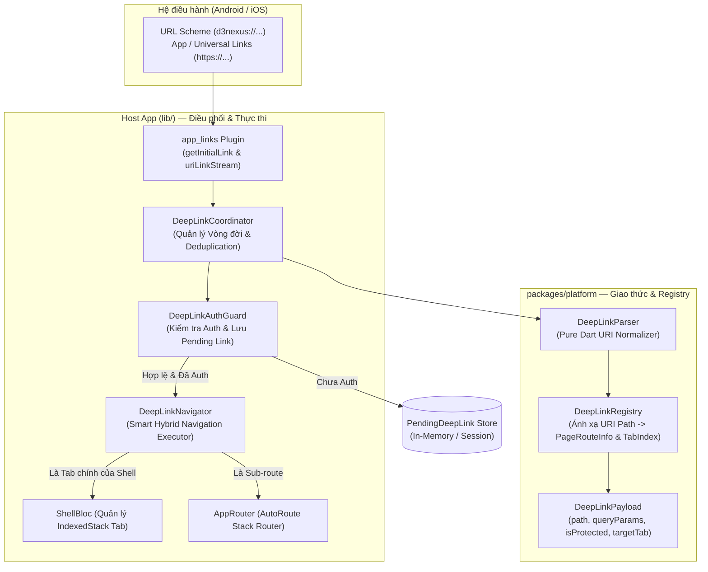

# Design Spec: External DeepLink & Central Routing Engine for Flutter Super App Template

- **Date:** 2026-09-11
- **Status:** Approved (Ready for Epic Breakdown)
- **Author:** Antigravity Pair Programming
- **Topic:** External DeepLink & Central Routing Engine (Trụ cột 2: Cơ chế Giao tiếp & Định tuyến tập trung)
- **Target Release:** Flutter Super App Template v1.1

---

## 1. Bối cảnh & Động lực (Context & Motivation)

Trong hệ sinh thái **Super App**, một trong những nguyên tắc kiến trúc tối thượng là: **Các Mini App (module ruột) phải "mù" hoàn toàn về nhau**. Chúng không được phép import trực tiếp lẫn nhau; mọi thao tác điều hướng xuyên module phải đi qua một **Central Router**.

Hiện tại trong `bloc_digital_wallet`:
1. `packages/platform` đã có `DeepLinkRoutes` chứa hằng số route nội bộ (`/settings`, `/scanner`, `/home`), và CI gate (`scripts/check_module_boundaries.sh`) đã chặn 100% việc import chéo giữa các `features/*`.
2. **Khoảng trống kiến trúc (Gap):** Hệ thống chỉ mới dừng lại ở in-app navigation. Hoàn toàn chưa có cơ chế đón nhận **Deep Link từ hệ điều hành** (Custom URL Scheme `d3nexus://...`, Android App Links, iOS Universal Links `https://app.d3nexus.com/...`). App hiện không thể mở thẳng vào một tính năng/màn hình con từ Web, Email, QR Code Scanner, hoặc Push Notification.
3. **Mục tiêu của Epic này:** Hoàn thiện 100% Trụ cột 2 cho template bằng cách xây dựng **External DeepLink & Central Routing Engine** chuẩn mực, hỗ trợ xử lý Cold/Warm start, Auth Guard với Pending DeepLink, và Smart Hybrid Navigation.

---

## 2. Mục tiêu & Ngoài phạm vi (Goals & Non-Goals)

### Mục tiêu (Goals)
- **Chuẩn hóa Giao thức Deep Link:** Cung cấp `DeepLinkPayload`, `DeepLinkParser`, và `DeepLinkRegistry` trong `packages/platform` (Pure Dart, 100% Unit-testable).
- **Hỗ trợ đa giao thức OS:** Nhận cả Custom URL Scheme (`d3nexus://...`) và Universal/App Links (`https://app.d3nexus.com/...`).
- **Giải quyết triệt để Timing Cold Start & Warm Start:**
  - Hoãn điều hướng lúc Cold Start cho tới khi `ShellPage` và `AppRouter` render xong Frame đầu tiên (`_isRouterReady`).
  - Lắng nghe `uriLinkStream` lúc Warm Start với cơ chế chống trùng lặp (Deduplication < 1s).
- **Centralized Auth Guard & Pending DeepLink:** Nếu route yêu cầu đăng nhập mà user chưa authenticate -> lưu `PendingDeepLink`, điều hướng về `/login` -> sau khi login thành công, tự động khôi phục và tiếp tục hành trình điều hướng.
- **Smart Hybrid Navigation:**
  - Nếu path trùng với Root Tab (Home: 0, Scanner: 1, Settings: 2) -> gửi `ShellAction.tabChanged(index)`.
  - Nếu là màn hình con/sub-route -> gọi `appRouter.push(pageRouteInfo)`.
- **Tự động hóa với Mason Bricks:** Cập nhật hook của `pac_mvi_feature` để khi sinh feature mới, route hằng số và registry tự động được cập nhật.

### Ngoài phạm vi (Non-Goals)
- Thay thế thư viện `auto_route` nội bộ bằng Navigator 2.0 viết tay.
- Triển khai cơ chế tải mã động runtime (Dynamic Feature Module) — Flutter biên dịch tĩnh vào 1 binary duy nhất.
- Quản lý Web Browser Routing phức tạp (URL bar sync trên Flutter Web) — trọng tâm là Mobile iOS & Android.

---

## 3. Kiến trúc Tổng thể (System Architecture)



---

## 4. Chi tiết Thiết kế Kỹ thuật (Technical Design)

### 4.1. Tầng Giao thức (`packages/platform`)

#### Data Contract: `DeepLinkPayload`
```dart
class DeepLinkPayload {
  final String path;
  final Map<String, String> queryParams;
  final int? targetTab;
  final bool isProtected;

  const DeepLinkPayload({
    required this.path,
    this.queryParams = const {},
    this.targetTab,
    this.isProtected = false,
  });
}
```

#### `DeepLinkParser`
Pure Dart class chịu trách nhiệm chuẩn hóa mọi dạng URI về format thống nhất:
* `d3nexus://scanner?auto_scan=true` -> path: `/scanner`, query: `{"auto_scan": "true"}`
* `https://app.d3nexus.com/settings/languages` -> path: `/settings/languages`
* Bỏ qua case-sensitivity, chuẩn hóa trailing slashes (`/scanner/` -> `/scanner`).

#### `DeepLinkRegistry`
Quản lý danh bạ ánh xạ giữa `path` và `PageRouteInfo` cùng `tabIndex`:
```dart
abstract class DeepLinkRegistry {
  static const Map<String, int> tabIndices = {
    DeepLinkRoutes.home: 0,
    DeepLinkRoutes.scanner: 1,
    DeepLinkRoutes.settings: 2,
  };

  static DeepLinkPayload? resolve(Uri uri);
}
```

---

### 4.2. Tầng Điều phối tại Host (`lib/`)

#### 1. `DeepLinkCoordinator`
Singleton được inject qua `GetIt`, làm việc với plugin `app_links`:
* Quản lý trạng thái `_isRouterReady: bool`.
* **Cold Start Staging:** Khi app mở từ trạng thái bị kill:
  ```dart
  final initialUri = await _appLinks.getInitialLink();
  if (initialUri != null) {
    if (!_isRouterReady) {
      _stagedInitialLink = initialUri;
    } else {
      _processUri(initialUri);
    }
  }
  ```
* **Warm Start Stream:** Lắng nghe liên tục:
  ```dart
  _linkSubscription = _appLinks.uriLinkStream.listen((uri) {
    _processUriWithDeduplication(uri);
  });
  ```
* **Deduplication:** Lưu `_lastProcessedUri` và timestamp (threshold: 1000ms) để loại bỏ sự kiện duplicate từ OS.

#### 2. `DeepLinkAuthGuard` & Pending DeepLink Flow
* Kiểm tra `payload.isProtected`:
  * Nếu `true` và `authRepository.isAuthenticated == false`:
    1. Gán `_pendingPayload = payload`.
    2. Gọi `router.push(LoginRoute())`.
    3. Lắng nghe `AppEventBus.on<LoginSuccessEvent>()`: Khôi phục `_pendingPayload`, đẩy sang Navigator và set `_pendingPayload = null`.
  * Nếu `false` hoặc đã authenticated -> đẩy thẳng sang Navigator.

#### 3. `DeepLinkNavigator` (Smart Hybrid Navigation)
```dart
void navigate(DeepLinkPayload payload) {
  if (payload.targetTab != null) {
    // 1. Chuyển tab trên Shell
    shellBloc.onAction(ShellAction.tabChanged(payload.targetTab!));
  }
  
  // 2. Nếu là màn hình con (không phải root tab), push lên AutoRoute
  if (!isRootTab(payload.path)) {
    final route = DeepLinkRegistry.getRouteInfo(payload.path, payload.queryParams);
    if (route != null) {
      appRouter.push(route);
    }
  }
}
```

---

### 4.3. Cấu hình Native OS

#### Android (`android/app/src/main/AndroidManifest.xml`)
* Thiết lập `android:launchMode="singleTask"` cho `MainActivity`.
* Đăng ký Intent Filters:
```xml
<!-- Custom Scheme -->
<intent-filter>
    <action android:name="android.intent.action.VIEW" />
    <category android:name="android.intent.category.DEFAULT" />
    <category android:name="android.intent.category.BROWSABLE" />
    <data android:scheme="d3nexus" />
</intent-filter>

<!-- App Links -->
<intent-filter android:autoVerify="true">
    <action android:name="android.intent.action.VIEW" />
    <category android:name="android.intent.category.DEFAULT" />
    <category android:name="android.intent.category.BROWSABLE" />
    <data android:scheme="https" android:host="app.d3nexus.com" />
</intent-filter>
```

#### iOS (`ios/Runner/Info.plist` & Entitlements)
* `Info.plist`:
```xml
<key>CFBundleURLTypes</key>
<array>
    <dict>
        <key>CFBundleTypeRole</key>
        <string>Editor</string>
        <key>CFBundleURLName</key>
        <string>com.danhdue.d3nexusshield</string>
        <key>CFBundleURLSchemes</key>
        <array>
            <string>d3nexus</string>
        </array>
    </dict>
</array>
```
* `Runner.entitlements`: Khai báo Universal Links domain:
```xml
<key>com.apple.developer.associated-domains</key>
<array>
    <string>applinks:app.d3nexus.com</string>
</array>
```

---

### 4.4. Cơ chế Phòng vệ & Fallback
* Nếu URI không parse được hoặc route không tồn tại trong `DeepLinkRegistry`:
  1. Ghi log cảnh báo qua `logger` (`D3NexusLogger.warning(...)`).
  2. Không để app crash; điều hướng fallback về `DeepLinkRoutes.home` (Tab 0).
  3. Bắn event hoặc Toast: *"Liên kết không hợp lệ hoặc tính năng chưa khả dụng"*.

---

## 5. Tự động hóa với Mason Brick (`pac_mvi_feature`)

Cập nhật `post_gen.dart` hook của `pac_mvi_feature`:
Khi tạo feature mới (vd: `payment`):
1. Thêm constant vào `packages/platform/lib/deep_link_routes.dart`:
   ```dart
   static const String payment = '/payment';
   ```
2. Đăng ký tự động vào `DeepLinkRegistry.register(...)`.

---

## 6. Chiến lược Kiểm thử (Testing Strategy)

| Tầng | Phạm vi kiểm thử | Công cụ / Kỹ thuật | Tiêu chí nghiệm thu |
| :--- | :--- | :--- | :--- |
| **Unit Test** | `packages/platform`: `DeepLinkParser` & `DeepLinkRegistry` | `flutter test` (Pure Dart) | 100% Branch Coverage, kiểm thử toàn bộ scheme, host, query params, case, trailing slash, invalid URIs. |
| **Unit Test** | Host App: `DeepLinkCoordinator` & `DeepLinkAuthGuard` | `flutter test` + Mockito / Fake `AppLinks` | Verify Cold Start staging, Warm Start stream, Deduplication < 1s, Pending DeepLink resume sau login. |
| **Widget / UI** | Host App: `DeepLinkNavigator` + `ShellBloc` | Widget Test | Verify chuyển đúng `currentTabIndex` của `ShellBloc` khi nhận tab route. |
| **Integration** | End-to-End Deep Link Flow | `integration_test` | Giả lập dispatch URI -> Kiểm tra màn hình đích hiển thị thành công. |

---

## 7. Phân rã Kanban Tasks (Kanban Breakdown)

- [ ] **Task 1:** `[PLATFORM]` Xây dựng `DeepLinkPayload`, `DeepLinkParser`, `DeepLinkRegistry` & Unit Tests (100% coverage).
- [ ] **Task 2:** `[HOST_OS]` Tích hợp `app_links`, cấu hình Android Manifest (Intent Filters) & iOS Info.plist / Entitlements.
- [ ] **Task 3:** `[HOST_CORE]` Triển khai `DeepLinkCoordinator`, `DeepLinkAuthGuard` (Pending Link Cache) & Unit Tests.
- [ ] **Task 4:** `[HOST_NAV]` Kết nối vòng đời `ShellPage` (Router Ready trigger) & Hoàn thiện `DeepLinkNavigator` (Smart Hybrid Navigation).
- [ ] **Task 5:** `[MASON_BRICK & E2E]` Cập nhật Mason Brick `pac_mvi_feature` tự động wire DeepLink & Viết kịch bản Integration Test.
