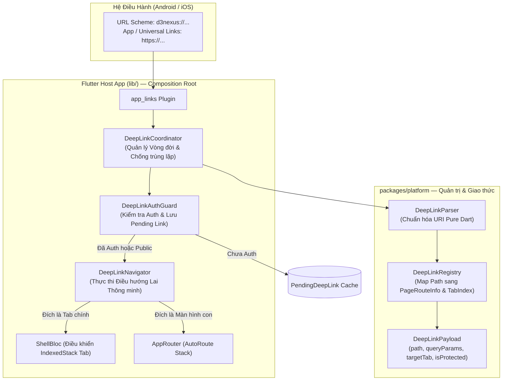
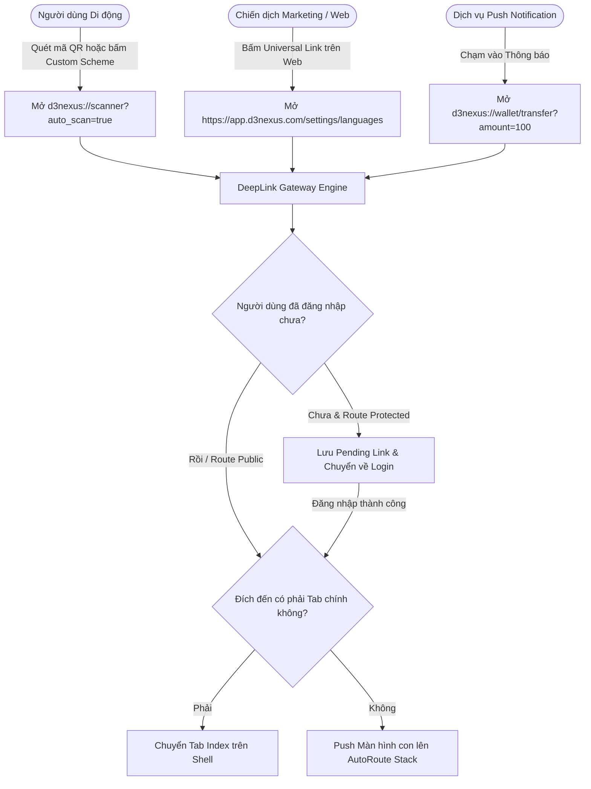
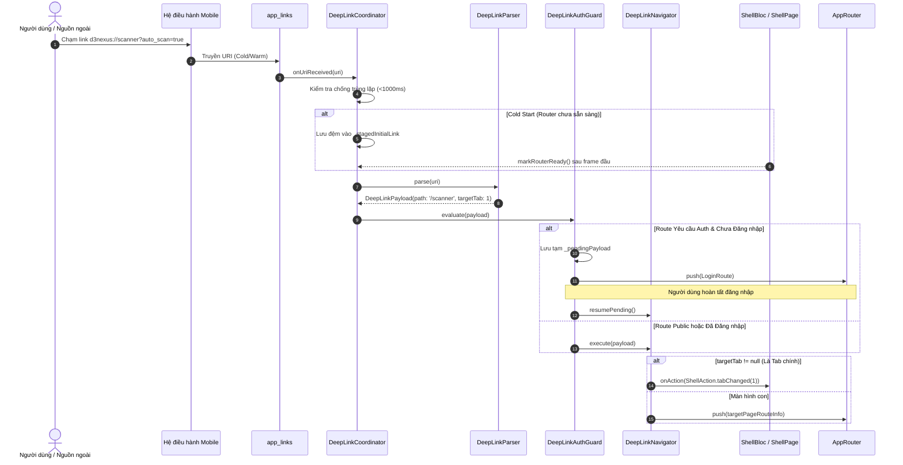

# Epic: DeepLink Router Engine (Bộ Định Tuyến DeepLink Tập Trung)

## Mục lục
1. [Meta Data](#meta-data)
2. [Bối cảnh](#bối-cảnh)
3. [Mục tiêu & Ngoài phạm vi](#mục-tiêu--ngoài-phạm-vi)
4. [Kiến trúc & Thiết kế kỹ thuật](#kiến-trúc--thiết-kế-kỹ-thuật)
   - [Kiến trúc tổng thể](#kiến-trúc-tổng-thể)
   - [Use Cases](#use-cases)
   - [Sequence Diagram](#sequence-diagram)
5. [Chiến lược Rollout & Giảm thiểu rủi ro](#chiến-lược-rollout--giảm-thiểu-rủi-ro)
6. [Phân rã Kanban Tasks](#phân-rã-kanban-tasks)

---

## Meta Data
- **Tên Epic:** `deeplink_router_engine`
- **Trạng thái:** `todo`
- **Target Release:** Flutter Super App Template v1.1
- **Source Spec:** [2026-09-11-external-deeplink-engine-design.md](2026-09-11-external-deeplink-engine-design.md)
- **Tham chiếu Đa Nền Tảng:**
  - Android: `android_digital_wallet/.devtool/epic/deeplink_router_engine/`
  - iOS: `iOSDigitalWallet/.devtool/epic/deeplink_router_engine/`

---

## Bối cảnh
Trong kiến trúc **Super App**, các Mini App (module tính năng) phải độc lập và "mù" hoàn toàn về nhau. Mặc dù điều hướng nội bộ giữa các package trước đây đã được thiết lập thông qua hằng số route chuỗi (`DeepLinkRoutes` trong `packages/platform`), ứng dụng vẫn chưa có một **Bộ Định Tuyến DeepLink Cấp Hệ Điều Hành (External DeepLink Router Engine)**.

Hậu quả:
1. Ứng dụng không thể đón nhận các liên kết ngoài từ OS như Custom URL Scheme (`d3nexus://...`), Android App Links, hoặc iOS Universal Links (`https://app.d3nexus.com/...`).
2. Chưa có cơ chế xử lý an toàn vòng đời lúc Cold Start (tránh mất sự kiện link khi Flutter Engine và Router chưa khởi tạo xong).
3. Chưa có Auth Guard tập trung kèm cơ chế lưu giữ liên kết chờ (Pending Deep Link) để tự động điều hướng tiếp sau khi người dùng đăng nhập.
4. Chưa có cơ chế Điều hướng Lai Thông minh (Smart Hybrid Navigation) để đồng bộ giữa việc đổi tab trên `ShellPage` và push màn hình con lên `AutoRoute`.

Epic này thiết lập một Gateway DeepLink tập trung đạt chuẩn nền tảng, hoàn thiện Trụ cột 2 ("Cơ chế Giao tiếp & Định tuyến tập trung") của Khung Quản trị Super App.

---

## Mục tiêu & Ngoài phạm vi

### Mục tiêu
- **Phân tách Giao thức & Bộ phân giải:** Xây dựng `DeepLinkPayload`, `DeepLinkParser`, và `DeepLinkRegistry` trong `packages/platform` (Pure Dart, 100% testable mà không phụ thuộc UI).
- **Hỗ trợ Đa Giao thức:** Đón nhận cả Custom Scheme (`d3nexus://...`) và HTTPS Universal/App Links (`https://app.d3nexus.com/...`).
- **Quản lý Vòng đời & Thời điểm khởi động (Timing):**
  - Cold Start: Lưu đệm link khởi tạo trong `_stagedInitialLink` cho đến khi `ShellPage` phát tín hiệu `markRouterReady()`.
  - Warm Start: Lắng nghe luồng link với cơ chế chống trùng lặp (ngưỡng < 1000ms).
- **Auth Guard Tập trung:** Chặn các route yêu cầu xác thực khi chưa đăng nhập, lưu tạm `PendingDeepLink`, chuyển hướng về Login, và tự động khôi phục khi nhận `LoginSuccessEvent`.
- **Điều hướng Lai Thông minh (Smart Hybrid Navigation):** Tự động đổi tab `ShellPage` nếu đích đến là Tab gốc (Home, Scanner, Settings); push lên stack `AutoRoute` nếu là màn hình con.
- **Tự động hóa với Mason Brick:** Cập nhật hook post-gen của `pac_mvi_feature` để tự động đăng ký các feature mới vào `DeepLinkRegistry`.

### Ngoài phạm vi
- Thay thế `auto_route` bằng Navigator 2.0 tự viết tay.
- Tải mã động runtime (Flutter biên dịch tĩnh toàn bộ vào 1 binary duy nhất lúc build).
- Đồng bộ URL thanh địa chỉ trình duyệt trên Flutter Web.

---

## Kiến trúc & Thiết kế Kỹ thuật

### Kiến trúc Tổng thể

### Use Cases

### Sequence Diagram

---

## Chiến lược Rollout & Giảm thiểu rủi ro

### Các Giai đoạn Triển khai
1. **Phase 1: Nền tảng (Giao thức & Phân tích)**: Xây dựng bộ parser và registry pure Dart trong `packages/platform`. Không rủi ro runtime đối với host app.
2. **Phase 2: Cấu hình Native & Tích hợp AppLinks**: Tích hợp `app_links` vào host app với intent filters cơ bản.
3. **Phase 3: Bộ Điều phối & Thực thi Điều hướng**: Tích hợp `DeepLinkCoordinator` và `DeepLinkNavigator` với `ShellBloc`.
4. **Phase 4: Tự động hóa Công cụ**: Cập nhật Mason brick `pac_mvi_feature` để tự động hóa đăng ký route.

### Giảm thiểu Rủi ro & Fallback
- **Route Không Xác định:** Nếu nhận phải URI sai cú pháp hoặc chưa đăng ký, `DeepLinkParser` tự động fallback an toàn về `DeepLinkRoutes.home` (Tab 0) và ghi log warning qua `D3NexusLogger`.
- **Hoãn Link An toàn (Safe Staging):** Link lúc Cold Start chỉ được kích hoạt sau khi Router báo sẵn sàng, ngăn chặn triệt để lỗi mất kết nối `NavigatorState`.

---

## Phân rã Kanban Tasks
- [Task 1: Platform DeepLink Protocol, Parser & Registry](../../features/task_1_deeplink_protocol_and_parser.md)
- [Task 2: Native OS Configuration & AppLinks Integration](../../features/task_2_native_os_and_app_links.md)
- [Task 3: DeepLink Coordinator, Auth Guard & Deduplication](../../features/task_3_deeplink_coordinator_and_auth_guard.md)
- [Task 4: Shell Lifecycle Integration & Smart Hybrid Navigation](../../features/task_4_shell_lifecycle_and_hybrid_navigation.md)
- [Task 5: Mason Brick Automation & E2E Integration Tests](../../features/task_5_mason_brick_and_integration_tests.md)
