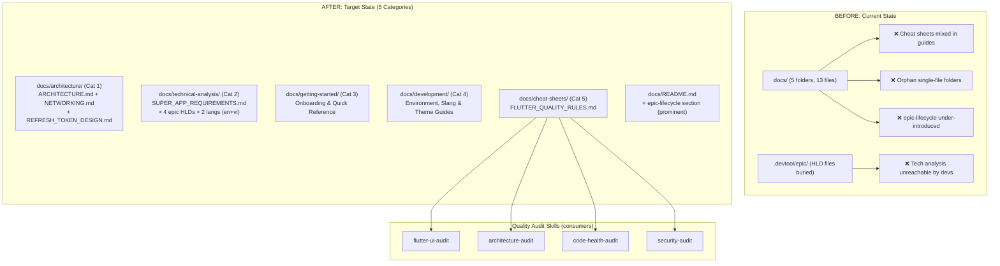
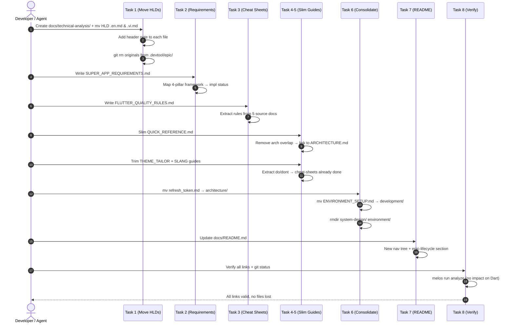

# Epic: Documentation Restructure — Flutter Super App Template

## Table of Contents
1. [Meta Data](#meta-data)
2. [Background](#background)
3. [Goals & Non-Goals](#goals--non-goals)
4. [Architecture & Technical Design](#architecture--technical-design)
   - [High-Level Architecture](#high-level-architecture)
   - [Use Cases](#use-cases)
   - [Sequence Diagram](#sequence-diagram)
   - [BDD Scenarios](#bdd-scenarios)
5. [Rollout Strategy & Mitigation](#rollout-strategy--mitigation)
6. [Kanban Tasks Breakdown](#kanban-tasks-breakdown)

---

## Meta Data
- **Epic Name:** `docs_restructure`
- **Status:** Done
- **Target Release:** Flutter Super App Template v2.1 (docs release)
- **Platform:** Flutter (monorepo — `bloc_digital_wallet`)
- **Source Spec:** [2026-09-16-docs-restructure-design.md](2026-09-16-docs-restructure-design.md)

---

## Background

The `docs/` directory contains 13 files across 5 folders, accumulated over multiple epics. After auditing all docs and 8 epics in `.devtool/epic/`, four structural problems were identified:

1. **Cheat Sheet rules are scattered** — `QUICK_REFERENCE`, `THEME_TAILOR_GUIDE`, `SLANG_GUIDE` all mix how-to guides with do/don't rules. Quality audit skills (`flutter-ui-audit`, `architecture-audit`, `code-health-audit`) have no consolidated source to reference.
2. **Rich technical analysis locked in `.devtool/epic/`** — 5 epics (logging, governance, deeplink, resilience, OTA localization) contain deep architectural decisions that developers cannot easily discover. Only AI agents navigate `.devtool/` naturally.
3. **Orphan folders** — `system-design/` and `environment/` each contain exactly 1 file, creating unnecessary navigation friction.
4. **`/epic-lifecycle` is under-introduced** — mentioned in only 4 lines at the bottom of README, despite being the backbone of the entire AI-driven development workflow for Flutter, Android, and iOS.
5. **No Super App Requirements document** — no consolidated map from governance pillars to implemented features exists for developer onboarding.

---

## Goals & Non-Goals

### Goals
- Restructure `docs/` into 5 clear, purpose-driven categories: Architecture, Technical Analysis, Getting Started, Development, Cheat Sheets
- Move epic HLDs (`.en.md` + `.vi.md`) from `.devtool/epic/` into `docs/technical-analysis/` — making architectural decisions discoverable for all developers
- Create `docs/technical-analysis/SUPER_APP_REQUIREMENTS.md` mapping all Super App governance pillars to implementation status
- Create `docs/cheat-sheets/FLUTTER_QUALITY_RULES.md` from 5 sources as the consolidated input for quality audit skills
- Give `/epic-lifecycle` a prominent section in `docs/README.md` with tri-platform table (Flutter + Android + iOS)
- Slim `QUICK_REFERENCE.md` — remove architecture overlap, keep as commands + Mason bricks reference
- Trim `THEME_TAILOR_GUIDE.md` and `SLANG_LOCALIZATION_GUIDE.md` — extract do/don't rules to cheat-sheets, keep how-to content
- Consolidate orphan folders: move `system-design/refresh_token.md` → `architecture/`, move `environment/ENVIRONMENT_SETUP.md` → `development/`
- No content loss: every concept finds a clear, discoverable home

### Non-Goals
- Changing technical content of ARCHITECTURE.md or NETWORKING.md
- Translating existing English-only documents into Vietnamese
- Creating new technical documentation beyond SUPER_APP_REQUIREMENTS.md
- Moving design spec files (`YYYY-MM-DD-*.md`) or BDD files from `.devtool/epic/`
- Updating quality audit skill SKILL.md files (only adding a reference note, no rewrite)

---

## Architecture & Technical Design

### High-Level Architecture

### Use Cases

```mermaid
flowchart TD
    Dev(["Developer"])
    Agent(["AI Agent"])

    subgraph UC1["UC-1: Discover Technical Analysis"]
        UC1A["Open docs/technical-analysis/"]
        UC1B["Read LOGGING_SYSTEM / GOVERNANCE / DEEPLINK / RESILIENCE"]
        UC1A --> UC1B
    end

    subgraph UC2["UC-2: Understand Super App Requirements"]
        UC2A["Open SUPER_APP_REQUIREMENTS.md"]
        UC2B["See 4-pillar map + implementation status per requirement"]
        UC2A --> UC2B
    end

    subgraph UC3["UC-3: Run Quality Audit"]
        UC3A["Agent invokes flutter-ui-audit"]
        UC3B["Skill reads FLUTTER_QUALITY_RULES.md"]
        UC3C["Applies consolidated do/dont rules"]
        UC3A --> UC3B --> UC3C
    end

    subgraph UC4["UC-4: Quick Commands Reference"]
        UC4A["Open QUICK_REFERENCE.md"]
        UC4B["Find Mason commands + Melos scripts"]
        UC4A --> UC4B
    end

    subgraph UC5["UC-5: Onboard with epic-lifecycle"]
        UC5A["Open docs/README.md"]
        UC5B["Read epic-lifecycle section"]
        UC5C["Understand 4-stage workflow for Flutter/Android/iOS"]
        UC5A --> UC5B --> UC5C
    end

    Dev --> UC1
    Dev --> UC2
    Dev --> UC4
    Dev --> UC5
    Agent --> UC3
```

### Sequence Diagram (Primary Flow: Task Execution)

### BDD Scenarios

See dedicated file: [bdd_scenarios.md](bdd_scenarios.md)

---

## Rollout Strategy & Mitigation

### Phased Approach
1. **Phase 1 — Foundation** (Tasks 1–3): Create new folders and new files first, before modifying or deleting anything. Zero risk of content loss.
2. **Phase 2 — Slim & Trim** (Tasks 4–6): Reduce existing docs, consolidate folders. Each file is committed individually so rollback is per-file.
3. **Phase 3 — Navigation** (Tasks 7–8): Update README and verify. Final commit only after link verification passes.

### Risks & Mitigations
- **Broken internal links** — After each move, `grep -r` for old paths and update them. Verify with `find docs/ -name "*.md"` cross-reference check.
- **Content loss** — Git tracks all moves. Every `git mv` preserves history. Verify with `git status --short docs/` after each task.
- **Epic HLD files deleted prematurely** — Move first, verify destination exists, then delete originals.

---

## Kanban Tasks Breakdown

| Task | Title | Status |
|------|-------|--------|
| [Task 1](task_1_create_technical_analysis.md) | Create `technical-analysis/` + Move 4 Epic HLDs (en+vi) | Done |
| [Task 2](task_2_super_app_requirements.md) | Create `SUPER_APP_REQUIREMENTS.md` | Done |
| [Task 3](task_3_flutter_quality_rules.md) | Create `cheat-sheets/FLUTTER_QUALITY_RULES.md` | Done |
| [Task 4](task_4_slim_quick_reference.md) | Slim `QUICK_REFERENCE.md` | Done |
| [Task 5](task_5_trim_guides.md) | Trim `THEME_TAILOR_GUIDE.md` + `SLANG_LOCALIZATION_GUIDE.md` | Done |
| [Task 6](task_6_consolidate_folders.md) | Consolidate `system-design/` and `environment/` folders | Done |
| [Task 7](task_7_update_readme.md) | Update `docs/README.md` (epic-lifecycle section + new nav) | Done |
| [Task 8](task_8_verify_and_commit.md) | Verify all links + Final commit | Done |
