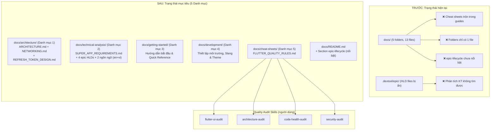

# Epic: Tái Cấu Trúc Tài Liệu — Flutter Super App Template

## Mục Lục
1. [Meta Data](#meta-data)
2. [Bối Cảnh](#bối-cảnh)
3. [Mục Tiêu & Ngoài Phạm Vi](#mục-tiêu--ngoài-phạm-vi)
4. [Kiến Trúc & Thiết Kế Kỹ Thuật](#kiến-trúc--thiết-kế-kỹ-thuật)
5. [Chiến Lược Triển Khai & Giảm Thiểu Rủi Ro](#chiến-lược-triển-khai--giảm-thiểu-rủi-ro)
6. [Bảng Kanban Tasks](#bảng-kanban-tasks)

---

## Meta Data
- **Tên Epic:** `docs_restructure`
- **Trạng thái:** Done
- **Target Release:** Flutter Super App Template v2.1 (docs release)
- **Platform:** Flutter (monorepo — `bloc_digital_wallet`)
- **Source Spec:** [2026-09-16-docs-restructure-design.md](2026-09-16-docs-restructure-design.md)

---

## Bối Cảnh

Thư mục `docs/` hiện có 13 files trong 5 folders, tích lũy qua nhiều epics. Sau khi audit toàn bộ docs và 8 epics trong `.devtool/epic/`, 5 vấn đề cấu trúc được xác định:

1. **Cheat Sheet rules bị phân tán** — `QUICK_REFERENCE`, `THEME_TAILOR_GUIDE`, `SLANG_GUIDE` đều trộn lẫn hướng dẫn how-to với quy tắc do/don't. Các quality audit skills không có nguồn tổng hợp chính thức.
2. **Phân tích kỹ thuật bị khóa trong `.devtool/epic/`** — 5 epics (logging, governance, deeplink, resilience, OTA) chứa quyết định kiến trúc sâu sắc mà developer không thể dễ dàng tìm thấy.
3. **Folders cô đơn** — `system-design/` và `environment/` mỗi folder chỉ có 1 file, gây friction khi điều hướng.
4. **`/epic-lifecycle` chưa được giới thiệu đủ nổi bật** — chỉ được đề cập 4 dòng cuối README, dù là backbone của toàn bộ quy trình phát triển AI-driven cho Flutter, Android và iOS.
5. **Không có tài liệu Super App Requirements** — không có bản đồ từ các governance pillars sang các tính năng đã triển khai.

---

## Mục Tiêu & Ngoài Phạm Vi

### Mục Tiêu
- Tái cấu trúc `docs/` thành 5 categories rõ ràng: Architecture, Technical Analysis, Getting Started, Development, Cheat Sheets
- Move epic HLDs (`.en.md` + `.vi.md`) từ `.devtool/epic/` vào `docs/technical-analysis/` — giúp developer dễ tìm
- Tạo `docs/technical-analysis/SUPER_APP_REQUIREMENTS.md` — bản đồ governance pillars → implementation status
- Tạo `docs/cheat-sheets/FLUTTER_QUALITY_RULES.md` từ 5 nguồn — input tổng hợp cho quality audit skills
- Dành section nổi bật cho `/epic-lifecycle` trong `docs/README.md` với bảng tri-platform (Flutter + Android + iOS)
- Slim `QUICK_REFERENCE.md` — loại bỏ overlap với ARCHITECTURE.md, giữ commands + Mason bricks
- Trim `THEME_TAILOR_GUIDE.md` và `SLANG_LOCALIZATION_GUIDE.md` — extract do/don't → cheat-sheets
- Consolidate folders cô đơn: move `system-design/refresh_token.md` → `architecture/`, move `environment/ENVIRONMENT_SETUP.md` → `development/`
- Không mất nội dung: mọi khái niệm đều có vị trí rõ ràng và dễ tìm

### Ngoài Phạm Vi
- Thay đổi nội dung kỹ thuật của ARCHITECTURE.md hoặc NETWORKING.md
- Dịch tài liệu English-only sang tiếng Việt
- Tạo tài liệu kỹ thuật mới ngoài SUPER_APP_REQUIREMENTS.md
- Di chuyển design spec files (`YYYY-MM-DD-*.md`) hoặc BDD files từ `.devtool/epic/`
- Rewrite SKILL.md của quality audit skills (chỉ thêm reference note)

---

## Kiến Trúc & Thiết Kế Kỹ Thuật

### Cấu Trúc Mục Tiêu

### Use Cases

```mermaid
flowchart TD
    Dev(["Developer"])
    Agent(["AI Agent"])

    subgraph UC1["UC-1: Tìm kiếm Phân Tích Kỹ Thuật"]
        UC1A["Mở docs/technical-analysis/"]
        UC1B["Đọc LOGGING / GOVERNANCE / DEEPLINK / RESILIENCE"]
        UC1A --> UC1B
    end

    subgraph UC2["UC-2: Hiểu Yêu Cầu Super App"]
        UC2A["Mở SUPER_APP_REQUIREMENTS.md"]
        UC2B["Xem bản đồ 4-pillar + implementation status"]
        UC2A --> UC2B
    end

    subgraph UC3["UC-3: Chạy Quality Audit"]
        UC3A["Agent gọi flutter-ui-audit"]
        UC3B["Skill đọc FLUTTER_QUALITY_RULES.md"]
        UC3C["Áp dụng do/dont rules tổng hợp"]
        UC3A --> UC3B --> UC3C
    end

    subgraph UC4["UC-4: Tra cứu Commands Nhanh"]
        UC4A["Mở QUICK_REFERENCE.md"]
        UC4B["Tìm lệnh Mason + Melos scripts"]
        UC4A --> UC4B
    end

    subgraph UC5["UC-5: Onboard với epic-lifecycle"]
        UC5A["Mở docs/README.md"]
        UC5B["Đọc section epic-lifecycle"]
        UC5C["Hiểu 4-stage workflow cho Flutter/Android/iOS"]
        UC5A --> UC5B --> UC5C
    end

    Dev --> UC1
    Dev --> UC2
    Dev --> UC4
    Dev --> UC5
    Agent --> UC3
```

### BDD Scenarios

Xem file chuyên biệt: [bdd_scenarios.md](bdd_scenarios.md)

---

## Chiến Lược Triển Khai & Giảm Thiểu Rủi Ro

### Tiếp Cận Phân Pha
1. **Phase 1 — Nền tảng** (Tasks 1–3): Tạo folders và files mới trước — zero rủi ro mất nội dung.
2. **Phase 2 — Tinh gọn** (Tasks 4–6): Giảm docs hiện tại, consolidate folders. Mỗi file commit riêng để dễ rollback.
3. **Phase 3 — Điều hướng** (Tasks 7–8): Cập nhật README và verify. Commit cuối sau khi link verification pass.

### Rủi Ro & Giảm Thiểu
- **Broken internal links** — Sau mỗi lần move, `grep -r` để tìm paths cũ và cập nhật. Verify với `find docs/ -name "*.md"`.
- **Mất nội dung** — Git tracks tất cả moves. Mọi `git mv` đều bảo toàn history. Verify với `git status --short docs/`.
- **Xóa epic HLD files trước khi move** — Move trước, verify destination tồn tại, rồi mới xóa originals.

---

## Bảng Kanban Tasks

| Task | Tiêu đề | Trạng thái |
|------|---------|------------|
| [Task 1](task_1_create_technical_analysis.md) | Tạo `technical-analysis/` + Move 4 Epic HLDs (en+vi) | Done |
| [Task 2](task_2_super_app_requirements.md) | Tạo `SUPER_APP_REQUIREMENTS.md` | Done |
| [Task 3](task_3_flutter_quality_rules.md) | Tạo `cheat-sheets/FLUTTER_QUALITY_RULES.md` | Done |
| [Task 4](task_4_slim_quick_reference.md) | Slim `QUICK_REFERENCE.md` | Done |
| [Task 5](task_5_trim_guides.md) | Trim `THEME_TAILOR_GUIDE.md` + `SLANG_LOCALIZATION_GUIDE.md` | Done |
| [Task 6](task_6_consolidate_folders.md) | Consolidate folders `system-design/` và `environment/` | Done |
| [Task 7](task_7_update_readme.md) | Cập nhật `docs/README.md` (section epic-lifecycle + nav mới) | Done |
| [Task 8](task_8_verify_and_commit.md) | Verify tất cả links + Final commit | Done |
