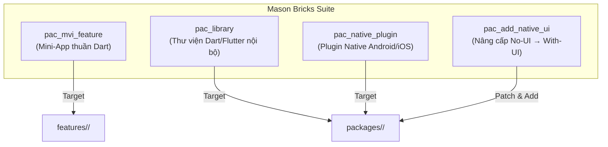
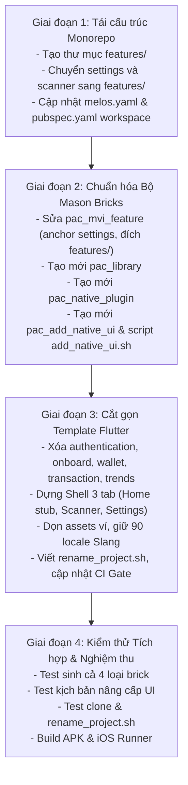

# Flutter Super App Template & Unified Mason Bricks — Design Spec

## 1. Metadata
- **Epic**: `flutter_super_app_template`
- **Date**: 2026-09-06
- **Status**: Approved — Ready for `epic-designer`
- **Reference Native Projects**:
  - Android Native Template: `/Users/danhdue/AllProjects/digital_wallet/android_digital_wallet/.worktrees/android_super_app_template`
  - iOS Native Template: `/Users/danhdue/AllProjects/digital_wallet/iOSDigitalWallet/.worktrees/ios_super_app_template`
- **Source Documents**:
  - `.devtool/epic/super_app_governance/2026-08-26-super-app-governance-design.md`
  - `.devtool/epic/flutter_super_app_template/2026-08-29-flutter-super-app-template-design.md`

---

## 2. Background & Problem Statement

### 2.1 Bối cảnh cũ và các vấn đề cần điều chỉnh
Trước đây, trong tài liệu thiết kế ngày 2026-08-29 (`flutter_super_app_template`), phương án kỹ thuật đã đề xuất:
1. Xây dựng hạ tầng native độc lập ngay bên trong thư mục `android/` và `ios/` của Flutter (vd: `android/buildSrc`, `android/framework`).
2. Sinh các brick phục vụ việc tạo Standalone Android App từ Flutter template (vd: `native_feature_module`, script `extract_native_standalone_android.sh`).
3. Toàn bộ các package (cả infra, tiện ích và các feature mini-apps) bị gom chung vào một thư mục phẳng `packages/` duy nhất trong `bloc_digital_wallet`.

### 2.2 Hiện trạng thực tế mới & Nhu cầu cập nhật
1. **Đã có sẵn 2 Native Template Projects hoàn chỉnh:**
   - Android Native Template: [`android_super_app_template`](file:///Users/danhdue/AllProjects/digital_wallet/android_digital_wallet/.worktrees/android_super_app_template) (Clean Architecture + MVI, Jetpack Compose, Kotlin Flow/Coroutines, Hilt, Konsist).
   - iOS Native Template: [`ios_super_app_template`](file:///Users/danhdue/AllProjects/digital_wallet/iOSDigitalWallet/.worktrees/ios_super_app_template) (Clean Architecture + MVI, SwiftUI, Combine, Tuist/SPM, ArchTests).
2. **Loại bỏ việc sinh Standalone Native App từ Flutter:**
   Vì đã có 2 repo native chuyên biệt trên, việc trích xuất hay sinh mã Standalone Android App từ Flutter là dư thừa (YAGNI). Template Flutter chỉ tập trung vào:
   - Một **Flutter Super App Host** chuẩn mực (Clean Arch + MVI + Melos Monorepo).
   - Hệ thống **Mason Bricks** tạo Features và Packages, đặc biệt là các **Packages có tích hợp Native Android/iOS** (tham khảo trực tiếp kiến trúc từ 2 template trên cho cả 2 trường hợp: Có UI và Không có UI).
3. **Tái cấu trúc thư mục Monorepo:**
   Phân tách rõ ràng giữa `packages/` (Hạ tầng/Infra) và `features/` (Mini-Apps), đạt sự đồng nhất 100% (Tri-Platform Parity) với cấu trúc của cả 2 template Android và iOS.

---

## 3. Kiến trúc Monorepo & Phân rã Thư mục (Tri-Platform Parity)

### 3.1 Cấu trúc Thư mục Mới
```
bloc_digital_wallet/ (Flutter Super App Template)
├── lib/                             # Host / Composition Root (Shell 3 tabs, AppRouter, DI)
│   └── shell/                       # ShellPage, ShellBloc, BottomNavBar, HomeStubPage
├── features/                        # CHỨA CÁC MINI-APPS / FEATURES (Sinh bởi pac_mvi_feature)
│   ├── settings/                    # Feature mẫu thực tế đầy đủ
│   └── scanner/                     # Feature khung rỗng mẫu
├── packages/                        # CHỨA INFRASTRUCTURE & NATIVE PLUGINS
│   ├── core/                        # Utilities, storage, extensions
│   ├── framework/                   # Base MVI BLoC, Action, State, Event
│   ├── network/                     # Retrofit, Dio, Interceptors
│   ├── ui_kit/                      # Design system Flutter
│   ├── platform/                    # app_platform: DeepLinkRoutes, AppEventBus
│   ├── logger/                      # Logging system
│   ├── logger_native_bridge/        # Pigeon headless log bridge
│   └── native_security/             # FFI native security
├── bricks/                          # Hệ thống Mason Bricks chuẩn hóa
├── scripts/                         # Script quản trị, đổi tên, CI gate
├── melos.yaml
└── pubspec.yaml                     # Dart Workspace root
```

### 3.2 So sánh cấu trúc 3 Nền tảng (Tri-Platform Parity)
| Khái niệm | Android Template (`android_super_app_template`) | iOS Template (`ios_super_app_template`) | Flutter Template (`bloc_digital_wallet`) |
|---|---|---|---|
| **Hạ tầng (Infra)** | `packages/` (`core`, `framework`, `network`, `platform`, `ui_kit`) | `Packages/` (`Core`, `Framework`, `Network`, `Platform`, `AppUIKit`, `Shell`) | `packages/` (`core`, `framework`, `network`, `platform`, `ui_kit`, `logger`, ...) |
| **Mini-Apps / Features** | `features/` (`settings`, `scanner`) | `Features/` (`Settings`, `Scanner`) | `features/` (`settings`, `scanner`) |
| **Composition Root** | `:app` + `:shell` | `App/` | `lib/` (Host App + `lib/shell/`) |
| **Cross-Feature Router** | `packages/platform` (`AppRoutes`) | `Packages/Platform` (`AppRoutes`) | `packages/platform` (`DeepLinkRoutes`) |
| **Event Bridge** | `packages/platform` (`AppEventBus`) | `Packages/Platform` (`AppEventBus`) | `packages/platform` (`AppEventBus`) |

### 3.3 Danh mục Packages trong Template Flutter
1. **Giữ nguyên 8 packages hạ tầng trong `packages/`:**
   `core`, `framework`, `network`, `ui_kit`, `platform` (`app_platform`), `logger`, `logger_native_bridge`, `native_security`.
2. **Feature Packages trong `features/`:**
   - `settings`: Feature mẫu thực tế (BLoC, Clean Architecture, đa ngôn ngữ, data sources).
   - `scanner`: Feature mẫu khung rỗng chuẩn mực (sinh từ brick `pac_mvi_feature`).
   - **Loại bỏ hoàn toàn các feature nghiệp vụ ví:** `authentication`, `onboard`, `wallet`, `transaction`, `trends`.
3. **Tái cấu trúc Host `lib/`:**
   - Shell gồm 3 tab: `Home` (stub page nhẹ tích hợp ngay trong shell), `Scanner`, và `Settings`. Tab mặc định khi mở app là `Settings`.
   - Bỏ splash tùy biến của `onboard`; app vào thẳng Shell bằng native splash mặc định của Flutter.
   - `lib/app_router.dart` và `lib/di/injection.dart` chỉ nạp route và DI cho Shell + Settings + Scanner.
4. **Cấu hình Workspace:**
   - `melos.yaml`:
     ```yaml
     packages:
       - 'packages/*'
       - 'features/*'
     ```
   - `pubspec.yaml` (Root Dart Workspace): Khai báo cả `packages/*` và `features/*`.

---

## 4. Thiết kế Hệ thống Mason Bricks Mới

Bộ Mason Bricks được phân định rõ ràng theo trách nhiệm, bao gồm 4 bricks chính thức:



### 4.1 Brick 1: `pac_mvi_feature` (Flutter Feature / Mini-App thuần Dart)
* **Vị trí xuất mã:** `features/{{name.snakeCase()}}/`
* **Tham số:** `name` (Tên feature, PascalCase/snake_case).
* **Cấu trúc:**
  ```
  features/{{name}}/
  ├── lib/
  │   ├── domain/               # entities, repositories interfaces, usecases
  │   ├── data/                 # datasources, models (Freezed), repositories impl
  │   ├── presentation/{{name}}/ # MVI: Action, Bloc, Event, Page, State
  │   ├── di/injection.dart     # Injectable module
  │   ├── {{name}}_router.dart  # AutoRoute (@RoutePage)
  │   └── {{name}}.dart         # Barrel export (chỉ export domain/presentation/di/router)
  ├── assets/locales/           # Slang đa ngôn ngữ (en, vi, ...)
  ├── pubspec.yaml              # Phụ thuộc ../../packages/{core, framework, ui_kit, platform}
  └── build.yaml / slang.yaml
  ```
* **Cập nhật Hook `post_gen.dart`:**
  - Chuyển toàn bộ neo (anchor) tích hợp từ chuỗi `onboard` sang `settings`.
  - Tự động đăng ký package vào `pubspec.yaml` root.
  - Tự động đăng ký DI vào `lib/di/injection.dart`.
  - Tự động đăng ký Router vào `lib/app_router.dart`.
  - Tự động đăng ký route công khai vào `packages/platform/lib/deep_link_routes.dart`.
* **Bricks đi kèm:** `pac_mvi_subfeature` (thêm màn hình con vào feature), `remove_pac_feature`, `remove_pac_subfeature`.

---

### 4.2 Brick 2: `pac_library` (Dart/Flutter Library Package)
* **Vị trí xuất mã:** `packages/{{name.snakeCase()}}/`
* **Mục đích:** Tạo các package tiện ích dùng chung, SDK nội bộ không có native và không có router/UI Shell.
* **Tham số:** `name`, `is_flutter` (boolean, default: true).
* **Cấu trúc:**
  ```
  packages/{{name}}/
  ├── lib/
  │   ├── {{name}}.dart         # Public API
  │   └── src/                  # Implementation internals
  ├── test/{{name}}_test.dart
  ├── pubspec.yaml              # resolution: workspace
  └── analysis_options.yaml
  ```
* **Hook `post_gen.dart`:** Chỉ đăng ký đường dẫn package vào `pubspec.yaml` root workspace.

---

### 4.3 Brick 3: `pac_native_plugin` (Flutter Package hỗ trợ Native Android & iOS)
* **Vị trí xuất mã:** `packages/{{name.snakeCase()}}/`
* **Mục đích:** Tạo Flutter Plugin hỗ trợ đồng thời Android (Kotlin) và iOS (Swift) theo Clean Architecture (`Platform/Domain/Data/Presentation`), tham chiếu trực tiếp từ `android_super_app_template` và `ios_super_app_template`.
* **Tham số:**
  * `name`: Tên package (e.g. `biometric_auth`, `camera_scanner`).
  * `has_ui`: `true` | `false` (Default: `false`).
  * `android_package`: Namespace Android (Default: `com.danhdue.{{name}}`).

#### Cấu trúc Thư mục Chi tiết:
```
packages/{{name}}/
├── lib/
│   ├── {{name}}.dart
│   ├── {{name}}_platform_interface.dart
│   └── src/
│       ├── {{name}}_method_channel.dart
│       └── {{name}}_native_view.dart      # [CHỈ SINH KHI has_ui=true] Widget bọc AndroidView / UiKitView
├── pigeons/
│   └── {{name}}_messages.dart             # [CHỈ SINH KHI has_ui=false] Pigeon schema type-safe
├── android/
│   ├── build.gradle.kts                   # Kotlin, Compose compiler (khi has_ui=true)
│   └── src/main/kotlin/com/danhdue/{{name}}/
│       ├── platform/                      # Plugin registration, Pigeon Impl hoặc PlatformViewFactory
│       ├── domain/                        # Pure Kotlin: Model, Repository interface, UseCase
│       ├── data/                          # Android device SDKs, System services
│       └── presentation/                  # [CHỈ SINH KHI has_ui=true]
│           ├── MviViewModel.kt            # Base MVI độc lập (StateFlow + Channel)
│           ├── {{name.pascalCase()}}ViewModel.kt
│           ├── {{name.pascalCase()}}Action.kt / State.kt / Event.kt
│           ├── {{name.pascalCase()}}Screen.kt # Jetpack Compose UI (@Composable)
│           └── {{name.pascalCase()}}PlatformView.kt # Bọc ComposeView vào PlatformView
└── ios/
    ├── {{name}}.podspec
    └── Classes/ (hoặc Sources/{{name}}/)
        ├── Platform/                      # Plugin registration, Pigeon Impl hoặc PlatformViewFactory
        ├── Domain/                        # Pure Swift: Entity, Protocol, UseCase
        ├── Data/                          # Apple frameworks, Security, AVFoundation
        └── Presentation/                  # [CHỈ SINH KHI has_ui=true]
            ├── MviViewModel.swift         # Base MVI độc lập (Combine @Published + PassthroughSubject)
            ├── {{name.pascalCase()}}ViewModel.swift
            ├── {{name.pascalCase()}}Action.swift / State.swift / Event.swift
            ├── {{name.pascalCase()}}View.swift # SwiftUI View
            └── {{name.pascalCase()}}PlatformView.swift # Bọc UIHostingController vào FlutterPlatformView
```

#### Quy tắc Kỹ thuật Native:
1. **Khi `has_ui: false` (Headless IPC):**
   - Sử dụng **Pigeon** định nghĩa hợp đồng tại `pigeons/{{name}}_messages.dart`.
   - Sinh code type-safe ra `Messages.g.kt` và `Messages.g.swift`.
   - Native implement interface trong `platform/`, gọi xuống `domain/` và `data/`.
2. **Khi `has_ui: true` (Native UI):**
   - **Android:** Dùng **Jetpack Compose** (`Screen.kt`) kết hợp base `MviViewModel.kt` (Coroutines/StateFlow). Nhúng vào Flutter bằng `ComposeView` thông qua `PlatformView` & `PlatformViewFactory`.
   - **iOS:** Dùng **SwiftUI** (`View.swift`) kết hợp base `MviViewModel.swift` (Combine). Nhúng vào Flutter bằng `UIHostingController` thông qua `FlutterPlatformView` & `FlutterPlatformViewFactory`.
   - **Self-contained:** Không phụ thuộc cứng ra đường dẫn bên ngoài, không ép Dagger-Hilt hay Tuist của app chủ; plugin tự quản lý DI nội bộ (constructor injection).

---

### 4.4 Brick 4: `pac_add_native_ui` (Cơ chế Nâng cấp một chạm từ No-UI sang With-UI)
* **Mục đích:** Nâng cấp một package native đang là Headless (`has_ui: false`) thành có giao diện Native (`has_ui: true`) mà không làm hỏng mã `domain/`, `data/`, hay `pigeons/` đang có.
* **Cách thực thi:**
  ```bash
  ./scripts/add_native_ui.sh <package_name>
  # Hoặc trực tiếp qua Mason:
  mason make pac_add_native_ui --name <package_name>
  ```
* **Các tác vụ tự động:**
  1. **Android:**
     - Cập nhật `build.gradle.kts` bổ sung `buildFeatures { compose = true }` và Compose dependencies.
     - Sinh thư mục `presentation/` (Base `MviViewModel.kt`, Compose Screen, Action/State/Event, PlatformView).
     - Hook tự động patch file `*Plugin.kt` để đăng ký `PlatformViewFactory`.
  2. **iOS:**
     - Sinh thư mục `Presentation/` (Base `MviViewModel.swift`, SwiftUI View, Action/State/Event, FlutterPlatformView).
     - Hook tự động patch file `*Plugin.swift` để đăng ký `FlutterPlatformViewFactory`.
  3. **Flutter (Dart):**
     - Sinh `lib/src/ui/{{name}}_native_view.dart` (Widget bọc `AndroidView` và `UiKitView`).
     - Tự động thêm dòng export vào barrel file `lib/{{name}}.dart`.
  4. **An toàn & Idempotent:** Báo lỗi nếu package chưa tồn tại; cảnh báo nếu package đã có UI, tuyệt đối không ghi đè mất mát code hiện có.

---

## 5. Loại bỏ Triệt để các Thành phần Standalone Cũ

1. **Hủy bỏ toàn bộ script trích xuất standalone:**
   - Xóa bỏ `scripts/extract_native_standalone_android.sh` và `scripts/extract_native_standalone_ios.sh`.
   - Không sinh thêm module native standalone nào (`android/framework`) trong repo Flutter.
2. **Hủy bỏ các Brick cũ không còn dùng:**
   - Xóa bỏ `native_feature_module` (brick nhắm vào `android/features/`).
   - Xóa bỏ các brick thử nghiệm cũ: `sample`, `remove_sample`, `test_brick`.
   - Giữ lại các brick legacy nhắm vào `lib/features/` cũ (`mvi_feature`, `mvi_subfeature`, `remove_feature`, `remove_subfeature`) với tiền tố `[DEPRECATED]` như quyết định trước đây.
3. **Dọn dẹp tài liệu spec:**
   - Hợp nhất và cập nhật spec trong `.devtool/epic/flutter_super_app_template/`.
   - Xóa bỏ các thư mục epic tạm `template_android` và `template_ios`.

---

## 6. Script Đổi tên Template (`scripts/rename_project.sh`)

Script đổi tên là điểm vào duy nhất sau khi clone template Flutter:
1. Nhận tham số: `./scripts/rename_project.sh <NewAppName> <new_package_name> <new.bundle.id>`
2. Thay đổi tên package và namespace trong:
   - Root `pubspec.yaml`, `melos.yaml`.
   - Toàn bộ các câu lệnh import `package:bloc_digital_wallet/...` trong `lib/`, `features/`, `packages/`.
   - `applicationId` và namespace trong Android `app/build.gradle.kts`.
   - Bundle Identifier và Display Name trong iOS `project.pbxproj` / `.xcconfig` / `Info.plist`.
3. **Bảo toàn Vendor Plugin Namespace:**
   - Giữ nguyên namespace `com.danhdue.*` của các plugin native nội bộ (`native_security`, `logger_native_bridge`) để tránh làm gãy native registration.
4. Tự động chạy `melos genAlls` để tái sinh toàn bộ router, DI, và slang translations theo tên mới.

---

## 7. Kế hoạch Triển khai (Migration Roadmap)



---

## 8. Kế hoạch Kiểm thử & Nghiệm thu (Verification Checklist)

| STT | Hạng mục kiểm thử | Lệnh / Thao tác kiểm tra | Tiêu chí Nghiệm thu (Pass Criteria) |
|---|---|---|---|
| 1 | **Tái cấu trúc Monorepo** | `melos bootstrap && melos genAlls` | Nhận diện đúng `packages/*` và `features/*`, code sinh không lỗi biên dịch. |
| 2 | **CI Boundary Gate** | `scripts/check_module_boundaries.sh` | Quét sạch các file trong `features/*`, phát hiện lỗi nếu `features/A` import `features/B`, pass khi import `packages/*`. |
| 3 | **Brick `pac_mvi_feature`** | `mason make pac_mvi_feature --name profile` | Sinh vào `features/profile/`, tự động wire Router, DI, và DeepLinkRoutes thành công. |
| 4 | **Brick `pac_library`** | `mason make pac_library --name cache_manager` | Sinh vào `packages/cache_manager/`, `flutter test` trong package chạy pass. |
| 5 | **Brick `pac_native_plugin (No-UI)`** | `mason make pac_native_plugin --name device_info --has_ui false` | Chạy Pigeon sinh code ra Kotlin & Swift, gọi qua lại giữa Dart và Native thành công. |
| 6 | **Brick `pac_native_plugin (With-UI)`** | `mason make pac_native_plugin --name custom_camera --has_ui true` | Render thành công Jetpack Compose trên Android và SwiftUI trên iOS qua PlatformView. |
| 7 | **Brick `pac_add_native_ui`** | `./scripts/add_native_ui.sh device_info` | Tự động nâng cấp package `device_info` lên Compose + SwiftUI, patch plugin class thành công. |
| 8 | **Script Đổi tên Template** | `./scripts/rename_project.sh SuperApp com.danhdue.superapp` | Đổi sạch sẽ tên, bundle id, `melos genAlls` pass, build APK và iOS Runner thành công. |

---

## 9. Định tuyến Bước Tiếp theo (Next Step Routing)
Vì tài liệu này định nghĩa một khối lượng công việc quy mô lớn (Epic-scale) gồm tái cấu trúc Monorepo, xây dựng hệ thống 4 Mason Bricks, cắt gọn template Flutter và tích hợp native đa nền tảng, bước tiếp theo sau khi tài liệu này được người dùng duyệt là:
$\rightarrow$ **Chuyển sang `epic-designer`** để tạo High-Level Design (HLD) chi tiết và phân rã thành các Kanban Task files (`task_*.md`).
