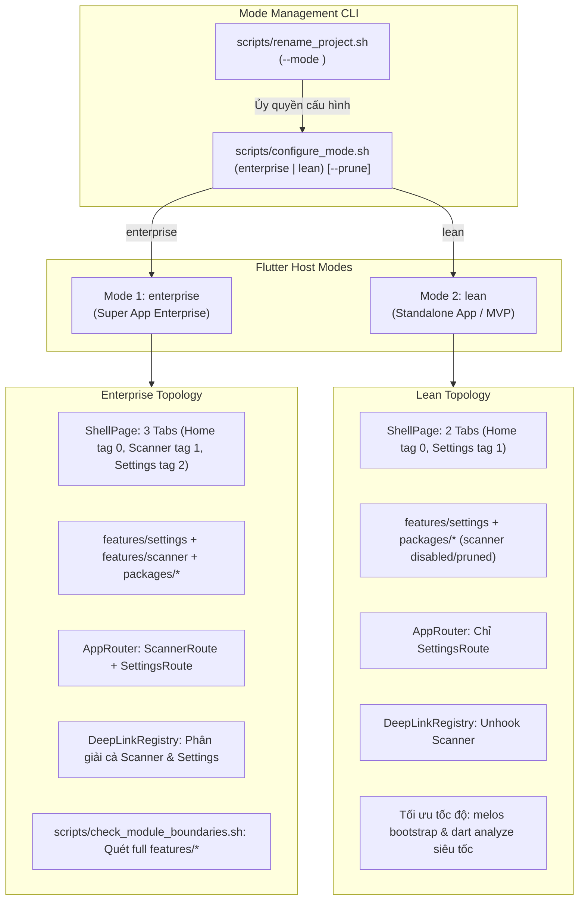
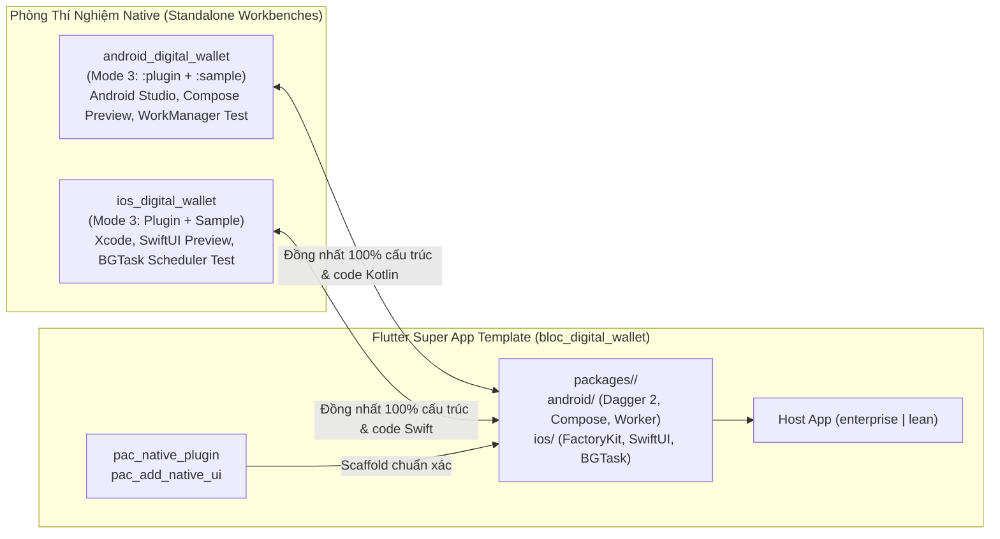
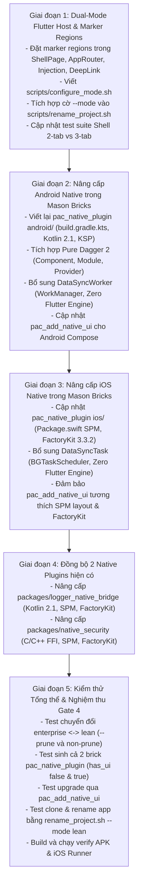

# Dual-Mode Flutter Super App Template & Native SDKs Upgrade — Design Spec

## 1. Metadata
- **Epic**: `flutter_super_app_template`
- **Date**: 2026-09-15
- **Status**: Gate 1 — Ready for `epic-designer` (HLD & Task Breakdown)
- **Target Repository**: `bloc_digital_wallet` (`/Users/danhdueexoictif/AllProjects/digital_wallet/bloc_digital_wallet`)
- **Reference Native Repositories**:
  - Android Native Template & Devbed: `/Users/danhdueexoictif/AllProjects/digital_wallet/android_digital_wallet`
    - Spec: `.devtool/epic/tri_mode_and_flutter_plugin_devbed/2026-09-11-tri-mode-template-and-flutter-plugin-devbed-design.md`
    - HLD: `.devtool/epic/tri_mode_and_flutter_plugin_devbed/tri_mode_and_flutter_plugin_devbed.en.md`
  - iOS Native Template & Devbed: `/Users/danhdueexoictif/AllProjects/digital_wallet/ios_digital_wallet`
    - Spec: `.devtool/epic/tri_mode_and_flutter_plugin_devbed/2026-09-14-tri-mode-template-and-flutter-plugin-devbed-design.md`
    - HLD: `.devtool/epic/tri_mode_and_flutter_plugin_devbed/tri_mode_and_flutter_plugin_devbed.en.md`
- **Source Documents**:
  - `.devtool/epic/flutter_super_app_template/2026-09-06-flutter-super-app-template-design.md`
  - `.devtool/epic/flutter_super_app_template/2026-09-09-ios-native-plugin-factory-di-spm-design.md`
  - `.devtool/epic/flutter_super_app_template/flutter_super_app_template.en.md`
  - `.devtool/epic/flutter_super_app_template/flutter_super_app_template.vi.md`

---

## 2. Context & Problem Statement

### 2.1 Hiện trạng của Flutter Super App Template
Trong các giai đoạn trước (2026-09-06 và 2026-09-09 Phase 5), dự án `bloc_digital_wallet` đã đạt được những bước tiến quan trọng:
1. Phân tách monorepo thành `packages/` (hạ tầng, tiện ích, native plugins) và `features/` (mini-apps: `settings`, `scanner`).
2. Tái cấu trúc Shell 3 tabs (`Home`, `Scanner`, `Settings`), mặc định khởi động vào tab `Settings`.
3. Xây dựng bộ Mason Bricks (`pac_mvi_feature`, `pac_library`, `pac_native_plugin`, `pac_add_native_ui`, `pac_rename_project`).
4. Triển khai Phase 5 trên iOS: chuyển giao diện native iOS của plugin sang Flutter Swift Package Manager (`Package.swift`) và FactoryKit 3.3.2 (`SharedContainer`).

### 2.2 Đột phá Kiến trúc mới từ Android & iOS Native Templates
Vào các ngày 2026-09-11 (Android) và 2026-09-14 (iOS), cả hai repository native tham chiếu đã hoàn thiện kiến trúc **Tri-Mode Architecture**:
- **Mode 1 (`enterprise`)**: Super App doanh nghiệp quy mô lớn với đầy đủ modules, dynamic feature/scanner stub, routing cross-feature và các chốt kiểm soát kiến trúc nghiêm ngặt (Konsist K1–K10 trên Android; ArchTests swift-syntax trên iOS).
- **Mode 2 (`lean`)**: Standard Standalone App / MVP loại bỏ hoàn toàn các module/stub không cần thiết (bỏ scanner stub, tắt Konsist/ArchTests, Shell 2 tab) giúp tăng tốc độ build và tinh gọn tối đa.
- **Mode 3 (`plugin`)**: Native Devbed / Workbench chuyên biệt để phát triển phần native cho Flutter Plugin:
  - **Android**: Module `:plugin` (Android Library) + `:sample` (App runner). Sử dụng **Pure Dagger 2** với KSP (zero Hilt) và **WorkManager `CoroutineWorker`** chạy tác vụ nền với **Zero Flutter Engine overhead** (tiết kiệm 150MB+ RAM và tránh OOM khi app bị kill).
  - **iOS**: Module `Plugin` (SPM) + `Sample` (SwiftUI App runner). Sử dụng **FactoryKit 3.3.2** (`SharedContainer`) và **`BGTaskScheduler`** chạy tác vụ nền với **Zero Flutter Engine overhead**.

### 2.3 Khoảng cách Kỹ thuật cần Khắc phục trên Flutter Template
1. **Thiếu tính linh hoạt về Mode trên Flutter Host:** Template Flutter hiện chỉ có một cấu hình Enterprise duy nhất. Các team muốn làm ứng dụng độc lập, MVP hay startup khi clone về phải gánh toàn bộ cấu hình 3 tab Shell, `features/scanner` và hệ thống routing phức tạp.
2. **Android Native trong `pac_native_plugin` bị lỗi thời:**
   - Vẫn dùng Groovy `build.gradle` với cấu hình Compose compiler cũ (`kotlinCompilerExtensionVersion = "1.5.15"` thay vì `org.jetbrains.kotlin.plugin.compose` của Kotlin 2.x).
   - Thiếu DI container chuẩn: Không có Pure Dagger 2 + KSP như module `:plugin` của Android Native.
   - Hoàn toàn thiếu cơ chế chạy tác vụ nền độc lập (`WorkManager` + zero Flutter Engine).
3. **iOS Native trong `pac_native_plugin` thiếu Background Task:** Mặc dù đã có FactoryKit 3.3.2, template iOS chưa tích hợp `BGTaskScheduler` (`DataSyncTask.swift`) để xử lý background với zero Flutter Engine.
4. **Thiếu công cụ chuyển đổi Mode:** Chưa có `scripts/configure_mode.sh` và cờ `--mode` trong `scripts/rename_project.sh` như Android và iOS.

---

## 3. Kiến trúc Dual-Mode cho Flutter Host (`enterprise` & `lean`)



### 3.1 Ma trận So sánh 2 Chế độ

| Tiêu chí | Mode 1: `enterprise` (Mặc định) | Mode 2: `lean` (Standalone App / MVP) |
|---|---|---|
| **Mục đích sử dụng** | Super App quy mô lớn, nhiều team phát triển, hệ sinh thái Mini-Apps | Ứng dụng đơn lẻ, MVP, startup, team nhỏ cần tốc độ phát triển tối đa |
| **Giao diện Shell** | 3 tabs: `Home` (0), `Scanner` (1), `Settings` (2). Default: `Settings` (2) | 2 tabs: `Home` (0), `Settings` (1). Default: `Settings` (1) |
| **Modules Kích hoạt** | `features/settings`, `features/scanner`, toàn bộ `packages/*` | `features/settings`, toàn bộ `packages/*` (loại bỏ/vô hiệu hóa `features/scanner`) |
| **Router & DI** | Nạp `ScannerRoute` + `ScannerModule` DI | Bỏ qua `ScannerRoute` + `ScannerModule` DI |
| **Deep Link Registry** | Phân giải cả `/settings` và `/scanner` | Chỉ phân giải `/settings` (bỏ `/scanner`) |
| **Cổng Kiểm soát CI** | `scripts/check_module_boundaries.sh` quét đa feature | Vẫn bảo toàn Clean Arch ranh giới giữa `features/` và `packages/` |
| **Tùy chọn `--prune`** | Giữ nguyên toàn bộ mã nguồn | Xóa hẳn thư mục `features/scanner/` và gỡ bỏ khỏi `pubspec.yaml` / `melos.yaml` |

### 3.2 Cơ chế Chuyển đổi Khối Đánh dấu (Marker Regions)
Để đảm bảo an toàn tuyệt đối, không gây lỗi cú pháp Dart khi đóng/mở mã nguồn, `scripts/configure_mode.sh` sử dụng các Marker Regions chuẩn:

```dart
// lib/shell/shell_page.dart
// shell:scanner-tab:begin
NavigationDestination(
  icon: Icon(Icons.qr_code_scanner_outlined),
  selectedIcon: Icon(Icons.qr_code_scanner),
  label: t.scanner.title,
),
// shell:scanner-tab:end
```

```dart
// lib/app_router.dart
// app:scanner-route:begin
import 'package:scanner/scanner_router.dart';
// app:scanner-route:end

// Bên trong AutoRoute config:
// app:scanner-route-entry:begin
AdaptiveRoute(page: ScannerRoute.page, path: '/scanner'),
// app:scanner-route-entry:end
```

```dart
// lib/di/injection.dart
// di:scanner-module:begin
import 'package:scanner/di/injection.dart';
// di:scanner-module:end

// di:scanner-register:begin
configureScannerInjection(getIt);
// di:scanner-register:end
```

```dart
// packages/platform/lib/deeplink/deep_link_registry.dart
// deeplink:scanner-register:begin
registry.register(DeepLinkRoutes.scanner, (uri) => AppRoutes.ScannerRoot());
// deeplink:scanner-register:end
```

---

## 4. Nâng cấp Toàn diện Android Native SDK & Mason Bricks

Để đồng bộ 1:1 với module `:plugin` đã kiểm thử thành công trong `android_digital_wallet`:

```
packages/{{name}}/android/
├── build.gradle.kts                           # Kotlin 2.1, KSP, Compose compiler plugin, Java 21
└── src/
    ├── main/
    │   ├── AndroidManifest.xml
    │   └── kotlin/com/danhdue/{{name}}/
    │       ├── di/                            # PURE DAGGER 2 (Zero Hilt)
    │       │   ├── {{name.pascalCase()}}Component.kt
    │       │   ├── {{name.pascalCase()}}ComponentProvider.kt # Double-checked locking singleton
    │       │   └── {{name.pascalCase()}}Module.kt
    │       ├── data/
    │       │   ├── repository/{{name.pascalCase()}}RepositoryImpl.kt
    │       │   └── worker/{{name.pascalCase()}}SyncWorker.kt # WorkManager (Zero Flutter Engine)
    │       ├── domain/
    │       │   ├── model/{{name.pascalCase()}}Data.kt
    │       │   ├── repository/{{name.pascalCase()}}Repository.kt
    │       │   └── usecase/
    │       │       ├── Get{{name.pascalCase()}}DataUseCase.kt
    │       │       └── Sync{{name.pascalCase()}}DataUseCase.kt
    │       ├── platform/
    │       │   ├── {{name.pascalCase()}}Plugin.kt          # FlutterPlugin lifecycle
    │       │   ├── Messages.g.kt                           # Pigeon IPC generated
    │       │   ├── {{name.pascalCase()}}HostApiImpl.kt     # Headless path
    │       │   └── {{name.pascalCase()}}PlatformViewFactory.kt # UI path
    │       └── presentation/                  # [CHỈ CÓ KHI has_ui=true]
    │           ├── base/
    │           │   ├── ViewContract.kt        # Base Action/State/Event
    │           │   └── MviViewModel.kt        # Coroutines StateFlow + Channel MVI
    │           ├── {{name.pascalCase()}}Screen.kt          # Jetpack Compose UI
    │           ├── {{name.pascalCase()}}ViewModel.kt
    │           ├── {{name.pascalCase()}}Contract.kt        # Action, State, Event
    │           └── {{name.pascalCase()}}PlatformView.kt    # ComposeView -> PlatformView
    └── test/kotlin/com/danhdue/{{name}}/
        ├── di/{{name.pascalCase()}}ComponentTest.kt
        ├── data/worker/{{name.pascalCase()}}SyncWorkerTest.kt
        ├── platform/{{name.pascalCase()}}HostApiImplTest.kt
        └── presentation/{{name.pascalCase()}}ViewModelTest.kt
```

### 4.1 Toolchain & Gradle Build Script (`build.gradle.kts`)
- Loại bỏ hoàn toàn Groovy `build.gradle` cũ; chuyển sang Kotlin DSL `build.gradle.kts`.
- Áp dụng Kotlin **2.1.0**, AGP **8.13+**, JDK **21**.
- Tích hợp KSP (`com.google.devtools.ksp`) và Compose Compiler Gradle Plugin (`org.jetbrains.kotlin.plugin.compose`).

### 4.2 Pure Dagger 2 Architecture (Zero Hilt)
Flutter host apps không có `@HiltAndroidApp` hay Hilt Gradle plugin. Do đó, plugin phải sử dụng Dagger 2 thuần:
```kotlin
@Singleton
@Component(modules = [{{name.pascalCase()}}Module::class])
interface {{name.pascalCase()}}Component {
    fun inject(worker: {{name.pascalCase()}}SyncWorker)
    fun getSyncDataUseCase(): Sync{{name.pascalCase()}}DataUseCase
    fun getGetDataUseCase(): Get{{name.pascalCase()}}DataUseCase
    fun getViewModelFactory(): {{name.pascalCase()}}ViewModelFactory
}
```

Singleton Provider an toàn đa luồng (`Thread-Safe Double-Checked Locking`):
```kotlin
object {{name.pascalCase()}}ComponentProvider {
    @Volatile private var instance: {{name.pascalCase()}}Component? = null

    fun get(context: Context): {{name.pascalCase()}}Component =
        instance ?: synchronized(this) {
            instance ?: Dagger{{name.pascalCase()}}Component.builder()
                .{{name.camelCase()}}Module({{name.pascalCase()}}Module(context.applicationContext))
                .build().also { instance = it }
        }

    @VisibleForTesting
    fun reset() { instance = null }
}
```

### 4.3 Zero Flutter Engine Background Execution (WorkManager)
Khi hệ điều hành Android kích hoạt Worker định kỳ hoặc khi có kết nối mạng:
```kotlin
class {{name.pascalCase()}}SyncWorker(
    context: Context,
    params: WorkerParameters
) : CoroutineWorker(context, params) {
    override suspend fun doWork(): Result {
        val useCase = {{name.pascalCase()}}ComponentProvider.get(applicationContext).getSyncDataUseCase()
        return if (useCase.execute()) Result.success() else Result.retry()
    }
}
```
> **Ưu điểm vượt trội:** Tác vụ chạy hoàn toàn trong process nền của Android với Kotlin Coroutines thuần và DI Dagger 2, **không khởi tạo `FlutterEngine`**, tiết kiệm ngay 150MB–200MB RAM và triệt tiêu nguy cơ bị Android LMK (Low Memory Killer) khai tử.

---

## 5. Nâng cấp Toàn diện iOS Native SDK & Mason Bricks

Để đồng bộ 1:1 với module `Plugin` trong `ios_digital_wallet`:

```
packages/{{name}}/ios/{{name}}/
├── Package.swift                              # FactoryKit 3.3.2 + platforms [.iOS("15.0")]
└── Sources/{{name}}/
    ├── {{name.pascalCase()}}Plugin.swift      # Composition root: register(with:)
    ├── {{name.pascalCase()}}Container.swift   # final class ...Container: SharedContainer (FactoryKit)
    ├── Platform/
    │   ├── Messages.g.swift                   # Pigeon IPC contracts
    │   ├── {{name.pascalCase()}}HostApiImpl.swift # Headless path (@Injected)
    │   └── {{name.pascalCase()}}PlatformViewFactory.swift # UI path
    ├── Domain/                                # Pure Swift
    │   ├── Model/{{name.pascalCase()}}Data.swift
    │   ├── Repository/{{name.pascalCase()}}Repository.swift
    │   └── UseCase/
    │       ├── Get{{name.pascalCase()}}DataUseCase.swift
    │       └── Sync{{name.pascalCase()}}DataUseCase.swift
    ├── Data/
    │   ├── Repository/{{name.pascalCase()}}RepositoryImpl.swift
    │   └── Background/
    │       └── {{name.pascalCase()}}SyncTask.swift # BGTaskScheduler (Zero Flutter Engine)
    └── Presentation/                          # [CHỈ CÓ KHI has_ui=true]
        ├── Base/
        │   ├── ViewContract.swift
        │   └── MviViewModel.swift             # Combine @Published + PassthroughSubject
        ├── {{name.pascalCase()}}View.swift    # SwiftUI View
        ├── {{name.pascalCase()}}ViewModel.swift
        ├── {{name.pascalCase()}}Action.swift / State.swift / Event.swift
        └── {{name.pascalCase()}}PlatformView.swift # UIHostingController -> FlutterPlatformView
```

### 5.1 Package.swift & FactoryKit 3.3.2
- Chuẩn phân phối **Flutter SwiftPM**, không dùng CocoaPods `.podspec`.
- Deployment target: iOS 15.0 floor cho plugin; hỗ trợ Swift 6 và Swift Concurrency (`async/await`).
- Mỗi plugin có một `SharedContainer` subclass độc lập (`import FactoryKit`), tránh va chạm namespace với app chủ:
  ```swift
  public final class {{name.pascalCase()}}Container: SharedContainer {
      public static let shared = {{name.pascalCase()}}Container()
      public let manager = ContainerManager()
  }

  public extension {{name.pascalCase()}}Container {
      var repository: Factory<{{name.pascalCase()}}Repository> { self { {{name.pascalCase()}}RepositoryImpl() } }
      var syncUseCase: Factory<Sync{{name.pascalCase()}}DataUseCase> { self { Sync{{name.pascalCase()}}DataUseCase(repository: self.repository()) } }
  }
  ```

### 5.2 Zero Flutter Engine Background Execution (BGTaskScheduler)
Đăng ký và xử lý background task thông qua Apple `BGTaskScheduler`:
```swift
public enum {{name.pascalCase()}}SyncTask {
    public static let identifier = "com.danhdue.{{name.snakeCase()}}.sync"

    public static func register() {
        BGTaskScheduler.shared.register(forTaskWithIdentifier: identifier, using: nil) { task in
            handle(task as! BGProcessingTask)
        }
    }

    static func handle(_ task: BGProcessingTask) {
        let useCase = {{name.pascalCase()}}Container.shared.syncUseCase()
        let work = Task { task.setTaskCompleted(success: await useCase.execute()) }
        task.expirationHandler = { work.cancel() }
    }
}
```
> **Điểm neo vòng đời:** `register()` được gọi trực tiếp trong `{{name.pascalCase()}}Plugin.register(with:)`, đảm bảo chạy trước khi `application(_:didFinishLaunchingWithOptions:)` trả về theo đúng quy định nghiêm ngặt của iOS.

---

## 6. Nâng cấp Bộ Mason Bricks & Tooling

### 6.1 Brick `pac_native_plugin`
- Cập nhật toàn bộ template Android sang **Kotlin DSL `build.gradle.kts`**, **Pure Dagger 2**, **KSP**, và **`DataSyncWorker`**.
- Cập nhật template iOS sang **Flutter SPM**, **FactoryKit 3.3.2**, và **`DataSyncTask`**.
- Hỗ trợ cả 2 biến thể:
  - `has_ui: false` (Headless Pigeon contract + Background Workers).
  - `has_ui: true` (Giao diện Jetpack Compose + SwiftUI nhúng qua PlatformView).

### 6.2 Brick `pac_add_native_ui` & Script `add_native_ui.sh`
- Nâng cấp một package native đang là Headless lên With-UI mà:
  1. Bảo toàn 100% mã `domain/`, `data/` (kể cả background workers) và DI containers (`Dagger 2` / `FactoryKit`).
  2. Bổ sung tầng `presentation/` trên Android (Compose Screen, MviViewModel, PlatformView).
  3. Bổ sung tầng `Presentation/` trên iOS (SwiftUI View, MviViewModel, PlatformView).
  4. Patch Gradle (`buildFeatures { compose = true }`) và plugin registration.

### 6.3 Brick `pac_rename_project` & Script `rename_project.sh`
- Bổ sung cờ `--mode <enterprise|lean>` (mặc định: `enterprise`).
- Tự động ủy quyền cho `scripts/configure_mode.sh` sau khi đổi tên package, namespace, bundle ID và imports.

---

## 7. Quy trình Phối hợp Tri-Platform (Bidirectional Devbed Workflow)

Hệ sinh thái giờ đây đạt sự hoàn hảo và liên kết chặt chẽ:



1. Khi lập trình viên cần xây dựng một tính năng Native phức tạp (camera AI, xử lý mã hóa phần cứng, sync dữ liệu nền lớn):
   - Mở `android_digital_wallet` ở **Mode 3**, dùng Android Studio viết Kotlin, Compose và WorkManager với tốc độ build cực nhanh, preview UI tức thì.
   - Mở `ios_digital_wallet` ở **Mode 3**, dùng Xcode viết Swift, SwiftUI và BGTaskScheduler độc lập.
2. Khi code native đã chạy hoàn hảo và vượt qua unit tests:
   - Chạy `mason make pac_native_plugin --name <feature> --has_ui <bool>` trong `bloc_digital_wallet`.
   - Copy mã nguồn từ Native Devbed sang `packages/<feature>/` mà **không cần sửa lại cấu trúc tầng hay DI**.
   - Host Flutter gọi plugin thông qua Pigeon IPC hoặc nhúng widget qua PlatformView.

---

## 8. Kế hoạch Triển khai (Migration Roadmap)



---

## 9. Tiêu chí Nghiệm thu (Verification Checklist)

| STT | Hạng mục Kiểm thử | Lệnh / Thao tác | Tiêu chí Đạt (Pass Criteria) |
|---|---|---|---|
| 1 | **Chuyển sang Lean Mode** | `./scripts/configure_mode.sh lean` | Shell chuyển thành 2 tabs, Scanner unhook sạch sẽ; `melos bootstrap && melos run analyze` pass 100%. |
| 2 | **Khôi phục Enterprise Mode** | `./scripts/configure_mode.sh enterprise` | Shell khôi phục 3 tabs, Scanner hoạt động lại bình thường; test suite pass 100%. |
| 3 | **Lean Mode với `--prune`** | `./scripts/configure_mode.sh lean --prune` | Thư mục `features/scanner/` được dọn sạch; không còn reference nào mồ côi trong `pubspec.yaml` hay `melos.yaml`. |
| 4 | **Brick `pac_native_plugin` (No-UI)** | `mason make pac_native_plugin --name test_headless --has_ui false` | Android: có Dagger 2 + WorkManager; iOS: có SPM + FactoryKit + BGTaskScheduler; `flutter test` pass. |
| 5 | **Brick `pac_native_plugin` (With-UI)** | `mason make pac_native_plugin --name test_ui --has_ui true` | Có Compose Screen (Android) và SwiftUI View (iOS) bọc qua PlatformView; build APK và iOS Runner xanh. |
| 6 | **Brick `pac_add_native_ui`** | `mason make pac_add_native_ui --name test_headless` | Nâng cấp headless lên with-ui mà không làm mất Dagger 2, FactoryKit hay background workers; compile pass. |
| 7 | **Đổi tên kèm Chế độ Lean** | `./scripts/rename_project.sh "LeanApp" lean_app com.danhdue.lean --mode lean` | Đổi tên sạch sẽ, app ở cấu hình Lean 2 tabs, build thành công APK và iOS Runner. |
| 8 | **Zero Flutter Engine Background** | Unit test `DataSyncWorkerTest` & `DataSyncTaskTests` | Chạy pass 100% trong môi trường test thuần túy không cần khởi tạo FlutterEngine. |

---

## 10. Định tuyến Bước Tiếp theo (Next Step Routing)
Tài liệu này xác lập đặc tả kiến trúc chính thức hoàn chỉnh cho Epic.
$\rightarrow$ Sau khi người dùng xác nhận bản đặc tả này (Gate 1 Passed), ta sẽ chuyển giao sang **Stage 2 (`epic-designer`)** để cập nhật HLD (`flutter_super_app_template.en.md`, `flutter_super_app_template.vi.md`) và phân rã chi tiết thành các file Kanban task (`task_*.md`).
