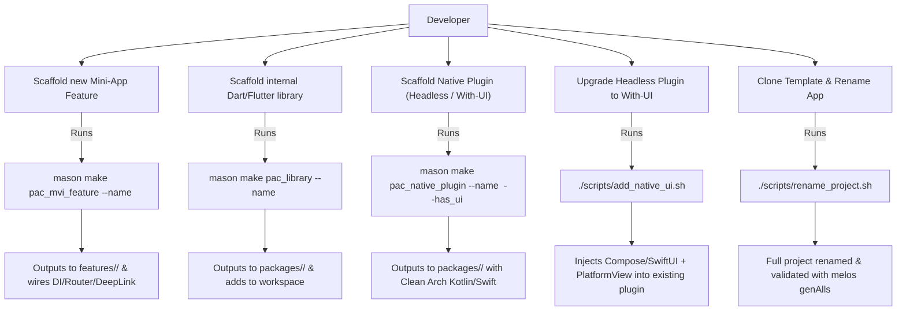
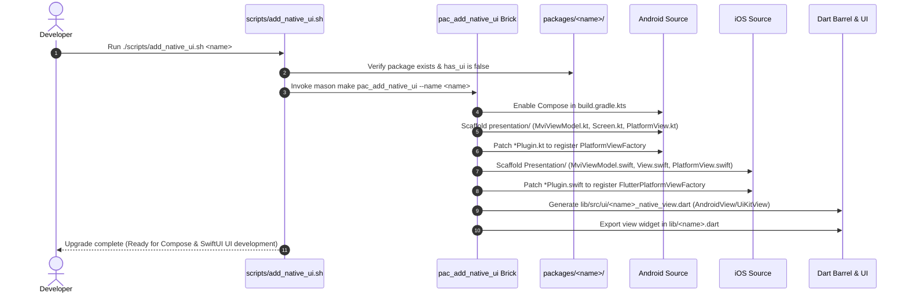

# Epic: Flutter Super App Template & Unified Mason Bricks

## Table of Contents
1. [Meta Data](#meta-data)
2. [Background](#background)
3. [Goals & Non-Goals](#goals--non-goals)
4. [Architecture & Technical Design](#architecture--technical-design)
   - [High-Level Architecture](#high-level-architecture)
   - [Use Cases](#use-cases)
   - [Sequence Diagram](#sequence-diagram)
5. [Rollout Strategy & Mitigation](#rollout-strategy--mitigation)
6. [Kanban Tasks Breakdown](#kanban-tasks-breakdown)

---

## Meta Data
- **Epic**: `flutter_super_app_template`
- **Status**: In-Progress (Designing)
- **Target Release**: Flutter Super App Template v1.0
- **Source Spec**: [2026-09-06-flutter-super-app-template-design.md](2026-09-06-flutter-super-app-template-design.md)
- **Reference Native Templates**:
  - Android: `/Users/danhdue/AllProjects/digital_wallet/android_digital_wallet/.worktrees/android_super_app_template`
  - iOS: `/Users/danhdue/AllProjects/digital_wallet/iOSDigitalWallet/.worktrees/ios_super_app_template`

---

## Background
The `bloc_digital_wallet` repository is a Flutter monorepo managed with Melos, employing Clean Architecture + MVI. Previously, all packages (core infrastructure, utilities, native bridges, and business mini-apps) were located in a single flat `packages/` directory. Furthermore, previous draft specifications attempted to extract standalone Android native apps directly from the Flutter repository.

Because two production-grade native super-app templates already exist independently (`android_super_app_template` and `ios_super_app_template`), the goal is now re-focused:
1. Re-architect `bloc_digital_wallet` into a reusable **Flutter Super App Template** by separating `packages/` (infrastructure, utilities, and native bridge plugins) from `features/` (mini-apps), achieving 100% architectural parity across Android, iOS, and Flutter.
2. Develop a clean suite of Mason bricks to generate features, libraries, and native-integrated packages (supporting both headless/no-UI and native-UI with Compose/SwiftUI + MVI).
3. Provide a one-click UI upgrade mechanism (`pac_add_native_ui` / `scripts/add_native_ui.sh`) to transition headless native packages to UI-enabled packages.
4. Remove legacy attempts to generate standalone native apps from Flutter.

---

## Goals & Non-Goals

### Goals
- **Tri-Platform Monorepo Parity**: Structure repository into `packages/` (infrastructure) and `features/` (mini-apps), mirroring the conventions of `android_super_app_template` and `ios_super_app_template`.
- **Streamlined Template Package Inventory**: Retain 8 infrastructure packages in `packages/` (`core`, `framework`, `network`, `ui_kit`, `platform`, `logger`, `logger_native_bridge`, `native_security`), 1 complete feature sample (`features/settings`), and 1 minimal scaffold feature (`features/scanner`). Purge wallet-specific domain packages (`wallet`, `transaction`, `trends`, `authentication`, `onboard`).
- **Shell Reconstitution**: Shell 3 tabs (`Home` stub, `Scanner`, `Settings`), defaulting to Settings tab, bypassing custom onboarding splash.
- **Mason Bricks Suite**:
  - `pac_mvi_feature`: Scaffolds pure-Dart feature packages in `features/{{name}}/`, auto-wiring into DI, AutoRoute, and `platform`'s `DeepLinkRoutes`.
  - `pac_library`: Scaffolds internal utility/infrastructure packages in `packages/{{name}}/`.
  - `pac_native_plugin`: Scaffolds Flutter plugins in `packages/{{name}}/` with Android (Kotlin) and iOS (Swift) Clean Architecture (`Platform/Domain/Data/Presentation`). Supports Pigeon for headless mode (`has_ui: false`) and Jetpack Compose/SwiftUI + self-contained `MviViewModel` via PlatformView for UI mode (`has_ui: true`).
  - `pac_add_native_ui` & `scripts/add_native_ui.sh`: Enables one-click upgrade from headless to UI-enabled native package without destroying existing logic.
- **Project Renaming Tool**: Ship `scripts/rename_project.sh` to automate app cloning, renaming bundle IDs, packages, and imports while preserving vendor plugin namespaces (`com.danhdue.*`).
- **CI Governance Gate**: Update `scripts/check_module_boundaries.sh` to enforce boundary rules between `features/*` and `packages/*`.

### Non-Goals
- Generating or extracting standalone Android/iOS native applications from the Flutter codebase (handled by the two independent native repositories).
- Rewriting runtime dynamic feature module loaders (Flutter packages are compiled into a unified binary).
- Replacing `auto_route` or `get_it`.

---

## Architecture & Technical Design

### High-Level Architecture
```mermaid
graph TD
    subgraph HostApp ["Flutter Super App Host (lib/)"]
        ShellPage["ShellPage (3 Tabs: Home, Scanner, Settings)"]
        AppRouter["AppRouter (AutoRoute)"]
        DI["AppInjection (GetIt)"]
    end

    subgraph Features ["features/ (Mini-Apps / Features)"]
        Settings["features/settings (Real Sample)"]
        Scanner["features/scanner (Empty Sample)"]
        NewFeature["features/{{name}} (via pac_mvi_feature)"]
    end

    subgraph PlatformPkg ["packages/platform (Governance)"]
        DeepLink["DeepLinkRoutes (Decoupled Navigation)"]
        EventBus["AppEventBus (Decoupled Events)"]
    end

    subgraph InfraPkgs ["packages/ (Core & Infrastructure)"]
        Core["packages/core"]
        Framework["packages/framework (MviBloc)"]
        Network["packages/network (Dio/Retrofit)"]
        UIKit["packages/ui_kit (Design System)"]
        Logger["packages/logger"]
    end

    subgraph NativePlugins ["packages/ (Native Bridges & Plugins)"]
        NativeSec["packages/native_security (FFI)"]
        NativeLog["packages/logger_native_bridge (Pigeon)"]
        NewPlugin["packages/{{plugin}} (via pac_native_plugin)"]
    end

    ShellPage --> Features
    AppRouter --> Features
    DI --> Features
    Features --> PlatformPkg
    Features --> InfraPkgs
    NativePlugins --> Core
    NewPlugin -.->|PlatformView (UI) or Pigeon (No-UI)| HostApp
```

### Use Cases


### Sequence Diagram


---

## Rollout Strategy & Mitigation

### Phased Migration
1. **Phase 1 (Directory Migration)**: Move `packages/settings` and `packages/scanner` to `features/`. Update `melos.yaml`, root `pubspec.yaml`, and relative path imports. Validate `melos bootstrap` and `melos genAlls`.
2. **Phase 2 (Bricks Suite)**: Build and test `pac_mvi_feature`, `pac_library`, `pac_native_plugin`, and `pac_add_native_ui`. Verify output against existing code standards.
3. **Phase 3 (Template Trimming)**: Remove obsolete wallet domain packages, rebuild Shell 3 tabs, clean assets, update boundary scripts.
4. **Phase 4 (Validation & Renaming)**: Execute `rename_project.sh` on an isolated branch, verifying compilation across Android and iOS.

### Risks & Mitigations
- **Relative Path Breakages during Restructuring**: Moving features from `packages/` to `features/` changes relative import depth to `../../packages/*`. Mitigation: Validate with `dart analyze` and `melos run analyze`.
- **Pigeon Version Alignment**: Conflicting analyzer constraints when using newer Pigeon releases. Mitigation: Keep Pigeon pinned to compatible workspace ceiling (`26.3.2`).
- **Vendor Plugin Breakage on Rename**: Renaming native plugins could break FFI/MethodChannel bindings. Mitigation: Lock `com.danhdue.*` namespaces in `rename_project.sh`.

---

## Kanban Tasks Breakdown

| Task ID | Task Title | Scope & Target Files |
|---|---|---|
| [Task 1](task_1_monorepo_restructuring.md) | Monorepo Directory Restructuring (Tri-Platform Parity) | Separate `packages/` and `features/`, move `settings` and `scanner`, update `melos.yaml` and workspace root. |
| [Task 2](task_2_pac_mvi_feature_brick.md) | Brick `pac_mvi_feature` Update | Target `features/{{name}}`, anchor to `settings`, update hooks and companion bricks. |
| [Task 3](task_3_pac_library_brick.md) | Brick `pac_library` Creation | Target `packages/{{name}}`, pure Dart/Flutter library scaffolding and workspace registration. |
| [Task 4](task_4_pac_native_plugin_brick.md) | Brick `pac_native_plugin` Creation | Android (Kotlin) & iOS (Swift) Clean Arch; Pigeon for headless, Compose/SwiftUI + MviViewModel for UI. |
| [Task 5](task_5_pac_add_native_ui_tool.md) | Brick `pac_add_native_ui` & `scripts/add_native_ui.sh` | One-click headless to UI upgrade, patching Gradle, Kotlin, Swift, and Dart barrel. |
| [Task 6](task_6_template_trimming_and_shell.md) | Template Trimming & Shell Reconstitution | Purge wallet packages, rebuild Shell 3 tabs (Home stub, Scanner, Settings), clean assets, update CI gate. |
| [Task 7](task_7_obsolete_cleanups.md) | Obsolete Bricks & Standalone Scripts Cleanup | Remove legacy `sample`, `test_brick`, `native_feature_module`, and standalone extraction scripts. |
| [Task 8](task_8_rename_script_and_validation.md) | Project Renaming Tool & Full Validation | Implement `scripts/rename_project.sh`, test clone/rename, run `melos genAlls`, build APK and iOS Runner. |
