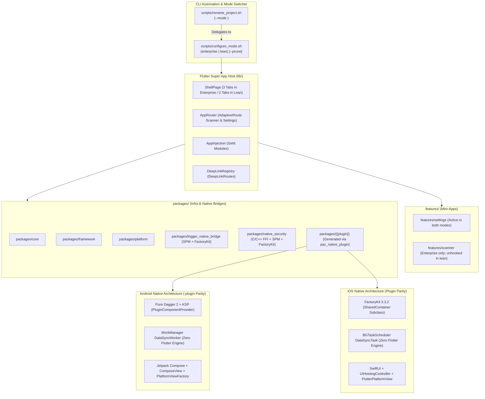
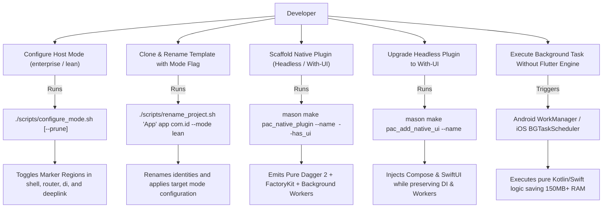
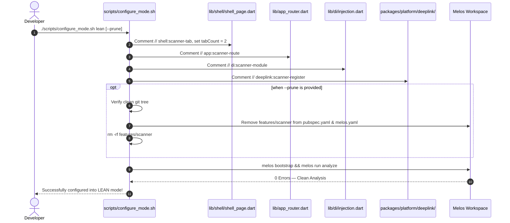

# Epic: Dual-Mode Flutter Super App Template & Native SDKs Upgrade

## Table of Contents
1. [Meta Data](#meta-data)
2. [Background](#background)
3. [Goals & Non-Goals](#goals--non-goals)
4. [Architecture & Technical Design](#architecture--technical-design)
   - [High-Level Architecture](#high-level-architecture)
   - [Use Cases](#use-cases)
   - [Sequence Diagram](#sequence-diagram)
   - [Shift-Left Impact Analysis (Check 1)](#shift-left-impact-analysis-check-1)
   - [Living BDD Scenarios](#living-bdd-scenarios)
5. [Rollout Strategy & Mitigation](#rollout-strategy--mitigation)
6. [Kanban Tasks Breakdown](#kanban-tasks-breakdown)

---

## Meta Data
- **Epic**: `flutter_super_app_template`
- **Status**: Stage 2 — In HLD & Task Breakdown Review (Gate 2)
- **Target Release**: Flutter Super App Template v2.0
- **Platform**: Flutter (Host & Monorepo) + Android Native + iOS Native
- **Source Specs**:
  - [2026-09-15-dual-mode-and-native-sdk-upgrade-design.md](2026-09-15-dual-mode-and-native-sdk-upgrade-design.md) (Primary Source Spec)
  - [2026-09-09-ios-native-plugin-factory-di-spm-design.md](2026-09-09-ios-native-plugin-factory-di-spm-design.md) (Phase 5 iOS DI Spec)
  - [2026-09-06-flutter-super-app-template-design.md](2026-09-06-flutter-super-app-template-design.md) (Foundational Spec)
- **Reference Native Repositories & Devbeds**:
  - Android Native Template: `/Users/danhdueexoictif/AllProjects/digital_wallet/android_digital_wallet`
  - iOS Native Template: `/Users/danhdueexoictif/AllProjects/digital_wallet/ios_digital_wallet`

---

## Background
The `bloc_digital_wallet` repository is a Flutter monorepo managed with Melos, employing Clean Architecture + MVI. In earlier milestones, the repository was reorganized into `packages/` (infrastructure, utilities, native plugins) and `features/` (mini-apps: `settings`, `scanner`).

Recently, the companion native repositories (`android_digital_wallet` and `ios_digital_wallet`) completed their **Tri-Mode Architecture** (`enterprise`, `lean`, `plugin` devbed):
1. **Android**: Implemented a standalone devbed `:plugin` with **Pure Dagger 2** (zero Hilt) and **WorkManager `DataSyncWorker`** for **zero Flutter Engine background execution** (saving 150MB+ RAM and preventing OS kills).
2. **iOS**: Implemented a standalone devbed `Plugin` with **FactoryKit 3.3.2** (`SharedContainer`) and **`BGTaskScheduler`** for **zero Flutter Engine background execution**.

To achieve complete **Tri-Platform Parity** across the entire digital wallet ecosystem:
1. **Dual-Mode for Flutter Host (`enterprise` & `lean`)**: Equip the Flutter Super App Template with a dual-mode mechanism (`scripts/configure_mode.sh <enterprise|lean> [--prune]`) allowing teams to use the template as either a fully governed Enterprise Super App (3 tabs, multi-mini-app) or a blazing-fast Standalone App / MVP (2 tabs, scanner stub unhooked or pruned).
2. **Native SDKs & Mason Bricks Upgrade**: Update `pac_native_plugin` and `pac_add_native_ui` to emit Android Kotlin code using Kotlin 2.1.0, Compose Compiler Plugin, Pure Dagger 2 with KSP, and WorkManager; and iOS Swift code using Flutter SPM, FactoryKit 3.3.2, and BGTaskScheduler.
3. **Template Renaming Automation**: Update `scripts/rename_project.sh` to accept `--mode <enterprise|lean>`, seamlessly configuring the new project upon creation.

---

## Goals & Non-Goals

### Goals
- **Dual-Mode Host Support**: Ship `scripts/configure_mode.sh <enterprise|lean> [--prune]` to toggle between Enterprise Super App (3 tabs) and Lean Standalone App (2 tabs).
- **Template Renaming Integration**: Add `--mode <enterprise|lean>` to `scripts/rename_project.sh` (defaulting to `enterprise`).
- **Android Native Plugin Parity (Pure Dagger 2 + WorkManager)**: Upgrade `pac_native_plugin` and `pac_add_native_ui` to generate Kotlin 2.1.0, AGP 8.13+, KSP, Pure Dagger 2 (`PluginComponentProvider`), and WorkManager `CoroutineWorker` running background tasks with **Zero Flutter Engine**.
- **iOS Native Plugin Parity (FactoryKit 3.3.2 + BGTaskScheduler)**: Upgrade `pac_native_plugin` and `pac_add_native_ui` to generate SwiftPM `Package.swift`, FactoryKit 3.3.2 (`SharedContainer`), and `BGTaskScheduler` running background tasks with **Zero Flutter Engine**.
- **One-Click Native UI Upgrade**: Ensure `pac_add_native_ui` upgrades headless plugins to UI-enabled without destroying existing Domain, Data, DI, or Background Worker logic.
- **Synchronize Shipped Plugins**: Upgrade `packages/logger_native_bridge` and `packages/native_security` to align with the updated toolchains.
- **Mode-Aware Test Suite**: Update host test suites (Shell tests, Router tests) to pass cleanly in both `enterprise` and `lean` modes.

### Non-Goals
- Generating or extracting standalone Android/iOS native applications from the Flutter codebase (handled by the two independent native repositories).
- Replacing `auto_route` or `get_it` in the Flutter host.
- Removing CocoaPods entirely from the iOS host (deferred to a separate Phase 2 spec).
- Changing business logic inside `features/settings`.

---

## Architecture & Technical Design

### High-Level Architecture

### Use Cases

### Sequence Diagram

---

### Shift-Left Impact Analysis (Check 1)
Diagnostic analysis executed via `check_code_impact.py`:
- **Upstream Git Status**: 🟢 Clean (Zero unmerged commits against `origin/develop`).
- **Downstream Blast Radius**: 12 callers identified (`shell_page_deeplink_test.dart`, `injection_test.dart`, `deep_link_flow_test.dart`, `deep_link_navigator.dart`).
- **Unprotected Seams**: `lib/app_router.dart` and `deep_link_registry.dart` require dedicated unit tests to verify mode unhooking and prevent regression.

### Living BDD Scenarios
A complete suite of BDD scenarios is established in [bdd_scenarios.md](bdd_scenarios.md), covering:
1. Mode switching round-trip (`enterprise` $\leftrightarrow$ `lean`) with and without `--prune`.
2. Shell 3-tab vs 2-tab default cold-start navigation.
3. Headless vs UI-enabled plugin scaffolding with Pure Dagger 2 and FactoryKit 3.3.2.
4. Background execution via WorkManager and BGTaskScheduler with zero Flutter Engine.
5. Project renaming with `--mode` flag.

---

## Rollout Strategy & Mitigation

### Phased Migration
1. **Phase 1: Dual-Mode Host & Marker Regions**: Add marker regions across `shell_page.dart`, `app_router.dart`, `injection.dart`, and `deep_link_registry.dart`. Implement `scripts/configure_mode.sh` and integrate `--mode` into `scripts/rename_project.sh`. Update test suites.
2. **Phase 2: Android Native Bricks Upgrade**: Rewrite `pac_native_plugin` Android template with Kotlin DSL `build.gradle.kts`, Kotlin 2.1.0, KSP, Pure Dagger 2 (`PluginComponentProvider`), and WorkManager `DataSyncWorker`. Update `pac_add_native_ui`.
3. **Phase 3: iOS Native Bricks Upgrade**: Update `pac_native_plugin` iOS template with FactoryKit 3.3.2, dedicated `SharedContainer`, and `BGTaskScheduler` (`DataSyncTask.swift`). Ensure `pac_add_native_ui` preserves background tasks.
4. **Phase 4: Plugins & Toolchain Synchronization**: Sync `packages/logger_native_bridge` and `packages/native_security` with Kotlin 2.1, SPM, and FactoryKit 3.3.2.
5. **Phase 5: Verification & Gate 4 Validation**: Test round-trip mode switching, brick scaffolding, UI upgrades, and clone/rename workflows across Android APK and iOS Runner.

### Risks & Mitigations
- **Marker Region Desynchronization**: Regex commenting could corrupt syntax if markers are modified. *Mitigation: Standardize marker comments with strict begin/end tags and validate with `melos run analyze` on every switch.*
- **Dirty Tree Data Loss on `--prune`**: Removing `features/scanner` could destroy uncommitted work. *Mitigation: Guard `--prune` with `git status --porcelain` check; require `--force` to override.*
- **Kotlin 2.x Compose Compatibility**: Version mismatch between Kotlin and Compose compiler plugin. *Mitigation: Pin to Kotlin 2.1.0 and use standard Compose compiler Gradle plugin (`org.jetbrains.kotlin.plugin.compose`).*
- **iOS Background Registration Window**: `BGTaskScheduler.register` failing if invoked too late. *Mitigation: Call `register()` strictly inside `Plugin.register(with:)`.*

---

## Kanban Tasks Breakdown

| Task ID | Task Title | Scope & Target Files |
|---|---|---|
| [Task 1](task_1_dual_mode_host_and_markers.md) | Dual-Mode Host Seams & Marker Regions | Implement marker regions in `shell_page.dart`, `app_router.dart`, `injection.dart`, and `deep_link_registry.dart`. Create unit tests for mode seams. |
| [Task 2](task_2_configure_mode_script.md) | Mode Configuration CLI (`configure_mode.sh`) | Implement `scripts/configure_mode.sh <enterprise\|lean> [--prune]` with clean-tree guard, round-trip tests, and Melos sync. |
| [Task 3](task_3_rename_project_mode_flag.md) | Project Renamer `--mode` Flag Integration | Update `scripts/rename_project.sh` to accept `--mode <enterprise\|lean>` and delegate to `configure_mode.sh`. |
| [Task 4](task_4_pac_native_plugin_android_dagger_workmanager.md) | Brick `pac_native_plugin` — Android Pure Dagger 2 & WorkManager | Update Android template to Kotlin DSL, KSP, Pure Dagger 2 (`PluginComponentProvider`), WorkManager `DataSyncWorker` (Zero Flutter Engine), and Compose. |
| [Task 5](task_5_pac_native_plugin_ios_bgtask.md) | Brick `pac_native_plugin` — iOS BGTaskScheduler | Update iOS template to integrate `BGTaskScheduler` (`DataSyncTask.swift`) with FactoryKit 3.3.2 and zero Flutter Engine execution. |
| [Task 6](task_6_pac_add_native_ui_sync.md) | Brick `pac_add_native_ui` Synchronization | Ensure `pac_add_native_ui` generates Jetpack Compose and SwiftUI while strictly preserving Dagger 2, FactoryKit, and background workers. |
| [Task 7](task_7_sync_shipped_native_plugins.md) | Synchronize Shipped Native Plugins | Align `packages/logger_native_bridge` and `packages/native_security` with Kotlin 2.1, SPM, and FactoryKit 3.3.2. |
| [Task 8](task_8_end_to_end_verification_and_gate4.md) | End-to-End Verification & Gate 4 Quality Check | Execute comprehensive verification across both modes, brick generation, UI upgrade, project renaming, and APK/Runner builds. |
