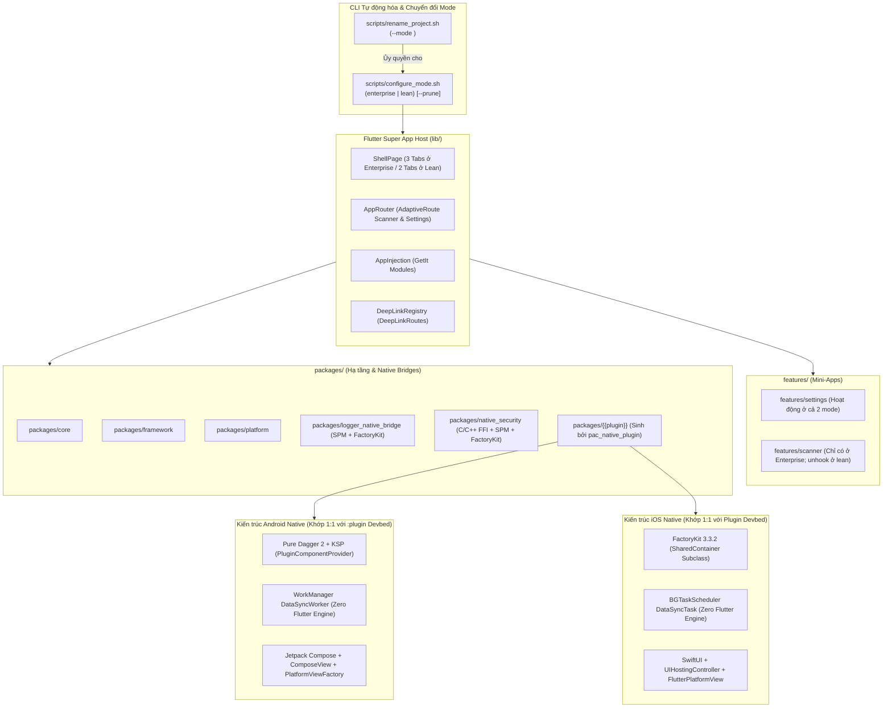
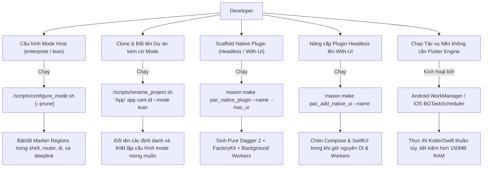
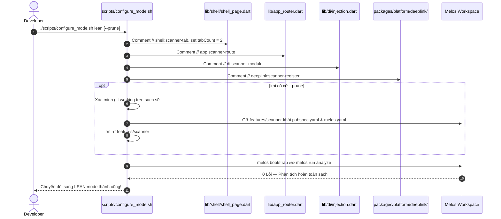

# Epic: Dual-Mode Flutter Super App Template & Nâng cấp Native SDKs

## Mục lục
1. [Meta Data](#meta-data)
2. [Bối cảnh](#bối-cảnh)
3. [Mục tiêu & Ngoài phạm vi](#mục-tiêu--ngoài-phạm-vi)
4. [Kiến trúc & Thiết kế Kỹ thuật](#kiến-trúc--thiết-kế-kỹ-thuật)
   - [Kiến trúc Tổng quan](#kiến-trúc-tổng-quan)
   - [Use Cases](#use-cases)
   - [Sequence Diagram](#sequence-diagram)
   - [Phân tích Tác động Shift-Left (Check 1)](#phân-tích-tác-động-shift-left-check-1)
   - [Tài liệu Kịch bản Sống BDD](#tài-liệu-kịch-bản-sống-bdd)
5. [Chiến lược Triển khai & Giảm thiểu Rủi ro](#chiến-lược-triển-khai--giảm-thiểu-rủi-ro)
6. [Phân rã Công việc Kanban (Tasks)](#phân-rã-công-việc-kanban-tasks)

---

## Meta Data
- **Epic**: `flutter_super_app_template`
- **Trạng thái**: Stage 2 — Đang duyệt HLD & Phân rã Task (Gate 2)
- **Target Release**: Flutter Super App Template v2.0
- **Nền tảng**: Flutter (Host & Monorepo) + Android Native + iOS Native
- **Tài liệu Đặc tả Nguồn (Source Specs)**:
  - [2026-09-15-dual-mode-and-native-sdk-upgrade-design.md](2026-09-15-dual-mode-and-native-sdk-upgrade-design.md) (Đặc tả Nguồn Chính)
  - [2026-09-09-ios-native-plugin-factory-di-spm-design.md](2026-09-09-ios-native-plugin-factory-di-spm-design.md) (Đặc tả Giai đoạn 5 iOS DI)
  - [2026-09-06-flutter-super-app-template-design.md](2026-09-06-flutter-super-app-template-design.md) (Đặc tả Nền tảng Ban đầu)
- **Repositories & Devbeds Native Tham chiếu**:
  - Android Native Template: `/Users/danhdueexoictif/AllProjects/digital_wallet/android_digital_wallet`
  - iOS Native Template: `/Users/danhdueexoictif/AllProjects/digital_wallet/ios_digital_wallet`

---

## Bối cảnh
Dự án `bloc_digital_wallet` là một Flutter monorepo được quản trị bằng Melos, áp dụng Clean Architecture + MVI. Trong các giai đoạn trước, monorepo đã được phân tách thành `packages/` (hạ tầng, tiện ích, native plugins) và `features/` (mini-apps: `settings`, `scanner`).

Gần đây, hai dự án native đi kèm (`android_digital_wallet` và `ios_digital_wallet`) đã hoàn thiện xuất sắc **Kiến trúc 3 Chế độ (Tri-Mode Architecture)** gồm `enterprise`, `lean`, và `plugin` devbed:
1. **Android**: Xây dựng môi trường devbed `:plugin` với **Pure Dagger 2** (loại bỏ hoàn toàn Hilt) và **WorkManager `DataSyncWorker`** cho phép chạy tác vụ nền với **Zero Flutter Engine overhead** (tiết kiệm hơn 150MB RAM và triệt tiêu nguy cơ bị hệ điều hành tắt ứng dụng).
2. **iOS**: Xây dựng môi trường devbed `Plugin` với **FactoryKit 3.3.2** (`SharedContainer`) và **`BGTaskScheduler`** cho phép chạy tác vụ nền với **Zero Flutter Engine overhead**.

Nhằm đạt được sự đồng nhất 100% (**Tri-Platform Parity**) trên toàn bộ hệ sinh thái ví điện tử:
1. **Dual-Mode cho Flutter Host (`enterprise` & `lean`)**: Bổ sung cơ chế 2 chế độ thông qua lệnh `./scripts/configure_mode.sh <enterprise|lean> [--prune]`, cho phép lựa chọn sử dụng template làm Enterprise Super App đầy đủ (3 tabs) hoặc Ứng dụng độc lập / MVP siêu tốc (2 tabs, unhook hoặc dọn sạch scanner stub).
2. **Nâng cấp Native SDKs & Mason Bricks**: Cập nhật `pac_native_plugin` và `pac_add_native_ui` để sinh mã Android Kotlin sử dụng Kotlin 2.1.0, Compose Compiler Plugin, Pure Dagger 2 với KSP, và WorkManager; mã iOS Swift sử dụng Flutter SPM, FactoryKit 3.3.2, và BGTaskScheduler.
3. **Tự động hóa Đổi tên Dự án**: Cập nhật `scripts/rename_project.sh` hỗ trợ thêm cờ `--mode <enterprise|lean>`.

---

## Mục tiêu & Ngoài phạm vi

### Mục tiêu
- **Hỗ trợ Dual-Mode Host**: Cung cấp script `scripts/configure_mode.sh <enterprise|lean> [--prune]` chuyển đổi linh hoạt giữa Enterprise Super App (3 tabs) và Lean Standalone App (2 tabs).
- **Tích hợp Đổi tên Dự án**: Thêm cờ `--mode <enterprise|lean>` vào `scripts/rename_project.sh` (mặc định: `enterprise`).
- **Đồng bộ Android Native Plugin (Pure Dagger 2 + WorkManager)**: Nâng cấp `pac_native_plugin` và `pac_add_native_ui` để sinh mã Kotlin 2.1.0, AGP 8.13+, KSP, Pure Dagger 2 (`PluginComponentProvider`), và WorkManager `CoroutineWorker` chạy nền với **Zero Flutter Engine**.
- **Đồng bộ iOS Native Plugin (FactoryKit 3.3.2 + BGTaskScheduler)**: Nâng cấp `pac_native_plugin` và `pac_add_native_ui` để sinh mã SwiftPM `Package.swift`, FactoryKit 3.3.2 (`SharedContainer`), và `BGTaskScheduler` chạy nền với **Zero Flutter Engine**.
- **Nâng cấp Giao diện Một chạm**: Đảm bảo `pac_add_native_ui` nâng cấp plugin headless lên with-ui mà không làm mất mã Domain, Data, DI, hay Background Workers hiện có.
- **Đồng bộ các Plugin đã có**: Cập nhật `packages/logger_native_bridge` và `packages/native_security` tương thích toolchain mới.
- **Bộ Kiểm thử Nhận biết Chế độ (Mode-Aware Test Suite)**: Cập nhật các test suite của host (Shell, Router) để pass xanh trên cả 2 chế độ `enterprise` và `lean`.

### Ngoài phạm vi
- Không sinh hay trích xuất ứng dụng native Android/iOS độc lập từ Flutter (đã do 2 repo native chuyên biệt đảm nhiệm).
- Không thay thế `auto_route` hoặc `get_it` trên host Flutter.
- Không gỡ bỏ hoàn toàn CocoaPods trên host iOS (dành cho spec Phase 2 riêng).
- Không can thiệp nghiệp vụ bên trong `features/settings`.

---

## Kiến trúc & Thiết kế Kỹ thuật

### Kiến trúc Tổng quan

### Use Cases

### Sequence Diagram

---

### Phân tích Tác động Shift-Left (Check 1)
Kết quả phân tích chẩn đoán thực thi qua công cụ `check_code_impact.py`:
- **Trạng thái Upstream Git**: 🟢 Sạch (Không có commit xung đột với `origin/develop`).
- **Bán kính Tác động (Blast Radius)**: Xác định 12 vị trí gọi (`shell_page_deeplink_test.dart`, `injection_test.dart`, `deep_link_flow_test.dart`, `deep_link_navigator.dart`).
- **Vị trí Cần Bảo vệ Kiểm thử**: `lib/app_router.dart` và `deep_link_registry.dart` cần bổ sung unit test chuyên biệt để kiểm thử các điểm unhook của mode.

### Tài liệu Kịch bản Sống BDD
Toàn bộ kịch bản BDD chuẩn mực đã được lưu trữ độc lập tại [bdd_scenarios.md](bdd_scenarios.md), bao gồm:
1. Chuyển đổi mode 2 chiều (`enterprise` $\leftrightarrow$ `lean`) có và không có `--prune`.
2. Khởi động lạnh hiển thị tab mặc định (3 tab vs 2 tab).
3. Sinh plugin headless và có UI với Pure Dagger 2 và FactoryKit 3.3.2.
4. Chạy tác vụ nền với WorkManager và BGTaskScheduler (Zero Flutter Engine).
5. Đổi tên dự án kèm cấu hình mode.

---

## Chiến lược Triển khai & Giảm thiểu Rủi ro

### Lộ trình 5 Giai đoạn
1. **Giai đoạn 1: Dual-Mode Host & Marker Regions**: Thêm các khối marker regions trong `shell_page.dart`, `app_router.dart`, `injection.dart`, và `deep_link_registry.dart`. Viết script `scripts/configure_mode.sh` và bổ sung `--mode` vào `scripts/rename_project.sh`. Cập nhật bộ test suite.
2. **Giai đoạn 2: Nâng cấp Android Native Bricks**: Cập nhật template Android của `pac_native_plugin` với Kotlin DSL `build.gradle.kts`, Kotlin 2.1.0, KSP, Pure Dagger 2 (`PluginComponentProvider`), và WorkManager `DataSyncWorker`. Cập nhật `pac_add_native_ui`.
3. **Giai đoạn 3: Nâng cấp iOS Native Bricks**: Cập nhật template iOS của `pac_native_plugin` với FactoryKit 3.3.2, dedicated `SharedContainer`, và `BGTaskScheduler` (`DataSyncTask.swift`). Đảm bảo `pac_add_native_ui` bảo toàn tác vụ nền.
4. **Giai đoạn 4: Đồng bộ Plugins & Toolchain**: Cập nhật `packages/logger_native_bridge` và `packages/native_security` tương thích Kotlin 2.1, SPM, và FactoryKit 3.3.2.
5. **Giai đoạn 5: Kiểm thử Tổng thể & Nghiệm thu Gate 4**: Kiểm thử chuyển đổi mode 2 chiều, sinh brick, nâng cấp UI, đổi tên dự án, và build thành công trên cả APK và iOS Runner.

### Rủi ro & Giải pháp Giảm thiểu
- **Lệch cú pháp do Regex Comment Marker**: *Giải pháp: Chuẩn hóa marker comments với thẻ begin/end nghiêm ngặt và luôn chạy `melos run analyze` kiểm tra tự động sau mỗi lần chuyển mode.*
- **Mất dữ liệu khi dùng `--prune` trên git bẩn**: *Giải pháp: Bắt buộc kiểm tra `git status --porcelain`; chỉ cho phép tiếp tục khi working tree sạch hoặc có cờ `--force`.*
- **Lệch phiên bản Kotlin 2.x Compose**: *Giải pháp: Khóa cứng Kotlin 2.1.0 và áp dụng plugin chính thức `org.jetbrains.kotlin.plugin.compose`.*
- **Cửa sổ đăng ký Background trên iOS**: *Giải pháp: Gọi `BGTaskScheduler.register` bắt buộc bên trong `Plugin.register(with:)` trước khi App Delegate trả về.*

---

## Phân rã Công việc Kanban (Tasks)

| Task ID | Tiêu đề Task | Phạm vi & Tệp mục tiêu |
|---|---|---|
| [Task 1](task_1_dual_mode_host_and_markers.md) | Dual-Mode Host Seams & Marker Regions | Thiết lập các khối marker regions trong `shell_page.dart`, `app_router.dart`, `injection.dart`, và `deep_link_registry.dart`. Bổ sung unit tests cho các điểm nối mode. |
| [Task 2](task_2_configure_mode_script.md) | CLI Cấu hình Mode (`configure_mode.sh`) | Hiện thực `scripts/configure_mode.sh <enterprise\|lean> [--prune]` kèm cơ chế bảo vệ cây git sạch, kiểm thử chuyển đổi 2 chiều và Melos sync. |
| [Task 3](task_3_rename_project_mode_flag.md) | Tích hợp Cờ `--mode` vào Script Đổi tên Dự án | Nâng cấp `scripts/rename_project.sh` tiếp nhận cờ `--mode <enterprise\|lean>` và tự động ủy quyền cấu hình cho `configure_mode.sh`. |
| [Task 4](task_4_pac_native_plugin_android_dagger_workmanager.md) | Brick `pac_native_plugin` — Android Pure Dagger 2 & WorkManager | Cập nhật template Android sang Kotlin DSL, KSP, Pure Dagger 2 (`PluginComponentProvider`), WorkManager `DataSyncWorker` (Zero Flutter Engine), và Compose. |
| [Task 5](task_5_pac_native_plugin_ios_bgtask.md) | Brick `pac_native_plugin` — iOS BGTaskScheduler | Cập nhật template iOS tích hợp `BGTaskScheduler` (`DataSyncTask.swift`) với FactoryKit 3.3.2 và thực thi nền zero Flutter Engine. |
| [Task 6](task_6_pac_add_native_ui_sync.md) | Đồng bộ Brick `pac_add_native_ui` | Đảm bảo `pac_add_native_ui` sinh Jetpack Compose và SwiftUI trong khi bảo toàn 100% Dagger 2, FactoryKit, và các background worker. |
| [Task 7](task_7_sync_shipped_native_plugins.md) | Đồng bộ các Native Plugins Sẵn có trong Repo | Cập nhật `packages/logger_native_bridge` và `packages/native_security` tương thích Kotlin 2.1, SPM, và FactoryKit 3.3.2. |
| [Task 8](task_8_end_to_end_verification_and_gate4.md) | Kiểm thử Tích hợp Đầu-Cuối & Nghiệm thu Gate 4 | Thực thi toàn bộ kiểm thử trên cả 2 mode, sinh thử các brick, nâng cấp UI, đổi tên dự án, và build thành công APK và iOS Runner. |
