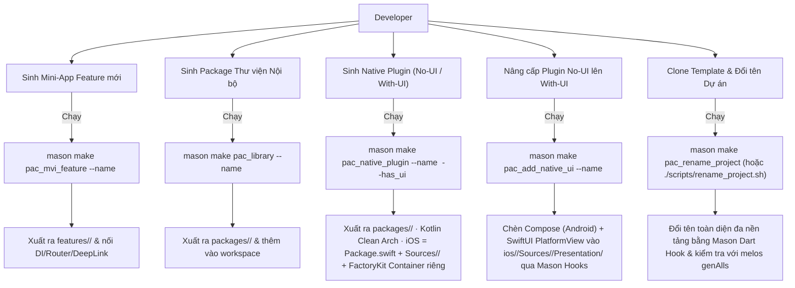
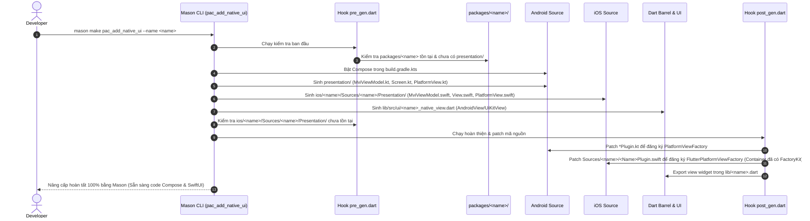

# Epic: Flutter Super App Template & Bộ Mason Bricks Chuẩn Hóa

## Mục lục
1. [Meta Data](#meta-data)
2. [Bối cảnh](#bối-cảnh)
3. [Mục tiêu & Ngoài phạm vi](#mục-tiêu--ngoài-phạm-vi)
4. [Kiến trúc & Thiết kế kỹ thuật](#kiến-trúc--thiết-kế-kỹ-thuật)
   - [Kiến trúc tổng thể](#kiến-trúc-tổng-thể)
   - [Use Cases](#use-cases)
   - [Sequence Diagram (Luồng nâng cấp UI)](#sequence-diagram-luồng-nâng-cấp-ui)
5. [Chiến lược Rollout & Giảm thiểu rủi ro](#chiến-lược-rollout--giảm-thiểu-rủi-ro)
6. [Phân rã Kanban Tasks](#phân-rã-kanban-tasks)

---

## Meta Data
- **Epic**: `flutter_super_app_template`
- **Trạng thái**: Giai đoạn 5 hoàn tất (iOS DI → FactoryKit + Flutter SPM). Hoãn: Giai đoạn 2 — gỡ hoàn toàn CocoaPods khỏi host (spec riêng sau).
- **Target Release**: Flutter Super App Template v1.0
- **Source Spec**: [2026-09-06-flutter-super-app-template-design.md](2026-09-06-flutter-super-app-template-design.md)
- **Spec Giai đoạn 5**: [2026-09-09-ios-native-plugin-factory-di-spm-design.md](2026-09-09-ios-native-plugin-factory-di-spm-design.md)
- **Template Native Tham chiếu**:
  - Android: `/Users/danhdue/AllProjects/digital_wallet/android_digital_wallet/.worktrees/android_super_app_template`
  - iOS: `/Users/danhdue/AllProjects/digital_wallet/iOSDigitalWallet/.worktrees/ios_super_app_template`

---

## Bối cảnh
`bloc_digital_wallet` là monorepo Flutter quản lý bằng Melos, tuân thủ Clean Architecture + MVI. Trước đây, toàn bộ các package (hạ tầng dùng chung, tiện ích, native bridges, và các mini-app nghiệp vụ) bị đặt chung trong một thư mục phẳng `packages/`. Thêm vào đó, các bản thảo thiết kế trước đây dự định trích xuất cả một dự án Standalone Native Android ngay từ bên trong repo Flutter.

Hiện tại, vì đã có sẵn 2 template native độc lập hoàn chỉnh ([`android_super_app_template`](file:///Users/danhdue/AllProjects/digital_wallet/android_digital_wallet/.worktrees/android_super_app_template) và [`ios_super_app_template`](file:///Users/danhdue/AllProjects/digital_wallet/iOSDigitalWallet/.worktrees/ios_super_app_template)), định hướng được điều chỉnh chuẩn xác:
1. Tái cấu trúc `bloc_digital_wallet` thành **Flutter Super App Template** chuẩn mực bằng cách phân tách rõ `packages/` (hạ tầng, tiện ích, native plugins) và `features/` (mini-apps), đạt sự đồng nhất 100% (Tri-Platform Parity) với cả Android và iOS.
2. Xây dựng bộ Mason Bricks tinh gọn để sinh features, thư viện, và packages tích hợp native (hỗ trợ cả No-UI với Pigeon và With-UI với Jetpack Compose/SwiftUI + MviViewModel qua PlatformView).
3. Bổ sung cơ chế nâng cấp một chạm (`pac_add_native_ui` / `scripts/add_native_ui.sh`) chuyển đổi package từ No-UI sang With-UI mà không ảnh hưởng mã nguồn cũ.
4. Loại bỏ triệt để các script và brick cũ nhằm sinh standalone native app từ Flutter.

---

## Mục tiêu & Ngoài phạm vi

### Mục tiêu
- **Đồng nhất cấu trúc 3 nền tảng (Tri-Platform Parity):** Phân tách cấu trúc thư mục thành `packages/` (hạ tầng) và `features/` (mini-apps), khớp chuẩn với `android_super_app_template` và `ios_super_app_template`.
- **Cắt gọn danh mục package trong Template:** Giữ 8 package hạ tầng trong `packages/` (`core`, `framework`, `network`, `ui_kit`, `platform`, `logger`, `logger_native_bridge`, `native_security`), 1 feature mẫu thực tế (`features/settings`), và 1 feature khung rỗng (`features/scanner`). Loại bỏ hoàn toàn các package domain ví (`wallet`, `transaction`, `trends`, `authentication`, `onboard`).
- **Tái cấu trúc Shell Host:** Shell 3 tab (`Home` stub page, `Scanner`, `Settings`), mở app vào thẳng Settings, bỏ splash tùy biến.
- **Hệ thống Mason Bricks:**
  - `pac_mvi_feature`: Sinh feature package thuần Dart trong `features/{{name}}/`, tự động đăng ký DI, AutoRoute, và `DeepLinkRoutes` (neo: `settings`).
  - `pac_library`: Sinh package tiện ích/hạ tầng nội bộ trong `packages/{{name}}/`.
  - `pac_native_plugin`: Sinh Flutter plugin trong `packages/{{name}}/` với Clean Architecture Android (Kotlin) & iOS (Swift) (`Platform/Domain/Data/Presentation`). Hỗ trợ Pigeon cho `has_ui: false` và Jetpack Compose/SwiftUI + self-contained `MviViewModel` qua PlatformView cho `has_ui: true`.
  - `pac_add_native_ui` & `scripts/add_native_ui.sh`: Nâng cấp một chạm từ headless sang có UI native an toàn.
- **Công cụ Đổi tên dự án:** `scripts/rename_project.sh` đổi tên package, app, bundle ID, imports; giữ cố định namespace vendor `com.danhdue.*` của plugin native.
- **CI Boundary Gate:** Cập nhật `scripts/check_module_boundaries.sh` kiểm tra phân định ranh giới giữa `features/*` và `packages/*`.
- **Chuẩn hóa DI phía iOS (Giai đoạn 5):** Mọi package iOS-native — 2 plugin đang ship (`logger_native_bridge`, `native_security`) và mọi thứ `pac_native_plugin` sinh ra — dùng **FactoryKit 3.x** với **một `SharedContainer` subclass riêng cho mỗi plugin** (`register(with:)` là composition root), phân phối qua **Flutter Swift Package Manager** (`Package.swift`, không `.podspec`). Host bật SPM và chạy hybrid với CocoaPods.

### Ngoài phạm vi
- Tự tạo hoặc trích xuất ứng dụng native Android/iOS độc lập từ repo Flutter (đã do 2 template native độc lập đảm nhiệm).
- Xây dựng cơ chế tải mã động runtime (Flutter biên dịch thành 1 binary duy nhất).
- Thay thế `auto_route` hoặc `get_it`.
- **Gỡ hoàn toàn CocoaPods khỏi host iOS** — hoãn sang spec Giai đoạn 2 riêng; Giai đoạn 5 giữ hybrid (pod bên thứ 3 chưa có SPM vẫn resolve qua CocoaPods).
- **Thay đổi phía Dart của plugin hoặc DI Android** — Giai đoạn 5 chỉ đụng Swift phía iOS.

---

## Kiến trúc & Thiết kế Kỹ thuật

### Kiến trúc Tổng thể
```mermaid
graph TD
    subgraph HostApp ["Flutter Super App Host (lib/)"]
        ShellPage["ShellPage (3 Tabs: Home, Scanner, Settings)"]
        AppRouter["AppRouter (AutoRoute)"]
        DI["AppInjection (GetIt)"]
    end

    subgraph Features ["features/ (Mini-Apps / Features)"]
        Settings["features/settings (Sample Thực tế)"]
        Scanner["features/scanner (Sample Khung rỗng)"]
        NewFeature["features/{{name}} (sinh bởi pac_mvi_feature)"]
    end

    subgraph PlatformPkg ["packages/platform (Quản trị)"]
        DeepLink["DeepLinkRoutes (Định tuyến phi phụ thuộc)"]
        EventBus["AppEventBus (Giao tiếp phi phụ thuộc)"]
    end

    subgraph InfraPkgs ["packages/ (Hạ tầng Dùng chung)"]
        Core["packages/core"]
        Framework["packages/framework (MviBloc)"]
        Network["packages/network (Dio/Retrofit)"]
        UIKit["packages/ui_kit (Design System)"]
        Logger["packages/logger"]
    end

    subgraph NativePlugins ["packages/ (Native Bridges & Plugins) — Flutter SPM + FactoryKit DI"]
        NativeSec["packages/native_security (FFI + NativeSecurityContainer)"]
        NativeLog["packages/logger_native_bridge (Pigeon + LoggerNativeBridgeContainer)"]
        NewPlugin["packages/{{plugin}} (sinh bởi pac_native_plugin — Package.swift + {{Plugin}}Container)"]
    end

    ShellPage --> Features
    AppRouter --> Features
    DI --> Features
    Features --> PlatformPkg
    Features --> InfraPkgs
    NativePlugins --> Core
    NewPlugin -.->|PlatformView (UI) hoặc Pigeon (No-UI)| HostApp
    NativePlugins -.->|resolve qua Flutter SwiftPM, hybrid với CocoaPods| HostApp
```

### Use Cases


### Sequence Diagram (Luồng nâng cấp UI)


---

## Chiến lược Rollout & Giảm thiểu Rủi ro

### Các Giai đoạn Thực thi
1. **Giai đoạn 1 (Tái cấu trúc thư mục):** Chuyển `packages/settings` và `packages/scanner` sang `features/`. Cập nhật `melos.yaml`, root `pubspec.yaml`, và relative paths. Chạy kiểm tra `melos bootstrap` và `melos genAlls`.
2. **Giai đoạn 2 (Hệ thống Bricks):** Xây dựng và kiểm thử `pac_mvi_feature`, `pac_library`, `pac_native_plugin`, `pac_add_native_ui`, và `pac_rename_project`.
3. **Giai đoạn 3 (Cắt gọn Template):** Loại bỏ các package domain ví, dựng lại Shell 3 tab, dọn assets, cập nhật script kiểm tra CI.
4. **Giai đoạn 4 (Đổi tên & Nghiệm thu):** Thử nghiệm chạy `mason make pac_rename_project` trên branch cách ly, build kiểm thử thành công trên cả Android và iOS.
5. **Giai đoạn 5 (iOS DI → FactoryKit + Flutter SPM):** Bật Flutter SPM trên host (hybrid với CocoaPods). Một spike (`task_14`) đo rủi ro target hỗn hợp C/C++/Swift của `native_security` dưới release dead-strip trước. Sau đó migrate `logger_native_bridge` và `native_security` từ `.podspec` sang `Package.swift` + FactoryKit `SharedContainer` riêng mỗi plugin, và viết lại phần iOS của `pac_native_plugin` / `pac_add_native_ui` theo layout SPM. `pac_rename_project` học xử lý token `Package.swift`. **Giai đoạn 2 (gỡ hoàn toàn CocoaPods khỏi host) ngoài phạm vi — spec riêng sau.**

### Rủi ro & Biện pháp Xử lý
- **Lỗi đường dẫn tương đối khi chuyển sang `features/`:** Chiều sâu tương đối đến `packages/` đổi thành `../../packages/*`. Biện pháp: Kiểm tra tự động bằng `dart analyze` và `melos run analyze`.
- **Xung đột phiên bản Pigeon:** Pigeon bản mới xung đột analyzer với `theme_tailor`. Biện pháp: Ghim phiên bản Pigeon `26.3.2` tương thích với workspace.
- **Lỗi đăng ký plugin khi đổi tên:** Đổi tên nhầm namespace plugin native có thể làm gãy bridge. Biện pháp: Khóa cứng namespace `com.danhdue.*` trong hook `pac_rename_project`.
- **FFI symbol reachability trên SPM (`native_security`):** Target static-library của SwiftPM để linker loại bỏ archive member C không được tham chiếu, nên `DynamicLibrary.executable()`/`.process()` không tìm thấy symbol FFI. **`task_14` spike (2026-09-09): đã giải quyết — verdict GO.** Fix = anchor `__attribute__((constructor))` trong TU C (cộng các attr `((used))` sẵn có và lời gọi force-reference trong `register(with:)`); đã verify sống qua dead-strip của build `--release` bằng `nm` trên `Release-iphoneos/Runner.app/Runner`. Không cần fallback (giữ `native_security` trên `.podspec`, gộp Giai đoạn 2).
- **Factory 3.x chỉ còn SPM:** Không có CocoaPods spec, nên plugin sinh ra là SPM-only, không dùng được ở host chưa bật SPM. Biện pháp: host template đã bật SPM; ghi rõ trong README của brick.

---

## Phân rã Kanban Tasks

| Task ID | Tiêu đề Task | Phạm vi & Tệp tác động |
|---|---|---|
| [Task 1](task_1_monorepo_restructuring.md) | Tái cấu trúc Thư mục Monorepo (Tri-Platform Parity) | Phân tách `packages/` và `features/`, chuyển `settings` & `scanner`, cập nhật `melos.yaml` và workspace root. |
| [Task 2](task_2_pac_mvi_feature_brick.md) | Cập nhật Brick `pac_mvi_feature` | Đích đến `features/{{name}}`, chuyển anchor sang `settings`, cập nhật hooks và bricks con. |
| [Task 3](task_3_pac_library_brick.md) | Tạo mới Brick `pac_library` | Đích đến `packages/{{name}}`, sinh thư viện thuần Dart/Flutter và đăng ký workspace. |
| [Task 4](task_4_pac_native_plugin_brick.md) | Tạo mới Brick `pac_native_plugin` | Clean Arch Android (Kotlin) & iOS (Swift); Pigeon cho No-UI, Compose/SwiftUI + MviViewModel cho With-UI. |
| [Task 5](task_5_pac_add_native_ui_tool.md) | Tạo mới Brick `pac_add_native_ui` | Brick nâng cấp 1 chạm từ No-UI lên With-UI qua Mason hooks (pre_gen/post_gen), tự động patch Gradle, Kotlin, Swift, Dart. |
| [Task 6](task_6_template_trimming_and_shell.md) | Cắt gọn Template & Dựng lại Shell Host | Xóa 5 package domain ví, dựng Shell 3 tab (Home stub, Scanner, Settings), dọn assets, cập nhật CI gate. |
| [Task 7](task_7_obsolete_cleanups.md) | Dọn dẹp Bricks Lỗi thời & Script Cũ | Xóa `sample`, `test_brick`, `native_feature_module`, và các script trích xuất standalone cũ. |
| [Task 8](task_8_rename_project_brick_and_validation.md) | Brick `pac_rename_project` & Nghiệm thu Toàn diện | Xây dựng brick `pac_rename_project` (Dart hook cross-platform) + wrapper script, test clone/rename, chạy `melos genAlls`, build APK & iOS Runner. |

### Giai đoạn 5 — iOS DI → FactoryKit + Flutter SPM ([spec](2026-09-09-ios-native-plugin-factory-di-spm-design.md))

| Task ID | Tiêu đề Task | Phạm vi & Tệp tác động |
|---|---|---|
| [Task 13](task_13_enable_flutter_spm_host.md) | Bật Flutter SPM trên host (hybrid) | `flutter config --enable-swift-package-manager`, commit lần migrate `ios/Runner.xcodeproj` một lần, cập nhật docs CI/setup, verify build với pod cũ vẫn resolve. |
| [Task 14](task_14_spike_native_security_spm_ffi.md) | Spike — `native_security` hỗn hợp C/C++/Swift dạng Flutter SPM ffiPlugin | Spike bỏ đi: `Package.swift` hỗn hợp build ở **release** (dead-strip bật) và `getSslPin1()` resolve từ Dart trên máy thật. Output = go/no-go + hướng làm hoặc fallback podspec. |
| [Task 15](task_15_migrate_logger_native_bridge_spm_factorykit.md) | Migrate `logger_native_bridge` → SPM + FactoryKit | `.podspec` → `ios/logger_native_bridge/Package.swift`, source → `Sources/`, `LoggerNativeBridgeContainer: SharedContainer`, chuyển Pigeon `swiftOut`, port test Swift sang container override. |
| [Task 16](task_16_migrate_native_security_spm_factorykit.md) | Migrate `native_security` → SPM + FactoryKit | `.podspec` → `Package.swift` (target C/C++ + target Swift + module map), `NativeSecurityContainer`, FFI symbol reachability, `logger_native_bridge` qua `.package(path:)`, test + smoke secure-storage. Blocked by 14, 15. |
| [Task 17](task_17_rewrite_pac_native_plugin_ios_spm.md) | Viết lại brick `pac_native_plugin` — phía iOS | Layout SPM mới trong `__brick__` (`ios/{{name}}/Package.swift` + `Sources/{{name}}/…`), `{{Name}}Container.swift`, consumer `@Injected`, `register(with:)` composition root, cả 2 mode `has_ui`, bỏ template podspec, viết lại `post_gen.dart`, README brick + `.gitignore`. Blocked by 13. |
| [Task 18](task_18_update_pac_add_native_ui_ios_spm.md) | Cập nhật brick `pac_add_native_ui` cho layout SPM | `pre_gen` check path → `ios/{{name}}/Sources/{{name}}/Presentation/`, `__brick__` sinh `Presentation/` dưới `Sources/`, `post_gen` patch `*Plugin.swift` layout SPM, export barrel. Blocked by 17. |
| [Task 19](task_19_pac_rename_project_package_swift.md) | `pac_rename_project` — xử lý token `Package.swift` | Rewrite token `name` / library-product cho mọi SPM plugin (sinh ra + 2 plugin đã migrate), giữ `com.danhdue.*`, verify rename trên clone + build iOS. Blocked by 15, 16, 17. |
| [Task 20](task_20_phase5_docs_sync.md) | Đồng bộ tài liệu — spec §4.3/§4.4/§8 + HLD + design doc | Phản ánh SPM + FactoryKit container riêng mỗi plugin trong `2026-09-06-…-design.md`, làm mới diagram/Kanban HLD epic, ghi nhận Giai đoạn 5 xong / Giai đoạn 2 hoãn. Sau 15–19. |


