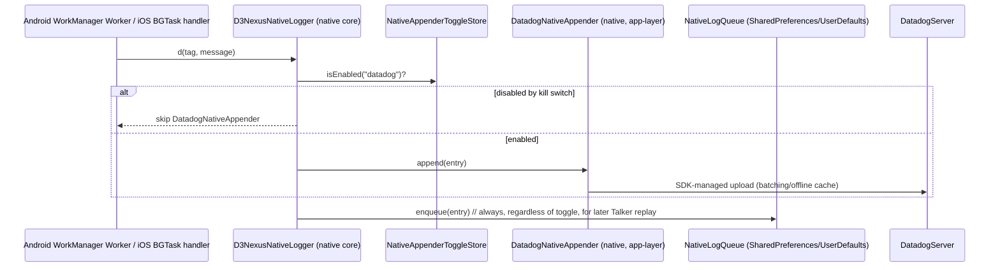
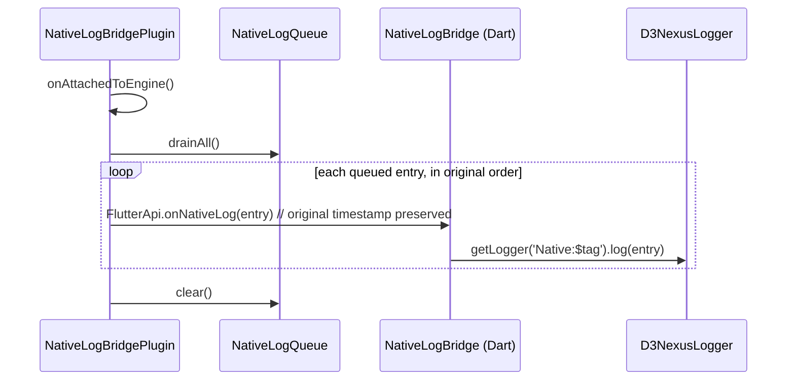

# Logger Native Bridge — Headless Logging Design Spec

## Status
Approved — ready for writing-plans / supersedes the current scope of [task_7_native_bridge.md](../../features/task_7_native_bridge.md).

## Background
[task_7_native_bridge.md](../../features/task_7_native_bridge.md), part of the `logging-refactor` epic ([logging_refactor.en.md](logging_refactor.en.md)), scoped `packages/logger_native_bridge` as a single Pigeon `@FlutterApi()` channel: native code calls into a running Dart isolate, which forwards the message into `D3NexusLogger`. That design implicitly assumes a Flutter engine is always attached when native code wants to log.

Three requirements surfaced that this assumption doesn't hold for:

1. Telemetry backends (Datadog, OpenTelemetry) must receive logs in realtime even when the native side runs fully headless — Android `WorkManager`/foreground `Service`/`BroadcastReceiver`, or iOS `BGTaskScheduler`/background fetch/a Notification Service Extension — with **no `FlutterEngine` instance at all**. A Pigeon `FlutterApi` call has nothing to call into in that case; the message is simply lost.
2. Those same headless logs still need to reach the in-app debug console (TalkerScreen) for developers, even though they can't be delivered live.
3. Integration into the app and into `D3NexusLogger` must stay as easy as the rest of the epic's appender model (register-and-go, no bespoke wiring per module).

Investigation of the current codebase found two facts that shape this design:
- The task's own reference integration point, `packages/native_security`'s `NativeSecurityPlugin.swift`, is actually a `dart:ffi` plugin (Dart calls synchronously into native, not the reverse) with **no Android Kotlin source at all** — there is no existing "native pushes to Dart" plumbing anywhere in this repo to model the bridge on.
- `packages/settings` already persists app preferences via `shared_preferences` (`^2.5.5`), which is backed by Android `SharedPreferences` / iOS `UserDefaults` — a file that exists on disk independent of any Flutter engine or Dart isolate being alive.

This spec replaces task_7's original single-channel design with a headless-first architecture. `packages/logger` / `packages/d3nexus_logger` (Task 1, not yet built — both are currently empty package scaffolds) are referred to below as "the core logger package"; the choice between those two names is out of scope here and owned by Task 1.

## Goals
- Native code can push a log to a telemetry backend (Datadog first) with **zero dependency on the Flutter engine or Dart isolate being alive** — the headless case.
- Headless logs are still visible on TalkerScreen, via best-effort replay the next time the app's Flutter engine starts.
- `setAppenderEnabled(id, false)` (the epic's kill switch) is honored by the headless path too — disabling a backend from Settings UI must stop headless native pushes to it as well, not just in-app Dart pushes.
- A pluggable native appender abstraction, mirroring `ILogAppender` on the Dart side, so a second native backend (e.g. an OTel native exporter) can be added later without touching `logger_native_bridge`'s core.
- Concrete backend SDKs stay out of `packages/logger_native_bridge` itself — same "core has zero concrete-SDK dependency" rule the epic already applies to `packages/logger`.

## Non-Goals
- Publishing `logger_native_bridge`'s native code as a separate non-pub package/pipeline (evaluated and rejected — see Alternatives Considered).
- Integrating an OpenTelemetry native mobile SDK in this task. Datadog's native Android/iOS SDKs are integrated first; the appender abstraction is what makes adding OTel later a non-breaking addition.
- Guaranteed-delivery or acknowledged replay into Talker. Replay is best-effort, at-most-once, for developer visibility only — the durable delivery guarantee for headless logs is whatever the native Datadog SDK itself provides (offline caching, retry), not this replay mechanism.
- Deciding the core logger package's final name (`packages/logger` vs `packages/d3nexus_logger`) — owned by Task 1.

## Architecture

```
packages/logger_native_bridge/
├── pigeon/schema.dart                        # @FlutterApi() (required) + @HostApi() (optional, dev/test only)
├── lib/
│   ├── logger_native_bridge.dart             # exports NativeLogBridge
│   └── src/native_log_bridge.dart            # Dart-side: implements FlutterApi, forwards into
│                                              # D3NexusLogger.getLogger('Native:$tag')
├── android/src/main/kotlin/.../
│   ├── D3NexusNativeLogger.kt                # static facade — NO Flutter/Pigeon import
│   ├── NativeLogAppender.kt                  # interface, mirrors ILogAppender
│   ├── NativeLogQueue.kt                     # bounded ring buffer, backed by SharedPreferences
│   ├── NativeAppenderToggleStore.kt          # reads the toggle keys packages/settings writes
│   └── NativeLogBridgePlugin.kt              # the ONLY class that knows about FlutterPlugin/Pigeon
└── ios/Classes/
    ├── D3NexusNativeLogger.swift             # static facade — NO Flutter import
    ├── NativeLogAppender.swift               # protocol
    ├── NativeLogQueue.swift                  # bounded ring buffer, backed by UserDefaults
    ├── NativeAppenderToggleStore.swift
    └── NativeLogBridgePlugin.swift           # the ONLY class that knows about FlutterPlugin/Pigeon
```

Key architectural decision: the package is split into a **native core** (no Flutter imports — callable from any Kotlin/Swift code, engine or no engine) and a **thin Flutter shim** (Pigeon-generated glue, only relevant when an engine is attached). Concrete backends (`DatadogNativeAppender`) live in the **consuming module's own native code** (e.g. `native_security`'s Android/iOS source, or `android/app` / `ios/Runner`), registered via `D3NexusNativeLogger.registerAppender(...)` at native bootstrap (`Application.onCreate` / `AppDelegate.didFinishLaunchingWithOptions`). This is the same "core has zero concrete-SDK dependency, appenders live at the app layer" rule the epic already applies to `packages/logger` — applied symmetrically to the native side.

## Data Flow

### Foreground (engine alive) — unchanged from epic Tasks 1-6
Dart code calling `D3NexusLogger.getLogger('Wallet').d(...)` dispatches only through Dart-side appenders (Talker, Dart-side Datadog/Otel appenders). This bridge is not involved.

### Headless (no engine)

No Dart, no Pigeon, no `FlutterEngine` anywhere in this flow — this is what satisfies the "unrelated to Dart" requirement.

### Replay on next engine attach

Best-effort, at-most-once: if the app is killed mid-replay, the remaining queued entries are simply replayed on the *next* attach instead. This is acceptable because BE delivery already happened in the headless flow above; replay only affects developer-facing visibility.

## Kill-Switch Propagation (no new channel needed)
`packages/settings` already persists `logging.appender_toggles` via `shared_preferences`, which is Android `SharedPreferences` / iOS `UserDefaults` under the hood — a file on disk, independent of any engine. `NativeAppenderToggleStore` reads that same file/suite directly. No Pigeon round-trip is required for the toggle to reach headless code: Dart writes it once via Settings UI, native reads the current value the next time it runs, whenever that is (fully eventual — acceptable for a kill switch, since a call already in flight in a background task cannot be interrupted by a network-based flag anyway).

This requires **one coordination point**: `NativeAppenderToggleStore` and the Dart-side settings persistence must agree on the exact SharedPreferences/UserDefaults key name and value encoding (e.g. whether the toggle map is stored as one JSON-encoded string under `logging.appender_toggles`, or as `flutter.logging.appender_toggles.<id>` boolean keys — `shared_preferences`'s Android/iOS backing implementation prefixes keys with `flutter.`). This key contract must be confirmed against Task 6's actual implementation before `NativeAppenderToggleStore` is finalized.

An optional `@HostApi()` method (`triggerFlush()` or similar) may be added for manual testing/dev convenience (forcing an immediate queue drain without restarting the app), but it is not required for correctness — the automatic `onAttachedToEngine` drain covers the real flow.

## Alternatives Considered

**Two separate packages** (a non-pub native-only library for the headless path, plus a thin Flutter plugin for replay) were considered for maximum isolation, but rejected: this repo has no existing pipeline for publishing/versioning a native-only package (Gradle/CocoaPods registry outside pub), and the current DoD limits this to a single consumer (`native_security`) — a second release pipeline is not justified yet. If a second native-only consumer appears later, this can be revisited.

**Keeping task_7's original single-`FlutterApi` design** was rejected outright since it cannot satisfy the headless requirement at all — there is no Dart isolate to call into in that scenario.

## Testing Strategy (TDD deltas vs. original task_7)
- **RED**: in addition to the original "mocked `FlutterApi` call → forwarded into `D3NexusLogger`" test, add: `NativeLogQueue` enqueue/drain is FIFO and bounded (oldest dropped once full); `NativeAppenderToggleStore` returns the correct boolean for a given key under both "toggle present" and "toggle absent → default enabled" cases; `D3NexusNativeLogger.d()` does not call a disabled appender.
- **GREEN**: implement `NativeLogAppender`/`D3NexusNativeLogger`/`NativeLogQueue`/`NativeAppenderToggleStore` as plain Kotlin/Swift (no Flutter import) first, unit-testable without an engine; then implement the Pigeon schema and `NativeLogBridgePlugin`'s `onAttachedToEngine` drain.
- **REFACTOR**: verify replay does not duplicate entries across two consecutive cold starts (queue must be cleared only after a successful drain); verify queue bound (default: 200 entries or 64KB, whichever first, drop-oldest) doesn't silently grow unbounded if the app is never reopened.

## Updated Definition of Done
- Pigeon-generated code compiles cleanly on both Android (Kotlin) and iOS (Swift).
- A log sent from a headless context (a test `WorkManager`/`BGTask` with no `FlutterEngine` running) still reaches the Datadog native SDK.
- The same headless log appears on `D3NexusLogger`'s Talker appender the next time the app is foregrounded, in original causal order.
- Disabling the Datadog appender via Settings UI stops the headless push on the next headless invocation.
- No module other than `native_security` depends on `logger_native_bridge`.
- No file under `packages/logger_native_bridge/android/**/*.kt` or `ios/Classes/*.swift` other than `NativeLogBridgePlugin.{kt,swift}` imports anything Flutter/Pigeon-related.

## Dependencies & Sequencing
- Still blocked by Task 2 (`ILogger`/`D3NexusLogger` must exist). Recommended after Tasks 1-4.
- New dependency: the exact `shared_preferences` key/encoding Task 6 uses for `logging.appender_toggles` must be confirmed before `NativeAppenderToggleStore` is finalized (see Kill-Switch Propagation above).
- Priority should move from "low" to at least "medium" — this scope is materially larger than the original single-channel task_7 (queue, toggle store, native appender abstraction, app-layer Datadog integration).

## Risks & Rollback
- If the headless Datadog native SDK integration misbehaves (quota burn, crashes in a background task), the existing kill switch (`setAppenderEnabled('datadog', false)`) is the mitigation — no release needed, per the epic's existing rollout strategy.
- If `NativeLogQueue`'s SharedPreferences-backed storage proves too small/slow for the bound chosen, swap the backing store for a small file without changing `NativeLogAppender`/`D3NexusNativeLogger`'s public surface.
- Rollback of this task alone: remove the `logger_native_bridge` dependency from `packages/native_security`'s native build files; no other package depends on it.

## References
- Epic: [logging_refactor.en.md](logging_refactor.en.md)
- Original task scope: [task_7_native_bridge.md](../../features/task_7_native_bridge.md)
- Prior spec: [2026-08-25-logging-module-design.md](2026-08-25-logging-module-design.md)
- [Pigeon Documentation](https://pub.dev/packages/pigeon)
- [Federated Plugins](https://docs.flutter.dev/packages-and-plugins/developing-packages#plugin-federation)
