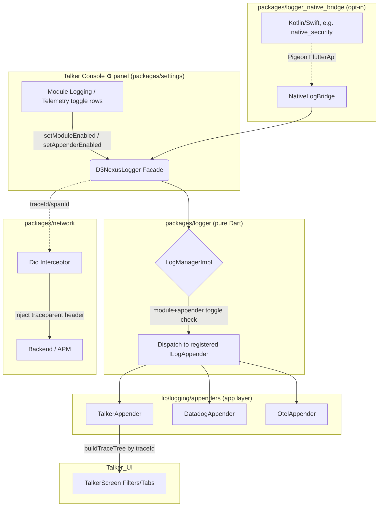
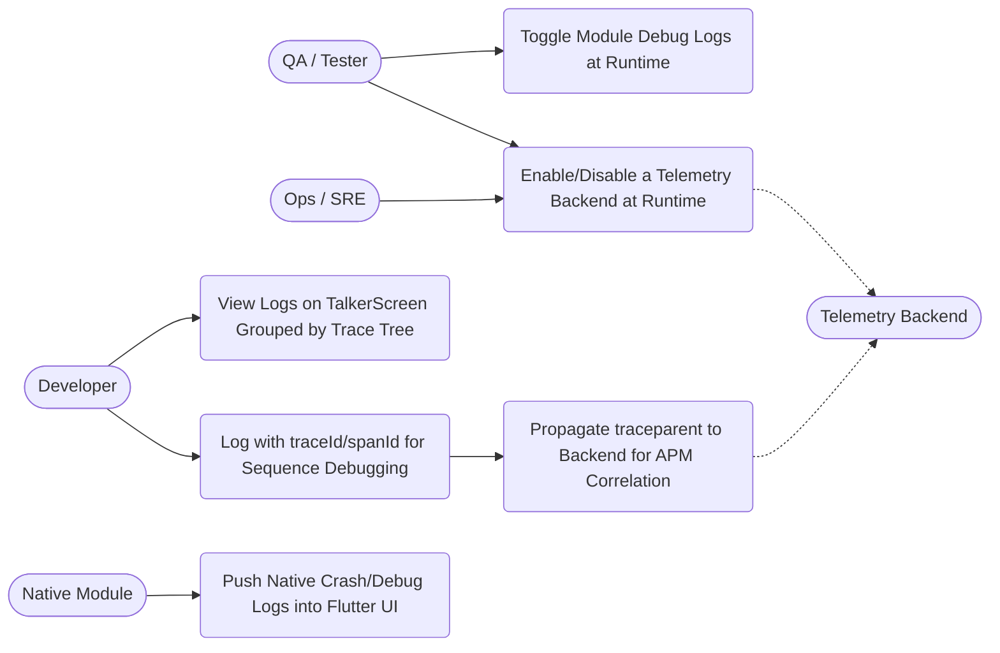
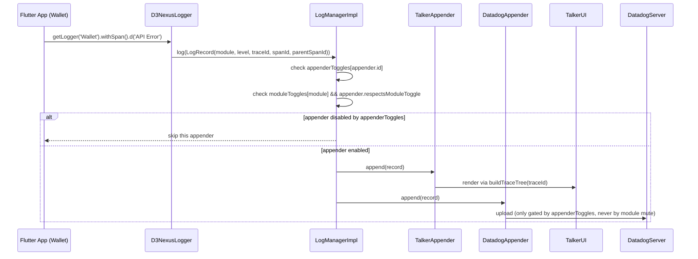
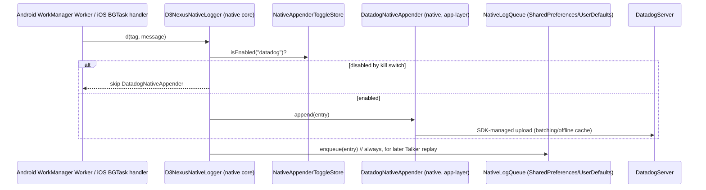
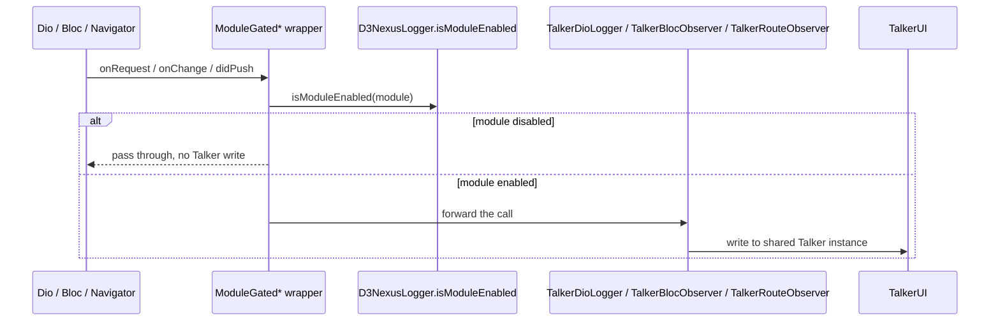

# Epic HLD: D3NexusLogger — Pluggable Logging & Tracing System

## Table of Contents
1. [Meta Data](#1-meta-data)
2. [Background](#2-background)
3. [Goals & Non-Goals](#3-goals--non-goals)
4. [Architecture & Technical Design](#4-architecture--technical-design)
   - [4.1. High-Level Architecture](#41-high-level-architecture)
   - [4.2. Use Cases Diagram](#42-use-cases-diagram)
   - [4.3. Sequence Diagram](#43-sequence-diagram)
   - [4.4. Native Bridge — Headless Logging](#44-native-bridge--headless-logging)
   - [4.5. Live Toggle Application — ModuleGated* Wrapper Pattern](#45-live-toggle-application--modulegated-wrapper-pattern)
5. [Rollout Strategy & Mitigation](#5-rollout-strategy--mitigation)
6. [Kanban Tasks Breakdown](#6-kanban-tasks-breakdown)

---

## 1. Meta Data
- **Epic**: `logging-refactor`
- **Status**: Planning
- **Target Release**: v1.x
- **Source Spec**: [2026-08-25-logging-module-design.md](2026-08-25-logging-module-design.md)
- **Related Spec (Task 7 update)**: [2026-08-26-logger-native-bridge-headless-design.md](2026-08-26-logger-native-bridge-headless-design.md) — headless-first redesign of `packages/logger_native_bridge`, superseding Task 7's original single-channel scope.

---

## 2. Background
The current logging system (`packages/core/lib/utils/log.dart`) is a static `Log` wrapper hard-coupled to `talker_flutter`, with `talker_dio_logger`/`talker_bloc_logger` pulled directly into `packages/network`. This creates four concrete problems:

- **Centralized & Coupled**: Switching or adding a telemetry backend (Datadog, OpenTelemetry) requires touching `packages/core` directly.
- **No Module Isolation**: Every log from every feature (Wallet, Authentication, Network, ...) dumps into a single Talker screen, causing information overload.
- **Lack of Traceability**: Log records carry no correlation beyond a bare message — it is impossible to reconstruct the causal sequence of steps behind one user action or API call.
- **Native Limitations**: Native platform code (e.g. `packages/native_security`'s Swift plugin) has no path to push logs into the Flutter debug console, and there's no way to keep that plumbing out of modules that have no native code at all. This limitation is sharper than it first appears: native code can also run fully **headless** — an Android `WorkManager`/foreground `Service` or an iOS `BGTaskScheduler` task, with no `FlutterEngine` instance at all — a case a Dart-isolate-dependent bridge cannot reach. See [4.4](#44-native-bridge--headless-logging).

This epic supersedes an earlier draft of `logging_refactor` that explored the same problem but coupled the core logic manager directly to `TalkerAppender`/`DataDogAppender`/`OtelAppender` in its architecture diagram — which would have broken the "swap backend without touching core" goal in practice. All content below (overview and tasks) is a full rewrite, not an incremental patch of that draft.

---

## 3. Goals & Non-Goals

### Goals
- A pure-Dart logging core (`packages/logger`) with zero dependency on any concrete telemetry SDK (Talker, Datadog, Otel).
- Per-module enable/disable at runtime, without a rebuild.
- Per-appender (per-backend) enable/disable at runtime, independent of module toggles — so muting a module for local debugging never blinds production telemetry.
- Every toggle applies **live** — the very next log call after a switch, with no app restart — for every logging path in the app, including third-party Talker plugins that sit outside `D3NexusLogger`'s own dispatch (Dio, BLoC, and route-navigation logging). See [4.5](#45-live-toggle-application--modulegated-wrapper-pattern).
- Trace-able causal sequence across log records via `traceId`/`spanId`/`parentSpanId` (W3C Trace Context / OpenTelemetry span model), reconstructable both in the in-app debug UI and by real APM backends.
- A separate, strictly opt-in native bridge package (`packages/logger_native_bridge`) so modules without native platform code never pay for it.
- Native code can push logs to a telemetry backend in realtime even when running fully headless (no Flutter engine attached), and those logs still surface on TalkerScreen via best-effort replay the next time the app is foregrounded — see [4.4](#44-native-bridge--headless-logging).

### Non-Goals (Out of Scope)
- Local file-based log persistence (Datadog SDK's own offline caching covers this).
- Changes to wallet/business logic.
- A full in-app trace timeline visualization screen — `buildTraceTree` is built as a pure, reusable function; a rich visual timeline UI on top of it is out of scope for this epic.
- Publishing `logger_native_bridge`'s native code as a separate non-pub package/pipeline — one pub package holds both the headless-capable native core and the Flutter shim (see [4.4](#44-native-bridge--headless-logging)).
- An OpenTelemetry native mobile SDK integration in the first iteration — Datadog's native SDK ships first; the native appender abstraction is what makes adding OTel later a non-breaking addition.

---

## 4. Architecture & Technical Design

### 4.1. High-Level Architecture
Concrete appenders (Talker/Datadog/Otel) live in the **app layer**, registered into `D3NexusLogger` via DI at bootstrap — never inside `packages/logger` and never as one pub package per appender. `ILogAppender` is the boundary that delivers "swap backend without touching core"; the native bridge is the only piece that gets its own package, because it is the one genuinely opt-in, per-module concern (Pigeon-generated platform code).

### 4.2. Use Cases Diagram

### 4.3. Sequence Diagram

### 4.4. Native Bridge — Headless Logging
`packages/logger_native_bridge` is split into a **native core** (plain Kotlin/Swift, zero Flutter/Pigeon import — callable from any native code, engine or no engine) and a **thin Flutter shim** (Pigeon-generated glue, relevant only when an engine is attached). Concrete native backends (e.g. `DatadogNativeAppender`) live in the consuming module's own native code (`native_security`), registered at native bootstrap — the same "core has zero concrete-SDK dependency, appenders live at the app layer" rule this epic already applies to `packages/logger`, applied symmetrically on the native side.

No Dart, no Pigeon, no `FlutterEngine` anywhere in this flow. The kill switch (`setAppenderEnabled`) reaches this headless path with no new channel: `packages/settings` already persists `logging.appender_toggles` via `shared_preferences`, which is backed by Android `SharedPreferences` / iOS `UserDefaults` — a file on disk independent of any engine. `NativeAppenderToggleStore` reads that same file directly.

Logs queued while headless surface on TalkerScreen the next time the engine attaches, replayed in original order with original timestamps, then cleared — best-effort and at-most-once, since durable BE delivery already happened above; replay only serves developer visibility.

Full rationale, package layout, and testing strategy: [2026-08-26-logger-native-bridge-headless-design.md](2026-08-26-logger-native-bridge-headless-design.md).

### 4.5. Live Toggle Application — ModuleGated* Wrapper Pattern
`LogManagerImpl` was always live by construction: `log()` re-checks `appenderToggles`/`moduleToggles` fresh on every call, so `TalkerAppender`/`DatadogAppender`/`OtelAppender` (Task 4) never needed special treatment. Post-launch verification found three exceptions — third-party Talker plugins that write **directly to the shared `Talker` instance**, entirely bypassing `D3NexusLogger`/`LogManagerImpl`'s dispatch:

- `TalkerDioLogger` (Dio request/response interceptor, wired in `lib/di/app_network_module.dart`)
- `TalkerBlocObserver` (global `Bloc.observer`, wired in `lib/core/app_initializer/bloc_observer_initializer.dart`)
- `TalkerRouteObserver` (`NavigatorObserver`, wired in `lib/main.dart`)

An earlier fix gated `TalkerDioLogger`'s *registration* once at bootstrap from a persisted toggle read — functionally correct but not live: flipping the toggle only took effect on the next app start. The shipped fix instead adds `ILogManager.isModuleEnabled(String module) -> bool` (a live query, mirroring the existing `setModuleEnabled` setter) and a small `ModuleGated*` wrapper family that checks it on every callback, forwarding to a real Talker delegate only when the owning module is currently enabled:

- `ModuleGatedInterceptor extends Interceptor` — module `Network`, wraps `TalkerDioLogger`.
- `ModuleGatedBlocObserver extends BlocObserver` — module `Framework`, wraps `TalkerBlocObserver`.
- `ModuleGatedRouteObserver extends NavigatorObserver` — module `App`, wraps `TalkerRouteObserver`.

Each wrapper is `respectsModuleToggle`-equivalent by construction (the check is unconditional, not appender-configurable), since these three plugins have no `ILogAppender.respectsModuleToggle` flag to read in the first place. `packages/settings/lib/presentation/settings/models/logging_toggle_constants.dart`'s `kKnownLoggingModules` includes `'Framework'` and `'App'` alongside the feature-module names so both are toggleable from the UI described below.

---

## 5. Rollout Strategy & Mitigation

**Phased Rollout Strategy**:
1. **Phase 1**: Build and unit-test `packages/logger` fully in isolation (`LogManagerImpl` dispatch logic, `buildTraceTree`, `LogRecord`).
2. **Phase 2**: Mark the existing `Log` (`packages/core/lib/utils/log.dart`) `@Deprecated` and have it delegate to `D3NexusLogger` internally, so existing call sites keep working unmodified.
3. **Phase 3**: On a dedicated branch, refactor all existing call sites (`Log.d/i/w/e`, ~10 today) to `D3NexusLogger.getLogger(module).d/i/w/e`.
4. **Phase 4**: Remove the old `Log` wrapper and move `talker_flutter`/`talker_dio_logger`/`talker_bloc_logger` dependencies out of `packages/core`/`packages/network` and into the app-layer appenders.

**Mitigation (Risk Plan)**:
Each phase is independently revertible; Phase 2's delegation shim means Phase 3/4 can be rolled back without touching call sites again. If a Datadog/Otel appender misbehaves in production (quota burn, ingestion errors), use `setAppenderEnabled(id, false)` as an immediate runtime kill switch instead of a release — this now also stops the headless native push path (see [4.4](#44-native-bridge--headless-logging)), not just in-app Dart logging.

---

## 6. Kanban Tasks Breakdown
Please use the **LachyFS's Kanban Markdown** Plugin to manage progress. The following task cards are stored in the `.devtool/features/` directory:

- [Task 1: Create `logger` Package (Pure Dart)](../../features/task_1_create_package.md)
- [Task 2: Define Core Interfaces & LogRecord](../../features/task_2_core_interfaces.md)
- [Task 3: Implement LogManagerImpl & Trace Tree](../../features/task_3_log_manager.md)
- [Task 4: App-Layer Appenders & DI Integration](../../features/task_4_appenders_di.md)
- [Task 5: Network Trace Propagation (traceparent)](../../features/task_5_network_tracing.md)
- [Task 6: Settings UI — Module & Appender Toggles](../../features/task_6_settings_ui.md) — post-implementation: relocated from the Settings screen into the Talker console's own ⚙ panel; see the task file's Post-Implementation Update and [4.5](#45-live-toggle-application--modulegated-wrapper-pattern).
- [Task 7: Create `logger_native_bridge` Package — Headless Native Push + Talker Replay](../../features/task_7_native_bridge.md)
- [Task 8: Refactor Existing Codebase to D3NexusLogger](../../features/task_8_refactor_codebase.md)
