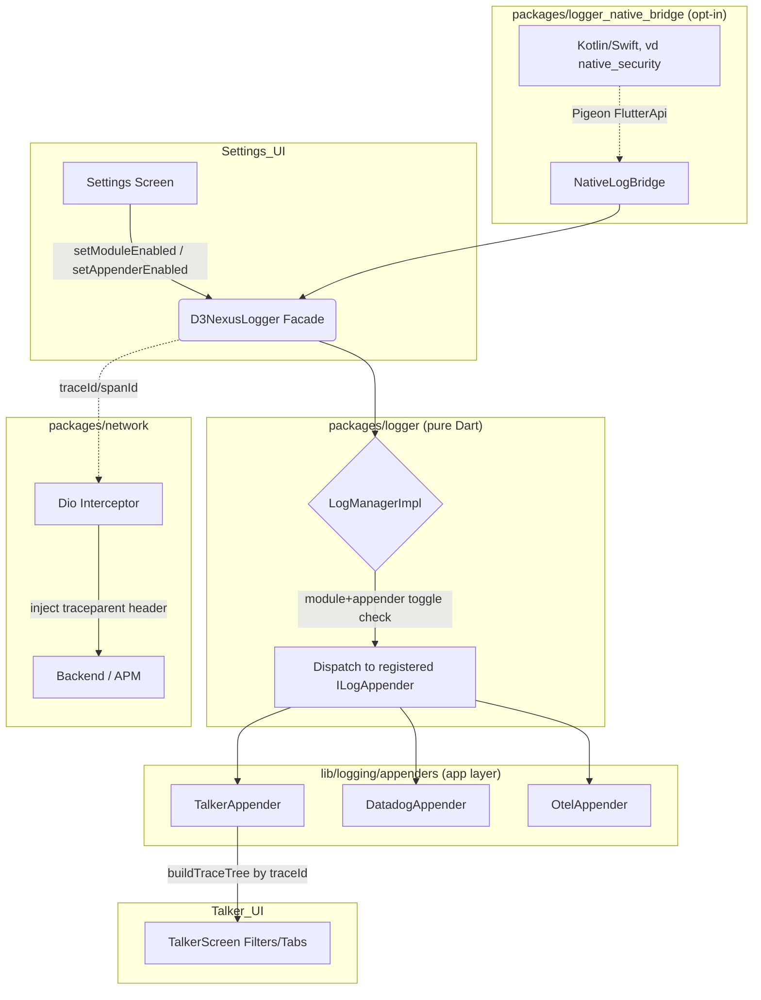
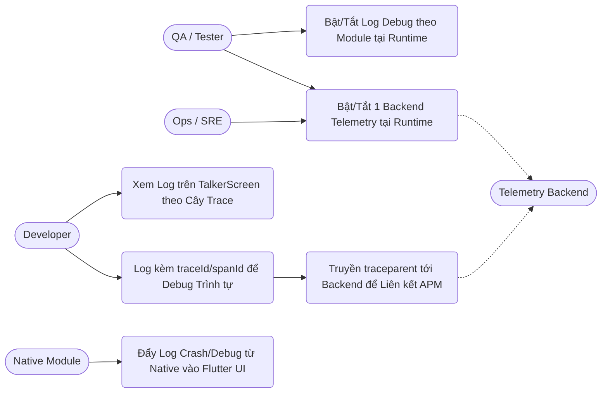
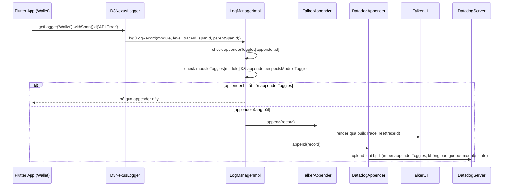
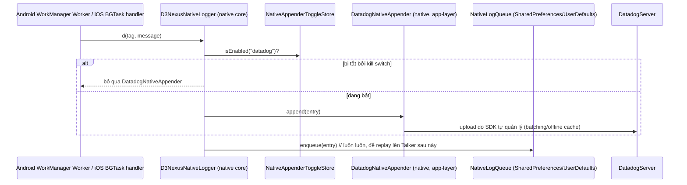

# Epic HLD: D3NexusLogger — Hệ thống Logging & Tracing Có thể Cắm ghép

## Mục lục
1. [Meta Data](#1-meta-data)
2. [Bối cảnh](#2-bối-cảnh)
3. [Mục tiêu & Ngoài phạm vi](#3-mục-tiêu--ngoài-phạm-vi)
4. [Kiến trúc & Thiết kế Kỹ thuật](#4-kiến-trúc--thiết-kế-kỹ-thuật)
   - [4.1. Kiến trúc Tổng quan](#41-kiến-trúc-tổng-quan)
   - [4.2. Sơ đồ Use Cases](#42-sơ-đồ-use-cases)
   - [4.3. Sơ đồ Sequence](#43-sơ-đồ-sequence)
   - [4.4. Native Bridge — Logging Headless](#44-native-bridge--logging-headless)
5. [Chiến lược Rollout & Giảm thiểu Rủi ro](#5-chiến-lược-rollout--giảm-thiểu-rủi-ro)
6. [Phân rã Kanban Tasks](#6-phân-rã-kanban-tasks)

---

## 1. Meta Data
- **Epic**: `logging-refactor`
- **Status**: Planning
- **Target Release**: v1.x
- **Source Spec**: [2026-08-25-logging-module-design.md](2026-08-25-logging-module-design.md)
- **Spec liên quan (cập nhật Task 7)**: [2026-08-26-logger-native-bridge-headless-design.md](2026-08-26-logger-native-bridge-headless-design.md) — thiết kế lại `packages/logger_native_bridge` theo hướng headless-first, thay thế scope 1-channel ban đầu của Task 7.

---

## 2. Bối cảnh
Hệ thống log hiện tại (`packages/core/lib/utils/log.dart`) là 1 static wrapper `Log` phụ thuộc cứng vào `talker_flutter`, cùng với `talker_dio_logger`/`talker_bloc_logger` được kéo thẳng vào `packages/network`. Điều này gây ra 4 vấn đề cụ thể:

- **Tập trung & Coupled**: Đổi hoặc thêm 1 backend telemetry (Datadog, OpenTelemetry) buộc phải sửa trực tiếp `packages/core`.
- **Không cô lập theo module**: Log từ mọi feature (Wallet, Authentication, Network...) đổ chung vào 1 màn hình Talker, gây quá tải thông tin.
- **Thiếu khả năng truy vết**: Log record không mang theo bất kỳ liên kết nào ngoài message thuần — không thể dựng lại trình tự nhân-quả của các bước đứng sau 1 hành động người dùng hay 1 API call.
- **Giới hạn ở Native**: Code native (vd Swift plugin của `packages/native_security`) không có đường nào để đẩy log vào Flutter debug console, và không có cách nào giữ phần "ống dẫn" này tránh xa các module hoàn toàn không có native code. Giới hạn này còn gắt hơn tưởng tượng ban đầu: code native còn có thể chạy hoàn toàn **headless** — 1 `WorkManager`/foreground `Service` trên Android, hoặc 1 task `BGTaskScheduler` trên iOS — không hề có `FlutterEngine` nào tồn tại, 1 trường hợp mà bridge phụ thuộc Dart isolate không thể chạm tới. Xem [4.4](#44-native-bridge--logging-headless).

Epic này thay thế hoàn toàn 1 bản nháp `logging_refactor` trước đó — bản nháp đó đã đi đúng hướng chung (core pluggable, module toggle, package native bridge riêng) nhưng sơ đồ kiến trúc của nó lại nối trực tiếp logic manager của core với `TalkerAppender`/`DataDogAppender`/`OtelAppender`, điều này sẽ phá vỡ chính mục tiêu "đổi backend không đụng core" khi thực thi thật. Toàn bộ nội dung bên dưới (overview và tasks) là viết lại hoàn toàn, không phải patch tăng dần trên bản nháp cũ.

---

## 3. Mục tiêu & Ngoài phạm vi

### Mục tiêu
- 1 core logging thuần Dart (`packages/logger`) không phụ thuộc bất kỳ SDK telemetry cụ thể nào (Talker, Datadog, Otel).
- Bật/tắt theo từng module tại runtime, không cần rebuild app.
- Bật/tắt theo từng appender (từng backend) tại runtime, độc lập với toggle module — để việc mute 1 module cho mục đích debug local không bao giờ làm mù telemetry production.
- Có thể truy vết trình tự nhân-quả giữa các log record qua `traceId`/`spanId`/`parentSpanId` (mô hình W3C Trace Context / OpenTelemetry span), dựng lại được cả trong UI debug tại app lẫn bởi các backend APM thật.
- 1 package native bridge (`packages/logger_native_bridge`) tách riêng, hoàn toàn opt-in để các module không có native code không phải trả chi phí cho nó.
- Code native có thể đẩy log lên backend telemetry theo thời gian thực ngay cả khi chạy hoàn toàn headless (không có Flutter engine), và log đó vẫn xuất hiện trên TalkerScreen qua cơ chế replay best-effort vào lần app được mở lại tiếp theo — xem [4.4](#44-native-bridge--logging-headless).

### Ngoài phạm vi
- Lưu log dưới dạng file cục bộ (SDK Datadog đã tự lo offline caching).
- Thay đổi logic nghiệp vụ ví/wallet.
- Xây dựng màn hình timeline trực quan đầy đủ trong app — `buildTraceTree` được xây như 1 pure function tái sử dụng được; việc dựng UI timeline trực quan phong phú trên nền đó nằm ngoài phạm vi epic này.
- Publish phần code native của `logger_native_bridge` thành 1 package/pipeline riêng ngoài pub — 1 package pub duy nhất chứa cả native core hỗ trợ headless lẫn Flutter shim (xem [4.4](#44-native-bridge--logging-headless)).
- Tích hợp OpenTelemetry native mobile SDK ngay ở vòng đầu — SDK native của Datadog được tích hợp trước; lớp trừu tượng appender native là thứ giúp việc thêm OTel sau này không phá vỡ gì.

---

## 4. Kiến trúc & Thiết kế Kỹ thuật

### 4.1. Kiến trúc Tổng quan
Các appender cụ thể (Talker/Datadog/Otel) sống ở **tầng app**, được đăng ký vào `D3NexusLogger` qua DI lúc bootstrap — không bao giờ nằm trong `packages/logger` và không tách thành 1 package riêng cho mỗi appender. `ILogAppender` chính là ranh giới tạo ra khả năng "đổi backend không đụng core"; native bridge là phần duy nhất có package riêng, vì đó là mối quan tâm thực sự opt-in theo từng module (code nền tảng sinh ra bởi Pigeon).

### 4.2. Sơ đồ Use Cases

### 4.3. Sơ đồ Sequence

### 4.4. Native Bridge — Logging Headless
`packages/logger_native_bridge` được tách làm 2 lớp: **native core** (Kotlin/Swift thuần, không import Flutter/Pigeon — gọi được từ bất kỳ code native nào, có engine hay không) và **lớp Flutter shim mỏng** (code sinh bởi Pigeon, chỉ liên quan khi có engine đính kèm). Backend native cụ thể (vd `DatadogNativeAppender`) sống trong code native của chính module tiêu thụ (`native_security`), được đăng ký lúc bootstrap native — cùng nguyên tắc "core không phụ thuộc SDK cụ thể, appender sống ở tầng app" mà epic này đã áp dụng cho `packages/logger`, áp dụng đối xứng sang phía native.

Không có Dart, không Pigeon, không `FlutterEngine` nào trong luồng này. Kill switch (`setAppenderEnabled`) chạm tới được nhánh headless này mà không cần thêm channel nào mới: `packages/settings` đã lưu `logging.appender_toggles` qua `shared_preferences`, được backing bởi Android `SharedPreferences` / iOS `UserDefaults` — 1 file trên đĩa, độc lập với engine. `NativeAppenderToggleStore` đọc thẳng file đó.

Log bị dồn lại lúc headless sẽ xuất hiện trên TalkerScreen vào lần engine kế tiếp được đính kèm, replay đúng thứ tự gốc kèm timestamp gốc, rồi bị xoá — best-effort và at-most-once, vì việc gửi lên BE đã xảy ra chắc chắn ở bước trên rồi; replay chỉ phục vụ mục đích quan sát của dev.

Toàn bộ lý do thiết kế, cấu trúc package, chiến lược test: [2026-08-26-logger-native-bridge-headless-design.md](2026-08-26-logger-native-bridge-headless-design.md).

---

## 5. Chiến lược Rollout & Giảm thiểu Rủi ro

**Chiến lược Rollout theo giai đoạn**:
1. **Phase 1**: Build và unit test 100% `packages/logger` độc lập (logic dispatch của `LogManagerImpl`, `buildTraceTree`, `LogRecord`).
2. **Phase 2**: Đánh dấu `Log` cũ (`packages/core/lib/utils/log.dart`) là `@Deprecated` và cho nó delegate nội bộ sang `D3NexusLogger`, để các call site hiện tại vẫn chạy được mà không cần sửa.
3. **Phase 3**: Trên 1 nhánh riêng, refactor toàn bộ call site hiện có (`Log.d/i/w/e`, ~10 chỗ hiện tại) sang `D3NexusLogger.getLogger(module).d/i/w/e`.
4. **Phase 4**: Xoá wrapper `Log` cũ, chuyển dependency `talker_flutter`/`talker_dio_logger`/`talker_bloc_logger` ra khỏi `packages/core`/`packages/network`, đưa hẳn vào tầng appender ở app.

**Giảm thiểu rủi ro (Risk Plan)**:
Mỗi phase có thể revert độc lập; shim delegate ở Phase 2 giúp Phase 3/4 rollback được mà không cần đụng lại call site. Nếu appender Datadog/Otel gặp sự cố ở production (tốn quota, lỗi ingest), dùng `setAppenderEnabled(id, false)` như 1 kill switch tức thời tại runtime thay vì phải release lại app — switch này giờ cũng chặn luôn nhánh push native headless (xem [4.4](#44-native-bridge--logging-headless)), chứ không chỉ log Dart trong app.

---

## 6. Phân rã Kanban Tasks
Sử dụng plugin **LachyFS's Kanban Markdown** để quản lý tiến độ. Các task card được lưu trong thư mục `.devtool/features/`:

- [Task 1: Tạo Package `logger` (Pure Dart)](../../features/task_1_create_package.md)
- [Task 2: Định nghĩa Core Interfaces & LogRecord](../../features/task_2_core_interfaces.md)
- [Task 3: Implement LogManagerImpl & Trace Tree](../../features/task_3_log_manager.md)
- [Task 4: App-Layer Appenders & Tích hợp DI](../../features/task_4_appenders_di.md)
- [Task 5: Truyền Trace qua Network (traceparent)](../../features/task_5_network_tracing.md)
- [Task 6: Settings UI — Toggle Module & Appender](../../features/task_6_settings_ui.md)
- [Task 7: Tạo Package `logger_native_bridge` — Push Native Headless + Replay Talker](../../features/task_7_native_bridge.md)
- [Task 8: Refactor Codebase Hiện tại sang D3NexusLogger](../../features/task_8_refactor_codebase.md)
