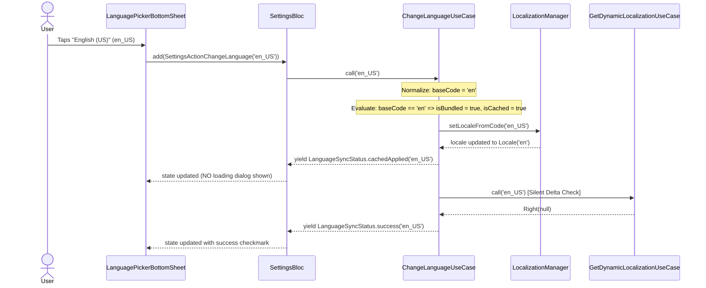
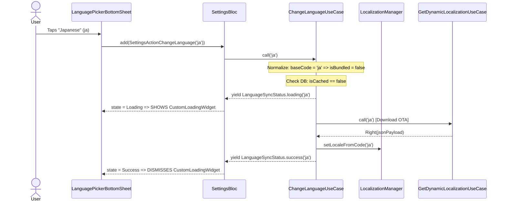

# Settings Bugfixes: Language Switching & Bundled Cache Resolution

## 1. Meta Data
- **Status:** In Progress
- **Target Release:** Next Minor
- **Platform:** Flutter
- **Source Spec:** N/A (Bugfix Epic derived from `settings_language_darkmode`)

## 2. Background
In the Super App Settings module, the application supports two default compiled-in (bundled) languages (`en` for English and `vi` for Vietnamese), alongside remote Over-The-Air (OTA) dynamic languages (such as Japanese `ja`, Korean `ko`, French `fr`).

### Current Bug Description
1. When the app is freshly installed, the system locale defaults to English (e.g. `en` or `en_US`).
2. If the user selects Vietnamese (`vi`), the app switches optimistically without showing any loading dialog because Vietnamese is recognized as cached/bundled.
3. However, when switching back to English (`en_US` / `en-US` / `en`), a modal downloading dialog (`CustomLoadingWidget`) is erroneously displayed to the user!
4. According to system specifications, the downloading dialog MUST ONLY be shown for remote OTA languages that have never been downloaded/cached before. Default bundled languages (`en`, `vi`) must NEVER show a downloading dialog under any circumstances, regardless of whether a country/region code is present (e.g. `en_US`, `en-US`, `vi_VN`, `vi-VN`).

### Root Cause Analysis
1. **`ChangeLanguageUseCase.dart:42`**:
   `final isBundled = languageCode == 'en' || languageCode == 'vi';`
   Literal string comparison against `'en'` and `'vi'` evaluates to `false` when `languageCode` contains a region tag (`en_US` or `en-US`).
2. **`CheckLanguageCachedUseCase.dart:15`**:
   `if (languageCode == 'en' || languageCode == 'vi') return true;`
   Fails for `en_US`, subsequently querying local storage for cached translations which returns `null` because compiled-in languages are not stored in the dynamic OTA cache.
3. **`GetCachedLanguagesUseCase.dart:44`**:
   Literal comparison marks `SupportedLanguage` models with `isCached = false` for region-tagged bundled languages.
4. **`BootstrapUseCase.dart:67-74`**:
   Backend bootstrap sends `{ language_code: "en_US" }` which replaces the initial `en` in local storage, causing the UI picker to emit `'en_US'`.
5. **`SettingsLocalDataSourceImpl.dart:158`**:
   `loadBundledFallback` candidate paths look for `assets/locales/$languageCode.i18n.json`, which fails for `en_US` because the asset files are `en.i18n.json` and `vi.i18n.json`.
6. **`LocalizationInitializer.dart:118`**:
   Device locale sync lacks robust normalization.

---

## 3. Goals & Non-Goals

### Goals
- Ensure all bundled languages (`en` and `vi`, including dialect/country variations such as `en_US`, `en-US`, `en_GB`, `vi_VN`) are always identified as bundled and cached (`isCached = true`).
- Ensure switching between bundled languages (EN <-> VI) is always optimistic (`cachedApplied` followed by `success`) and **never** emits `loading` or displays a modal downloading dialog.
- Preserve the loading dialog strictly for uncached remote OTA languages (`ja`, `ko`, etc.).
- Ensure bundled fallback asset paths resolve base language codes correctly when region codes are provided.
- Maintain full test coverage across Domain, Data, Presentation, and App Initializer layers.

### Non-Goals
- Modifying backend bootstrap API contract or translation payload schema.
- Re-architecting the entire Settings module or modifying theme/dark mode functionality.

---

## 4. Architecture & Technical Design

### High-Level Architecture
```mermaid
graph TD
    UI[LanguagePickerBottomSheet / SettingsPage] -->|ChangeLanguage(code)| Bloc[SettingsBloc]
    Bloc --> UC[ChangeLanguageUseCase]
    
    UC --> NORM[Language Code Normalizer]
    NORM -->|baseCode: en/vi| BUNDLE{Is Bundled?}
    BUNDLE -->|Yes: isCached=true| OPT[Optimistic Switch]
    BUNDLE -->|No| CHK[CheckLanguageCachedUseCase]
    
    CHK --> REPO[SettingsRepository]
    OPT --> LM[LocalizationManager.setLocaleFromCode]
    OPT --> BUS[AppEventBus.publish]
    OPT --> DELTA[GetDynamicLocalizationUseCase (Silent Background Sync)]
    
    CHK -->|Not Cached| OTA[Yield Loading & Download OTA]
    OTA --> LM
```

### Use Cases
```mermaid
flowchart TD
    User([Mobile User]) -->|Selects Language en_US or vi_VN| UI[Language Picker Bottom Sheet]
    UI -->|SettingsActionChangeLanguage| Bloc[SettingsBloc]
    Bloc --> UC[ChangeLanguageUseCase]
    
    subgraph Language Normalization & Evaluation
        UC --> NORM[Extract baseCode: languageCode.split('-_')[0]]
        NORM --> EVAL{baseCode in ['en', 'vi'] OR isCached in DB?}
    end
    
    EVAL -->|Yes: Bundled or Cached| FLOW_A[Optimistic Switch Flow]
    FLOW_A --> EMIT1[Emit cachedApplied: UI updates instantly]
    FLOW_A --> SYNC[Background Delta Sync]
    FLOW_A --> EMIT2[Emit success: Bottom sheet updates checkmark]
    
    EVAL -->|No: Uncached Remote OTA| FLOW_B[Remote OTA Download Flow]
    FLOW_B --> EMIT3[Emit loading: Show CustomLoadingWidget dialog]
    FLOW_B --> DL[Download dynamic JSON from BE]
    FLOW_B --> APPLY[Apply translations & dismiss dialog]
    FLOW_B --> EMIT4[Emit success]
```

### Sequence Diagram: Bundled Language Switch (EN <-> VI)


### Sequence Diagram: Uncached Remote OTA Language Switch (JA)


---

### Check 1 (Shift-Left Impact Analysis Diagnostic)
- **Tool**: `skills/impact-analysis/resources/scripts/check_code_impact.py`
- **Upstream Git Conflicts**: 🟢 CLEAN against `develop` / `HEAD`.
- **Downstream Callers & Blast Radius**: Localized to `features/settings` and `lib/core/app_initializer/localization_initializer.dart`.
- **Cross-Platform Bridges**: No native `MethodChannel` touched.
- **Coverage Safety Net**:
  - `ChangeLanguageUseCase`: 🟢 80% coverage (requires new test cases for `en_US`, `vi_VN`).
  - `CheckLanguageCachedUseCase`: 🔴 0% coverage (MISSING TEST FILE - Must create `check_language_cached_usecase_test.dart`).
  - `GetCachedLanguagesUseCase`: 🟢 80% coverage (requires test cases for `en_US` cache state).
  - `SettingsLocalDataSourceImpl`: 🟢 80% coverage (requires test case for `loadBundledFallback` with region tags).
  - `LocalizationInitializer`: 🔴 0% coverage (requires unit test verifying device locale fallback).

---

## 5. BDD Output in Epic Directory
The full Gherkin behavioral specifications are formally defined in [bdd_scenarios.md](./bdd_scenarios.md).

---

## 6. Rollout Strategy & Mitigation
- Standard deployment. Changes are strictly backward-compatible as they normalize locale strings and broaden bundled detection logic.
- Rollback plan: Revert usecase changes without database migrations required.

---

## 7. Kanban Tasks Breakdown
- [Task 13: Domain & Data - Language Normalization & Bundled Cache Resolution](task_13_domain_data_language_normalization.md)
- [Task 14: Presentation & Bloc - Optimistic Switching & Loading Dialog Suppression](task_14_presentation_bloc_loading_dialog_guard.md)
- [Task 15: Host App Integration & 3-Tier Verification](task_15_host_app_integration_3tier_verification.md)
