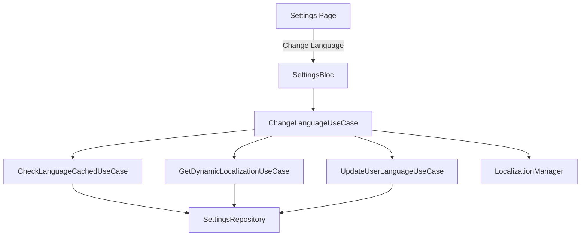
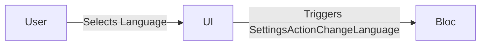
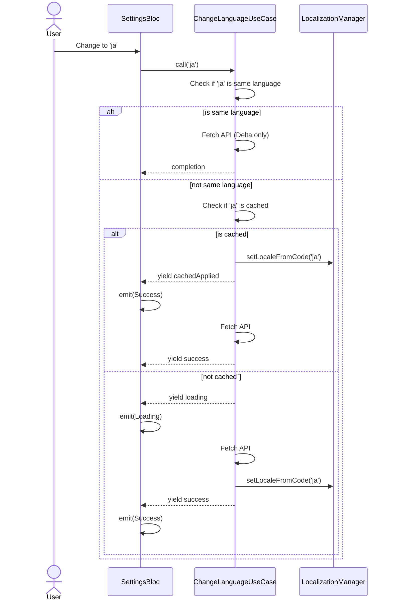

# Settings Bugfixes

## 1. Meta Data
- **Status:** Queued (backlog)
- **Target Release:** Next Minor
- **Source Spec:** N/A

## 2. Background
Settings module bugs that need fixing, specifically the language switch race conditions. When the user changes language rapidly, optimistic UI forces un-cached languages to display immediately, and concurrent API fetches overwrite the current locale when they finish out-of-order.

## 3. Goals & Non-Goals
**Goals:**
- Fix the race condition when user rapid-clicks multiple languages.
- Apply state-aware Optimistic UI (only immediate for default/cached languages).

**Non-Goals:**
- Refactor the entire Settings module.

## 4. Architecture & Technical Design

### High-Level Architecture

### Use Cases

### Sequence Diagram

## 5. Rollout Strategy & Mitigation
- Standard deployment.

## 6. Kanban Tasks Breakdown
- [Task 11: Fix Language Race Condition](../../features/task_11_language_race_condition.md)
- [Task 12: Refactor Language Sync Orchestration](../../features/task_12_refactor_language_sync.md)
