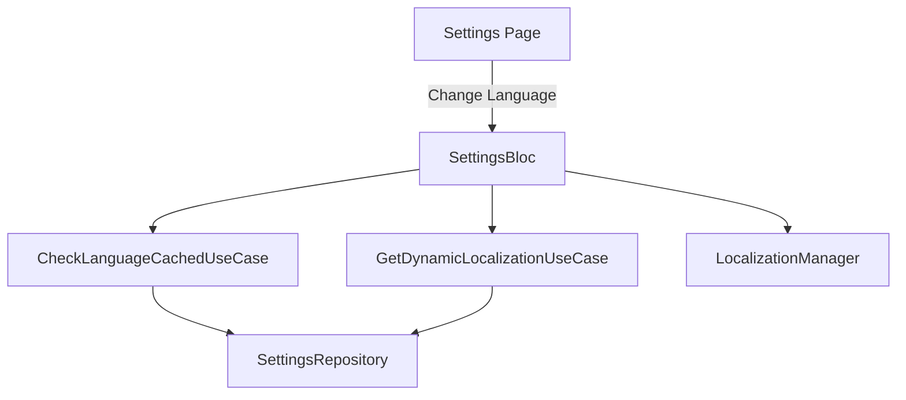
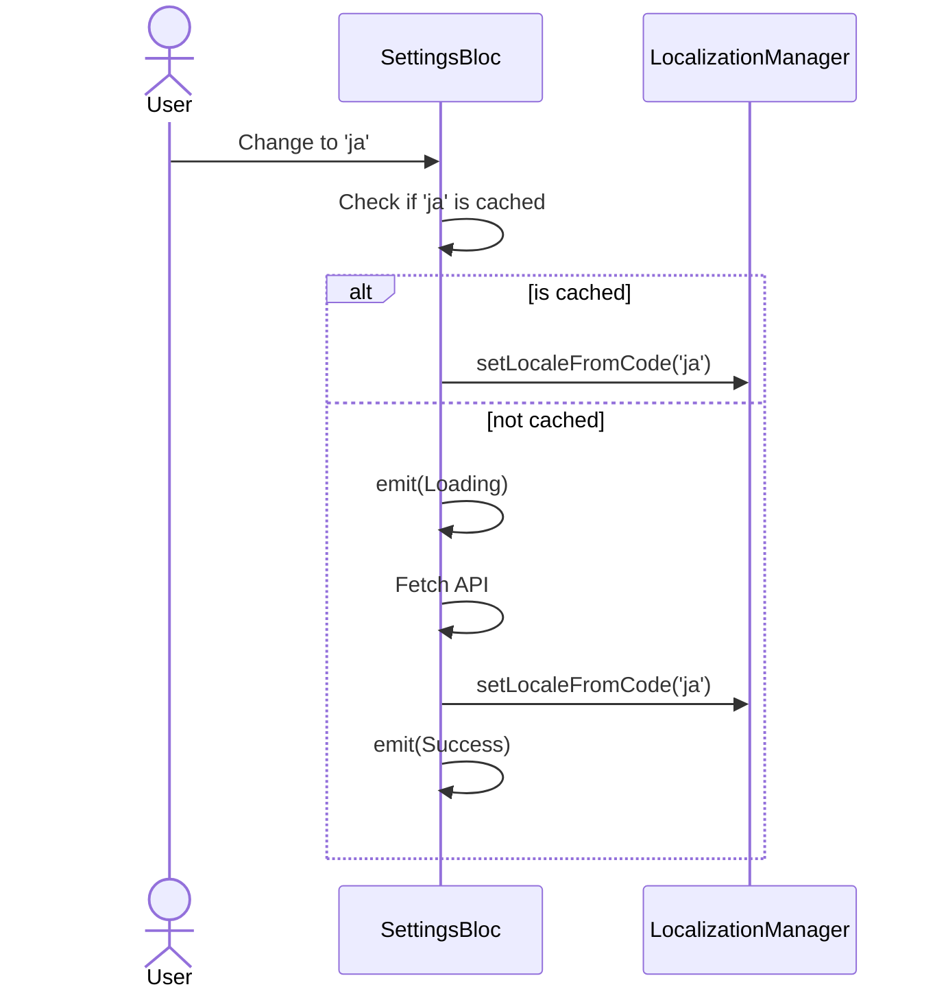

# Settings Bugfixes

## 1. Meta Data
- **Status:** Queued (backlog)
- **Target Release:** Next Minor
- **Source Spec:** N/A

## 2. Background (Bối cảnh)
Lỗi module Settings liên quan đến race conditions khi chuyển đổi ngôn ngữ. Khi người dùng thay đổi ngôn ngữ liên tục, optimistic UI khiến ngôn ngữ chưa được tải về hiển thị ngay lập tức, và các tiến trình API song song sẽ đè locale hiện tại khi chúng chạy xong không theo thứ tự.

## 3. Goals & Non-Goals
**Goals:**
- Sửa lỗi race condition khi người dùng click đổi nhiều ngôn ngữ liên tục.
- Áp dụng state-aware Optimistic UI (chỉ update tức thì cho các ngôn ngữ mặc định/đã cache).

**Non-Goals:**
- Refactor toàn bộ module Settings.

## 4. Architecture & Technical Design

### High-Level Architecture

### Use Cases

### Sequence Diagram

## 5. Rollout Strategy & Mitigation
- Standard deployment.

## 6. Kanban Tasks Breakdown
- [Task 11: Fix Language Race Condition](../../features/task_11_language_race_condition.md)
