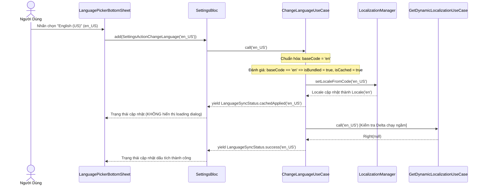
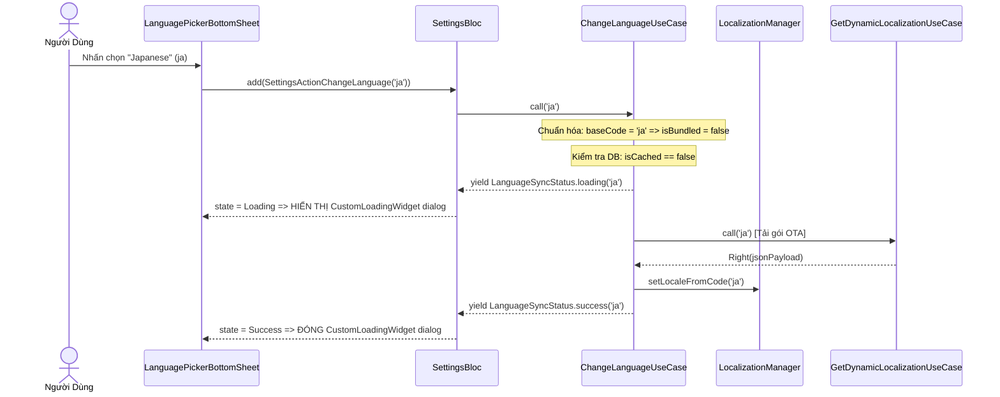

# Settings Bugfixes: Sửa Lỗi Chuyển Đổi Ngôn Ngữ & Nhận Diện Ngôn Ngữ Mặc Định (Bundled Cache)

## 1. Meta Data
- **Status:** In Progress
- **Target Release:** Next Minor
- **Platform:** Flutter
- **Source Spec:** N/A (Bugfix Epic kế thừa từ `settings_language_darkmode`)

## 2. Background (Bối cảnh)
Trong module Settings của Super App, ứng dụng hỗ trợ 2 ngôn ngữ mặc định được nhúng sẵn trong mã nguồn (bundled languages) là `en` (Tiếng Anh) và `vi` (Tiếng Việt), cùng các ngôn ngữ tải động từ xa Over-The-Air (OTA) như Tiếng Nhật `ja`, Tiếng Hàn `ko`, Tiếng Pháp `fr`.

### Mô Tả Lỗi Thực Tế
1. Khi mới cài đặt ứng dụng, hệ thống hiển thị Tiếng Anh mặc định theo cài đặt máy (ví dụ `en` hoặc `en_US`).
2. Khi người dùng chọn chuyển sang Tiếng Việt (`vi`), ứng dụng chuyển tức thì (optimistic switch) mà không hiển thị dialog loading vì Tiếng Việt được nhận diện là ngôn ngữ đã có sẵn/cached.
3. Tuy nhiên, khi người dùng bấm chọn quay trở lại Tiếng Anh (`en_US` / `en-US` / `en`), màn hình lại hiển thị một modal loading dialog (`CustomLoadingWidget`) để tải về!
4. Theo thiết kế chuẩn của hệ thống: Modal dialog tải về CHỈ ĐƯỢC PHÉP hiển thị đối với các ngôn ngữ OTA từ xa được tải lần đầu tiên (chưa được cache). Hai ngôn ngữ mặc định (`en`, `vi`) luôn luôn được coi là đã cache sẵn (`isCached = true`) và TUYỆT ĐỐI KHÔNG được hiển thị dialog loading trong bất kỳ trường hợp nào, bất kể mã ngôn ngữ có kèm mã vùng/quốc gia hay không (ví dụ: `en_US`, `en-US`, `vi_VN`, `vi-VN`).

### Phân Tích Nguyên Nhân Gốc Rễ (Root Causes)
1. **`ChangeLanguageUseCase.dart:42`**:
   `final isBundled = languageCode == 'en' || languageCode == 'vi';`
   So sánh chuỗi ký tự cố định với `'en'` và `'vi'` dẫn đến trả về `false` khi `languageCode` có chứa mã vùng như `'en_US'` hay `'en-US'`.
2. **`CheckLanguageCachedUseCase.dart:15`**:
   `if (languageCode == 'en' || languageCode == 'vi') return true;`
   Trả về `false` với `'en_US'`, sau đó truy vấn local storage tìm bản dịch tải động OTA. Do Tiếng Anh là ngôn ngữ biên dịch sẵn nên trả về `null`, kết quả usecase báo `isCached = false`.
3. **`GetCachedLanguagesUseCase.dart:44`**:
   So sánh cứng khiến đối tượng `SupportedLanguage` của Tiếng Anh bị gán cờ `isCached = false`.
4. **`BootstrapUseCase.dart:67-74`**:
   Backend bootstrap trả về danh sách có `{ language_code: "en_US" }` và ghi đè mã `en` ban đầu trong local storage, khiến Bottom Sheet phát ra `'en_US'`.
5. **`SettingsLocalDataSourceImpl.dart:158`**:
   Hàm `loadBundledFallback` tìm file asset theo đường dẫn tĩnh `assets/locales/$languageCode.i18n.json`, dẫn đến không tìm thấy `en.i18n.json` khi mã là `en_US`.
6. **`LocalizationInitializer.dart:118`**:
   Quá trình đồng bộ locale của thiết bị cần được chuẩn hóa thống nhất.

---

## 3. Goals & Non-Goals (Mục tiêu & Ngoài phạm vi)

### Mục tiêu (Goals)
- Đảm bảo toàn bộ các ngôn ngữ mặc định (`en` và `vi`, bao gồm các biến thể vùng như `en_US`, `en-US`, `en_GB`, `vi_VN`) luôn được xác định chính xác là bundled language và đã được cache (`isCached = true`).
- Chuyển đổi qua lại giữa các ngôn ngữ mặc định (EN <-> VI) luôn thực hiện tức thì (optimistic: `cachedApplied` rồi `success`), **tuyệt đối không phát ra trạng thái `loading`** và không hiển thị modal dialog.
- Giữ nguyên cơ chế hiển thị loading dialog cho các ngôn ngữ OTA từ xa chưa từng được tải (`ja`, `ko`, v.v.).
- Đảm bảo hàm nạp fallback asset nhận diện đúng file gốc `en.i18n.json` / `vi.i18n.json` khi nhận mã vùng.
- Đạt độ phủ kiểm thử tự động 100% cho các trường hợp kiểm thử trên Domain, Data, Presentation và App Initializer.

### Ngoài phạm vi (Non-Goals)
- Không thay đổi hợp đồng API backend bootstrap hoặc cấu trúc JSON bản dịch.
- Không tái cấu trúc toàn bộ module Settings hoặc can thiệp sang tính năng Dark Mode.

---

## 4. Kiến Trúc & Thiết Kế Kỹ Thuật (Architecture & Technical Design)

### Kiến Trúc Mức Cao (High-Level Architecture)
```mermaid
graph TD
    UI[LanguagePickerBottomSheet / SettingsPage] -->|ChangeLanguage(code)| Bloc[SettingsBloc]
    Bloc --> UC[ChangeLanguageUseCase]
    
    UC --> NORM[Language Code Normalizer]
    NORM -->|baseCode: en/vi| BUNDLE{Là Bundled Language?}
    BUNDLE -->|Đúng: isCached=true| OPT[Chuyển Ngôn Ngữ Tức Thì]
    BUNDLE -->|Sai| CHK[CheckLanguageCachedUseCase]
    
    CHK --> REPO[SettingsRepository]
    OPT --> LM[LocalizationManager.setLocaleFromCode]
    OPT --> BUS[AppEventBus.publish]
    OPT --> DELTA[GetDynamicLocalizationUseCase (Chạy ngầm kiểm tra delta)]
    
    CHK -->|Chưa cache| OTA[Phát Loading & Tải OTA]
    OTA --> LM
```

### Biểu Đồ Ca Sử Dụng (Use Cases)
```mermaid
flowchart TD
    User([Người Dùng Di Động]) -->|Chọn ngôn ngữ en_US hoặc vi_VN| UI[Language Picker Bottom Sheet]
    UI -->|SettingsActionChangeLanguage| Bloc[SettingsBloc]
    Bloc --> UC[ChangeLanguageUseCase]
    
    subgraph Chuẩn Hóa Mã Ngôn Ngữ & Đánh Giá
        UC --> NORM[Tách baseCode: languageCode.split('-_')[0]]
        NORM --> EVAL{baseCode thuộc ['en', 'vi'] HOẶC isCached trong DB?}
    end
    
    EVAL -->|Đúng: Bundled hoặc Đã Cache| FLOW_A[Luồng Chuyển Tức Thì Optimistic]
    FLOW_A --> EMIT1[Phát cachedApplied: Giao diện cập nhật ngay]
    FLOW_A --> SYNC[Đồng bộ Delta ngầm trong background]
    FLOW_A --> EMIT2[Phát success: Bottom sheet hiện dấu tích chọn]
    
    EVAL -->|Sai: Ngôn ngữ OTA chưa cache| FLOW_B[Luồng Tải Về Từ Xa OTA]
    FLOW_B --> EMIT3[Phát loading: Hiển thị CustomLoadingWidget dialog]
    FLOW_B --> DL[Tải gói JSON bản dịch từ BE]
    FLOW_B --> APPLY[Áp dụng bản dịch & đóng dialog]
    FLOW_B --> EMIT4[Phát success]
```

### Biểu Đồ Tuần Tự: Chuyển Đổi Ngôn Ngữ Mặc Định (EN <-> VI)


### Biểu Đồ Tuần Tự: Tải Ngôn Ngữ OTA Chưa Cache (JA)


---

### Phân Tích Tác Động Kiểm Thử (Check 1 Diagnostic)
- **Công cụ**: `skills/impact-analysis/resources/scripts/check_code_impact.py`
- **Xung đột mã nguồn**: 🟢 Không có xung đột với `develop` / `HEAD`.
- **Phạm vi tác động**: Gói gọn trong `features/settings` và `lib/core/app_initializer/localization_initializer.dart`.
- **An toàn kiểm thử tự động**:
  - `ChangeLanguageUseCase`: 🟢 80% coverage (bổ sung test case cho `en_US`, `vi_VN`).
  - `CheckLanguageCachedUseCase`: 🔴 0% coverage (CẦN TẠO MỚI `check_language_cached_usecase_test.dart`).
  - `GetCachedLanguagesUseCase`: 🟢 80% coverage (bổ sung test case cho trạng thái cache của `en_US`).
  - `SettingsLocalDataSourceImpl`: 🟢 80% coverage (bổ sung test case cho `loadBundledFallback` với mã vùng).
  - `LocalizationInitializer`: 🔴 0% coverage (bổ sung test case).

---

## 5. BDD Scenarios
Tài liệu kịch bản hành vi Gherkin chi tiết được lưu trữ tại [bdd_scenarios.md](./bdd_scenarios.md).

---

## 6. Chiến Lược Triển Khai & Giảm Thiểu Rủi Ro (Rollout Strategy)
- Triển khai chuẩn trong bản cập nhật kế tiếp. Mã nguồn tương thích ngược hoàn toàn vì chỉ nới rộng điều kiện nhận diện mã ngôn ngữ chuẩn hóa.
- Kế hoạch rollback: Revert commit usecase mà không ảnh hưởng cơ sở dữ liệu local.

---

## 7. Phân Rã Công Việc Kanban (Kanban Tasks Breakdown)
- [Task 13: Domain & Data - Chuẩn Hóa Mã Ngôn Ngữ & Nhận Diện Bundled Cache](../../features/task_13_domain_data_language_normalization.md)
- [Task 14: Presentation & Bloc - Chuyển Đổi Tức Thì & Chặn Dialog Tải Ngôn Ngữ Mặc Định](../../features/task_14_presentation_bloc_loading_dialog_guard.md)
- [Task 15: Tích Hợp Host App & Kiểm Thử 3-Tier Hoàn Chỉnh](../../features/task_15_host_app_integration_3tier_verification.md)
