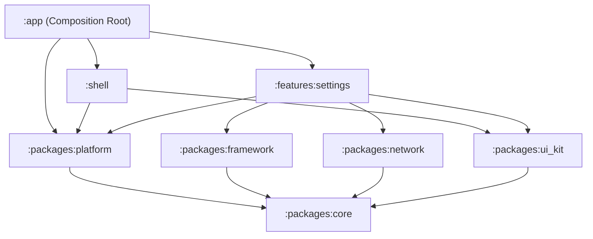

# Design Spec: Settings Screen UI, Dark Mode & OTA Dynamic Localization

**Date**: 2026-09-06  
**Status**: Implemented & Verified  
**Authors**: Antigravity & DanhDue ExOICTIF  
**Target Architecture**: Clean Architecture + MVI + Multi-Module Android (Kotlin 2.x, Jetpack Compose, Dagger Hilt)

---

## 1. Context & Motivation

This specification defines the implementation of the rich Settings screen for `android_super_app_template`, matching the visual design and functional requirements of the reference super app templates (iOS & Flutter).

### Key Features:
1. **Full Settings Screen UI**:
   - 4 grouped card sections with rounded corners (`16.dp`):
     - **TÀI KHOẢN (Account)**: Chỉnh sửa hồ sơ, Đổi mật khẩu, Xác thực 2 yếu tố (2FA).
     - **TÙY CHỌN (Preferences)**: Tiền tệ / Đơn vị (`USD ($)`), Ngôn ngữ (hiển thị ngôn ngữ hiện tại, mở Bottom Sheet), Chế độ tối (Switch).
     - **NHÀ PHÁT TRIỂN (Developer)**: Chế độ gỡ lỗi (Switch).
     - **THÔNG TIN ỨNG DỤNG (App Information)**: Liên hệ hỗ trợ, Về ứng dụng (`1.0.0`).
   - Standalone **Đăng xuất (Logout)** card button at the bottom.
2. **Dark Mode Toggle**:
   - Managed centrally via `AppThemeManager` in `:packages:platform`.
   - Persisted in `CacheStore` (`:packages:core`).
   - Reactive theme updates across the entire app hierarchy without Activity recreation.
   - Publishes `AppEvent.ThemeModeChanged` to `AppEventBus`.
3. **OTA Dynamic Localization with Modal Bottom Sheet**:
   - Bundled default languages: **English (`en`)** and **Vietnamese (`vi`)** in `strings.xml`.
   - Remote languages (**日本語 `ja_JP`**, **한국어 `ko_KR`**) fetched on-demand from the backend.
   - **Background Bootstrap Sync**: On entering Settings (`init`), calls `POST /api/v1/settings/sync/bootstrap` in the background (no loading dialog) to retrieve available languages and check for stale translations.
   - **Dual-Layer Caching**: Both `CacheStore` (DataStore) and `SharedPreferences` store downloaded translations and supported languages list (`key_supported_languages`).
   - **Immediate Startup Loading**: `GetCachedLanguagesUseCase` loads previously cached languages on frame 0, ensuring the language picker renders all supported languages immediately, even while offline.
   - **State-aware Language Switching**:
     - If language is **cached/bundled**: Switch locale immediately (optimistic UI), and check for delta updates in background.
     - If language is **not cached**: Display a modal `LoadingDialog` ("Đang tải ngôn ngữ..."), fetch remote translations via `GET /api/v1/translations/{code}`, save flattened dot-notation map into `CacheStore` and `SharedPreferences`, apply locale, and dismiss dialog. If fetch fails, keep previous language and display a soft error message.
     - **Same-Language Skip**: Redundant switches on the active language are skipped.
   - **In-Place Recomposition**: `LocalDynamicStringResolver` coupled with `remember(currentLanguageCode, translationsVersion) { appLocalizationManager::getString }` allows fine-grained recomposition of dynamic strings across all modules without tearing down active bottom sheets or recreating the UI tree.

---

## 2. System Architecture & Module Boundaries

The implementation strictly honors the governed module hierarchy (Konsist K1–K9):



### 2.1 `:packages:platform` (Cross-Feature Seam)
1. **`AppThemeMode` & `AppThemeManager`**:
   - `AppThemeMode`: enum `{ SYSTEM, LIGHT, DARK }`
   - `AppThemeManager`: Singleton injected with `CacheStore` and `AppEventBus`.
   - State flows: `val themeMode: StateFlow<AppThemeMode>`, `val isDarkMode: StateFlow<Boolean>`.
   - Functions: `fun toggleDarkMode(enabled: Boolean)`, `fun setThemeMode(mode: AppThemeMode)`.
   - Emits `AppEvent.ThemeModeChanged(mode)` on `AppEventBus`.
2. **`AppLocalizationManager`**:
   - Tracks `val currentLanguageCode: StateFlow<String>` (resolved synchronously in `init` from `SharedPreferences` to prevent cold start resets).
   - Tracks `val translationsVersion: StateFlow<Int>`: Increments only when dynamic translations differ from existing values.
   - Function `fun getString(key: String, fallback: String): String`: Resolves dot-notation keys from in-memory `dynamicOverrides`, with schema alias support (e.g. `home.main.title` <-> `home.nav.home`), falling back to `fallback`.
   - Function `suspend fun setLocale(languageCode: String)`:
     - Persists to `SharedPreferences` and `CacheStore`.
     - Loads cached translations into memory immediately.
     - Emits `AppEvent.AppLanguageChanged(languageCode)` on `AppEventBus`.
   - Function `suspend fun applyDynamicTranslations(translations: Map<String, String>, languageCode: String? = null)`:
     - Detects content changes before updating memory and disk.
     - Persists in `CacheStore` and `SharedPreferences`.
     - Bumps `translationsVersion` only if changes were detected.
3. **`AppEvent` additions**:
   ```kotlin
   data class ThemeModeChanged(val mode: AppThemeMode) : AppEvent
   data class AppLanguageChanged(val languageCode: String) : AppEvent
   ```

---

## 3. Remote APIs & Data Layer (`:features:settings`)

### 3.1 Remote Endpoints
1. **Bootstrap Sync**:
   - `POST /api/v1/settings/sync/bootstrap`
   - Request Body:
     ```json
     {
       "cached_translations": [
         { "resource_id": "en_US", "version": "1.0.0" }
       ]
     }
     ```
   - Response Body:
     - `available_languages`: list of supported languages (`language_code`, `language_name`, `version`, `is_default`, `is_active`).
     - `stale_translations`: list of resources needing updates.
2. **Translations Download (Delta/Full)**:
   - `GET /api/v1/translations/{language_code}?since_version={version}`
   - Returns nested translations JSON tree, `mode` (`full` | `delta`), and `version`.

### 3.2 Moshi DTOs & JSON Flattening
- `BootstrapRequestDto`, `CachedTranslationDto`, `BootstrapResponseDto`, `SupportedLanguageDto`.
- `JsonFlattener`: Transforms arbitrary nested maps (e.g. `{"settings": {"preferences": {"darkMode": "ダークモード"}}}`) into flat dot-notation entries `settings.preferences.darkMode = "ダークモード"`.

### 3.3 Local Storage (`SettingsLocalDataSource`)
- Dual-layer persistence using `CacheStore` (`:packages:core`) and `SharedPreferences` (`app_preferences`):
  - `translations_{code}`: JSON string of flat translations map.
  - `key_supported_languages`: JSON string of cached `SupportedLanguageItem` list.
- Methods:
  - `suspend fun getSupportedLanguages(): List<SupportedLanguage>`
  - `fun getSupportedLanguagesSync(): List<SupportedLanguage>`
  - `suspend fun saveSupportedLanguages(languages: List<SupportedLanguage>)`
  - `suspend fun saveTranslations(languageCode: String, translations: Map<String, String>)`
  - `suspend fun getTranslations(languageCode: String): Map<String, String>`

---

## 4. Domain Layer (`:features:settings`)

Pure Kotlin, 0 Android framework imports (Konsist Rule K3).

### 4.1 Entities
- `SupportedLanguage(code: String, name: String, version: String, isDefault: Boolean, isActive: Boolean, isCached: Boolean)`
- `LanguageSyncStatus`: `Idle`, `Loading(code: String)`, `CachedApplied(code: String)`, `Success(code: String)`, `Error(code: String, message: String)`

### 4.2 Repository Interface
```kotlin
interface SettingsRepository {
    suspend fun getSettingsData(): Result<Settings>
    suspend fun getProfileData(): Result<Profile>
    suspend fun bootstrap(): Result<List<SupportedLanguage>>
    suspend fun fetchAndCacheTranslations(languageCode: String, sinceVersion: String? = null): Result<Map<String, String>>
    suspend fun getCachedLanguages(): List<SupportedLanguage>
    suspend fun getCachedTranslations(languageCode: String): Map<String, String>
}
```

### 4.3 Use Cases Specification

- **`GetCachedLanguagesUseCase`**:
  - *Purpose*: Retrieves locally cached supported languages synchronously for frame-0 startup display.
  - *Contract*: `suspend operator fun invoke(): List<SupportedLanguage>`.
  - *Behavior*: Queries `SettingsRepository.getCachedLanguages()`. If local cache exists, returns it immediately so `availableLanguages` in `SettingsViewModel` is populated before network bootstrap finishes.

- **`BootstrapSettingsUseCase`**:
  - *Purpose*: Synchronizes supported languages and translation version metadata with the backend.
  - *Contract*: `suspend operator fun invoke(): Result<List<SupportedLanguage>>`.
  - *Behavior*: Calls `SettingsRepository.bootstrap()`, sends cached versions to `POST /api/v1/settings/sync/bootstrap`, saves updated languages into both DataStore and `SharedPreferences`, and returns merged language list.

- **`ChangeLanguageUseCase`**:
  - *Purpose*: Orchestrates language switching with optimistic UI for cached/bundled languages and loading dialog for uncached languages.
  - *Contract*: `operator fun invoke(targetLanguage: SupportedLanguage): Flow<LanguageSyncStatus>`.
  - *Behavior*:
    - If `targetLanguage.isCached || targetLanguage.code in setOf("en", "vi", ...)`: Emits `LanguageSyncStatus.CachedApplied`, loads cached dot-map into `AppLocalizationManager`, sets locale, and quietly checks delta updates in background without blocking UI, then emits `LanguageSyncStatus.Success`.
    - If uncached: Emits `LanguageSyncStatus.Loading`, calls `SettingsRepository.fetchAndCacheTranslations(code)`, applies flattened map to `AppLocalizationManager`, sets locale, and emits `LanguageSyncStatus.Success` (or `LanguageSyncStatus.Error` on failure).

- **`ToggleDarkModeUseCase`**:
  - *Purpose*: Updates global application theme.
  - *Contract*: `suspend operator fun invoke(isDarkMode: Boolean)`.
  - *Behavior*: Maps boolean to `AppThemeMode.DARK` or `LIGHT` and delegates to `AppThemeManager.setThemeMode()`, persisting to `CacheStore` and broadcasting `AppEvent.ThemeModeChanged`.

---

## 5. Presentation Layer (`:features:settings`)

### 5.1 MVI Architecture
- **`SettingsState`**: Holds `isLoading`, `isDarkMode`, `selectedLanguageCode`, `selectedLanguageName`, `availableLanguages`, `isLanguagePickerVisible`, `isLoadingLanguage`, `errorMessage`.
- **`SettingsAction`**:
  - `ToggleDarkMode(isDarkMode: Boolean)`
  - `OpenLanguagePicker`, `DismissLanguagePicker`
  - `SelectLanguage(language: SupportedLanguage)`
  - `OpenProfile`, `OpenSecurity`, `OpenDeveloperOptions`, `Logout`
- **`SettingsEvent`**: `NavigateToProfile`, `NavigateToSecurity`, `NavigateToDeveloperOptions`, `ShowToast(message: String)`

### 5.2 Dynamic Language Name Resolution
`SettingsViewModel.resolveLanguageName`:
Looks up the display name directly in `availableLanguages`. If not yet loaded, queries `java.util.Locale.forLanguageTag(code).getDisplayLanguage(locale)`, ensuring accurate native names ("日本語", "한국어", "Tiếng Việt") without static hardcoded tags.

---

## 6. Verification & Quality Gates

1. **Unit Tests (`:features:settings:testDebugUnitTest`)**:
   - `GetCachedLanguagesUseCaseTest`: Verifies cached language retrieval.
   - `ChangeLanguageUseCaseTest`: Verifies optimistic switch for cached languages, loading emission for uncached languages, same-language skip, and failure rollback.
   - `SettingsLocalDataSourceTest`: Verifies roundtripping through DataStore and `SharedPreferences`.
   - `SettingsViewModelTest`: Verifies actions and cached language loading before bootstrap settles.
2. **Architecture Gate (`:konsist-test:test`)**:
   - Strict validation of all Konsist rules K1–K9.
3. **Quality & Spotless**:
   - `./gradlew check` (detekt, spotless, tests) passes with Code 0.
