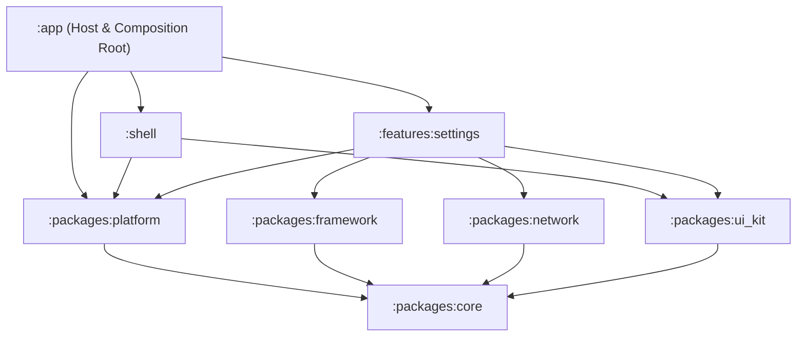
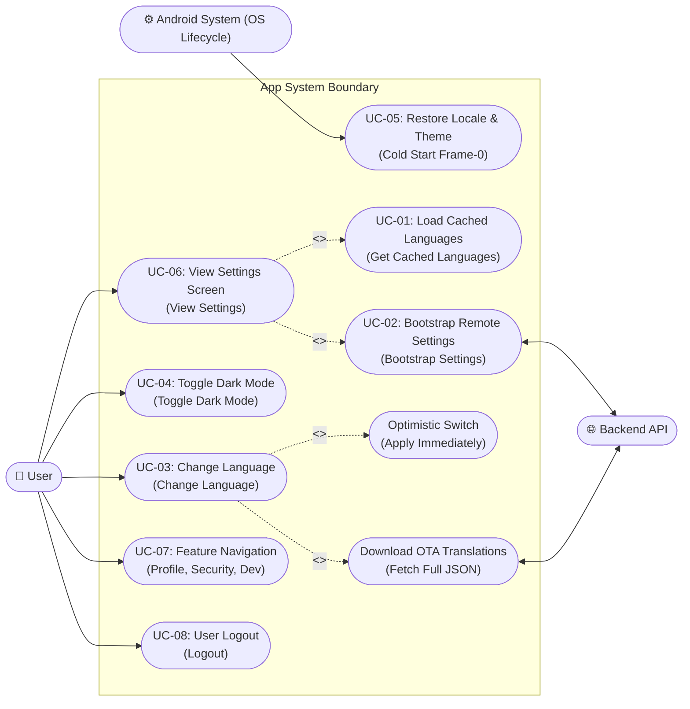
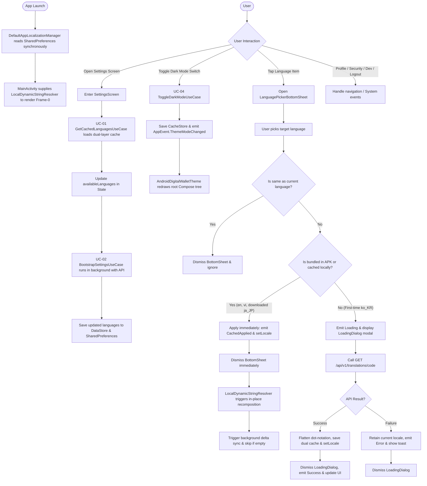
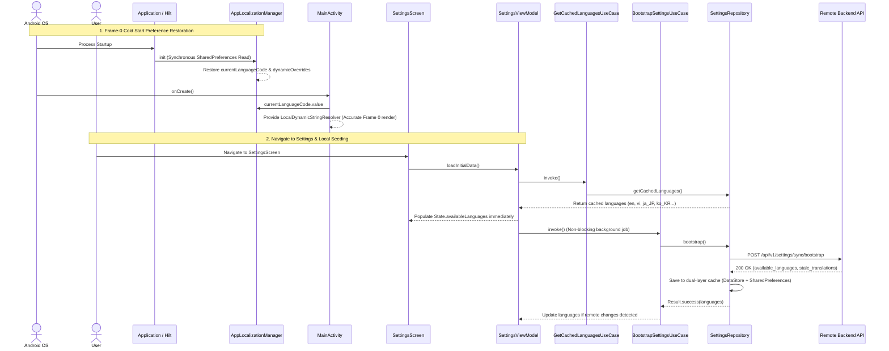
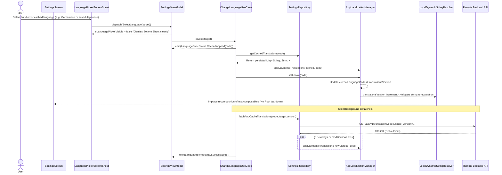
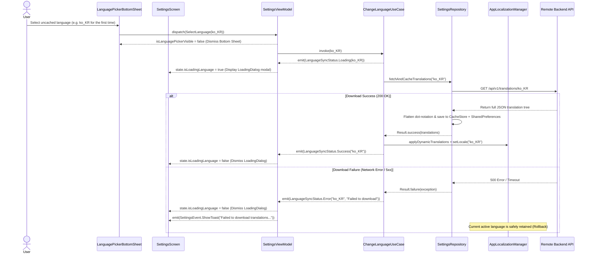

# Epic: Settings Screen UI, Dark Mode & OTA Dynamic Localization

## 1. Meta Data
- **Epic Name**: `settings_language_darkmode`
- **Status**: Completed
- **Target Release**: v1.0.0
- **Source Spec**: [2026-09-06-settings-language-darkmode-design.md](2026-09-06-settings-language-darkmode-design.md)
- **Target Architecture**: Clean Architecture + MVI + Multi-Module Android (Kotlin 2.x, Jetpack Compose Material 3, Dagger Hilt)

---

## 2. Background
The application previously had a stub Settings screen and basic language configuration. In order to achieve full feature parity with the reference super app templates (iOS & Flutter), the Settings feature has been upgraded to:
1. Provide a modern, card-grouped Settings screen matching the provided UI designs (Account, Preferences, Developer, App Info, Logout).
2. Enable centralized Dark Mode management that reacts instantly across the entire application hierarchy without Activity recreation.
3. Support on-the-air (OTA) dynamic localization: bundling English (`en`) and Vietnamese (`vi`) by default, while downloading additional languages (e.g. Japanese `ja_JP`, Korean `ko_KR`) on demand from the backend API, complete with silent bootstrap synchronization, optimistic UI transitions, and instant cold-start restoration.

---

## 3. Goals & Non-Goals

### Goals
- **UI Parity**: 100% visual fidelity with design screenshots using Jetpack Compose (4 rounded card sections with pastel circular icon badges, chevrons, switches, and a standalone red logout button).
- **Global Theme Management**: `AppThemeManager` in `:packages:platform` backed by `CacheStore` (`:packages:core`) and broadcasting `AppEvent.ThemeModeChanged` on `AppEventBus`.
- **OTA Dynamic Localization**:
  - Instant cold-start restoration from frame 0 using synchronous `SharedPreferences` cache loading into `dynamicOverrides`.
  - Dual-layer caching (Jetpack DataStore `CacheStore` + `SharedPreferences`) for both supported languages list (`key_supported_languages`) and translations.
  - Startup cached languages resolution via `GetCachedLanguagesUseCase`: immediately renders available languages in the picker without waiting for network.
  - Modal Bottom Sheet (`LanguagePickerBottomSheet`) with checkmark indicator on active language and download indicator on uncached languages.
  - Optimistic UI switch for cached/bundled languages; modal `LoadingDialog` for uncached languages with fallback on failure.
  - `GET /api/v1/translations/{code}?since_version={version}` supporting delta/full translation downloads flattened into dot-notation `Map<String, String>`.
  - Fine-grained Compose recomposition via `LocalDynamicStringResolver` preventing bottom sheet dismissals or UI tree destruction during background delta sync.
- **Quality & Architecture**: Strict compliance with Konsist rules K1–K9, comprehensive BDD -> TDD coverage for all components.

### Non-Goals
- Implementing full backend authentication/2FA logic for navigation items (these remain interactive route stubs).
- Complex currency exchange engine (displays currency preferences).

---

## 4. Architecture & Technical Design

### High-Level Architecture


### 4.2 UML Use Case Diagram

Visual representation of Actors, System Boundary, and Use Cases for Settings, Theme, and OTA Localization:



### 4.3 Business Activity Flowchart (UML Activity Diagram)

End-to-end operational flow including decision branches and dual-layer persistence:



### 4.4 Detailed Sequence Diagrams

#### **Diagram 1: Cold Start Frame-0 Restoration & Screen Initialization**


#### **Diagram 2: Cached Language Switch (Optimistic Switch & In-Place Recomposition)**


#### **Diagram 3: Uncached Remote Language Switch (OTA Download & Failure Rollback)**


### Domain Use Cases Specification

#### **UC-01: GetCachedLanguagesUseCase (Retrieve Languages from Local Cache)**
- **Objective**: Supply supported languages (both bundled APK languages and previously downloaded remote OTA languages) immediately when opening the Settings screen without network delay.
- **Actor**: `SettingsViewModel` (during `loadInitialData()`).
- **Input**: None (`invoke()`).
- **Output**: `List<SupportedLanguage>`.
- **Preconditions**: App has launched (default bundled languages available or previous bootstrap saved).
- **Primary Flow**:
  1. Use case calls `settingsRepository.getCachedLanguages()`.
  2. Repository queries dual-layer cache (`SettingsLocalDataSource`) via `SharedPreferences` or `CacheStore`.
  3. Returns persisted language list (e.g., English, Tiếng Việt, 日本語, 한국어).
  4. ViewModel immediately updates `SettingsState.availableLanguages`, populating the Bottom Sheet instantly.

#### **UC-02: BootstrapSettingsUseCase (Synchronize Settings & Language Metadata from Server)**
- **Objective**: Background synchronization with the backend to discover new available languages and identify outdated translation resources (`stale_translations`).
- **Actor**: `SettingsViewModel` (invoked silently after local cache initialization).
- **Input**: None (`invoke()`).
- **Output**: `Result<List<SupportedLanguage>>`.
- **Primary Flow**:
  1. Use case calls `settingsRepository.bootstrap()`.
  2. Repository sends current cached version list to `POST /api/v1/settings/sync/bootstrap`.
  3. Backend returns available languages and list of stale translations.
  4. Repository writes updated languages into both DataStore and `SharedPreferences` (`cacheSupportedLanguagesSync`).
  5. Returns merged `SupportedLanguage` list with bundled languages (`en`, `vi`).
- **Exception Flow / Network Failure**: If offline or request fails, repository safely returns local cache fallback without crashing or degrading user experience.

#### **UC-03: ChangeLanguageUseCase (Optimistic Language Switching & OTA Download)**
- **Objective**: Switch active app language with optimistic instantaneous application for available languages, or download remote language packages on demand.
- **Actor**: User (selects a language item in `LanguagePickerBottomSheet`).
- **Input**: `targetLanguage: SupportedLanguage`.
- **Output**: `Flow<LanguageSyncStatus>` (`Loading`, `CachedApplied`, `Success`, `Error`).
- **Primary Flow A (Bundled in APK or Cached locally - e.g., `en`, `vi`, or downloaded `ja_JP`)**:
  1. Use case emits `LanguageSyncStatus.CachedApplied(code)`.
  2. Retrieves cached dot-notation map and applies to `appLocalizationManager.applyDynamicTranslations(cached, code)`.
  3. Updates locale via `appLocalizationManager.setLocale(code)`.
  4. Silently runs `settingsRepository.fetchAndCacheTranslations(code, targetLanguage.version)` to check for delta updates without blocking UI.
  5. Emits `LanguageSyncStatus.Success(code)`.
- **Primary Flow B (Uncached Remote Language - e.g., `ko_KR` on initial selection)**:
  1. Use case emits `LanguageSyncStatus.Loading(code)`. UI displays `LoadingDialog`.
  2. Calls `settingsRepository.fetchAndCacheTranslations(code)` to fetch full translation dictionary from `GET /api/v1/translations/{code}`.
  3. JSON payload is flattened, stored in dual-layer cache, and injected into `AppLocalizationManager`.
  4. Calls `appLocalizationManager.setLocale(code)`.
  5. Emits `LanguageSyncStatus.Success(code)`. UI dismisses `LoadingDialog`.
- **Exception Flow / Network Failure**:
  - If download fails: Emits `LanguageSyncStatus.Error(code, message)`. App retains active language, dismisses `LoadingDialog`, and surfaces error feedback.

#### **UC-04: ToggleDarkModeUseCase (Toggle System Theme Mode)**
- **Objective**: Switch app theme mode between Light and Dark globally.
- **Actor**: User (toggles Dark Mode switch in `SettingsScreen`).
- **Input**: `isDarkMode: Boolean`.
- **Output**: `Unit`.
- **Primary Flow**:
  1. Determines target `AppThemeMode` (`DARK` if `true`, `LIGHT` if `false`).
  2. Calls `appThemeManager.setThemeMode(mode)`.
  3. `AppThemeManager` persists selection in `CacheStore`, updates `isDarkMode: StateFlow<Boolean>`, and dispatches `AppEvent.ThemeModeChanged` on `AppEventBus`.
  4. Compose hierarchy re-themes seamlessly via `AndroidDigitalWalletTheme`.

#### **UC-05: Cold Start Restoration (Frame-0 Preference Restoration)**
- **Objective**: Ensure app cold starts immediately restore the user's selected language and OTA translations on Frame 0 without flashing or falling back to system defaults.
- **Execution Target**: `DefaultAppLocalizationManager` & `MainActivity`.
- **Flow**:
  1. During singleton initialization, `DefaultAppLocalizationManager.init` synchronously loads saved language code and cached dynamic translations from `SharedPreferences`.
  2. `MainActivity.onCreate` reads `appLocalizationManager.currentLanguageCode.value` directly and supplies `LocalDynamicStringResolver`.
  3. Composables reading `appStringResource()` render correct localized strings on initial frame without waiting for async DataStore or network coroutines.

### 4.6 Comprehensive BDD Test Scenarios

Complete test scenario suite structured in standard Gherkin syntax (`Given - When - Then`) covering Happy Paths, Edge Cases, State Transitions, Race Conditions, and Failures:

```gherkin
Feature: Settings, Dark Mode & OTA Dynamic Localization
  As a digital wallet user
  I want my theme and language preferences to switch instantaneously and glitch-free
  So that I have a reliable, personalized experience even with intermittent network connectivity

  # ==========================================
  # Group 1: Startup & Frame-0 Caching
  # ==========================================
  Scenario: [BDD-01] Restore Frame-0 preferences on cold start
    Given the user previously chose "ja_JP" language and "DARK" theme
    When the application is cold started from an inactive process
    Then DefaultAppLocalizationManager reads SharedPreferences synchronously in init
    And MainActivity renders Frame-0 with dark theme and accurate Japanese strings
    And no visible flash, glitch, or fallback to system locale occurs

  Scenario: [BDD-02] Instant display of cached languages on opening Settings
    Given local dual-layer storage contains cached languages ["en", "vi", "ja_JP"]
    When the user navigates into the Settings screen
    Then SettingsViewModel immediately seeds availableLanguages via GetCachedLanguagesUseCase
    And the LanguagePickerBottomSheet displays all 3 languages without network delay
    And BootstrapSettingsUseCase triggers quietly in the background

  # ==========================================
  # Group 2: Dark Mode Theme Switching
  # ==========================================
  Scenario: [BDD-03] Toggle dark mode switch
    Given the Settings screen is currently in Light Mode
    When the user turns the "Dark Mode" switch to ON
    Then ToggleDarkModeUseCase is invoked with isDarkMode = true
    And AppThemeManager saves to CacheStore and broadcasts AppEvent.ThemeModeChanged
    And the entire Compose tree immediately redraws in Dark Theme

  # ==========================================
  # Group 3: Language Switching
  # ==========================================
  Scenario: [BDD-04] Switch to bundled or cached language (Optimistic Switch)
    Given the user is on "en"
    And opens the language picker selecting bundled "vi" or downloaded "ja_JP"
    When the user taps the target language
    Then the bottom sheet dismisses immediately
    And ChangeLanguageUseCase emits CachedApplied status
    And the UI renders the new language instantly via LocalDynamicStringResolver
    And a background coroutine verifies delta updates without blocking the UI

  Scenario: [BDD-05] Select currently active language (Edge Case)
    Given the active language is "en"
    And the language picker bottom sheet is open
    When the user selects "en" again
    Then the bottom sheet closes immediately
    And no redundant network sync or locale switch operations are executed

  Scenario: [BDD-06] Download and apply uncached OTA language
    Given language "ko_KR" has never been downloaded to the device
    When the user selects "ko_KR" from the language picker
    Then the bottom sheet closes and a modal LoadingDialog is presented
    And ChangeLanguageUseCase emits Loading status
    And full JSON is downloaded from GET /api/v1/translations/ko_KR
    And translations are stored in dual-layer cache (DataStore + SharedPreferences)
    And LoadingDialog dismisses and Korean is applied app-wide

  # ==========================================
  # Group 4: Network Resilience & Async Race Conditions
  # ==========================================
  Scenario: [BDD-07] Network error during OTA download (Graceful Rollback)
    Given language "ko_KR" is uncached
    And the network fails with a timeout or 500 server error
    When the user selects "ko_KR"
    Then LoadingDialog closes
    And ChangeLanguageUseCase emits Error status
    And the app safely retains the previously active language without layout distortion
    And dispatches a ShowToast event notifying the user

  Scenario: [BDD-08] Rapid language selection (Race Condition)
    Given the language picker bottom sheet is open
    When the user rapidly taps "ko_KR" followed immediately by "ja_JP"
    Then the in-flight download job for "ko_KR" is cancelled immediately
    And only the latest selected language "ja_JP" is processed and applied

  Scenario: [BDD-09] Handle empty delta updates from backend (Non-destructive update)
    Given the backend returns an empty translation delta and empty deleted_keys
    When SettingsRepository processes the response
    Then it skips calling applyDynamicTranslations
    And does not increment translationsVersion, preventing unnecessary UI recomposition
```

---

## 5. Rollout Strategy & Mitigation
- **Phased Rollout**: Infrastructure first (`:packages:platform`), then data/domain layers, followed by UI and composition.
- **Graceful Fallback**: If remote translation download fails, the app retains the currently active language and surfaces a non-blocking toast, avoiding app crashes or blank screens.
- **Dual-Layer Cache Persistence**: Cached translations and supported languages survive app restarts through dual-layer persistence via Jetpack DataStore (`CacheStore`) and `SharedPreferences` (`app_preferences`).
- **In-Place Runtime Recomposition**: Utilizing `LocalDynamicStringResolver` coupled with `remember(currentLanguageCode, translationsVersion)` ensures individual string composables recompose cleanly without destroying active dialogs, bottom sheets, or backstacks.

---

## 6. Bug Fixes & Refinements Log

During live emulator validation and QA cycles, the following critical issues and edge cases were identified and systematically resolved:

### 1. Cold Start Reverting to System Locale & Missing Dynamic Translations
- **Issue**: On cold restart, the app reverted to the system default language instead of restoring the user's previously selected language preference. Additionally, remote OTA translations (e.g. Japanese `ja_JP`) were not loaded in memory, causing fallbacks to bundled strings.
- **Root Cause**: `DefaultAppLocalizationManager` initialized `_currentLanguageCode` asynchronously from `CacheStore`, causing `MainActivity` to launch with `"en"` and invoke `AppCompatDelegate.setApplicationLocales("en")`, overwriting the user preference. Moreover, `dynamicOverrides` never rehydrated previously cached translations from disk on startup.
- **Solution**:
  - `DefaultAppLocalizationManager` performs synchronous resolution in `init` checking `KEY_APP_LANGUAGE` from `SharedPreferences` -> `AppCompatDelegate.getApplicationLocales()` -> system fallback.
  - Synchronously loads cached translations from `SharedPreferences` into `dynamicOverrides` on frame 0.
  - `MainActivity` initializes `currentLanguageCode` from `appLocalizationManager.currentLanguageCode.value`.

### 2. Rapid Reopen Bottom Sheet Glitch & Dismissal
- **Issue**: Selecting a language (e.g. Vietnamese) immediately switched the locale and dismissed the bottom sheet. Rapidly reopening the picker coincided with the background delta sync completing, which abruptly dismissed and reopened the bottom sheet.
- **Root Cause**: `MainActivity` wrapped the root Compose hierarchy in `key(currentLanguageCode, translationsVersion)`. When delta sync finished and called `applyDynamicTranslations`, `translationsVersion` incremented, destroying and recreating the entire root Compose tree including the active `ModalBottomSheet`.
- **Solution**:
  - Removed `key(...)` from the root tree in `MainActivity`.
  - Implemented fine-grained string resolution via `LocalDynamicStringResolver` with `remember(currentLanguageCode, translationsVersion) { appLocalizationManager::getString }`.
  - Added change-detection guards in `DefaultSettingsRepository` and `applyDynamicTranslations` to skip version bumps when the incoming delta is empty or unchanged.

### 3. Startup Language List Caching (`GetCachedLanguagesUseCase`)
- **Issue**: `SettingsViewModel` initialized with hardcoded `DEFAULT_LANGUAGES` (`[en, vi]`). If the device was offline or the picker was opened immediately on launch, previously bootstrapped languages (`ja_JP`, `ko_KR`) were missing until the network request returned.
- **Solution**:
  - Implemented `GetCachedLanguagesUseCase` in `features:settings:domain:usecase`.
  - Added dual-layer persistence for `KEY_SUPPORTED_LANGUAGES` in `SettingsLocalDataSource` (DataStore + `SharedPreferences`).
  - In `SettingsViewModel.loadInitialData()`, executed `getCachedLanguagesUseCase()` prior to `bootstrapSettingsUseCase()`.

### 4. Dynamic Locale Display Name Resolution
- **Issue**: Static hardcoded fallback maps (`"ja" -> "日本語"`, `"ko" -> "한국어"`) were error-prone when introducing new remote languages.
- **Solution**: Refactored `resolveLanguageName` to look up names from cached `SupportedLanguage` models, with automatic platform fallback using `java.util.Locale.forLanguageTag(code).getDisplayLanguage(locale)`.

---

## 7. Kanban Tasks Breakdown
All tasks have been completed and archived in `.devtool/features/done/`:
1. [x] [Task 1: Platform Theme & Localization Infrastructure](../../features/done/task_1_platform_theme_localization_infrastructure.md)
2. [x] [Task 2: Settings Remote APIs & Data Layer Integration](../../features/done/task_2_settings_data_layer_api_integration.md)
3. [x] [Task 3: Settings Domain Orchestration Use Cases](../../features/done/task_3_settings_domain_orchestration_usecases.md)
4. [x] [Task 4: Settings Presentation MVI ViewModel](../../features/done/task_4_settings_presentation_mvi_viewmodel.md)
5. [x] [Task 5: Settings Card UI & Language Bottom Sheet](../../features/done/task_5_settings_card_ui_language_bottom_sheet.md)
6. [x] [Task 6: Root Composition & App-Wide Wiring Verification](../../features/done/task_6_root_composition_app_wiring.md)
