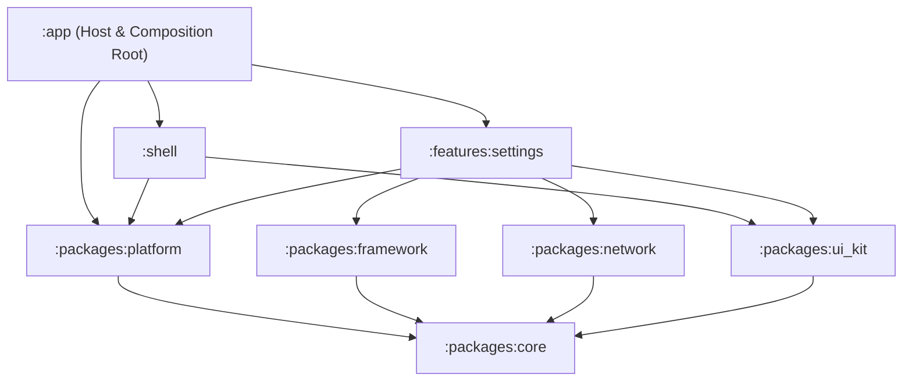
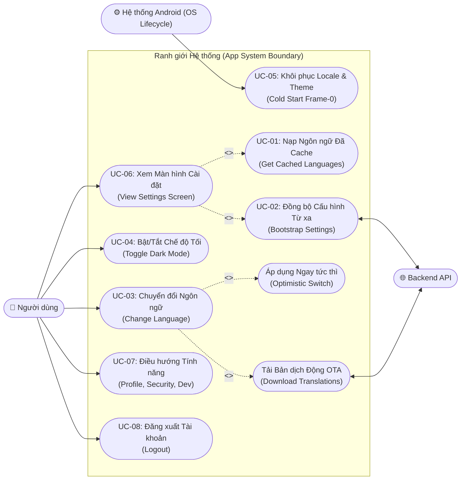
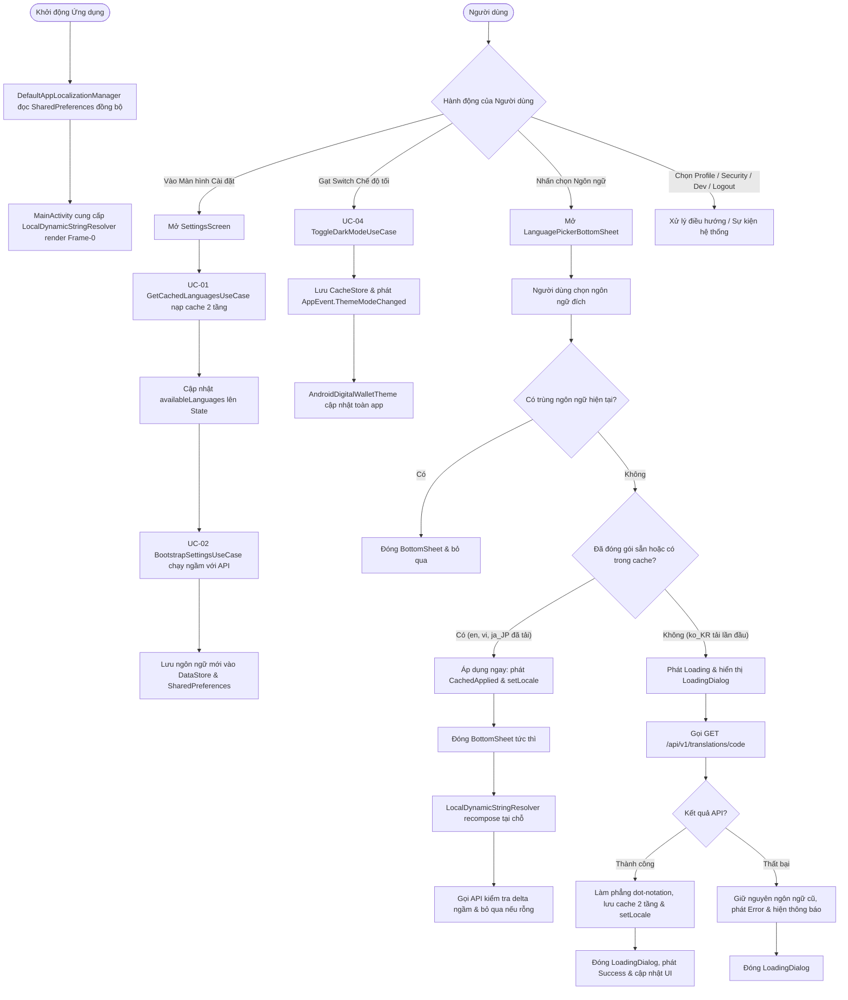
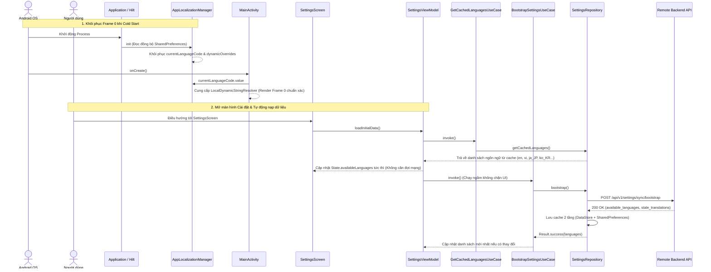
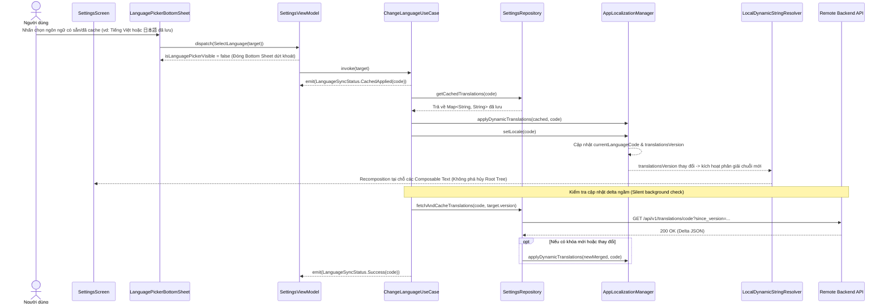
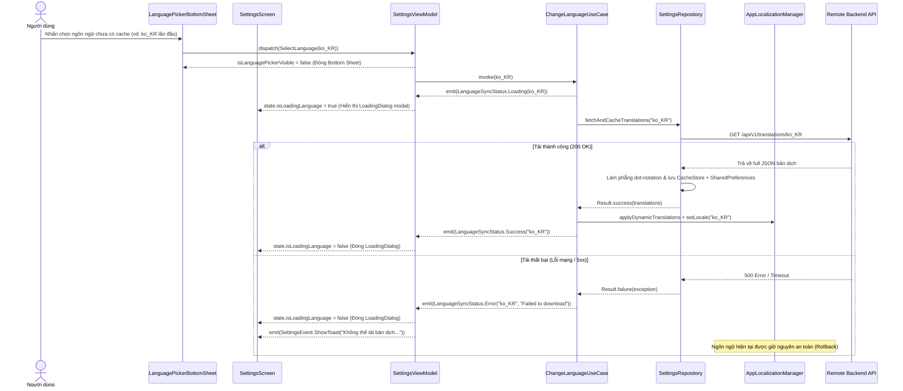

# Epic: Giao diện Cài đặt (Settings), Chế độ Tối (Dark Mode) & Đa ngôn ngữ Động (OTA Localization)

## 1. Thông tin chung (Meta Data)
- **Tên Epic**: `settings_language_darkmode`
- **Trạng thái**: Hoàn thành (Completed)
- **Phiên bản mục tiêu**: v1.0.0
- **Tài liệu đặc tả nguồn**: [2026-09-06-settings-language-darkmode-design.md](2026-09-06-settings-language-darkmode-design.md)
- **Kiến trúc mục tiêu**: Clean Architecture + MVI + Multi-Module Android (Kotlin 2.x, Jetpack Compose Material 3, Dagger Hilt)

---

## 2. Bối cảnh (Background)
Ứng dụng hiện tại có màn hình Cài đặt cơ bản dạng stub. Để đạt được tính tương thích và đồng bộ tính năng với template super app tham chiếu (iOS & Flutter), tính năng Cài đặt cần được nâng cấp để:
1. Cung cấp giao diện màn hình Cài đặt hiện đại, phân nhóm theo card bo tròn chuẩn thiết kế (Tài khoản, Tùy chọn, Dành cho nhà phát triển, Thông tin ứng dụng, Đăng xuất).
2. Quản lý Dark Mode tập trung, phản hồi tức thì trên toàn bộ cây giao diện của ứng dụng mà không cần khởi động lại Activity.
3. Hỗ trợ đa ngôn ngữ động qua mạng (OTA dynamic localization): đóng gói sẵn tiếng Anh (`en`) và tiếng Việt (`vi`) trong `strings.xml`, đồng thời tải động các ngôn ngữ bổ sung (ví dụ: tiếng Nhật `ja_JP`, tiếng Hàn `ko_KR`) theo nhu cầu từ backend API, đi kèm cơ chế đồng bộ ngầm lúc khởi tạo (silent bootstrap) và chuyển đổi giao diện mượt mà (optimistic UI).

---

## 3. Mục tiêu & Giới hạn (Goals & Non-Goals)

### Mục tiêu (Goals)
- **Chuẩn giao diện (UI Parity)**: Đạt 100% độ chính xác về mặt thị giác so với thiết kế với Jetpack Compose (4 nhóm card bo góc với icon tròn màu pastel, chevron, switch toggle, và nút đăng xuất màu đỏ riêng biệt).
- **Quản lý Theme toàn cục (Global Theme Management)**: `AppThemeManager` trong `:packages:platform` được lưu trữ bởi `CacheStore` (`:packages:core`) và phát sự kiện `AppEvent.ThemeModeChanged` qua `AppEventBus`.
- **Đa ngôn ngữ động qua mạng (OTA Dynamic Localization)**:
  - Khôi phục ngôn ngữ đã chọn và toàn bộ chuỗi bản dịch OTA ngay lập tức từ frame 0 lúc cold start.
  - Lưu trữ 2 tầng (dual-layer caching): lưu cả vào Jetpack DataStore (`CacheStore`) và `SharedPreferences` cho cả danh sách ngôn ngữ (`key_supported_languages`) và bản dịch động.
  - Khởi động nhanh với `GetCachedLanguagesUseCase`: nạp ngay danh sách các ngôn ngữ đã cache lên Bottom Sheet trước khi gọi đồng bộ mạng `bootstrapSettingsUseCase`.
  - Hiển thị Modal Bottom Sheet (`LanguagePickerBottomSheet`) với dấu tích chọn ngôn ngữ đang kích hoạt và biểu tượng tải cho ngôn ngữ chưa cache.
  - Áp dụng ngay (optimistic UI) cho ngôn ngữ đã lưu cache hoặc có sẵn; hiển thị modal `LoadingDialog` khi tải ngôn ngữ mới và có cơ chế rollback an toàn nếu lỗi mạng.
  - Tải `GET /api/v1/translations/{code}?since_version={version}` hỗ trợ cập nhật delta/full và làm phẳng thành `Map<String, String>` dạng dot-notation.
  - Hỗ trợ recomposition mượt mà không làm gián đoạn hay tự động đóng Bottom Sheet khi delta sync hoàn tất.
- **Chất lượng & Kiến trúc**: Tuân thủ tuyệt đối các quy tắc Konsist K1–K9, độ phủ kiểm thử đầy đủ theo quy trình BDD -> TDD cho tất cả các thành phần mới.

### Giới hạn (Non-Goals)
- Triển khai toàn bộ logic xác thực/2FA ở backend cho các mục điều hướng (các mục này duy trì dưới dạng stub điều hướng).
- Công cụ chuyển đổi tỷ giá tiền tệ phức tạp (chỉ hiển thị tùy chọn loại tiền tệ).

---

## 4. Kiến trúc & Thiết kế kỹ thuật (Architecture & Technical Design)

### Kiến trúc tổng thể (High-Level Architecture)


### 4.2 Biểu đồ Ca sử dụng chuẩn UML (UML Use Case Diagram)

Biểu đồ mô tả trực quan các Tác nhân (Actors), Ranh giới hệ thống (System Boundary) và các Ca sử dụng (Use Cases) của hệ thống Cài đặt, Theme và Đa ngôn ngữ:



### 4.3 Biểu đồ Hoạt động Nghiệp vụ (UML Activity Diagram / Complete Flowchart)

Biểu đồ thể hiện toàn bộ các luồng nghiệp vụ, rẽ nhánh điều kiện và cơ chế lưu trữ 2 tầng (Dual-layer persistence):



### 4.4 Các Sơ đồ Tuần tự Chi tiết (Sequence Diagrams)

#### **Sơ đồ 1: Khởi động Cold Start & Đồng bộ Nền khi mở Cài đặt**


#### **Sơ đồ 2: Chuyển đổi Ngôn ngữ Đã có Cache (Optimistic Switch & Recomposition Tại chỗ)**


#### **Sơ đồ 3: Tải Ngôn ngữ OTA Mới Chưa có Cache & Rollback Khi Lỗi**


### Chi tiết các Ca sử dụng nghiệp vụ (Domain Use Cases Specification)

#### **UC-01: GetCachedLanguagesUseCase (Nạp danh sách ngôn ngữ từ bộ nhớ đệm)**
- **Mục đích**: Cung cấp danh sách các ngôn ngữ được hỗ trợ (cả ngôn ngữ đóng gói sẵn và ngôn ngữ từ xa đã từng đồng bộ) ngay lập tức khi mở màn hình Cài đặt, không phải đợi kết nối mạng.
- **Actor**: `SettingsViewModel` (khi chạy `loadInitialData()`).
- **Input**: Không (`invoke()`).
- **Output**: `List<SupportedLanguage>`.
- **Preconditions**: Ứng dụng đã khởi chạy (đã có cấu hình mặc định trong APK hoặc từ lần đồng bộ trước).
- **Luồng xử lý chính**:
  1. Use case gọi `settingsRepository.getCachedLanguages()`.
  2. Repository truy vấn bộ nhớ đệm 2 tầng (`SettingsLocalDataSource`) từ `SharedPreferences` hoặc `CacheStore`.
  3. Trả về danh sách ngôn ngữ đã lưu (ví dụ: English, Tiếng Việt, 日本語, 한국어).
  4. ViewModel cập nhật ngay vào `SettingsState.availableLanguages`, giúp Bottom Sheet hiển thị ngay lập tức.

#### **UC-02: BootstrapSettingsUseCase (Đồng bộ cấu hình & siêu dữ liệu từ xa)**
- **Mục đích**: Đồng bộ ngầm với backend danh sách ngôn ngữ hỗ trợ mới nhất và kiểm tra các bản dịch bị cũ (`stale_translations`).
- **Actor**: `SettingsViewModel` (chạy ngầm sau khi đã nạp cache).
- **Input**: Không (`invoke()`).
- **Output**: `Result<List<SupportedLanguage>>`.
- **Luồng xử lý chính**:
  1. Use case gọi `settingsRepository.bootstrap()`.
  2. Repository gửi danh sách phiên bản ngôn ngữ đang có tới `POST /api/v1/settings/sync/bootstrap`.
  3. Server phản hồi danh sách ngôn ngữ hỗ trợ và các resource cần cập nhật.
  4. Repository lưu danh sách ngôn ngữ mới vào cả DataStore và `SharedPreferences` (`cacheSupportedLanguagesSync`).
  5. Trả về danh sách `SupportedLanguage` đã hợp nhất với các ngôn ngữ đóng gói sẵn (`en`, `vi`).
- **Luồng ngoại lệ / Lỗi mạng**: Nếu mất mạng hoặc API lỗi, repository trả về danh sách ngôn ngữ fallback an toàn từ local cache mà không làm sập ứng dụng.

#### **UC-03: ChangeLanguageUseCase (Chuyển đổi ngôn ngữ Optimistic & Tải OTA)**
- **Mục đích**: Thay đổi ngôn ngữ ứng dụng với cơ chế chuyển giao diện tức thì (Optimistic) cho ngôn ngữ đã có, hoặc tải động gói ngôn ngữ mới từ xa (OTA) khi chưa lưu cache.
- **Actor**: Người dùng (chọn ngôn ngữ trên `LanguagePickerBottomSheet`).
- **Input**: `targetLanguage: SupportedLanguage`.
- **Output**: `Flow<LanguageSyncStatus>` (`Loading`, `CachedApplied`, `Success`, `Error`).
- **Luồng chính A (Ngôn ngữ có sẵn trong APK hoặc đã lưu cache - vd: `en`, `vi`, hoặc `ja_JP` đã tải)**:
  1. Use case phát `LanguageSyncStatus.CachedApplied(code)`.
  2. Nạp bản dịch từ cache (nếu có) và áp dụng qua `appLocalizationManager.applyDynamicTranslations(cached, code)`.
  3. Áp dụng locale qua `appLocalizationManager.setLocale(code)`.
  4. Chạy ngầm `settingsRepository.fetchAndCacheTranslations(code, targetLanguage.version)` để kiểm tra delta update mà không chặn UI.
  5. Phát `LanguageSyncStatus.Success(code)`.
- **Luồng chính B (Ngôn ngữ mới chưa lưu cache - vd: `ko_KR` lần đầu)**:
  1. Use case phát `LanguageSyncStatus.Loading(code)`. UI hiển thị `LoadingDialog`.
  2. Gọi `settingsRepository.fetchAndCacheTranslations(code)` để tải toàn bộ bản dịch JSON từ `GET /api/v1/translations/{code}`.
  3. Dữ liệu được làm phẳng (flatten dot-notation), lưu vào cache 2 tầng và áp dụng vào `AppLocalizationManager`.
  4. Gọi `appLocalizationManager.setLocale(code)`.
  5. Phát `LanguageSyncStatus.Success(code)`. UI đóng `LoadingDialog`.
- **Luồng ngoại lệ / Lỗi mạng**:
  - Nếu tải bản dịch thất bại: Phát `LanguageSyncStatus.Error(code, message)`. Ứng dụng giữ nguyên ngôn ngữ hiện tại, đóng `LoadingDialog` và hiển thị thông báo lỗi.

#### **UC-04: ToggleDarkModeUseCase (Chuyển đổi chế độ Giao diện Sáng/Tối)**
- **Mục đích**: Thay đổi chế độ hiển thị toàn ứng dụng giữa Light Mode và Dark Mode.
- **Actor**: Người dùng (gạt toggle Dark Mode trên `SettingsScreen`).
- **Input**: `isDarkMode: Boolean`.
- **Output**: `Unit`.
- **Luồng xử lý chính**:
  1. Xác định `AppThemeMode` tương ứng (`DARK` nếu `true`, `LIGHT` nếu `false`).
  2. Gọi `appThemeManager.setThemeMode(mode)`.
  3. `AppThemeManager` lưu trạng thái vào `CacheStore`, cập nhật `isDarkMode: StateFlow<Boolean>`, và phát `AppEvent.ThemeModeChanged` qua `AppEventBus`.
  4. Toàn bộ cây Compose phản ứng mượt mà với theme mới thông qua `AndroidDigitalWalletTheme`.

#### **UC-05: Cold Start Restoration (Khôi phục cấu hình khi khởi động lại ứng dụng)**
- **Mục đích**: Đảm bảo ứng dụng khi mở lại (cold restart) hiển thị ngay lập tức đúng ngôn ngữ và theme người dùng đã chọn từ Frame 0, không bị nhấp nháy hay reset về cài đặt hệ thống.
- **Thực thi tại**: `DefaultAppLocalizationManager` & `MainActivity`.
- **Luồng xử lý**:
  1. Khi Application/Hilt khởi tạo singleton `DefaultAppLocalizationManager`, hàm `init` đọc đồng bộ mã ngôn ngữ đã chọn và toàn bộ bản dịch động từ `SharedPreferences`.
  2. `MainActivity.onCreate` lấy ngay `appLocalizationManager.currentLanguageCode.value` và cung cấp `LocalDynamicStringResolver`.
  3. Mọi text component sử dụng `appStringResource()` hiển thị chính xác bản dịch đã chọn mà không cần chờ coroutine mạng hay DataStore.

### 4.6 Kịch bản Kiểm thử Hành vi BDD Tổng hợp (Comprehensive BDD Test Scenarios)

Hệ thống kịch bản BDD theo chuẩn Gherkin (`Given - When - Then`) bao quát đầy đủ Happy Paths, Edge Cases, State Transitions, Race Conditions và Xử lý Lỗi:

```gherkin
Feature: Cài đặt, Chế độ tối & Đa ngôn ngữ động OTA (Settings, Dark Mode & Localization)
  Là một người dùng ứng dụng ví điện tử
  Tôi muốn tùy chỉnh giao diện sáng/tối và ngôn ngữ hiển thị mượt mà, tức thì
  Để có trải nghiệm cá nhân hóa tốt nhất và không bị gián đoạn khi mất kết nối mạng

  # ==========================================
  # Nhóm 1: Khởi động & Nạp dữ liệu (Startup & Caching)
  # ==========================================
  Scenario: [BDD-01] Khôi phục cấu hình Frame-0 khi Cold Start
    Given người dùng đã chọn ngôn ngữ "ja_JP" và theme "DARK" từ phiên trước
    When ứng dụng khởi động lại từ đầu (cold start)
    Then DefaultAppLocalizationManager đọc SharedPreferences đồng bộ ngay trong init
    And MainActivity render Frame-0 với giao diện Dark Mode và chuỗi tiếng Nhật chính xác
    And không bị nhấp nháy hay fallback về ngôn ngữ hệ thống

  Scenario: [BDD-02] Nạp tức thì danh sách ngôn ngữ đã lưu khi mở Cài đặt
    Given bộ nhớ đệm 2 tầng đã lưu các ngôn ngữ ["en", "vi", "ja_JP"]
    When người dùng điều hướng vào màn hình Cài đặt
    Then SettingsViewModel nạp ngay 3 ngôn ngữ từ GetCachedLanguagesUseCase lên State
    And danh sách ngôn ngữ hiển thị tức thì trên Bottom Sheet mà không cần chờ mạng
    And BootstrapSettingsUseCase được kích hoạt ngầm để kiểm tra cập nhật mới

  # ==========================================
  # Nhóm 2: Chế độ tối (Dark Mode)
  # ==========================================
  Scenario: [BDD-03] Bật chuyển đổi Chế độ tối
    Given màn hình Cài đặt đang ở chế độ Sáng (Light Mode)
    When người dùng gạt switch "Chế độ tối" sang Bật
    Then ToggleDarkModeUseCase được gọi với isDarkMode = true
    And AppThemeManager lưu cấu hình vào CacheStore và phát AppEvent.ThemeModeChanged
    And toàn bộ cây Compose cập nhật sang Dark Theme tức thì

  # ==========================================
  # Nhóm 3: Chuyển đổi Ngôn ngữ (Language Selection)
  # ==========================================
  Scenario: [BDD-04] Chuyển đổi ngôn ngữ có sẵn hoặc đã cache (Optimistic Switch)
    Given người dùng đang ở ngôn ngữ "en"
    And mở Bottom Sheet chọn ngôn ngữ "vi" (đóng gói sẵn) hoặc "ja_JP" (đã tải trước đó)
    When người dùng nhấn chọn ngôn ngữ đích
    Then Bottom Sheet đóng ngay lập tức
    And ChangeLanguageUseCase phát trạng thái CachedApplied
    And giao diện áp dụng ngôn ngữ mới ngay lập tức qua LocalDynamicStringResolver
    And một tác vụ chạy ngầm kiểm tra delta update mà không làm gián đoạn UI

  Scenario: [BDD-05] Chọn lại chính ngôn ngữ đang kích hoạt (Edge Case)
    Given ngôn ngữ hiện tại đang là "en"
    And Bottom Sheet chọn ngôn ngữ đang mở
    When người dùng nhấn chọn lại "en"
    Then Bottom Sheet đóng lại ngay lập tức
    And không có tác vụ tải mạng hay sự kiện đổi locale nào bị kích hoạt lại thừa thãi

  Scenario: [BDD-06] Tải mới ngôn ngữ OTA chưa có trong cache
    Given ngôn ngữ "ko_KR" chưa từng được tải về thiết bị
    When người dùng nhấn chọn "ko_KR" trên Bottom Sheet
    Then Bottom Sheet đóng lại và hiển thị LoadingDialog "Đang chuyển đổi ngôn ngữ..."
    And ChangeLanguageUseCase phát trạng thái Loading
    And hệ thống tải full JSON từ GET /api/v1/translations/ko_KR
    And lưu bản dịch và danh sách ngôn ngữ vào cache 2 tầng (DataStore + SharedPreferences)
    And LoadingDialog đóng lại, ngôn ngữ tiếng Hàn được áp dụng trên toàn app

  # ==========================================
  # Nhóm 4: Xử lý Lỗi Mạng & Bất đồng bộ (Resilience & Race Conditions)
  # ==========================================
  Scenario: [BDD-07] Lỗi mạng khi tải ngôn ngữ mới (Graceful Rollback)
    Given ngôn ngữ "ko_KR" chưa có trong cache
    And kết nối mạng bị mất hoặc máy chủ trả về mã lỗi 500
    When người dùng chọn "ko_KR"
    Then LoadingDialog hiển thị và đóng lại sau khi có lỗi
    And ChangeLanguageUseCase phát trạng thái Error
    And ứng dụng giữ nguyên an toàn ngôn ngữ hiện tại mà không bị vỡ giao diện
    And phát sự kiện ShowToast thông báo lỗi cho người dùng

  Scenario: [BDD-08] Chọn liên tiếp nhiều ngôn ngữ cực nhanh (Race Condition)
    Given người dùng mở Bottom Sheet chọn ngôn ngữ
    When người dùng nhấn liên tiếp thật nhanh "ko_KR" rồi đến "ja_JP"
    Then tác vụ tải ngầm đang chạy của "ko_KR" bị hủy bỏ ngay lập tức (cancel in-flight job)
    And chỉ có ngôn ngữ cuối cùng "ja_JP" được thực thi và áp dụng lên State

  Scenario: [BDD-09] Nhận delta update rỗng từ server (Non-destructive update)
    Given backend trả về gói delta update với translations rỗng và deleted_keys rỗng
    When SettingsRepository xử lý kết quả
    Then bỏ qua việc gọi applyDynamicTranslations
    And không làm tăng translationsVersion, ngăn chặn việc giật/redraw giao diện không cần thiết
```

---

## 5. Chiến lược triển khai & Giảm thiểu rủi ro (Rollout Strategy & Mitigation)
- **Triển khai từng giai đoạn (Phased Rollout)**: Xây dựng tầng hạ tầng trước (`:packages:platform`), kế đến tầng dữ liệu & domain, sau cùng là UI và tích hợp gốc.
- **Dung sai lỗi an toàn (Graceful Fallback)**: Nếu tải bản dịch từ xa thất bại, ứng dụng vẫn giữ nguyên ngôn ngữ hiện hành và hiện thông báo lỗi nhẹ nhàng, không gây gián đoạn hay crash ứng dụng.
- **Lưu trữ bền vững (Cache Persistence)**: Các bản dịch và danh sách ngôn ngữ đã tải được lưu an toàn 2 tầng qua Jetpack DataStore (`CacheStore`) và `SharedPreferences` (`app_preferences`).
- **Phân giải chuỗi runtime (In-place Recomposition)**: Sử dụng `LocalDynamicStringResolver` kết hợp `remember(currentLanguageCode, translationsVersion)` để recompose chính xác từng Composable mà không cần hủy toàn bộ cây View hoặc khởi động lại Activity.

---

## 6. Nhật ký Khắc phục Lỗi & Cải tiến Thực tế (Bug Fixes & Refinements)

Trong quá trình hoàn thiện và kiểm thử thực tế trên thiết bị giả lập, các lỗi và điểm tối ưu hóa sau đã được phát hiện và giải quyết triệt để:

### 1. Khắc phục lỗi Cold Start Reset về Ngôn ngữ Hệ thống & Thiếu Bản dịch OTA
- **Vấn đề**: Khi tắt hẳn app và mở lại (cold restart), ứng dụng load lại theo locale mặc định của hệ thống thay vì ngôn ngữ người dùng đã chọn trước đó, đồng thời các chuỗi OTA (ví dụ tiếng Nhật `ja_JP`) bị rỗng khiến app fallback về tiếng Anh/Việt.
- **Nguyên nhân**: `DefaultAppLocalizationManager` khởi tạo `_currentLanguageCode` bất đồng bộ từ `CacheStore`, khiến `MainActivity` lúc tạo bị lấy mặc định `"en"` và gọi `AppCompatDelegate.setApplicationLocales("en")`, ghi đè lên cấu hình cũ. Thêm vào đó, `dynamicOverrides` không tự động đọc lại các bản dịch đã tải từ đĩa khi vừa khởi động.
- **Giải pháp**:
  - `DefaultAppLocalizationManager` đọc `SharedPreferences` đồng bộ ngay trong hàm khởi tạo `init`: ưu tiên `KEY_APP_LANGUAGE` -> `AppCompatDelegate.getApplicationLocales()` -> system locale.
  - Tải đồng bộ toàn bộ chuỗi bản dịch từ `SharedPreferences` cho ngôn ngữ đã chọn vào `dynamicOverrides` ngay từ frame 0.
  - `MainActivity` khởi tạo `currentLanguageCode` từ `appLocalizationManager.currentLanguageCode.value`.

### 2. Khắc phục lỗi Giật/Tự động đóng Bottom Sheet khi Mở nhanh
- **Vấn đề**: Người dùng chọn ngôn ngữ (ví dụ Tiếng Việt), Bottom Sheet đóng lại và áp dụng ngay. Khi người dùng mở lại Bottom Sheet thật nhanh, Bottom Sheet đột ngột bị đóng rồi mở lại sau đó.
- **Nguyên nhân**: `MainActivity` bọc toàn bộ cây Compose trong `key(currentLanguageCode, translationsVersion)`. Khi delta update chạy ngầm tải xong và gọi `applyDynamicTranslations`, `translationsVersion` bị tăng lên dẫn đến việc Compose hủy bỏ và dựng lại toàn bộ cây giao diện (kể cả Bottom Sheet đang mở).
- **Giải pháp**:
  - Loại bỏ wrapper `key(...)` ở cấp root của `MainActivity`.
  - Chuyển sang cơ chế recomposition tại chỗ (fine-grained recomposition) thông qua `LocalDynamicStringResolver` với `remember(currentLanguageCode, translationsVersion) { appLocalizationManager::getString }`.
  - Trong `DefaultSettingsRepository` và `applyDynamicTranslations`: Thêm điều kiện bỏ qua nếu delta rỗng (`flattened.isEmpty()`) hoặc nội dung bản dịch không thay đổi so với bộ nhớ.

### 3. Cache & Tải Danh sách Ngôn ngữ khi Khởi động (`GetCachedLanguagesUseCase`)
- **Vấn đề**: Ban đầu, `SettingsViewModel` khởi tạo với danh sách ngôn ngữ mặc định chỉ gồm `en` và `vi`. Danh sách các ngôn ngữ bổ sung (`ja_JP`, `ko_KR`) chỉ xuất hiện sau khi gọi `bootstrapSettingsUseCase` qua mạng. Nếu người dùng offline hoặc mở picker ngay khi vào màn hình, các ngôn ngữ đã tải trước đó không xuất hiện.
- **Giải pháp**:
  - Tạo `GetCachedLanguagesUseCase` trong `features/settings/domain/usecase/`.
  - Bổ sung cơ chế lưu `KEY_SUPPORTED_LANGUAGES` vào `SharedPreferences` trong `SettingsLocalDataSource` song song với `CacheStore`.
  - Trong `SettingsViewModel.loadInitialData()`, nạp ngay danh sách ngôn ngữ từ cache qua `getCachedLanguagesUseCase()` trước khi gọi API `bootstrapSettingsUseCase()`.

### 4. Tự động Phân giải Tên Ngôn ngữ hiển thị (Dynamic Locale Name Resolution)
- **Vấn đề**: Việc hardcode thủ công (`"ja" -> "日本語"`, `"ko" -> "한국어"`) dễ gây lỗi khi mở rộng thêm ngôn ngữ mới.
- **Giải pháp**: Cập nhật `resolveLanguageName` tìm kiếm theo model `SupportedLanguage` đã cache; nếu chưa có trong cache thì phân giải tự động bằng `java.util.Locale.forLanguageTag(code).getDisplayLanguage(locale)`.

---

## 7. Phân rã công việc Kanban (Kanban Tasks Breakdown)
Tất cả các task đã được thực hiện và lưu trữ tại thư mục `.devtool/features/done/`:
1. [x] [Task 1: Hạ tầng Theme & Đa ngôn ngữ Platform](../../features/done/task_1_platform_theme_localization_infrastructure.md)
2. [x] [Task 2: Tích hợp API Từ xa & Tầng Dữ liệu Settings](../../features/done/task_2_settings_data_layer_api_integration.md)
3. [x] [Task 3: Các Use Case Điều phối Nghiệp vụ Settings](../../features/done/task_3_settings_domain_orchestration_usecases.md)
4. [x] [Task 4: MVI ViewModel Tầng Presentation](../../features/done/task_4_settings_presentation_mvi_viewmodel.md)
5. [x] [Task 5: Giao diện Card Settings & Bottom Sheet Chọn Ngôn ngữ](../../features/done/task_5_settings_card_ui_language_bottom_sheet.md)
6. [x] [Task 6: Tích hợp Toàn diện Ứng dụng & Kiểm định Chất lượng](../../features/done/task_6_root_composition_app_wiring.md)
