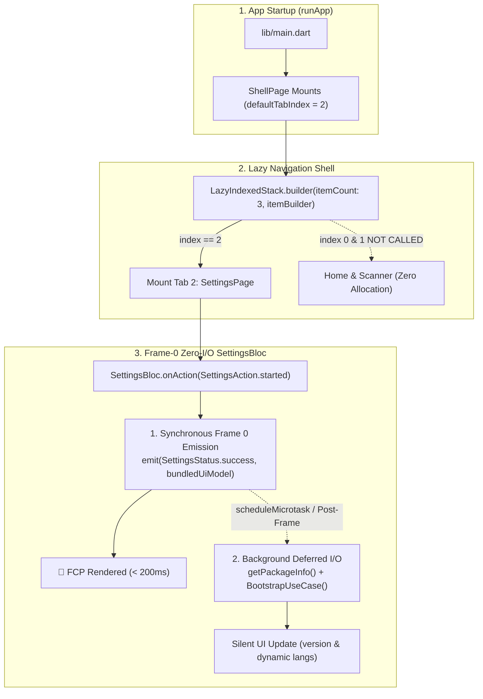

# Design Specification — Startup Rendering & Shell Lazy Builder Optimization

- **Author**: Antigravity Pair Programming
- **Date**: 2026-09-17
- **Epic**: `startup_rendering_optimization`
- **Status**: Draft (In Review)

---

## 1. Problem Statement & Baseline Telemetry

From empirical telemetry gathered on **iPhone 17 Pro Simulator (iOS 26.5, Metal Impeller)**:
- **Total Cold Start to FCP**: `552.3 ms`
- **Total Time To Interactive (TTI)**: `554.8 ms`
- **Engine & Binding Init**: `24.6 ms` (4.4%)
- **Dependency Injection (GetIt)**: `40.5 ms` (7.3%)
- **Core Services & Initializers**: `18.2 ms` (3.3%)
- **Widget Tree Build (runApp) to FCP**: **`468.2 ms` (84.4% of total cold start!)**

### Root Causes Identified
1. **Eager Object Instantiation in `LazyIndexedStack`**:
   `LazyIndexedStack` previously required `children: List<Widget>`. Even though offscreen tabs were swapped with `SizedBox.shrink()` in the Element tree, the Dart runtime still allocated and instantiated all child widgets (`HomeDashboardPage`, `ScannerPage`, `SettingsPage`) and their wrappers on every shell build pass.
2. **Active Tab Frame-0 I/O & Network Overhead**:
   Per project design specifications, `ShellConfig.defaultTabIndex = 2` (`SettingsPage`) is the mandatory active startup tab. Upon mounting on Frame 0, `SettingsPage` triggered `SettingsAction.started()`. In `SettingsBloc`, `_onStarted` sequentially blocked on:
   - `_appInfoService.getPackageInfo()` (Platform Channel call to native OS)
   - `_bootstrapUseCase()` (HTTP POST request to `http://127.0.0.1:8888/api/v1/settings/sync/bootstrap`)
   This delayed state emission and held up the first contentful paint.

---

## 2. Target KPIs

| Metric | Current Baseline | Target Post-Optimization |
| :--- | :--- | :--- |
| **Widget Tree Build (`runApp` to FCP)** | `468.2 ms` | **< 200.0 ms** |
| **Total Cold Start (FCP)** | `552.3 ms` | **< 280.0 ms** |
| **Inactive Tabs Built at Startup (Home, Scanner)** | 2 widgets allocated | **0 allocations (100% deferred)** |
| **Frame-0 Platform Channel & Network Calls** | 2 calls blocking | **0 calls blocking Frame 0** |

---

## 3. Architecture & Technical Solution



---

## 4. Component Changes & Implementation Details

### 4.1. True Lazy Builder for `LazyIndexedStack` (`packages/ui_kit`)
Refactor `packages/ui_kit/lib/widgets/lazy_indexed_stack.dart` to support builder-based lazy evaluation:
```dart
typedef NullableIndexedWidgetBuilder = Widget? Function(BuildContext context, int index);

class LazyIndexedStack extends StatefulWidget {
  const LazyIndexedStack({
    super.key,
    required this.index,
    required this.itemCount,
    required this.itemBuilder,
    this.alignment = AlignmentDirectional.topStart,
    this.textDirection,
    this.sizing = StackFit.loose,
  });

  final int index;
  final int itemCount;
  final NullableIndexedWidgetBuilder itemBuilder;
  ...
}
```
- Only invokes `itemBuilder(context, i)` when `i` has been activated (added to `_activatedIndices`).
- Inactive tabs receive `const SizedBox.shrink()` without evaluating the builder function.
- Preserves mounted state of previously activated tabs.

### 4.2. `ShellPage` Wiring (`lib/shell/shell_page.dart`)
- Update `ShellPage.handleState` to use `LazyIndexedStack.builder` or `itemBuilder`.
- Preserve `ShellConfig.defaultTabIndex = 2` as required.
- Only the builder for index 2 (`SettingsPage`) executes on launch.

### 4.3. Non-blocking Frame-0 `SettingsBloc` (`features/settings`)
Refactor `SettingsBloc._onStarted` in `features/settings/lib/presentation/settings/settings_bloc.dart`:
```dart
Future<void> _onStarted(
  SettingsActionStarted action,
  Emitter<SettingsState> emit,
) async {
  // 1. Frame-0 fast-path: emit synchronous initial state with bundled defaults
  final initialUiModel = SettingsUiModel(
    id: 'local',
    appVersion: state.uiModel?.appVersion ?? '1.0.0',
    buildNumber: state.uiModel?.buildNumber ?? '1',
    isDarkModeEnabled: ThemeManager.instance.isDarkMode,
    availableLanguages: GetCachedLanguagesUseCase.defaultBundledLanguages,
  );
  emit(state.copyWith(status: SettingsStatus.success, uiModel: initialUiModel));

  // 2. Defer heavy platform channel & network calls to background execution
  unawaited(_executeBackgroundSync(emit));
}
```
- Frame 0 renders in < 10ms without waiting for native platform channels or network connectivity.
- `unawaited(_executeBackgroundSync(emit))` fetches actual `PackageInfo` and calls `BootstrapUseCase` in the background, smoothly updating state if and when the response arrives.

---

## 5. BDD Acceptance Criteria

```gherkin
Feature: Startup Rendering & Lazy Shell Optimization

  Scenario: Inactive tabs are not evaluated on cold start
    Given ShellConfig.defaultTabIndex is 2
    When ShellPage mounts for the first time
    Then LazyIndexedStack.itemBuilder should be invoked for index 2
    And LazyIndexedStack.itemBuilder should NOT be invoked for index 0 or index 1
    And HomeDashboardPage and ScannerPage should not be instantiated

  Scenario: SettingsPage renders Frame 0 without blocking on I/O
    Given SettingsPage is the active startup page
    When SettingsBloc receives SettingsActionStarted
    Then SettingsBloc should emit SettingsStatus.success synchronously
    And the initial UI model should be displayed immediately
    And package info and bootstrap network requests should run in background without delaying Frame 0

  Scenario: End-to-end cold start telemetry performance budget
    Given the application starts on a simulator or device
    When ShellPage completes its first frame callback
    Then ColdStartReport.totalToFcp should be less than 350 milliseconds in test/debug
    And ColdStartReport.totalToTti should be less than 400 milliseconds
```

---

## 6. Verification & Quality Plan

1. **Unit & Widget Tests**:
   - `packages/ui_kit/test/widgets/lazy_indexed_stack_test.dart`: verify builder is only called for activated indices.
   - `features/settings/test/presentation/settings/settings_bloc_test.dart`: verify synchronous Frame-0 emission and detached background sync.
2. **Quality Gate (`quality_check`)**:
   - Tier A: Unit tests across `packages/ui_kit`, `features/settings`, and host app.
   - Tier B: `fvm flutter analyze` (0 errors, 0 warnings), license headers, module boundaries.
   - Tier C2: Clean, native build smoke test, and simulator run measuring new telemetry metrics.
