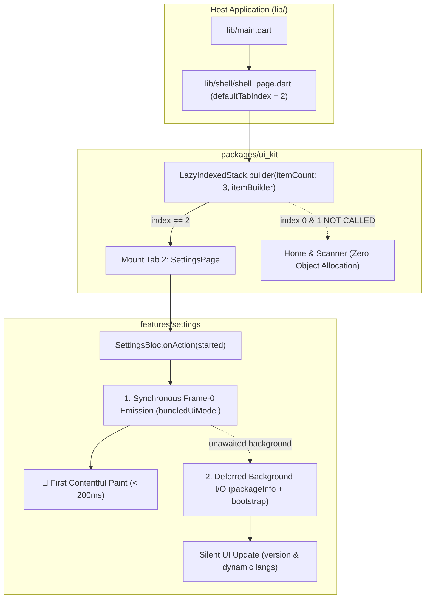
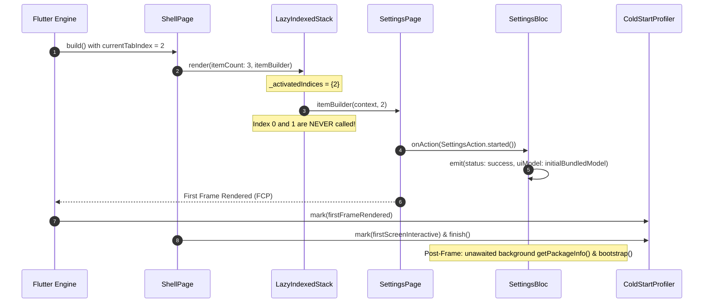

# Epic Overview — Startup Rendering & Shell Lazy Builder Optimization

## 1. Meta Data
- **Epic Name**: `startup_rendering_optimization`
- **Status**: Done
- **Target Release**: v1.1.0
- **Platform**: Flutter (iOS / Android)
- **Source Spec**: [2026-09-17-startup-rendering-optimization-design.md](2026-09-17-startup-rendering-optimization-design.md)

---

## 2. Background & Problem Statement
During initial cold start profiling on **iPhone 17 Pro Simulator (Metal Impeller)**, total cold start time was measured at **552.3 ms to FCP** and **554.8 ms to TTI**.
Empirical telemetry revealed that **`Widget Tree Build (runApp) to FCP` accounts for 468.2 ms (84.4%)** of the entire cold start duration.

Deep investigation identified two primary architectural bottlenecks:
1. **Eager Instantiation in `LazyIndexedStack`**:
   The existing `LazyIndexedStack` accepts `children: List<Widget>`. Even though offscreen tab widgets are swapped with `SizedBox.shrink()` in the Element tree, the Dart runtime still evaluates, allocates, and instantiates all tab widgets (`HomeDashboardPage`, `ScannerPage`, `SettingsPage`) during the initial Shell build.
2. **Active Startup Tab (`SettingsPage`, `defaultTabIndex = 2`) Frame-0 I/O & Network Blocking**:
   Per project design constraints, `ShellConfig.defaultTabIndex = 2` (`SettingsPage`) is the mandatory active startup tab. Upon mounting, `SettingsPage` dispatches `SettingsAction.started()`, which sequentially awaits native platform channels (`package_info_plus`) and initiates an HTTP POST bootstrap sync to `http://127.0.0.1:8888/api/v1/settings/sync/bootstrap`, delaying Frame-0 state emission and FCP.

---

## 3. Goals & Non-Goals

### Goals
- **Eliminate Eager Inactive Tab Instantiation**: Convert `LazyIndexedStack` to a true `itemBuilder` pattern where tabs 0 and 1 are never called or constructed when starting on tab 2.
- **Zero-I/O Frame-0 for `SettingsBloc`**: Emit synchronous initial UI state in `_onStarted` with bundled defaults, deferring native platform channels and network bootstrap to background execution after Frame 0.
- **Performance Budget**: Reduce `Widget Tree Build (runApp) to FCP` from **468.2 ms** to **< 200 ms**, reducing total cold start to **< 280 ms**.
- **Preserve Mandatory Tab Requirement**: Keep `ShellConfig.defaultTabIndex = 2` intact.

### Non-Goals
- Changing visual layout, card design, typography, or styling of `SettingsPage` or `HomeDashboardPage`.
- Changing default tab index to 0 (Home).
- Modifying business logic or error handling of `BootstrapUseCase`.

---

## 4. Architecture & Technical Design

### High-Level Architecture

### Sequence Flow

---

## 5. BDD Test Scenarios Overview

See [bdd_scenarios.md](bdd_scenarios.md) for full Gherkin specifications covering:
- **Use Case 1**: Lazy Builder Tab Instantiation (Index 2 only).
- **Use Case 2**: SettingsBloc Frame-0 Instant Render & Detached Background Sync.
- **Use Case 3**: Tab Switching & State Retention.
- **Use Case 4**: Cold Start Telemetry Budget & Resilience.

---

## 6. Rollout Strategy & Mitigation
- **Safety**: Fully backward compatible. `LazyIndexedStack` builder pattern completely preserves existing navigation and tab state persistence.
- **Fallback**: If background bootstrap fails, the app functions normally using bundled languages and default config without throwing unhandled exceptions.
- **Quality Gate**: Verification via 3-Tier tests and real simulator telemetry benchmarking.

---

## 7. Kanban Tasks Breakdown

1. [Task 01: True Lazy Builder for LazyIndexedStack](task_01_lazy_indexed_stack_builder.md)
2. [Task 02: Zero-I/O Frame-0 for SettingsBloc](task_02_settings_bloc_zero_io_frame_zero.md)
3. [Task 03: ShellPage Lazy Wiring & Regression Verification](task_03_shell_page_lazy_wiring.md)
4. [Task 04: Acceptance Telemetry & Performance Benchmarking](task_04_startup_rendering_acceptance_and_benchmarking.md)
