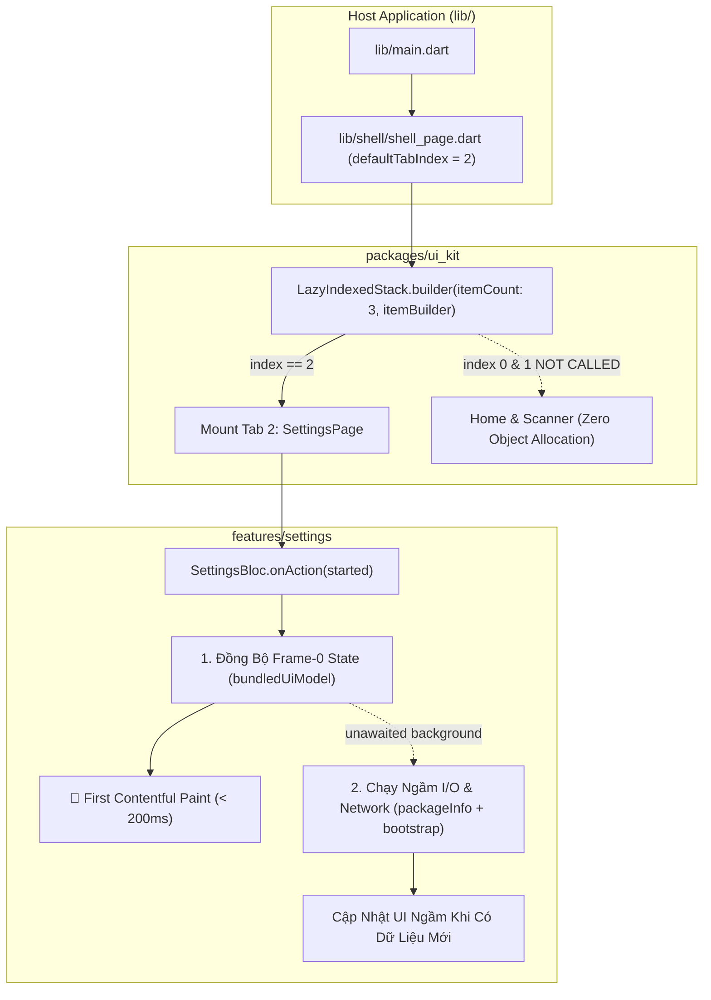
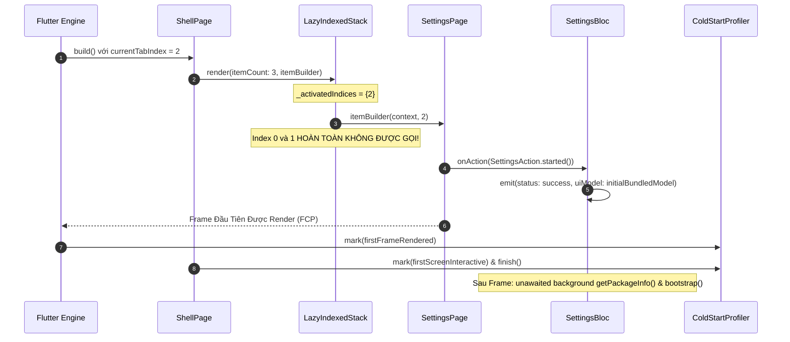

# Tổng Quan Epic — Tối Ưu Hóa Rendering Khởi Động & Shell Lazy Builder

## 1. Thông Tin Chung (Meta Data)
- **Tên Epic**: `startup_rendering_optimization`
- **Trạng Thái**: Done
- **Phiên Bản Dự Kiến**: v1.1.0
- **Nền Tảng**: Flutter (iOS / Android)
- **Tài Liệu Nguồn**: [2026-09-17-startup-rendering-optimization-design.md](2026-09-17-startup-rendering-optimization-design.md)

---

## 2. Bối Cảnh & Vấn Đề Kỹ Thuật
Trong quá trình đo lường hiệu năng cold start thực tế trên **iPhone 17 Pro Simulator (Metal Impeller)**:
- Tổng thời gian cold start đạt **552.3 ms (to FCP)** và **554.8 ms (TTI)**.
- Số liệu telemetry cho thấy **`Widget Tree Build (runApp) to FCP` chiếm tới 468.2 ms (84.4%)** tổng thời gian khởi động!

Phân tích sâu đã chỉ rõ hai điểm nghẽn kiến trúc cốt lõi:
1. **Khởi Tạo Đối Tượng Eager trong `LazyIndexedStack`**:
   `LazyIndexedStack` hiện tại nhận tham số `children: List<Widget>`. Mặc dù các tab không active bị thay thế bằng `SizedBox.shrink()` trong Element tree, nhưng runtime của Dart vẫn phải cấp phát và chạy constructor cho toàn bộ các widget con (`HomeDashboardPage`, `ScannerPage`, `SettingsPage`) trong mỗi lần `ShellPage` build.
2. **Tab Khởi Động Mặc Định (`SettingsPage`, `defaultTabIndex = 2`) Bị Chặn Bởi I/O & Network Ngay Frame 0**:
   Theo đúng yêu cầu thiết kế của dự án, `ShellConfig.defaultTabIndex = 2` (`SettingsPage`) là tab bắt buộc phải hiển thị khi mở app. Khi mount, `SettingsPage` phát sự kiện `SettingsAction.started()`, khiến `SettingsBloc` tuần tự chờ native platform channel (`package_info_plus`) và gửi request HTTP POST bootstrap đến `http://127.0.0.1:8888/api/v1/settings/sync/bootstrap`, làm trì hoãn phát sinh state và kéo dài FCP.

---

## 3. Mục Tiêu & Giới Hạn Phạm Vi

### Mục Tiêu (Goals)
- **Xóa Bỏ Khởi Tạo Eager Của Các Tab Không Active**: Chuyển `LazyIndexedStack` sang mô hình `itemBuilder` thực thụ, đảm bảo khi mở app ở tab 2, Tab 0 (Home) và Tab 1 (Scanner) **hoàn toàn không được gọi hay cấp phát bộ nhớ**.
- **Frame-0 Zero-I/O Cho `SettingsBloc`**: Phát state giao diện ban đầu đồng bộ trong `_onStarted` với dữ liệu mặc định đóng gói sẵn, đẩy các tác vụ platform channel và network bootstrap ra chạy ngầm sau khi Frame 0 đã vẽ xong.
- **Chỉ Tiêu Hiệu Năng (KPIs)**: Giảm thời gian `Widget Tree Build (runApp) to FCP` từ **468.2 ms** xuống **< 200 ms**, rút ngắn tổng thời gian khởi động xuống **< 280 ms**.
- **Bảo Toàn Yêu Cầu Thiết Kế**: Giữ nguyên `ShellConfig.defaultTabIndex = 2`.

### Giới Hạn (Non-Goals)
- Không thay đổi thiết kế giao diện, bố cục thẻ, font chữ hay style của `SettingsPage` hoặc `HomeDashboardPage`.
- Không đổi tab mặc định về 0 (Home).
- Không sửa đổi business logic hay cơ chế xử lý lỗi của `BootstrapUseCase`.

---

## 4. Kiến Trúc & Thiết Kế Kỹ Thuật

### Sơ Đồ Kiến Trúc Tổng Thể

### Luồng Tuần Tự Khởi Động (Sequence Flow)

---

## 5. Danh Sách Kịch Bản Kiểm Thử BDD

Xem chi tiết tại [bdd_scenarios.md](bdd_scenarios.md) bao gồm:
- **Use Case 1**: Khởi tạo tab theo cơ chế Lazy Builder (chỉ gọi Index 2).
- **Use Case 2**: Render tức thì Frame 0 trong SettingsBloc và chạy ngầm I/O.
- **Use Case 3**: Chuyển đổi tab và lưu giữ trạng thái.
- **Use Case 4**: Kiểm chuẩn ngân sách hiệu năng Cold Start Telemetry.

---

## 6. Chiến Lược Triển Khai & Kiểm Soát Rủi Ro
- **Tính an toàn**: Tương thích ngược hoàn toàn. Builder pattern của `LazyIndexedStack` bảo toàn 100% tính năng điều hướng và lưu giữ state của tab đã mở.
- **Phương án dự phòng**: Nếu background bootstrap gặp lỗi mạng, app vẫn hoạt động trơn tru với ngôn ngữ và cấu hình mặc định, không bao giờ bị crash.
- **Kiểm định chất lượng**: Kiểm thử toàn diện qua 3-Tier testing suite và chạy simulator benchmarking.

---

## 7. Phân Rã Các Tasks Kanban

1. [Task 01: True Lazy Builder cho LazyIndexedStack](task_01_lazy_indexed_stack_builder.md)
2. [Task 02: Zero-I/O Frame-0 cho SettingsBloc](task_02_settings_bloc_zero_io_frame_zero.md)
3. [Task 03: Tích Hợp ShellPage với Lazy Builder & Kiểm Tra Hồi Quy](task_03_shell_page_lazy_wiring.md)
4. [Task 04: Acceptance Telemetry & Đo Lường Hiệu Năng Thực Tế](task_04_startup_rendering_acceptance_and_benchmarking.md)
