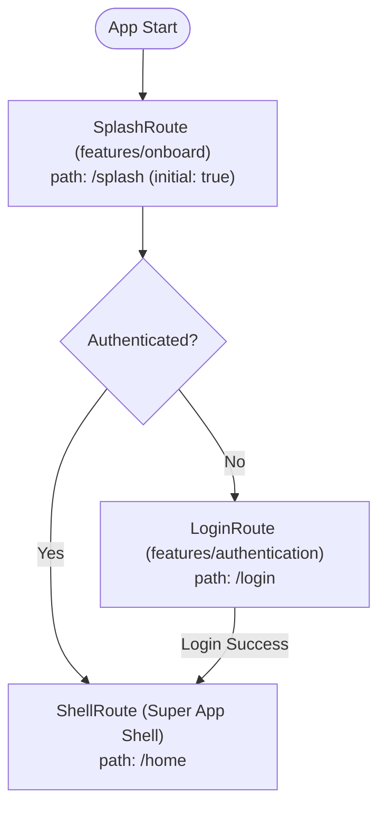
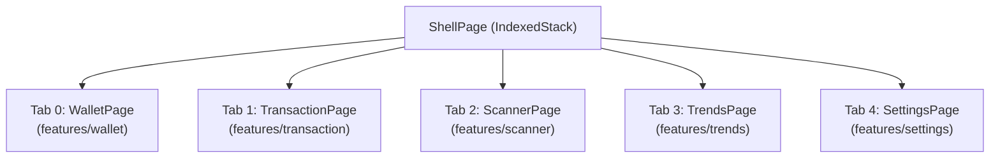
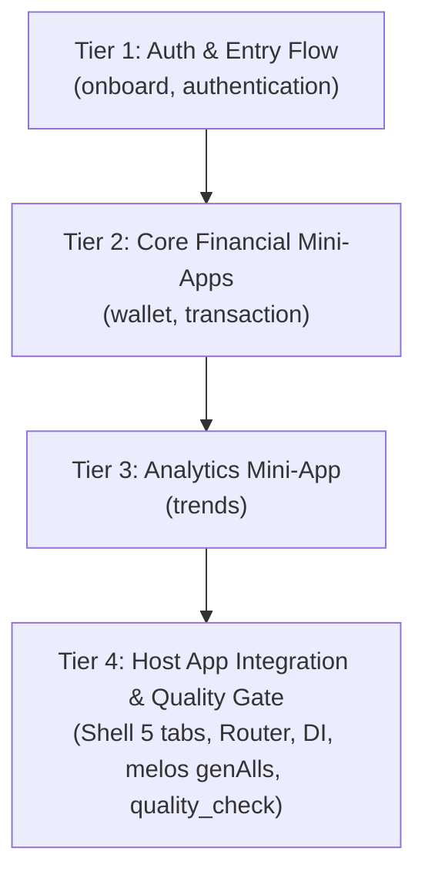

# Super App Features Migration Design Spec

- **Date:** 2026-09-16
- **Epic Slug:** `super_app_features_migration`
- **Scope:** Migrate and standardize legacy feature modules (`authentication`, `onboard`, `wallet`, `transaction`, `trends`) from `danhdue/full_features` into the clean Super App template architecture on `danhdue/develop`.
- **Target Branch / Base:** `danhdue/develop`
- **Status:** In Review (Gate 1)

---

## 1. Executive Summary & Problem Statement

The Super App codebase has been restructured into a clean template repository (`danhdue/develop`), establishing modern foundations:
- Module separation: `features/` for Mini-Apps and `packages/` for shared infrastructure.
- Dart / Flutter Pub Workspace configuration (`workspace:` resolution).
- Fault isolation via `MiniAppErrorBoundary`.
- Modernized toolchain: Slang v4, AutoRoute v10, Freezed v3, Injectable v2.

However, the current template only contains skeleton / demo code for `settings` and `scanner`, along with a basic `HomeDashboardPage`. The legacy branch (`danhdue/full_features`) contains complete demo implementations of `authentication`, `onboard`, `wallet`, `transaction`, and `trends` that resided in the legacy `packages/` directory.

This epic governs the professional migration of these 5 features into the Super App architecture:
1. Scaffolding each feature package using the new Mason brick (`pac_mvi_feature`) directly into `features/`.
2. Applying TDD and referencing legacy code to adapt domain entities, data sources, usecases, BLoCs (MVI), and UI components to the new architecture.
3. Integrating the features into the Host App Shell (Splash $\rightarrow$ Login $\rightarrow$ 5-Tab Shell) with error boundary wrapping.
4. Ensuring quality through platform-aware 3-Tier tests and semantic audits via `@quality_check`.

---

## 2. Architecture & Directory Blueprint

### 2.1 Workspace Structure

```
bloc_digital_wallet/
├── pubspec.yaml                     # Root workspace definition
├── melos.yaml                       # Melos workspace scripts & package patterns
├── features/                        # Dedicated autonomous Mini-Apps
│   ├── authentication/              # Login, Auth Bloc, Token Storage, Interceptors
│   ├── onboard/                     # Splash Screen, Intro, Launch Routing
│   ├── wallet/                      # Wallet Dashboard, Tokens, NFTs, Network Selection
│   ├── transaction/                 # Transaction History, Transfer, Details
│   ├── trends/                      # Market trends, Price charts, Analytics
│   ├── scanner/                     # (Existing) QR/Barcode scanner mini-app
│   └── settings/                    # (Existing) Settings, Theme, Localization, Profile
└── packages/                        # Shared infrastructure (non-feature modules)
    ├── core/                        # Base primitives, common utilities
    ├── framework/                   # BaseMviPage, BaseBloc, MiniAppErrorBoundary
    ├── logger/                      # Centralized Talker logging
    ├── logger_native_bridge/        # Native bridge logger
    ├── native_security/             # SSL Pinning & native security hooks
    ├── network/                     # Dio HTTP client, interceptor chain
    ├── platform/                    # Deeplink coordinator & OS capabilities
    └── ui_kit/                      # Common design tokens, buttons, theme tailoring
```

> **Cleanup Requirement:** The empty/obsolete directories `packages/authentication`, `packages/onboard`, `packages/wallet`, `packages/transaction`, `packages/trends`, and `packages/home` will be completely removed.

### 2.2 Pub Workspace Configuration

Each feature package's `pubspec.yaml` will declare:
```yaml
resolution: workspace
```
And the root `pubspec.yaml` will include all active feature packages:
```yaml
workspace:
  - packages/core
  - packages/framework
  - packages/logger
  - packages/logger_native_bridge
  - packages/native_security
  - packages/network
  - packages/platform
  - packages/ui_kit
  - features/scanner
  - features/settings
  - features/onboard
  - features/authentication
  - features/wallet
  - features/transaction
  - features/trends
```

---

## 3. Navigation & Super App Shell Experience

### 3.1 App Launch & Route Hierarchy

The application entry and authentication guard follow the original demo flow:



### 3.2 5-Tab Super App Shell with Resilience

The Host App `ShellPage` hosts 5 bottom tabs, each wrapped in a `MiniAppErrorBoundary`:



`ShellConfig` settings:
- `tabCount = 5`
- `defaultTabIndex = 0` (`WalletPage`)
- `hasScannerTab = true`

---

## 4. Feature Specifications & Migration Details

### 4.1 `features/onboard`
- **Purpose:** Handles application bootstrapping, splash delay, initial environment checks, and route dispatching.
- **Components:**
  - `SplashPage` / `SplashBloc` (MVI)
  - `OnboardRouter` exporting `SplashRoute`
  - Localization via Slang v4 (`assets/locales/`)

### 4.2 `features/authentication`
- **Purpose:** User authentication, biometric / PIN / credentials validation, and session token storage.
- **Components:**
  - `LoginPage` / `LoginBloc` (MVI)
  - `AuthenticationRepository`, `LoginUseCase`
  - Token interceptor bridging with `packages/network`
  - `AuthenticationRouter` exporting `LoginRoute`

### 4.3 `features/wallet`
- **Purpose:** Core financial dashboard displaying balances, token lists, NFT galleries, and blockchain network selection.
- **Components:**
  - Pages: `WalletPage`, `TokenListPage`, `NftsListPage`, `NetworkSelectionPage`
  - BLoCs: `WalletBloc`, `TokenListBloc`, `NftsListBloc`, `NetworkSelectionBloc`
  - Domain: `GetWalletUseCase`, `GetTokenAccountsUseCase`, `GetNftsListUseCase`, `GetNetworkSelectionUseCase`
  - Data: `WalletRemoteDataSource`, `WalletLocalDataSource`, Retrofit REST clients
  - `WalletRouter` exporting routes

### 4.4 `features/transaction`
- **Purpose:** Financial ledger, transaction history, filters, and transaction details view.
- **Components:**
  - `TransactionPage`, `TransactionDetailsPage`
  - `TransactionBloc`
  - `GetTransactionsUseCase`, `TransactionRepository`
  - `TransactionRouter` exporting routes

### 4.5 `features/trends`
- **Purpose:** Market analytics, crypto/fiat price charts, and performance trends.
- **Components:**
  - `TrendsPage`, `TrendsBloc`
  - Market data models and usecases
  - `TrendsRouter` exporting routes

---

## 5. Dependency Injection & Routing Wire-Up

### 5.1 Host Dependency Injection (`lib/di/injection.dart`)
Each feature exposes a self-contained `configureModuleDependencies(GetIt getIt)` function:
```dart
@InjectableInit(initializerName: r'$initGetIt')
Future<void> configureDependencies() async {
  // Shared Infrastructure
  core.configureModuleDependencies(getIt);
  network.configureModuleDependencies(getIt);
  platform.configureModuleDependencies(getIt);

  // Mini-App Features
  onboard.configureModuleDependencies(getIt);
  authentication.configureModuleDependencies(getIt);
  wallet.configureModuleDependencies(getIt);
  transaction.configureModuleDependencies(getIt);
  trends.configureModuleDependencies(getIt);
  scanner.configureModuleDependencies(getIt);
  await settings.configureModuleDependencies(getIt);

  // SSL Pinning resolution
  if (getIt.isRegistered<network.SslConfiguration>()) {
    getIt.unregister<network.SslConfiguration>();
  }

  getIt.$initGetIt();
}
```

### 5.2 Host App Router (`lib/app_router.dart`)
```dart
@AutoRouterConfig(replaceInRouteName: 'Page,Route')
class AppRouter extends RootStackRouter {
  final _onboardRouter = onboard.OnboardRouter();
  final _authRouter = auth.AuthenticationRouter();
  final _walletRouter = wallet.WalletRouter();
  final _transactionRouter = transaction.TransactionRouter();
  final _scannerRouter = scanner.ScannerRouter();
  final _trendsRouter = trends.TrendsRouter();
  final _settingsRouter = settings.SettingsRouter();

  @override
  List<AutoRoute> get routes => [
    AutoRoute(initial: true, page: onboard.SplashRoute.page, path: AppRoutes.splash),
    ..._authRouter.routes,
    AutoRoute(page: ShellRoute.page, path: AppRoutes.home),
    ..._walletRouter.routes,
    ..._transactionRouter.routes,
    ..._scannerRouter.routes,
    ..._trendsRouter.routes,
    ..._settingsRouter.routes,
  ];
}
```

---

## 6. Implementation Phasing (4 Tiers)



1. **Tier 1 (Auth & Entry):**
   - Scaffold `features/onboard` and `features/authentication` via Mason.
   - Implement Splash & Login pages, BLoCs, usecases, and tests using TDD.
   - Register in root workspace.
2. **Tier 2 (Core Financial):**
   - Scaffold `features/wallet` and `features/transaction` via Mason.
   - Implement data sources, models (Freezed v3), repositories, usecases, BLoCs, and UI.
   - Unit and widget tests for both modules.
3. **Tier 3 (Analytics & Trends):**
   - Scaffold `features/trends` via Mason.
   - Implement market data usecases, charts UI, and BLoC with tests.
4. **Tier 4 (Host App Integration & Verification):**
   - Remove legacy empty folders from `packages/`.
   - Update `ShellPage` (5 tabs wrapped with `MiniAppErrorBoundary`), `CustomBottomNavBar`, `AppRouter`, and `injection.dart`.
   - Run `melos genAlls` to generate all Freezed, Injectable, AutoRoute, and Slang files.
   - Run 3-Tier test suite and execute `@quality_check` (Gate 4 & Gate 5).

---

## 7. Verification & Acceptance Criteria

### Automated Testing
- **Tier 1 (Unit):** All domain usecases, repositories, and BLoC state transitions have unit test coverage $\ge 85\%$.
- **Tier 2 (Widget / Component):** Key pages (`SplashPage`, `LoginPage`, `WalletPage`, `TransactionPage`, `TrendsPage`) render cleanly without overflow or unhandled exceptions.
- **Tier 3 (Integration):** App launches to Splash, navigates to Login/Shell, and switches across all 5 bottom navigation tabs smoothly.

### Quality Gate (Gate 4 & Gate 5)
- Zero analyzer warnings (`fvm flutter analyze` returns clean).
- Zero broken imports or deprecated APIs.
- 4 Semantic Audits (Security, Architecture, UI, Code Health) report zero blockers.
- Gate 5: User reviews completed Kanban tasks and approves merge.
