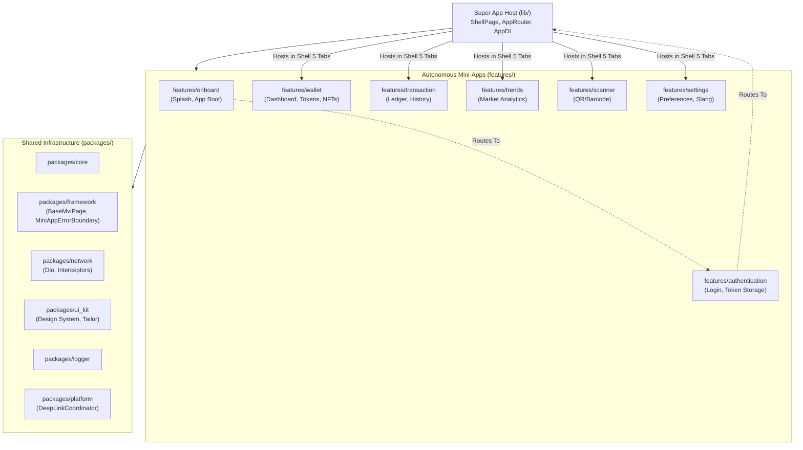
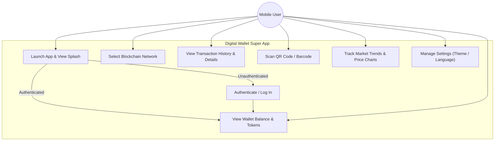
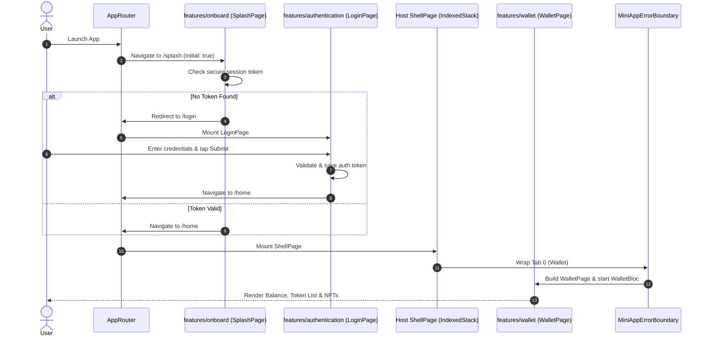

# Epic Overview: Super App Features Migration

## Meta Data
- **Epic Name:** `super_app_features_migration`
- **Status:** In Progress (Stage 2 — Architecture & Tasks)
- **Target Release:** v1.1.0
- **Platform:** Flutter
- **Source Spec:** [2026-09-16-super-app-features-migration-design.md](2026-09-16-super-app-features-migration-design.md)
- **BDD Scenarios:** [bdd_scenarios.md](bdd_scenarios.md)

---

## 1. Background & Problem Statement
The codebase has been refactored into a modern Flutter Super App template (`danhdue/develop`), featuring Pub Workspace isolation, fault resilience via `MiniAppErrorBoundary`, and modernized toolchains (Slang v4, AutoRoute v10, Freezed v3, Injectable v2). 

However, the template currently only provides skeleton code for `scanner` and `settings`, alongside a demo `HomeDashboardPage`. The legacy repository branch (`danhdue/full_features`) contains complete, functioning demo implementations of 5 core modules:
1. `onboard` (Splash, intro, initial app routing)
2. `authentication` (Login, authentication BLoC, token storage, interceptors)
3. `wallet` (Portfolio dashboard, tokens, NFTs, network selection)
4. `transaction` (Ledger, transaction history, details)
5. `trends` (Market analytics, charts, crypto/fiat rates)

This epic governs the systematic migration and architecture upgrade of these 5 features into autonomous Mini-Apps housed under `features/`, fully wired into the Super App Host Shell, and verified through strict 3-Tier testing and automated semantic audits.

---

## 2. Goals & Non-Goals

### Goals
- **Scaffold New Packages:** Use the Mason brick `pac_mvi_feature` to create standard Clean Architecture skeletons under `features/<feature>`.
- **Logic & Asset Migration:** Refer to `danhdue/full_features` to port over domain entities, usecases, data models, repositories, BLoCs (MVI), and UI components.
- **Modernize Standards:** Upgrade to Slang v4, Freezed v3, AutoRoute v10, Injectable v2, and ensure Flutter Pub Workspace compatibility.
- **Host App Shell Integration:** Restore the 5-tab Super App experience (Wallet, Transaction, Scanner, Trends, Settings) with `MiniAppErrorBoundary` on each tab.
- **Clean Residual Artifacts:** Delete obsolete empty feature packages residing in `packages/`.
- **3-Tier Verification:** Attain 100% test pass rate across unit, widget, and host integration tests with zero analyzer warnings.

### Non-Goals
- Adding new payment gateways or third-party SDKs not present in `danhdue/full_features`.
- Redesigning the core UI visual themes or branding (existing UI Kit designs are preserved).
- Refactoring unrelated packages (`packages/native_security`, `packages/logger_native_bridge`).

---

## 3. Architecture & Technical Design

### 3.1 High-Level Component Architecture

### 3.2 Use Cases & Actor Interactions

### 3.3 Primary Sequence Diagram: App Boot to Multi-Tab Shell

### 3.4 Check 1 (Shift-Left Impact Analysis)
A predictive blast radius analysis was executed via `check_code_impact.py` against `danhdue/develop`:
- **Modified Core Files:** `lib/app_router.dart`, `lib/di/injection.dart`, `lib/shell/shell_page.dart`, `lib/shell/shell_config.dart`, `pubspec.yaml`.
- **Downstream Callers:** 18 downstream files identified (including `test/router/app_router_mode_test.dart`, `test/shell/shell_page_deeplink_test.dart`, `test/di/injection_test.dart`).
- **Safety Net Coverage:** Existing router and shell page have ~80% coverage; `ShellConfig` updates require paired test updates.
- **Native Bridges:** Zero native bridge contracts touched.

---

## 4. Rollout Strategy & Mitigation

- **Phased Feature Rollout:** Features are migrated in 4 distinct tiers to avoid bulk compiler regressions.
- **Fault Resilience:** Every feature mounted in `ShellPage` is isolated within `MiniAppErrorBoundary`. If any mini-app crashes during rendering or state emission, other tabs remain fully functional with a local recovery card.
- **Fallback / Rollback:** Since each feature package is autonomous, any problematic feature can be decoupled from the Host `AppRouter` and `injection.dart` without destabilizing other modules.

---

## 5. Kanban Tasks Breakdown

| Task ID | Title | Scope Summary | Tier | Status |
|---|---|---|---|---|
| [Task 01](task_01_scaffold_and_migrate_onboard_feature.md) | Scaffold & Migrate Onboard Feature | Create `features/onboard`, migrate splash logic, Slang v4, MVI bloc, tests | Tier A | todo |
| [Task 02](task_02_scaffold_and_migrate_authentication_feature.md) | Scaffold & Migrate Authentication Feature | Create `features/authentication`, migrate login, token storage, auth bloc, tests | Tier A | todo |
| [Task 03](task_03_scaffold_and_migrate_wallet_feature.md) | Scaffold & Migrate Wallet Feature | Create `features/wallet`, migrate portfolio, tokens, NFTs, network selection, tests | Tier A | todo |
| [Task 04](task_04_scaffold_and_migrate_transaction_feature.md) | Scaffold & Migrate Transaction Feature | Create `features/transaction`, migrate ledger, history list, details view, tests | Tier A | todo |
| [Task 05](task_05_scaffold_and_migrate_trends_feature.md) | Scaffold & Migrate Trends Feature | Create `features/trends`, migrate market analytics, price charts, MVI bloc, tests | Tier A | todo |
| [Task 06](task_06_host_app_shell_navigation_di_integration.md) | Host App Shell, Navigation & DI Integration | Update `ShellPage` (5 tabs + ErrorBoundary), `AppRouter`, `injection.dart`, remove old dirs | Tier B | todo |
| [Task 07](task_07_host_acceptance_tests_and_quality_check.md) | Host Acceptance Tests & Quality Check | Update Host integration tests, run `melos genAlls`, boundary check, and quality_check | Tier C | todo |
