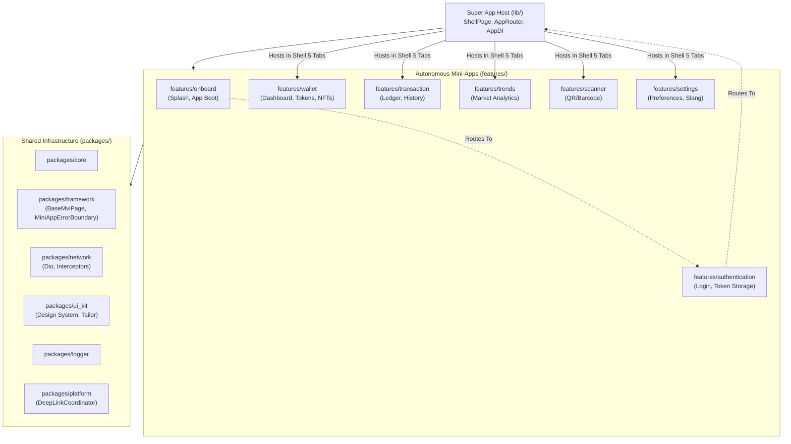
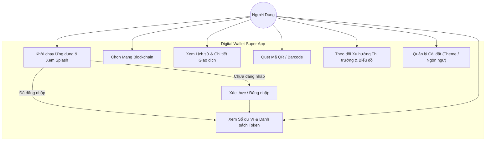
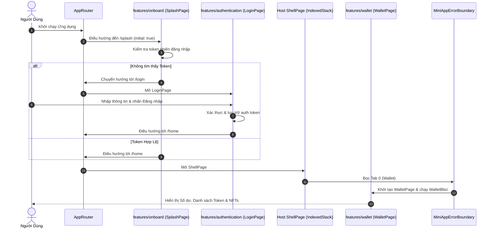

# Tổng Quan Epic: Di Chuyển Features Sang Kiến Trúc Super App

## Thông Tin Meta
- **Tên Epic:** `super_app_features_migration`
- **Trạng thái:** Đang thực hiện (Giai đoạn 2 — Kiến trúc & Nhiệm vụ)
- **Phiên bản mục tiêu:** v1.1.0
- **Nền tảng:** Flutter
- **Tài liệu Thiết kế Nguồn:** [2026-09-16-super-app-features-migration-design.md](2026-09-16-super-app-features-migration-design.md)
- **Kịch bản BDD:** [bdd_scenarios.md](bdd_scenarios.md)

---

## 1. Bối Cảnh & Vấn Đề
Codebase đã được tái cấu trúc thành một template Super App Flutter hiện đại (`danhdue/develop`), nổi bật với cơ chế cô lập Pub Workspace, khả năng phục hồi lỗi qua `MiniAppErrorBoundary`, và toolchain hiện đại hóa (Slang v4, AutoRoute v10, Freezed v3, Injectable v2).

Tuy nhiên, template hiện tại chỉ cung cấp mã nguồn mẫu cho `scanner` và `settings`, cùng một trang demo `HomeDashboardPage`. Nhánh cũ của repository (`danhdue/full_features`) chứa đầy đủ mã nguồn demo hoạt động hoàn chỉnh của 5 module cốt lõi:
1. `onboard` (Màn hình Splash, giới thiệu, điều hướng khởi chạy ban đầu)
2. `authentication` (Đăng nhập, BLoC xác thực, lưu trữ session token, interceptor)
3. `wallet` (Dashboard ví, danh sách token, bộ sưu tập NFT, chọn mạng blockchain)
4. `transaction` (Sổ cái giao dịch, lịch sử giao dịch, chi tiết giao dịch)
5. `trends` (Phân tích thị trường, biểu đồ biến động giá tiền điện tử/tiền tệ)

Epic này quản trị quá trình di chuyển và nâng cấp kiến trúc bài bản cho 5 feature trên thành các Mini-App độc lập đặt trong thư mục `features/`, kết nối hoàn chỉnh vào Host Shell của Super App, và được xác minh qua tiêu chuẩn kiểm thử 3 tầng (3-Tier Testing) cùng quy trình audit tự động.

---

## 2. Mục Tiêu & Giới Hạn Phạm Vi

### Mục Tiêu
- **Scaffold Package Mới:** Sử dụng Mason brick `pac_mvi_feature` để tạo khung Clean Architecture chuẩn trong `features/<feature>`.
- **Di Chuyển Logic & Assets:** Tham chiếu từ nhánh `danhdue/full_features` để chuyển đổi entities domain, usecases, data models, repositories, BLoCs (MVI), và các component UI.
- **Hiện Đại Hóa Tiêu Chuẩn:** Nâng cấp lên Slang v4, Freezed v3, AutoRoute v10, Injectable v2, và tương thích hoàn toàn với Flutter Pub Workspace.
- **Tích Hợp Host App Shell:** Khôi phục trải nghiệm Super App 5 tabs (Wallet, Transaction, Scanner, Trends, Settings) với `MiniAppErrorBoundary` bọc từng tab.
- **Dọn Dẹp Mã Thừa:** Xóa bỏ hoàn toàn các thư mục rỗng cũ của feature trong `packages/`.
- **Kiểm Thử 3 Tầng:** Đạt 100% tỷ lệ pass cho các bài test unit, widget, và host integration test, không còn cảnh báo từ analyzer.

### Giới Hạn Phạm Vi (Non-Goals)
- Không bổ sung thêm cổng thanh toán mới hoặc SDK bên thứ ba chưa có trong `danhdue/full_features`.
- Không thay đổi thiết kế giao diện hay bộ nhận diện thương hiệu cốt lõi (giữ nguyên theme của UI Kit hiện có).
- Không tái cấu trúc các package không liên quan (`packages/native_security`, `packages/logger_native_bridge`).

---

## 3. Kiến Trúc & Thiết Kế Kỹ Thuật

### 3.1 Sơ Đồ Kiến Trúc Component Tổng Quan

### 3.2 Sơ Đồ Use Case & Tương Tác Người Dùng

### 3.3 Sơ Đồ Trình Tự: Từ Khởi Động Đến Shell Đa Tab

### 3.4 Phân Tích Tác Động Shift-Left (Check 1)
Phân tích vùng ảnh hưởng đã được thực hiện bằng `check_code_impact.py` trên nhánh `danhdue/develop`:
- **Tệp cốt lõi sửa đổi:** `lib/app_router.dart`, `lib/di/injection.dart`, `lib/shell/shell_page.dart`, `lib/shell/shell_config.dart`, `pubspec.yaml`.
- **Tệp tiêu thụ hạ tầng (Downstream Callers):** 18 tệp bị ảnh hưởng (bao gồm các test router, shell deeplink, injection test).
- **Lưới bảo vệ Coverage:** Router và Shell Page hiện tại có coverage ~80%; `ShellConfig` cần được cập nhật test tương ứng.
- **Native Bridges:** Không có hợp đồng native bridge nào bị thay đổi.

---

## 4. Chiến Lược Triển Khai & Giảm Thiểu Rủi Ro

- **Triển khai Phân Tầng:** Các feature được di chuyển theo 4 tầng độc lập để tránh xung đột trình biên dịch hàng loạt.
- **Cô lập Lỗi (Resilience):** Mọi feature hiển thị trong `ShellPage` đều được bọc trong `MiniAppErrorBoundary`. Nếu một mini-app gặp lỗi runtime trong quá trình build UI, các tab khác vẫn hoạt động hoàn toàn bình thường kèm theo giao diện khôi phục lỗi cục bộ.
- **Khả năng Phục Hồi (Rollback):** Do mỗi package là một mini-app độc lập, bất kỳ feature nào có sự cố đều có thể dễ dàng ngắt kết nối khỏi Host `AppRouter` và `injection.dart` mà không làm tê liệt toàn bộ ứng dụng.

---

## 5. Bảng Phân Chia Nhiệm Vụ Kanban

| Mã Nhiệm Vụ | Tên Nhiệm Vụ | Tóm Tắt Phạm Vi | Phân Tầng | Trạng Thái |
|---|---|---|---|---|
| [Task 01](task_01_scaffold_and_migrate_onboard_feature.md) | Khởi tạo & Di chuyển Feature Onboard | Tạo `features/onboard`, di chuyển splash, Slang v4, BLoC MVI, tests | Tier A | todo |
| [Task 02](task_02_scaffold_and_migrate_authentication_feature.md) | Khởi tạo & Di chuyển Feature Authentication | Tạo `features/authentication`, di chuyển login, token, auth bloc, tests | Tier A | todo |
| [Task 03](task_03_scaffold_and_migrate_wallet_feature.md) | Khởi tạo & Di chuyển Feature Wallet | Tạo `features/wallet`, di chuyển portfolio, tokens, NFTs, network, tests | Tier A | todo |
| [Task 04](task_04_scaffold_and_migrate_transaction_feature.md) | Khởi tạo & Di chuyển Feature Transaction | Tạo `features/transaction`, di chuyển sổ cái, lịch sử, chi tiết, tests | Tier A | todo |
| [Task 05](task_05_scaffold_and_migrate_trends_feature.md) | Khởi tạo & Di chuyển Feature Trends | Tạo `features/trends`, di chuyển phân tích thị trường, biểu đồ giá, tests | Tier A | todo |
| [Task 06](task_06_host_app_shell_navigation_di_integration.md) | Tích Hợp Host App Shell, Navigation & DI | Cập nhật `ShellPage` (5 tabs + ErrorBoundary), Router, DI, xóa thư mục cũ | Tier B | todo |
| [Task 07](task_07_host_acceptance_tests_and_quality_check.md) | Kiểm Thử Chấp Nhận Host App & Quality Check | Cập nhật Host integration tests, `melos genAlls`, boundary check, quality check | Tier C | todo |
