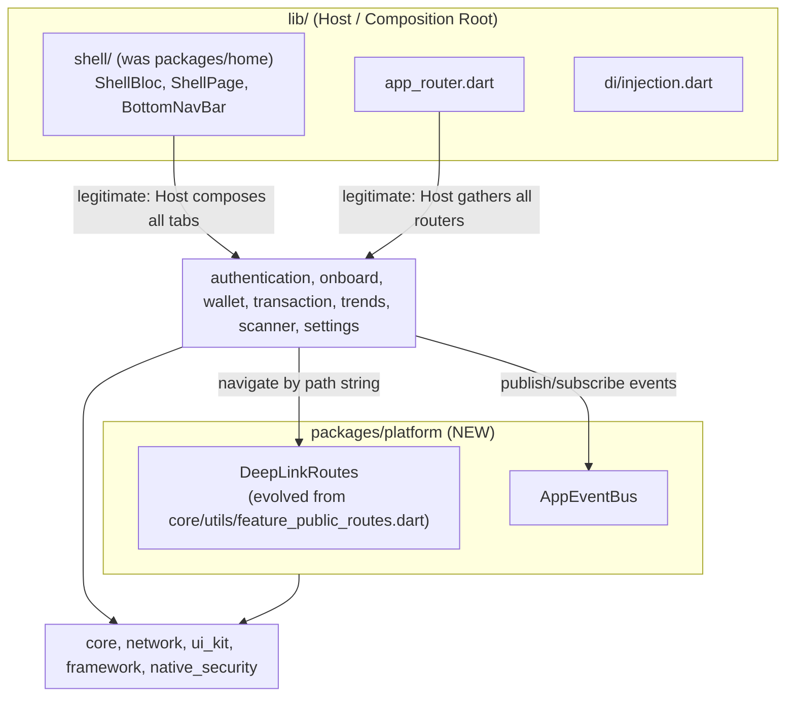

# Super App Governance — Design Spec

## Status
Approved — ready for epic-designer.

## Background
`bloc_digital_wallet` is a melos monorepo with 13 packages (`authentication`, `home`, `onboard`, `scanner`, `settings`, `trends`, `transaction`, `wallet` as features; `core`, `network`, `ui_kit`, `framework`, `native_security` as infrastructure), each following Clean Architecture + MVI, scaffolded by the `pac_mvi_feature`/`pac_mvi_subfeature` Mason bricks. The user wants to evolve this into a Super App governed by four mechanisms: decomposed container/modules, centralized routing/communication, state isolation, and lifecycle governance (CI/CD contract enforcement).

Investigation of the current codebase against those four pillars found:

1. **Container & Modules**: package-per-feature structure already exists and is sound. However [packages/home/lib/presentation/home/home_page.dart](../../../packages/home/lib/presentation/home/home_page.dart) imports `wallet`, `transaction`, `scanner`, `trends`, `settings` directly and embeds their `Page` widgets in an `IndexedStack`. `home` itself has no `domain/`/`data/` layers at all — it is not a real feature, it is Shell/Host logic misplaced inside a feature package. `onboard` also imports `settings` directly.
2. **Centralized routing/communication**: a routing decoupling mechanism already exists — `packages/core/lib/utils/feature_public_routes.dart` (`FeaturePublicRoutes`), auto-generated per feature by the `pac_mvi_feature` brick's `post_gen.dart` hook. It defines name-string-based `PageRouteInfo` constants so callers don't need to import a feature's router/page classes. In practice it is used in exactly one place (`onboard/splash_page.dart`) — the mechanism exists but is not enforced or consistently adopted, which is how `home_page.dart`'s direct imports happened. No Event Bridge exists anywhere in the codebase.
3. **State Isolation**: each feature has its own `MviBloc` (Action/State/Event) — no global state, this pillar is already healthy. DI uses a single flat `GetIt.instance`; each package's public barrel (`{{name}}.dart`) already exports only domain entities/interfaces/usecases/presentation/DI-init/router — it does **not** export `data/repositories/*_impl.dart` or datasources. The convention is correct but nothing stops a deep-import (`package:x/data/...`) from outside the package.
4. **Lifecycle Governance**: `.gitlab-ci.yml` has a single `CIChecking` stage (format/generation check only) and a `pre-commit` hook running `melos genAlls`. No dependency-boundary lint, no per-package build/test isolation, no `example/` harness in any feature package. Separately, `scripts/genAlls.sh` regenerates all 13 packages + root app unconditionally on every invocation — `scripts/genFeature.sh <pkg>` already supports scoping generation to a single named package (via `melos exec --scope`), but there is no automatic "what actually changed" detection, and `.gitlab-ci.yml`'s `cache:` block (`.gradle`, `build`, `app/build`, `build-caches`) omits `.dart_tool/`, so `build_runner`'s own content-hash-based incremental cache is discarded on every CI run.

## Goals
- Eliminate the compile-time coupling where `home` (a disguised Shell) directly imports 5 Mini App packages, and where `onboard` directly imports `settings`.
- Give Mini Apps a way to navigate to each other without importing each other's router/page classes, by promoting the existing (underused) `FeaturePublicRoutes` mechanism into an enforced, first-class DeepLink Router.
- Give Mini Apps a way to exchange data/signals without importing each other, via a new typed Event Bridge (`AppEventBus`), consistent with the existing Action/State/Event MVI convention.
- Lock in the DI export discipline that already exists informally (barrel exports domain/presentation only) via automated CI enforcement, so it can't silently regress.
- Add a CI Gate that hard-blocks any new cross-feature-package import or deep-import into another package's internals, while allowing the migration to proceed incrementally via an explicit, shrinking whitelist.
- Update the `pac_mvi_feature`/`pac_mvi_subfeature` Mason bricks so newly generated packages are wired into the new mechanisms by default, and mark the orphaned `lib/features/`-targeting bricks as deprecated so they stop misleading contributors.
- Migrate incrementally, pilot = `settings` (chosen because it is imported by both `home` and `onboard`, exercising both dependency directions), then the shell relocation, then the remaining packages.
- Speed up the local dev/build loop without weakening correctness: add an opt-in, diff-scoped generation script for fast local iteration, and make CI's `build_runner` step reuse its own content-hash cache across runs instead of discarding it every time.

## Non-Goals
- **True dynamic/lazy-loaded feature modules at runtime** (Android Dynamic Feature Module equivalent). Flutter has no supported mechanism for this; all packages remain statically compiled into one binary. This spec addresses *logical* decoupling (no compile-time knowledge between Mini Apps), not physical/runtime module loading.
- **Hierarchical/scoped `GetIt` containers.** The DI container stays a single flat `GetIt.instance`. Practical Dependency Inversion is achieved through export/import discipline (barrel files + CI Gate), not through changing the DI runtime architecture — lower risk, no lifecycle-management rewrite needed.
- **Replacing `auto_route` with a hand-rolled Navigator 2.0 implementation.** Rejected as an alternative (see below) — too costly given 8 packages already have generated `.gr.dart` routers, and unnecessary since `auto_route` already supports name-string-based route resolution, which is exactly what `FeaturePublicRoutes` already exploits.
- **Removing the orphaned `mvi_feature`/`mvi_subfeature`/`remove_feature`/`remove_subfeature` bricks.** Considered, explicitly rejected by the user — they will be kept, just marked deprecated in their `brick.yaml` description pointing to the `pac_*` equivalents.
- **Giving `home` real dashboard content.** Out of scope; `home`'s tab-shell responsibilities are relocated as-is. Whether a distinct "Home dashboard" feature is added later is a separate, future decision.

## Architecture

### Package graph (target state)


The only packages allowed to import a Mini App package directly are the Host (`lib/`) and `platform` (for route registration plumbing). No Mini App may import another Mini App package.

### `platform` package
New package, workspace member, depended on by every Mini App (added to the `pac_mvi_feature` pubspec template).

**Naming (discovered during Task 9 implementation, epic ledger ruling):** the directory is `packages/platform/`, but the pubspec `name:` is `app_platform` — the real pub.dev package `platform` (OS/environment detection) is already a transitive dependency of this workspace (`settings → path_provider → path_provider_platform_interface → platform`), and Dart pub has no way to alias a local `path:` package against a same-named hosted one; `flutter pub get` fails version solving otherwise. Every pubspec dependency on it uses the key `app_platform:`; Dart code imports it aliased `as platform`, so call sites still read `platform.configureModuleDependencies(...)`/`DeepLinkRoutes.xRoute` exactly as designed below.

**DeepLinkRoutes** (relocated/renamed from `packages/core/lib/utils/feature_public_routes.dart`): unchanged mechanism, just relocated and its adoption enforced. Each feature keeps registering its public entry route as a name-string `PageRouteInfo` constant (`DeepLinkRoutes.settingsRoute`, generated by the brick hook). Callers navigate via `context.router.push(DeepLinkRoutes.settingsRoute)` — no import of the target package's router/page.

**AppEventBus** (new): a broadcast-stream singleton registered in `platform`'s DI module.
```dart
abstract class AppEvent {}

@lazySingleton
class AppEventBus {
  final _controller = StreamController<AppEvent>.broadcast();
  void publish(AppEvent event) => _controller.add(event);
  Stream<T> on<T extends AppEvent>() => _controller.stream.whereType<T>();
}
```
Each feature that needs to signal others defines its own `AppEvent` subclasses in its barrel (e.g. `WalletBalanceUpdatedEvent`), mirroring the existing Action/State/Event naming convention from `framework`. No central registry of event types is needed — publishers and subscribers only share a dependency on `platform` + whichever event-defining package they care about (a subscriber importing another feature's *event type* to listen for it is acceptable, since event classes are data contracts, not implementation — same posture as importing a domain entity).

### DI / export discipline
No change to the DI container. The rule being locked in: a package's public barrel (`{{name}}.dart`) may only export `domain/**`, `presentation/**`, `di/injection.dart`, and its router/translations — never `data/**` or any `*_impl.dart`. This is already true today; the CI Gate (below) turns it from convention into an enforced invariant.

### Host/Shell relocation
`packages/home/lib/presentation/home/{home_bloc,home_page,home_action,home_state,home_event}.dart` and `widgets/custom_bottom_nav_bar.dart` move to `lib/shell/` (renamed `Home*` → `Shell*`). `lib/shell/shell_page.dart` keeps its direct imports of `wallet`, `transaction`, `scanner`, `trends`, `settings` — this is now correct, since `lib/` is the Host. `packages/home` is removed from the workspace once the move lands. `onboard`'s post-onboarding navigation to `settings` is replaced with `context.router.push(DeepLinkRoutes.settingsRoute)`.

### CI Gate
New script `scripts/check_module_boundaries.sh`, run as an added step in the `.gitlab-ci.yml` `CIChecking` stage:
- Scans every `packages/<feature>/lib/**/*.dart` for `import 'package:<other-feature>/'` where both `<feature>` and `<other-feature>` are feature packages (`authentication`, `onboard`, `wallet`, `transaction`, `trends`, `scanner`, `settings` — `home`/`lib/shell` and infra packages are exempt).
- Scans for deep-imports: `import 'package:<pkg>/data/` or any `*_impl.dart` path from a file outside `<pkg>` itself.
- A companion file `scripts/module_boundary_whitelist.txt` lists currently-known, pre-existing violations (seeded at Phase 0 with `home→{wallet,transaction,scanner,trends,settings}` and `onboard→settings`). The script fails the build on any violation **not** present in the whitelist; whitelisted violations pass but are logged as warnings. Entries are deleted from the whitelist as each package's migration lands — deleting an entry and then reintroducing the same import will now correctly fail CI. **Two different removal mechanisms, not one:** the `onboard→settings` entry is *actively* matched and warned on every run (`onboard` is a scanned package) until Task 14 removes both the import and the whitelist line. The five `home→*` entries are never matched at all — `home` is not a scan root (see above), so they exist in the whitelist purely as a tracked record of known debt; they become moot when Task 15 deletes `packages/home` outright, not because the gate ever actively caught and cleared them.

### Dev Scripts & Build Caching
Two separate mechanisms, kept deliberately separate because they have different correctness guarantees:

**`scripts/genChanged.sh [ref]`** (new) — an explicitly **opt-in, local-only convenience** wrapping `melos exec --diff=<ref> --include-dependents -- fvm flutter pub run build_runner build --delete-conflicting-outputs` (plus the same slang/format steps `genAlls.sh` already runs). Default `ref` is `develop` when no argument is given. `--include-dependents` ensures that when a shared package (e.g. `core`, `framework`) changes, every package that depends on it is regenerated too, not just the changed package itself.

This script is **not** wired into the pre-commit hook or CI, and its README/inline usage comment must say why: `git diff` only proves *source* changed, it cannot prove generated output (`.g.dart`/`.freezed.dart`/`.gr.dart`) is currently in sync with source — if a past commit (even one already on `develop`) changed source without regenerating its output, a diff-based tool has no way to detect that gap, because from that commit onward there is no further source diff to see. `genChanged` is a fast-path for "what am I actively touching right now," never a substitute for a full `genAlls` before committing.

**`.gitlab-ci.yml` cache fix** — add `.dart_tool/` (root) and `packages/*/.dart_tool/` to the existing `cache: paths:` list, keyed by a hash of `pubspec.lock` (so a dependency upgrade invalidates the cache instead of reusing stale build state). This is safe by construction, unlike diff-based skipping: `build_runner` decides what to regenerate from content hashes of the files actually present at run time, not from git history, so restoring a prior `.dart_tool/build/` state and re-running `build_runner build` always produces a correct result — it simply does less work when inputs are unchanged. `genAlls.sh` itself is not modified; it keeps unconditionally invoking `build_runner` for every package exactly as today, and now that invocation is fast when nothing changed instead of slow.

The existing `pre-commit` hook (full `melos genAlls` + before/after diff check) is unchanged — it remains the authoritative safety net that catches exactly the staleness gap described above, since it always regenerates from actual file content before every commit.

### Mason / Bricks changes
- `pac_mvi_feature/hooks/post_gen.dart`: `_updateFeaturePublicRoutes` retargets `packages/platform/lib/deep_link_routes.dart` instead of `packages/core/lib/utils/feature_public_routes.dart`.
- `pac_mvi_feature/__brick__/.../pubspec.yaml`: add `app_platform: {path: ../platform}` alongside the existing `core`/`network`/`ui_kit`/`framework` local dependencies (dependency key is `app_platform`, not `platform` — see the naming note above).
- `remove_pac_feature`: extend its cleanup to also remove the package's entry from `packages/platform/lib/deep_link_routes.dart` (symmetric with what `post_gen.dart` adds).
- `pac_mvi_subfeature`: no change — subfeature routes correctly stay internal to the owning package's router; they are not meant to be publicly deep-linkable by default.
- `mvi_feature`, `mvi_subfeature`, `remove_feature`, `remove_subfeature` (target the unused `lib/features/` pattern): kept per user decision, but each `brick.yaml` description gets a `[DEPRECATED — use pac_mvi_feature/pac_mvi_subfeature instead]` prefix so `mason list` surfaces the warning.

## Migration Plan (incremental)

**Phase 0 — Foundation.** Create `packages/platform` (DeepLinkRoutes relocated + AppEventBus new), add it to the root workspace and DI. Add `scripts/check_module_boundaries.sh` + seeded whitelist to CI. Update the two Mason bricks per above. Add `scripts/genChanged.sh` and the `.dart_tool/` CI cache fix. No behavior change to the running app.

**Phase 1 — Pilot: `settings` (revised after implementation — see Task 14's ledger entry).** The original plan assumed `onboard`'s import of `settings` was a push-navigation. Implementation found this premise wrong: `onboard`'s post-onboarding navigation (`splash_page.dart`) already used a route-abstraction (`DeepLinkRoutes.homeRoute`, migrated in Phase 0/Task 9) and never imported `settings` for navigation at all. The actual `onboard→settings` import (`splash_bloc.dart`) is a business-logic/DTO dependency (`BootstrapUseCase`, `FetchTranslationUseCase`) — a coupling shape `DeepLinkRoutes`/`AppEventBus` cannot represent. Fixing it for real needs a Dependency-Inversion refactor (interface + relocated logic, following this codebase's existing `TokenRefresher` precedent) that is a genuine architectural decision out of this epic's scope. **`onboard→settings` therefore stays whitelisted indefinitely within this epic** — it is not resolved by Phase 1, or by this epic at all. The pilot's actual goal (validate `DeepLinkRoutes` end-to-end before Phase 2/3 rely on it) was already satisfied by Task 9's own `splash_page.dart` migration. `home`'s import of `settings` is a different shape again — `home_page.dart` *embeds* `SettingsPage()` as one of five `IndexedStack` tab children, not a pushed route, so `DeepLinkRoutes` doesn't apply to it either. `home→settings` stays whitelisted through Phase 1 and is resolved together with `home`'s other four feature imports in Phase 2, since all five are the same kind of embed and belong together in one atomic move rather than being split across phases.

**Phase 2 — Shell relocation.** Move `home`'s tab-shell code to `lib/shell/`; retire `packages/home` from the workspace. This resolves the remaining whitelist entries (`home→wallet/transaction/scanner/trends/settings`) automatically, since those imports now live in the Host (`lib/`), which is outside the CI Gate's feature-to-feature scope.

**Phase 3 — Remaining packages.** With the `home→*` violations resolved by Phase 2 (`onboard→settings` deliberately left whitelisted, see Phase 1 above), this phase is about hardening: audit all 7 feature packages' barrels for the export-discipline rule, tighten the CI Gate's deep-import check package by package. The whitelist file is **kept**, not removed — it ends this epic with exactly one documented, accepted entry (`onboard→settings`) rather than reaching zero.

## Testing Strategy
- `platform` package: unit tests for `DeepLinkRoutes` path/name resolution and `AppEventBus` publish/subscribe (multiple subscribers, type filtering via `on<T>()`).
- `scripts/check_module_boundaries.sh`: a fixture test (temp file with a deliberate violation) asserting the script exits non-zero, and a clean fixture asserting exit zero — prevents the gate itself from silently regressing.
- Per migrated package (starting with `settings`): existing `bloc_test` suites are unaffected structurally; add a test asserting navigation goes through `DeepLinkRoutes`/`AppEventBus` mocks rather than asserting on a concrete cross-package type.
- `genChanged.sh`: manually verified against a deliberately staged staleness scenario (source changed in an old commit, generated output not regenerated) to confirm the documented gap behaves as described, so the caveat in its usage comment is accurate rather than theoretical.
- CI cache fix: verify a second CI run (cache hit) produces identical generated output to a clean run (cache miss) for the same commit, and that a `pubspec.lock` change correctly triggers a cache miss.

## Alternatives Considered

**Approach A — put DeepLinkRoutes/AppEventBus inside `core` instead of a new `platform` package.** Lower short-term cost (no new package), but `core` already carries auth/localization/theme/services concerns; adding cross-feature navigation/event governance would mix an architectural-boundary concern into a general-utility package. Rejected in favor of a dedicated `platform` package, which also makes the Host/Mini-App governance boundary explicit and independently discoverable/auditable.

**Approach C — replace `auto_route` with a hand-rolled Navigator 2.0 + custom `RouteInformationParser`.** Would give the most "pure" URL-schema deep linking, but requires rewriting all 8 packages' existing `@RoutePage()`/`.gr.dart` router setup simultaneously, contradicting the incremental migration strategy and offering no capability `auto_route`'s existing name-based route resolution doesn't already provide. Rejected.

**Approach D — hand-rolled content-hash cache for `genAlls.sh`** (track a manifest of per-package file hashes, skip codegen if unchanged). Rejected: reimplements what `build_runner`'s own `.dart_tool/build/` cache already does correctly, adds custom code to maintain, and has no correctness advantage over just caching `.dart_tool/` in CI.

**Approach E — use `melos exec --diff` as the *authoritative* skip mechanism in CI/pre-commit, not just a local dev convenience.** Rejected after the user identified the gap: a git-diff between two refs cannot detect that generated output committed in an *earlier* commit (possibly already on the diff base itself) was never actually regenerated from its source. Content-hash-based caching (`.dart_tool/`) does not have this gap, since it hashes the files actually present rather than reasoning about git history — so it, not diff-based filtering, is what CI and the pre-commit hook rely on.
