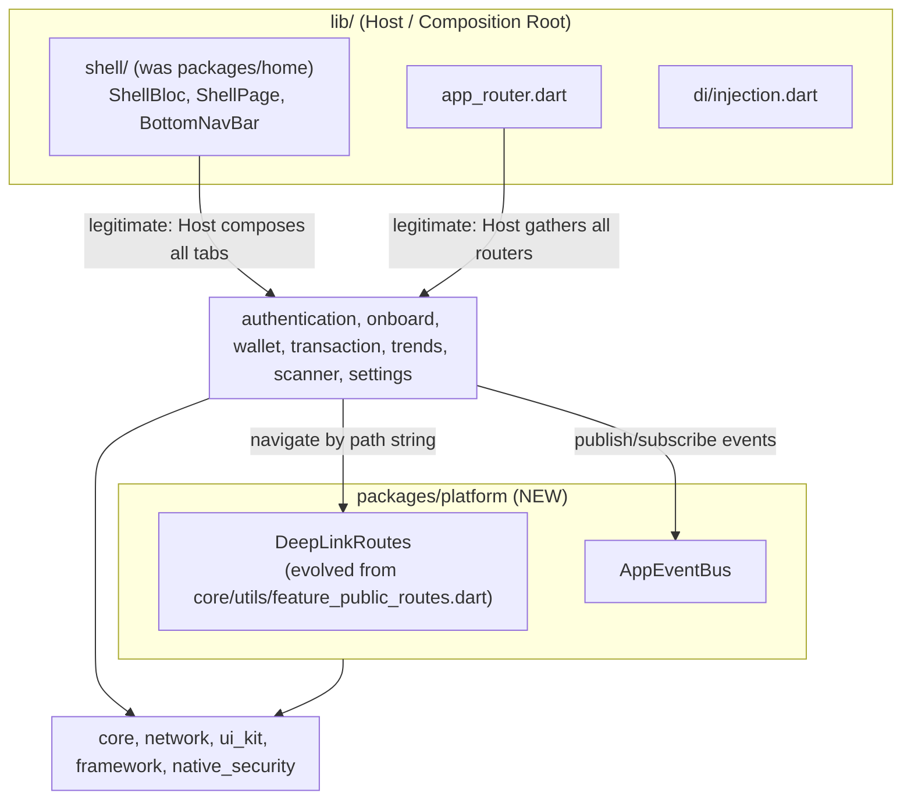
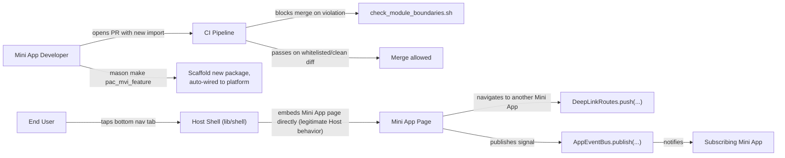
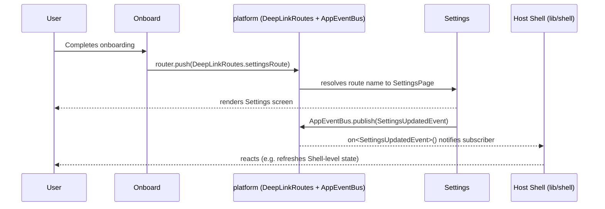

# Epic: Super App Governance

## Meta Data
- **Epic Name**: super_app_governance
- **Status**: Queued (backlog) — behind `logging-refactor` (currently active: tasks 4/6/7/8 are `in-progress`/`todo`). Move this epic's tasks from `backlog` to `todo` once `logging-refactor` reaches `done`.
- **Target Release**: TBD — activation gated on `logging-refactor` completion, not a calendar date.
- **Source Spec**: [2026-08-26-super-app-governance-design.md](2026-08-26-super-app-governance-design.md)

## Background (Bối cảnh)
`bloc_digital_wallet` is a melos monorepo with 13 packages following Clean Architecture + MVI, feature-scaffolded by the `pac_mvi_feature`/`pac_mvi_subfeature` Mason bricks. An architecture review against the four governance pillars of a Super App platform (decomposed container/modules, centralized routing/communication, state isolation, lifecycle governance) found two concrete coupling violations — `home` (which has no `domain/`/`data/` layers of its own; it is Shell/Host logic misplaced inside a feature package) directly imports and embeds 5 Mini App packages' page widgets, and `onboard` directly imports `settings` — plus a routing-decoupling mechanism (`FeaturePublicRoutes`) that already exists in `core` but is used in exactly one place across the whole codebase, and no CI enforcement preventing either problem from recurring. See the source spec for the full pillar-by-pillar findings.

## Goals & Non-Goals

### Goals
- Eliminate the `home→{wallet,transaction,scanner,trends,settings}` and `onboard→settings` direct cross-package imports.
- Promote the existing, underused `FeaturePublicRoutes` mechanism into an enforced DeepLink Router (`platform` package), and add a new typed `AppEventBus` for cross-feature signals.
- Lock in the DI export discipline that already exists informally (barrels only export domain/presentation, never `data/**`/`*_impl.dart`) via CI enforcement.
- Add a CI Gate (`scripts/check_module_boundaries.sh`) that hard-blocks new violations while allowing incremental migration via a shrinking whitelist.
- Update the `pac_mvi_feature`/`pac_mvi_subfeature` Mason bricks so new packages are wired into `platform` by default; mark the orphaned `lib/features/`-targeting bricks (`mvi_feature`, `mvi_subfeature`, `remove_feature`, `remove_subfeature`) as deprecated in their descriptions (kept, not removed, per explicit user decision).
- Speed up the local dev/build loop without weakening correctness: an opt-in, diff-scoped `genChanged.sh` for local iteration, plus a `.dart_tool/` CI cache fix that is safe because it relies on `build_runner`'s own content-hash staleness detection rather than git diff.
- Migrate incrementally: pilot = `settings` (imported by both `home` and `onboard`, exercising both dependency directions), then Shell relocation, then hardening across the rest.

### Non-Goals
- True dynamic/lazy-loaded runtime feature modules (no Flutter-supported equivalent to Android Dynamic Feature Modules) — this epic addresses logical decoupling only.
- Hierarchical/scoped `GetIt` containers — DI stays one flat `GetIt.instance`; Dependency Inversion is achieved via export/import discipline, not a DI runtime rewrite.
- Replacing `auto_route` with a hand-rolled Navigator 2.0 implementation.
- Removing the orphaned `mvi_feature`/`mvi_subfeature`/`remove_feature`/`remove_subfeature` bricks (explicitly rejected by the user — deprecate in description only).
- Giving `home`/the relocated Shell real dashboard content — its tab-shell responsibilities are relocated as-is.
- Using `melos exec --diff` as an authoritative (CI/pre-commit) skip mechanism — it cannot detect generated output that went stale in a commit predating the diff base; only `build_runner`'s content-hash cache is used for anything correctness-sensitive.

## Architecture & Technical Design

### High-Level Architecture

### Use Cases

### Sequence Diagram (primary flow — pilot: settings)

## Rollout Strategy & Mitigation
Incremental, four phases (see source spec's Migration Plan for full detail):

1. **Phase 0 — Foundation**: create `packages/platform` (DeepLinkRoutes relocated + AppEventBus new), CI Gate + seeded whitelist, Mason brick updates, `genChanged.sh` + `.dart_tool/` CI cache fix. No behavior change.
2. **Phase 1 — Pilot (`settings`)**: `onboard→settings` is a genuine push-navigation, migrated onto `DeepLinkRoutes.settingsRoute` and dropped from the whitelist. `home→settings` is an `IndexedStack` tab embed, not a pushed route — it does not fit `DeepLinkRoutes` and stays whitelisted until Phase 2, resolved together with `home`'s other four tab embeds in one atomic move.
3. **Phase 2 — Shell relocation**: move `home`'s tab-shell code to `lib/shell/`; retire `packages/home`. Resolves all of `home`'s remaining whitelist entries (including `settings`) automatically.
4. **Phase 3 — Hardening**: audit all feature packages' barrels, tighten the CI Gate's deep-import check, remove the (by-then-empty) whitelist file.

**Mitigation**: the CI Gate whitelist is the rollback mechanism at every phase — a migration step can be reverted by re-adding its entry to the whitelist without touching the gate script itself. The pre-commit hook's full `genAlls` + diff check remains the authoritative safety net against stale generated output throughout.

**Sequencing note**: this epic is queued behind `logging-refactor` (see Meta Data) — all tasks below start in `backlog` and should not be picked up until `logging-refactor` completes, to avoid two large refactors landing on `develop` concurrently.

## Kanban Tasks Breakdown
- [Task 9: Create `platform` package — DeepLinkRoutes relocation](../../features/task_9_create_platform_package.md)
- [Task 10: Implement `AppEventBus`](../../features/task_10_app_event_bus.md)
- [Task 11: CI Gate — module boundary script](../../features/task_11_ci_module_boundary_gate.md)
- [Task 12: Update Mason bricks for `platform`](../../features/task_12_mason_bricks_platform.md)
- [Task 13: `genChanged.sh` + `.dart_tool/` CI cache](../../features/task_13_gen_changed_and_ci_cache.md)
- [Task 14: Migrate pilot package `settings`](../../features/task_14_migrate_settings_pilot.md)
- [Task 15: Relocate Shell out of `home`](../../features/task_15_relocate_shell.md)
- [Task 16: Hardening — barrel audit & whitelist removal](../../features/task_16_hardening_barrel_audit.md)
