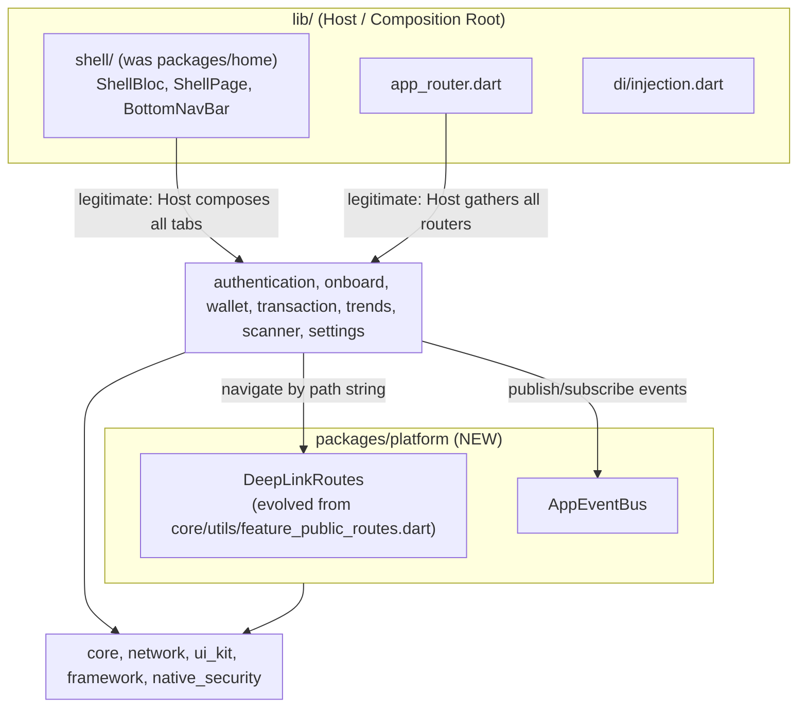
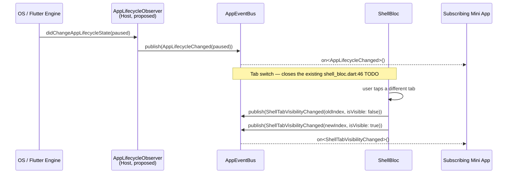
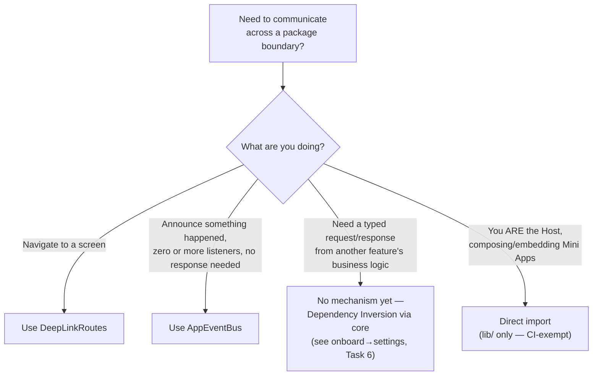
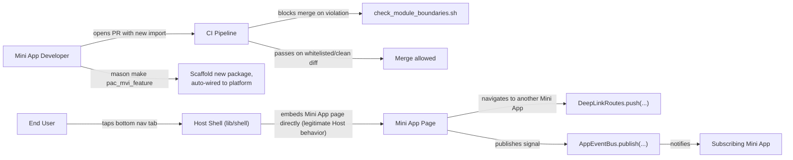
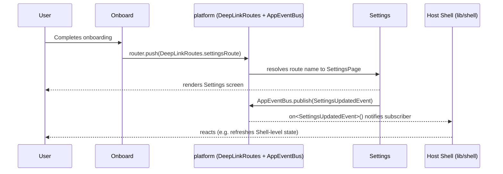

# Epic: Super App Governance

## Table of Contents
1. [Meta Data](#meta-data)
2. [Background](#background-bối-cảnh)
3. [Goals & Non-Goals](#goals--non-goals)
4. [Architecture & Technical Design](#architecture--technical-design)
   1. [High-Level Architecture](#high-level-architecture)
   2. [Host ↔ Module Communication Channels](#host--module-communication-channels)
   3. [Current Implementation Audit](#current-implementation-audit)
   4. [Lifecycle Events — Analysis & Recommendation](#lifecycle-events--analysis--recommendation)
   5. [Use Cases](#use-cases)
   6. [Sequence Diagram (primary flow — pilot: settings)](#sequence-diagram-primary-flow--pilot-settings)
5. [Compliance Assessment Against the Original 4 Governance Pillars](#compliance-assessment-against-the-original-4-governance-pillars)
6. [Rollout Strategy & Mitigation](#rollout-strategy--mitigation)
7. [Kanban Tasks Breakdown](#kanban-tasks-breakdown)

## Meta Data
- **Epic Name**: super_app_governance
- **Status**: **Complete** — all 8 tasks (1–8) implemented, reviewed, and merged on branch `epic/super_app_governance`. `logging-refactor` (the epic this one was originally queued behind) had already merged to `develop` via PR #31 before implementation began, so no concurrent-epic conflict occurred in practice.
- **Target Release**: Shipped with this branch; not yet merged to `develop` (integration decision pending).
- **Source Spec**: [2026-08-26-super-app-governance-design.md](2026-08-26-super-app-governance-design.md)

## Background (Bối cảnh)
`bloc_digital_wallet` is a melos monorepo with 13 packages following Clean Architecture + MVI, feature-scaffolded by the `pac_mvi_feature`/`pac_mvi_subfeature` Mason bricks. An architecture review against the four governance pillars of a Super App platform (decomposed container/modules, centralized routing/communication, state isolation, lifecycle governance) found two concrete coupling violations — `home` (which has no `domain/`/`data/` layers of its own; it is Shell/Host logic misplaced inside a feature package) directly imports and embeds 5 Mini App packages' page widgets, and `onboard` directly imports `settings` — plus a routing-decoupling mechanism (`FeaturePublicRoutes`) that already exists in `core` but is used in exactly one place across the whole codebase, and no CI enforcement preventing either problem from recurring. See the source spec for the full pillar-by-pillar findings.

## Goals & Non-Goals

### Goals

#### Original governance framework, adapted for Flutter (source of truth for scope)
This epic was scoped against a 4-pillar, 8-criterion framework for a "standard" Super App governance model, given at brainstorming time in platform-agnostic/Android-flavored wording. Two of the eight criteria (1.2, 3.2) originally named Android-only mechanisms (Dynamic Feature Modules, Dagger/Hilt) that have **no Flutter/Dart equivalent at all** — not "a different name for the same thing," but tooling that doesn't exist in this ecosystem. Rather than keep goals this project cannot literally satisfy as written, the wording below states each criterion in terms of what actually exists and is achievable in a Dart/Flutter pub workspace, marking each adaptation explicitly. This is the authoritative statement of intent — see [Compliance Assessment](#compliance-assessment-against-the-original-4-governance-pillars) for how well the finished implementation meets each one.

**1. Decomposed Architecture (Container & Modules)**
- **1.1 Host App (the "shell")**: acts as the core Container. This layer only houses shared platform concerns: user authentication (Auth), the network interface, and local storage. *(Platform-agnostic as originally stated — no adaptation needed.)*
- **1.2 Mini Apps (the "body")** — *adapted*: every other feature must be pushed out into an independent module. The original wording named Android Dynamic Feature Modules (runtime-downloaded code) or a Flutter Module embedded into a separate Native Shell per feature. **Neither applies here**: Flutter has no runtime dynamic-code-loading mechanism accepted by the App Store/Play Store for a production app (unlike Android's own native Dynamic Feature Modules), and this app is one Flutter binary, not several native shells each embedding their own Flutter engine. The achievable equivalent in this ecosystem: a Mini App is an independent Dart/Flutter package (a `packages/*` member of the pub workspace) — separately owned, buildable, and testable — but still compiled into the single app binary at build time, not downloaded or loaded at runtime.

**2. Centralized Communication & Routing**
- **2.1 DeepLink Router Engine**: the ultimate rule is that Mini Apps are completely "blind" to each other. No direct import may exist between them. Every screen-to-screen navigation must go through a Central Router handled via URL Schema or Deeplink. *(Achievable in Flutter as originally stated — `auto_route` provides the Central Router; an external URL-scheme handler such as `app_links` would complete the "URL Schema/Deeplink" half. No Flutter-specific translation needed — see Compliance Assessment 2.1 for what's actually wired up today.)*
- **2.2 Event Bridge**: communication between the Host and Mini Apps happens through a stateless Event Bus mechanism. When data is needed, a Mini App throws an Event/Intent; the Host App catches it, processes it, and returns a result — preserving Clean Architecture's Decoupling property. *(Achievable in Flutter as originally stated — a `Stream`/`Future`-based bus, no platform-specific translation needed.)*

**3. State Isolation**
- **3.1 Local State encapsulation**: instead of Global State (the root cause of broken logic and memory leaks), each Mini App must manage its own lifecycle and State through fully isolated ViewModel (MVI) or BLoC streams. *(Already Flutter-native as stated — BLoC is itself a Flutter/Dart state-management library, `flutter_bloc`.)*
- **3.2 Layered Dependency Injection** — *adapted*: the dependency tree is managed extremely strictly; the Host provides core Singletons, but Implementation must be hidden, pushing only Interfaces (Dependency Inversion) down to Mini Apps. The original wording named Dagger or Hilt — Android-native (Kotlin/Java) DI frameworks with no Dart binding whatsoever. The Dart/Flutter equivalent actually used in this project is `get_it` (the service-locator container) plus `injectable` (its code generator) — same intent, different concrete tooling.

**4. Lifecycle Governance (CI/CD)**
- **4.1 Sandbox Development**: each Mini App is its own project, able to compile and run independently (Standalone mode) so a development team can write its own unit tests without pulling the whole Super App's code onto their machine. *(Platform-agnostic as originally stated — no adaptation needed.)*
- **4.2 Internal API Contract**: updating either the Shell or a Mini App must strictly follow protocol versioning. If the Host App changes a data structure, the CI/CD pipeline must automatically red-flag it and block the merge to prevent a runtime crash. *(Platform-agnostic as originally stated — no adaptation needed.)*

#### This epic's concrete goals (in pursuit of the framework above)
- Eliminate the `home→{wallet,transaction,scanner,trends,settings}` and `onboard→settings` direct cross-package imports.
- Promote the existing, underused `FeaturePublicRoutes` mechanism into an enforced DeepLink Router (`platform` package), and add a new typed `AppEventBus` for cross-feature signals.
- Lock in the DI export discipline that already exists informally (barrels only export domain/presentation, never `data/**`/`*_impl.dart`) via CI enforcement.
- Add a CI Gate (`scripts/check_module_boundaries.sh`) that hard-blocks new violations while allowing incremental migration via a shrinking whitelist.
- Update the `pac_mvi_feature`/`pac_mvi_subfeature` Mason bricks so new packages are wired into `platform` by default; mark the orphaned `lib/features/`-targeting bricks (`mvi_feature`, `mvi_subfeature`, `remove_feature`, `remove_subfeature`) as deprecated in their descriptions (kept, not removed, per explicit user decision).
- Speed up the local dev/build loop without weakening correctness: an opt-in, diff-scoped `genChanged.sh` for local iteration, plus a `.dart_tool/` CI cache fix that is safe because it relies on `build_runner`'s own content-hash staleness detection rather than git diff.
- Migrate incrementally: pilot = `settings` (imported by both `home` and `onboard`, exercising both dependency directions), then Shell relocation, then hardening across the rest.

### Non-Goals
- True dynamic/lazy-loaded runtime feature modules (no Flutter-supported equivalent to Android Dynamic Feature Modules) — this epic addresses logical decoupling only.
- Hierarchical/scoped `GetIt` containers — DI stays one flat `GetIt.instance`; Dependency Inversion is achieved via export/import discipline, not a DI runtime rewrite.
- Replacing `auto_route` with a hand-rolled Navigator 2.0 implementation.
- Removing the orphaned `mvi_feature`/`mvi_subfeature`/`remove_feature`/`remove_subfeature` bricks (explicitly rejected by the user — deprecate in description only).
- Giving `home`/the relocated Shell real dashboard content — its tab-shell responsibilities are relocated as-is.
- Using `melos exec --diff` as an authoritative (CI/pre-commit) skip mechanism — it cannot detect generated output that went stale in a commit predating the diff base; only `build_runner`'s content-hash cache is used for anything correctness-sensitive.

## Architecture & Technical Design

### High-Level Architecture

**Naming note (discovered during Task 1):** the directory is `packages/platform/`, but its pubspec `name:` is `app_platform` — the real pub.dev package `platform` is already a transitive dependency of this workspace, and Dart pub can't alias a local package against a same-named hosted one. Every dependency on it uses the key `app_platform:`; code imports it aliased `as platform`. See the source spec for full detail.

### Host ↔ Module Communication Channels

Three channels exist in the codebase today, each for a different job. Using the wrong one for a task is the most common way an architecture like this erodes over time, so this section is deliberately explicit about which one applies where.

| Channel | Direction | Shape | Who may use it | Enforcement |
|---|---|---|---|---|
| **`DeepLinkRoutes`** (`packages/platform`) | Any package → any screen | Fire-and-forget navigation, push/replace by route constant | Any package | None needed — a route constant carries no implementation detail to leak |
| **`AppEventBus`** (`packages/platform`) | Any package ↔ any package (N publishers, N subscribers) | Typed broadcast pub/sub, no response value | Any package | None needed — publishing/subscribing to an event type is not an import of another feature's internals |
| **Direct composition** (`lib/shell/`, `lib/di/injection.dart`, `lib/app_router.dart`) | Host → Mini App only | Compile-time import + embed (widget tree, DI registration, router aggregation) | **Host (`lib/`) only** | `scripts/check_module_boundaries.sh` does not scan `lib/` — this privilege is structural, not just convention |

**Explicitly not a channel today:** direct Mini-App-to-Mini-App import (hard-blocked by the CI Gate for the 7 feature packages) and typed request/response between two Mini Apps' business logic (no mechanism exists or is planned — `onboard`'s dependency on `settings`'s `BootstrapUseCase`/`FetchTranslationUseCase` is the one place this gap is visible today, and it stays whitelisted rather than forced through a channel that doesn't fit it — see [Rollout Strategy](#rollout-strategy--mitigation), Phase 1).

### Current Implementation Audit

`AppEventBus` was built in Task 2, but nothing in the codebase publishes or subscribes to it yet, and several lifecycle-shaped signals still use older, bespoke, single-purpose mechanisms instead of a shared one. This table is a factual snapshot (verified against the code, not aspirational) of where each kind of cross-boundary signal actually stands as of epic completion:

| Signal | Today's mechanism | Cross-package reach | Known gap |
|---|---|---|---|
| Auth logout | `AuthStreamService` (`packages/core`) — a single-purpose `Stream<void>`, published by `network`'s `AuthInterceptor` on repeated 401s | `network` → Host (`AuthNavigationInitializer`) only | Mini Apps have no way to react to logout (e.g. clear a cached list) without depending on `core`'s `AuthStreamService` directly, which none currently do |
| Locale changed | `LocalizationManager` singleton with two single-slot callbacks; the Host's `LocalizationInitializer` explicitly imports and pokes each of the 7 feature packages' generated `LocaleSettings` by name | Host → all 7 Mini Apps, one direction | Host must know every package by name (already automated by the `pac_mvi_feature` brick hook, so low-friction in practice, but still a hand-maintainable fan-out list, not a subscription model) |
| Shell tab visibility (hidden/shown) | **None** | N/A | `lib/shell/shell_bloc.dart:46` carries a literal `// TODO: Notify child tab to pop to root / scroll to top.` — a tab's widget/bloc currently has no way to learn it was switched away from or back to; `IndexedStack` just keeps every tab mounted silently |
| OS app lifecycle (resumed/paused/detached) | **None** | N/A | Zero `WidgetsBindingObserver` implementations anywhere in `lib/` or any `packages/*/lib/` — confirmed by repo-wide search |
| Arbitrary cross-feature business event | `AppEventBus` | Any → Any | Registered in DI, unit-tested (Task 2) — but zero real (non-test) publishers or subscribers exist anywhere in the repo today |

### Lifecycle Events — Analysis & Recommendation

**Question this section answers:** does the Host ↔ Module communication architecture need a dedicated Lifecycle Delegate mechanism to notify modules of lifecycle events (app foreground/background, tab visibility, session state)?

**Recommendation: no new mechanism — reuse `AppEventBus` with a small, formal vocabulary of lifecycle events.** A parallel "Lifecycle Delegate" abstraction (e.g. a registered-callback interface every Mini App implements) would duplicate what `AppEventBus` already does — typed, N-publisher/N-subscriber broadcast — for no added capability, and would leave two competing cross-feature communication patterns for the next contributor to choose between. That ambiguity is exactly what this epic's [Communication Channels](#host--module-communication-channels) table above exists to prevent.

Concretely, closing the two real gaps found in the audit means:

1. **Define a small set of lifecycle-shaped `AppEvent` subclasses** in `packages/platform` — e.g. `ShellTabVisibilityChanged({required int tabIndex, required bool isVisible})`, `AppLifecycleChanged(AppLifecycleState state)`, `UserLoggedOut()`. Small and closed, not an open-ended catalog — add a new one only when a real subscriber needs it (same discipline `AppEventBus`'s own design already follows).
2. **`lib/shell/shell_bloc.dart`'s tab-change handlers publish `ShellTabVisibilityChanged`** for the previously-active and newly-active tab indices on every `_onTabChanged`/`_onTabDoubleTapped`. This directly closes the existing `// TODO` and gives a tab's own bloc a real, opt-in way to know it's hidden (e.g. pause polling, stop an animation) without Flutter's `IndexedStack` itself changing.
3. **A new `AppLifecycleObserver`** (a `WidgetsBindingObserver`, wired once at the Host's root widget — there is currently none anywhere in the app) publishes `AppLifecycleChanged` on every `didChangeAppLifecycleState` call. This is a net-new capability, not a migration of an existing one.
4. **`AuthStreamService.onLoggedOut` stays exactly as-is** (it is `network` infrastructure, already correctly scoped and working) — but its existing Host-side subscriber (`AuthNavigationInitializer`) also republishes it as `UserLoggedOut()` on `AppEventBus`, so a Mini App that wants to react (clear cached state, reset a form) can subscribe without taking a direct dependency on `core`'s `AuthStreamService`.
5. **Locale-change fan-out is deliberately *not* migrated to `AppEventBus`.** It is a generated-code, synchronous, ordered-dependency problem — each package's slang singleton must be updated before that package's next rebuild reads it — not a "notify whoever happens to be listening" problem. Forcing it through an async broadcast stream would be a worse fit than the direct Host-driven call it already is. This is a documented, deliberate exception, not an oversight left for a future audit to flag again.

**Status of this recommendation: proposed, not yet implemented.** The `super_app_governance` epic's 8 tasks (1–8) are complete; this analysis was produced afterward, against the epic's finished state. Implementing it is scoped as a small follow-up (new task or mini-epic), not a reopening of this epic's already-closed tasks — see the note at the top of [Kanban Tasks Breakdown](#kanban-tasks-breakdown).

#### Lifecycle event flow (proposed)

#### Choosing a communication channel (decision guide)

### Use Cases

### Sequence Diagram (primary flow — pilot: settings)

## Compliance Assessment Against the Original 4 Governance Pillars

The epic's brainstorming phase was scoped against a 4-pillar, 8-criterion framework for a "standard" Super App platform (container/modules, centralized communication/routing, state isolation, lifecycle governance). This section audits the finished implementation against that original framework, criterion by criterion, verified against the actual code (not aspirational) — written after all 8 tasks closed, so it reflects reality, not intent.

| # | Criterion | Status | Gap |
|---|---|---|---|
| 1.1 | Host = pure container (Auth/Network/Storage only) | ✅ Met | — |
| 1.2 | Mini App = independent module + dynamic runtime loading | ⚠️ Half-met | No dynamic loading — Flutter platform limitation |
| 2.1 | DeepLink Router, Mini Apps fully blind to each other, URL Schema | ⚠️ Half-met | Internal decoupling is real; no external OS-level URL scheme exists |
| 2.2 | Event Bridge, Mini App throws an event and gets a result back | ⚠️ Half-met | `AppEventBus` is fire-and-forget only, no request/response channel |
| 3.1 | State Isolation via MVI/BLoC | ✅ Met | — |
| 3.2 | Layered DI, Host hides implementation, pushes only interfaces down | ⚠️ Half-met | DI stays flat (deliberate); 2 documented `data/**` barrel exceptions remain |
| 4.1 | Sandbox Development — standalone build/run/test per Mini App | ⚠️ Half-met | Independent unit testing works; no standalone UI runner exists |
| 4.2 | Internal API Contract — CI red-flags/blocks merge on breaking Host changes | ✅ Met (via a different mechanism) | No formal contract-versioning system; static typing + CI analyze covers the same goal |

**3 of 8 fully met, 5 of 8 half-met with a clearly identified gap, 0 of 8 unaddressed.**

### 1.1 — Host = pure container
**Met.** `lib/` contains only Shell (tab composition), DI wiring, router aggregation, and app initializers — no feature business logic. Auth/Network/Storage are organized as their own infrastructure packages (`core`, `network`, `native_security`) that the Host depends on, rather than being inlined into `lib/` — a cleaner split than the original framework's literal wording ("the Host houses Auth/Network/Storage") implies, without violating its intent.

### 1.2 — Mini App = independent module + dynamic runtime loading
**Half-met.** All 7 feature packages build and test independently. There is **no dynamic runtime loading** — everything still compiles into one binary. This is a real Flutter platform limitation (no equivalent to Android Dynamic Feature Modules), explicitly called out as a Non-Goal from the epic's design phase. Meeting this criterion literally would require a fundamentally different architecture (separate Flutter engines per Mini App behind a true Native Shell) — not proposed or built, and a substantial undertaking if ever required.

### 2.1 — DeepLink Router, Mini Apps fully blind to each other, URL Schema
**Half-met.** `DeepLinkRoutes` (`packages/platform`) plus the CI Gate (`scripts/check_module_boundaries.sh`) hard-block direct cross-Mini-App imports (one ratified exception: `onboard→settings`, a business-logic coupling, not navigation). Verified for this assessment: **zero external URL-scheme/deep-link handling exists anywhere in the app** — no `uni_links`/`app_links` dependency, no `<intent-filter>` in `AndroidManifest.xml`, no `CFBundleURLSchemes` in `Info.plist`. The app cannot currently be opened directly into a specific screen from a push notification, web link, or external QR code. `DeepLinkRoutes` is a real, working *internal* decoupling mechanism — it is not OS-level deep linking.

### 2.2 — Event Bridge, Mini App throws an event and gets a result back
**Half-met.** `AppEventBus` is a one-way broadcast pub/sub (fire-and-forget) — there is no request/response channel. The original framework's wording is explicit about a round-trip: "a Mini App throws an Event/Intent, the Host catches it, processes it, and returns a result." This is a materially different shape than what was built. This gap is the direct root cause of the still-open `onboard→settings` exception (see [Lifecycle Events](#lifecycle-events--analysis--recommendation) and the source spec's Phase 1 note): `onboard` needs a *typed result* from `settings`'s business logic, and no request/response channel exists to carry it — so it still imports directly, whitelisted rather than resolved. Deliberately not addressed by widening `AppEventBus` into a request/response bus (that would blur its own "stateless broadcast" identity into an ad hoc RPC layer) — the documented alternative is Dependency Inversion (an interface hosted in `core`, implemented by `settings`), matching this codebase's existing `TokenRefresher` precedent.

### 3.1 — State Isolation via MVI/BLoC
**Fully met.** Every Mini App owns its own BLoC (Action/State/Event via `framework`); the Host's own Shell has its own `ShellBloc` for tab-index state. No global state/shared provider was found anywhere across the whole epic.

### 3.2 — Layered DI, Host hides implementation, pushes only interfaces down
**Half-met.** DI (`GetIt`/`injectable`) stays a single flat container — not hierarchical/scoped, a deliberate choice (see [Non-Goals](#non-goals)) made to avoid a DI-runtime rewrite for uncertain benefit. On hiding implementation: the barrel-export discipline (only `domain/**`/`presentation/**`, never `data/**`) is enforced for *imports* by the CI Gate, but the CI Gate cannot detect a package's own barrel *exporting* its own `data/**` files (a structurally different check — see Task 8's report). A manual audit (Task 8) found exactly 2 such exceptions in `packages/settings`'s barrel, both documented as deliberate: `SettingsLocalDataSource` (consumed by the Host's `logging_initializer.dart`) and `SyncBootstrapResponse` (consumed by `onboard` — the same root cause as [2.2](#22--event-bridge-mini-app-throws-an-event-and-gets-a-result-back) above).

### 4.1 — Sandbox Development
**Half-met.** Independent unit testing works well and was exercised repeatedly throughout this epic — every package's `flutter test` runs standalone with no need to build the root app. What's missing: **no package has an `example/` app or its own standalone Flutter entry point**, so a developer cannot run/view a single Mini App's UI in isolation (e.g. launch just `wallet` on a simulator without the Host's Shell/DI/routing). This gap was already flagged in the very first architecture review that preceded this epic (recommendation 6) and remains open — out of this epic's 8-task scope.

### 4.2 — Internal API Contract, CI blocks merge on breaking Host changes
**Met, via a different mechanism than literal contract-versioning.** Because this is a single pub workspace (every package resolves against one shared dependency graph), any breaking change to a Host-side or infrastructure type fails `flutter analyze`/compilation immediately for every Mini App that depends on it — caught at **compile time**, not runtime, and enforced in CI (`melos run analyze` in `.gitlab-ci.yml`'s `CIChecking` stage) before merge. There is no separate formal contract-versioning system (e.g. semantic versioning of `platform`'s public API, or a dedicated contract test suite) — but for a statically-typed language in a single-resolution workspace, compile-time type-checking already delivers the original goal (block merge, prevent a runtime crash from a Host-side structural change) without needing additional tooling.

## Rollout Strategy & Mitigation
Incremental, four phases (see source spec's Migration Plan for full detail):

1. **Phase 0 — Foundation**: create `packages/platform` (DeepLinkRoutes relocated + AppEventBus new), CI Gate + seeded whitelist, Mason brick updates, `genChanged.sh` + `.dart_tool/` CI cache fix. No behavior change.
2. **Phase 1 — Pilot (`settings`), revised after implementation**: the plan assumed `onboard→settings` was a push-navigation; implementation found it isn't — `onboard`'s navigation already used `DeepLinkRoutes.homeRoute` (via Task 1) and never imported `settings` for routing. The real `onboard→settings` import is a business-logic dependency (`BootstrapUseCase`/`FetchTranslationUseCase`) that neither `DeepLinkRoutes` nor `AppEventBus` can represent — fixing it needs a Dependency-Inversion refactor out of this epic's scope, so it **stays whitelisted indefinitely**. The pilot's real goal (prove `DeepLinkRoutes` end-to-end) was already met by Task 1's own migration. `home→settings` is a separate case — an `IndexedStack` tab embed, not a pushed route — it does not fit `DeepLinkRoutes` and stays whitelisted until Phase 2, resolved together with `home`'s other four tab embeds in one atomic move.
3. **Phase 2 — Shell relocation**: move `home`'s tab-shell code to `lib/shell/`; retire `packages/home`. Resolves all of `home`'s remaining whitelist entries (including `settings`) automatically.
4. **Phase 3 — Hardening**: audit all feature packages' barrels, tighten the CI Gate's deep-import check. The whitelist file is kept, ending the epic with one documented, accepted entry (`onboard→settings`), not zero.

**Mitigation**: the CI Gate whitelist is the rollback mechanism at every phase — a migration step can be reverted by re-adding its entry to the whitelist without touching the gate script itself. The pre-commit hook's full `genAlls` + diff check remains the authoritative safety net against stale generated output throughout.

**Sequencing note (historical)**: this epic was originally queued behind `logging-refactor` with all tasks starting in `backlog`. By the time implementation began, `logging-refactor` had already merged to `develop` (PR #31), so tasks were activated (`backlog` → `todo`) immediately with no concurrent-epic conflict in practice.

## Kanban Tasks Breakdown
All 8 tasks below are **done**. The [Lifecycle Events recommendation](#lifecycle-events--analysis--recommendation) above was written after this epic closed and is a proposed follow-up, not a 9th task of this epic — it has no task file yet.

- [Task 1: Create `platform` package — DeepLinkRoutes relocation](../../features/task_1_create_platform_package.md)
- [Task 2: Implement `AppEventBus`](../../features/task_2_app_event_bus.md)
- [Task 3: CI Gate — module boundary script](../../features/task_3_ci_module_boundary_gate.md)
- [Task 4: Update Mason bricks for `platform`](../../features/task_4_mason_bricks_platform.md)
- [Task 5: `genChanged.sh` + `.dart_tool/` CI cache](../../features/task_5_gen_changed_and_ci_cache.md)
- [Task 6: Migrate pilot package `settings`](../../features/task_6_migrate_settings_pilot.md)
- [Task 7: Relocate Shell out of `home`](../../features/task_7_relocate_shell.md)
- [Task 8: Hardening — barrel audit & whitelist removal](../../features/task_8_hardening_barrel_audit.md)
