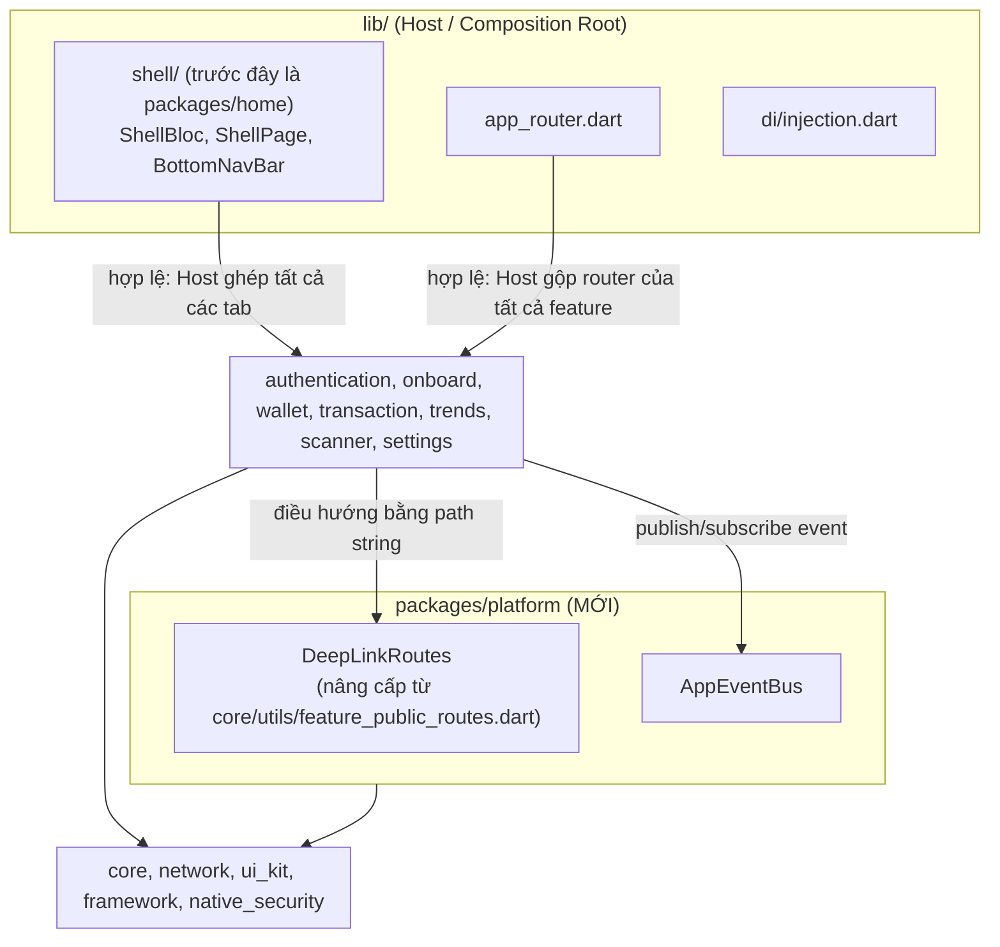
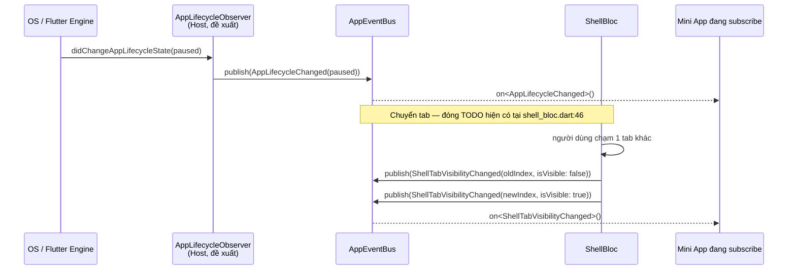
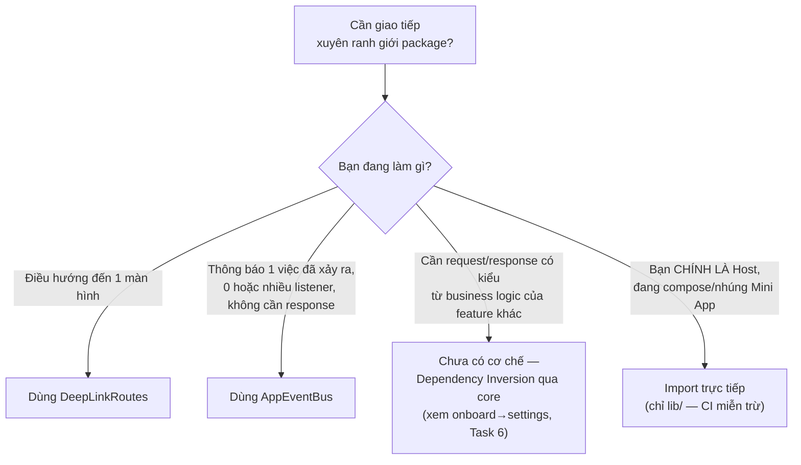
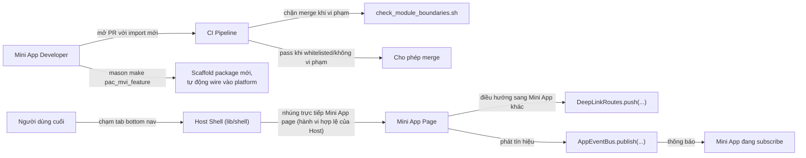
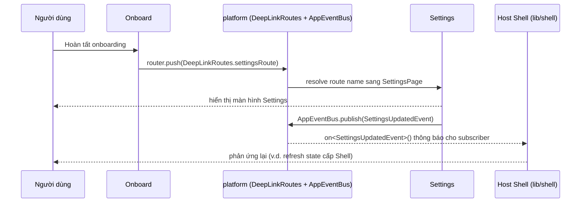

# Epic: Quản trị Super App

## Mục lục
1. [Meta Data](#meta-data)
2. [Bối cảnh](#bối-cảnh)
3. [Mục tiêu & Ngoài phạm vi](#mục-tiêu--ngoài-phạm-vi)
4. [Kiến trúc & Thiết kế kỹ thuật](#kiến-trúc--thiết-kế-kỹ-thuật)
   1. [Kiến trúc tổng thể](#kiến-trúc-tổng-thể)
   2. [Kênh giao tiếp Host ↔ Module](#kênh-giao-tiếp-host--module)
   3. [Đánh giá hiện trạng triển khai](#đánh-giá-hiện-trạng-triển-khai)
   4. [Lifecycle Events — Phân tích & Đề xuất](#lifecycle-events--phân-tích--đề-xuất)
   5. [Use Cases](#use-cases)
   6. [Sequence Diagram (luồng chính — pilot: settings)](#sequence-diagram-luồng-chính--pilot-settings)
5. [Đánh giá Tuân thủ 4 Trụ cột Quản trị Gốc](#đánh-giá-tuân-thủ-4-trụ-cột-quản-trị-gốc)
6. [Chiến lược Rollout & Giảm thiểu rủi ro](#chiến-lược-rollout--giảm-thiểu-rủi-ro)
7. [Phân rã Kanban Tasks](#phân-rã-kanban-tasks)

## Meta Data
- **Tên Epic**: super_app_governance
- **Trạng thái**: **Hoàn tất** — toàn bộ 8 task (1–8) đã implement, review, và merge trên branch `epic/super_app_governance`. `logging-refactor` (epic mà epic này ban đầu xếp hàng chờ sau) thực ra đã merge vào `develop` qua PR #31 trước khi implementation bắt đầu, nên không có xung đột 2 epic đồng thời nào xảy ra trên thực tế.
- **Target Release**: Đã ship trên branch này; chưa merge vào `develop` (quyết định integration đang chờ).
- **Source Spec**: [2026-08-26-super-app-governance-design.md](2026-08-26-super-app-governance-design.md)

## Bối cảnh
`bloc_digital_wallet` là một melos monorepo với 13 package theo Clean Architecture + MVI, được scaffold bằng 2 Mason brick `pac_mvi_feature`/`pac_mvi_subfeature`. Việc đánh giá kiến trúc theo 4 trụ cột quản trị Super App (phân rã container/module, giao tiếp/định tuyến tập trung, cô lập trạng thái, quản trị vòng đời) phát hiện 2 vi phạm coupling cụ thể — `home` (không hề có `domain/`/`data/` riêng; thực chất là logic Shell/Host bị đặt nhầm chỗ trong 1 feature package) import trực tiếp và nhúng widget page của 5 Mini App, và `onboard` import trực tiếp `settings` — cộng thêm 1 cơ chế decoupling định tuyến (`FeaturePublicRoutes`) đã tồn tại sẵn trong `core` nhưng chỉ được dùng ở đúng 1 nơi trong toàn bộ codebase, và không có CI nào ngăn 2 vấn đề trên tái diễn. Xem source spec để có đầy đủ phát hiện theo từng trụ cột.

## Mục tiêu & Ngoài phạm vi

### Mục tiêu

#### Khung quản trị gốc, đã điều chỉnh cho Flutter (nguồn tham chiếu chính thức cho phạm vi)
Epic này được scope theo 1 khung 4 cơ chế quản trị cốt lõi, 8 tiêu chí cho 1 nền tảng Super App "chuẩn mực", được đưa ra ngay từ giai đoạn brainstorming bằng ngôn từ mang tính platform-agnostic/thiên về Android. 2 trong 8 tiêu chí (1.2, 3.2) ban đầu nêu tên cơ chế **chỉ tồn tại trên Android**, **không có tương đương nào trên Flutter/Dart** — không phải "khác tên nhưng cùng bản chất", mà là tooling hoàn toàn không tồn tại trong hệ sinh thái này. Thay vì giữ nguyên các mục tiêu mà project này không thể đáp ứng đúng như câu chữ, nội dung dưới đây phát biểu lại từng tiêu chí theo đúng những gì thực sự tồn tại và khả thi trong 1 pub workspace Dart/Flutter, đánh dấu rõ từng chỗ điều chỉnh. Đây là phát biểu ý định có tính thẩm quyền — xem [Đánh giá Tuân thủ](#đánh-giá-tuân-thủ-4-trụ-cột-quản-trị-gốc) để biết implementation đã hoàn tất đáp ứng từng tiêu chí đến đâu.

**1. Kiến trúc Phân rã (Container & Modules)**
- **1.1. Host App (App Vỏ)**: Đóng vai trò là một Container cốt lõi. Khối này chỉ dung nạp các tác vụ nền tảng dùng chung: Xác thực người dùng (Auth), Giao tiếp mạng (Network Interface), và Lưu trữ cục bộ (Local Storage). *(Đã platform-agnostic ngay từ đầu — không cần điều chỉnh.)*
- **1.2. Mini Apps (App Ruột)** — *đã điều chỉnh*: Mọi tính năng khác phải bị tống ra thành 1 module độc lập. Bản gốc nêu tên Android Dynamic Feature Modules (code tải về lúc runtime) hoặc 1 Flutter Module nhúng vào 1 Native Shell riêng cho mỗi feature. **Cả 2 đều KHÔNG áp dụng được ở đây**: Flutter không có cơ chế tải code động lúc runtime được App Store/Play Store chấp nhận cho app production (khác với Dynamic Feature Module thật của Android), và app này là 1 binary Flutter duy nhất, không phải nhiều native shell mỗi cái nhúng riêng 1 Flutter engine. Điều tương đương khả thi trong hệ sinh thái này: 1 Mini App là 1 package Dart/Flutter độc lập (1 thành viên `packages/*` trong pub workspace) — sở hữu, build, test tách biệt — nhưng vẫn compile chung vào 1 binary app duy nhất lúc build, không tải hay load lúc runtime.

**2. Cơ chế Giao tiếp & Định tuyến tập trung**
- **2.1. DeepLink Router Engine**: Nguyên tắc tối thượng là các Mini App "mù" hoàn toàn về nhau. Không có bất kỳ Import trực tiếp nào giữa chúng. Mọi thao tác điều hướng chuyển trang đều phải thông qua một Central Router xử lý bằng URL Schema hoặc Deeplink. *(Khả thi trên Flutter đúng như nguyên văn — `auto_route` cung cấp Central Router; 1 external URL-scheme handler như `app_links` sẽ hoàn thiện nửa còn lại "URL Schema/Deeplink". Không cần điều chỉnh gì về mặt platform — xem Đánh giá Tuân thủ 2.1 để biết thực tế đã wire được đến đâu.)*
- **2.2. Event Bridge**: Giao tiếp giữa Host và Mini Apps thực hiện qua cơ chế Event Bus phi trạng thái. Khi cần dữ liệu, Mini App ném ra một Event/Intent, Host App bắt lấy, xử lý và trả về kết quả, đảm bảo tính chất Decoupling của Clean Architecture. *(Khả thi trên Flutter đúng như nguyên văn — 1 bus dựa trên `Stream`/`Future`, không cần điều chỉnh platform.)*

**3. Cô lập Trạng thái (State Isolation)**
- **3.1. Đóng gói State cục bộ**: Thay vì sử dụng Global State (nguồn cơn của việc đứt gãy logic và rò rỉ bộ nhớ), mỗi Mini App phải tự quản lý vòng đời và State của riêng mình thông qua các luồng ViewModel (MVI) hoặc BLoC bị cô lập hoàn toàn. *(Đã Flutter-native đúng như nguyên văn — BLoC bản thân nó là 1 thư viện state-management của Flutter/Dart, `flutter_bloc`.)*
- **3.2. Dependency Injection phân tầng** — *đã điều chỉnh*: Quản lý cây phụ thuộc cực kỳ khắt khe; Host cung cấp các Singleton cốt lõi, nhưng bắt buộc phải che giấu Implementation và chỉ đẩy các Interface (Dependency Inversion) xuống cho Mini App. Bản gốc nêu tên Dagger hoặc Hilt — framework DI native của Android (Kotlin/Java), hoàn toàn không có binding nào với Dart. Tương đương thật trên Dart/Flutter mà project này đang dùng là `get_it` (container service-locator) cộng `injectable` (code generator của nó) — cùng ý định, khác tooling cụ thể.

**4. Quản trị Vòng đời (Governance & CI/CD)**
- **4.1. Sandbox Development**: Mỗi Mini App là một project riêng, có khả năng tự biên dịch và chạy độc lập (Standalone mode) để team phát triển tự viết Unit Test mà không cần kéo toàn bộ code của Super App về máy. *(Đã platform-agnostic ngay từ đầu — không cần điều chỉnh.)*
- **4.2. API Contract nội bộ**: Việc cập nhật Vỏ hoặc Ruột phải tuân thủ nghiêm ngặt phiên bản giao thức. Nếu Host App đổi cấu trúc dữ liệu, luồng CI/CD phải tự động báo đỏ và chặn merge để ngăn crash ở Runtime. *(Đã platform-agnostic ngay từ đầu — không cần điều chỉnh.)*

#### Mục tiêu cụ thể của epic này (nhằm hiện thực hóa khung ở trên)
- Loại bỏ import chéo trực tiếp `home→{wallet,transaction,scanner,trends,settings}` và `onboard→settings`.
- Nâng cấp cơ chế `FeaturePublicRoutes` (đã có sẵn nhưng ít dùng) thành DeepLink Router được enforce (package `platform`), thêm mới `AppEventBus` kiểu dữ liệu cho tín hiệu xuyên feature.
- Khóa lại kỷ luật export DI đã tồn tại không chính thức (barrel chỉ export domain/presentation, không bao giờ export `data/**`/`*_impl.dart`) bằng CI enforcement.
- Thêm CI Gate (`scripts/check_module_boundaries.sh`) chặn cứng vi phạm mới, cho phép migrate dần qua whitelist thu hẹp dần.
- Cập nhật Mason brick `pac_mvi_feature`/`pac_mvi_subfeature` để package mới tự động wire vào `platform`; đánh dấu deprecated trong mô tả các brick mồ côi nhắm vào `lib/features/` (`mvi_feature`, `mvi_subfeature`, `remove_feature`, `remove_subfeature`) — giữ lại, không xóa, theo quyết định rõ ràng của user.
- Tăng tốc vòng lặp dev/build cục bộ mà không giảm độ đúng đắn: `genChanged.sh` opt-in dựa trên diff cho lặp cục bộ, cộng thêm fix cache `.dart_tool/` cho CI — an toàn vì dựa trên content-hash staleness detection của chính build_runner, không dựa git diff.
- Migrate tuần tự: pilot = `settings` (bị cả `home` và `onboard` import, kiểm chứng cả 2 chiều phụ thuộc), sau đó chuyển Shell, rồi hardening phần còn lại.

### Ngoài phạm vi
- Dynamic/lazy-loaded feature module thật sự lúc runtime (Flutter không có cơ chế tương đương Android Dynamic Feature Module) — epic này chỉ giải quyết decoupling logic.
- DI container phân tầng/scoped `GetIt` — DI giữ nguyên 1 `GetIt.instance` phẳng; Dependency Inversion đạt được qua kỷ luật export/import, không viết lại DI runtime.
- Thay `auto_route` bằng Navigator 2.0 tự viết tay.
- Xóa các brick mồ côi `mvi_feature`/`mvi_subfeature`/`remove_feature`/`remove_subfeature` (user đã từ chối rõ ràng — chỉ đánh dấu deprecated trong mô tả).
- Cho `home`/Shell sau khi chuyển vị trí có nội dung dashboard thật — trách nhiệm tab-shell được chuyển nguyên trạng.
- Dùng `melos exec --diff` làm cơ chế skip có tính quyết định (cho CI/pre-commit) — nó không thể phát hiện generated output đã stale từ 1 commit trước mốc diff; chỉ cache content-hash của build_runner mới được dùng cho bất cứ thứ gì liên quan đến độ đúng đắn.

## Kiến trúc & Thiết kế kỹ thuật

### Kiến trúc tổng thể

**Lưu ý về tên gói (phát hiện trong lúc làm Task 1):** thư mục vẫn là `packages/platform/`, nhưng `name:` trong pubspec là `app_platform` — package thật `platform` trên pub.dev đã là transitive dependency sẵn có của workspace, và Dart pub không thể alias 1 package local trùng tên với 1 package hosted. Mọi dependency trỏ vào nó dùng key `app_platform:`; code import nó với alias `as platform`. Xem source spec để biết chi tiết đầy đủ.

### Kênh giao tiếp Host ↔ Module

Codebase hiện có 3 kênh giao tiếp, mỗi kênh phục vụ 1 mục đích riêng. Dùng sai kênh cho 1 tác vụ là cách phổ biến nhất khiến kiến trúc kiểu này xói mòn dần theo thời gian, nên phần này cố tình trình bày rõ ràng kênh nào dùng cho việc gì.

| Kênh | Chiều | Hình thái | Ai được dùng | Enforcement |
|---|---|---|---|---|
| **`DeepLinkRoutes`** (`packages/platform`) | Bất kỳ package → bất kỳ màn hình | Điều hướng fire-and-forget, push/replace bằng route constant | Bất kỳ package nào | Không cần — 1 route constant không mang theo chi tiết implementation nào để rò rỉ |
| **`AppEventBus`** (`packages/platform`) | Bất kỳ package ↔ bất kỳ package (N publisher, N subscriber) | Pub/sub broadcast có kiểu, không trả về giá trị | Bất kỳ package nào | Không cần — publish/subscribe 1 event type không phải là import internal của feature khác |
| **Composition trực tiếp** (`lib/shell/`, `lib/di/injection.dart`, `lib/app_router.dart`) | Chỉ Host → Mini App | Import compile-time + nhúng (widget tree, đăng ký DI, gộp router) | **Chỉ Host (`lib/`)** | `scripts/check_module_boundaries.sh` không scan `lib/` — đặc quyền này mang tính cấu trúc, không chỉ là quy ước |

**Rõ ràng KHÔNG phải là 1 kênh hiện nay:** import trực tiếp giữa 2 Mini App (bị CI Gate chặn cứng với 7 feature package), và request/response có kiểu giữa business logic của 2 Mini App (chưa có cơ chế nào tồn tại hoặc được lên kế hoạch — việc `onboard` phụ thuộc vào `BootstrapUseCase`/`FetchTranslationUseCase` của `settings` là nơi duy nhất thấy rõ gap này hiện nay, và nó vẫn nằm trong whitelist thay vì bị ép qua 1 kênh không phù hợp — xem [Chiến lược Rollout](#chiến-lược-rollout--giảm-thiểu-rủi-ro), Phase 1).

### Đánh giá hiện trạng triển khai

`AppEventBus` được xây ở Task 2, nhưng chưa có gì trong codebase publish hay subscribe vào nó, và một số tín hiệu mang tính lifecycle vẫn đang dùng các cơ chế cũ, tự chế, đơn mục đích thay vì 1 cơ chế dùng chung. Bảng dưới là snapshot thực tế (đã verify với code, không phải mong muốn) về vị trí thật sự của từng loại tín hiệu xuyên ranh giới tại thời điểm epic hoàn tất:

| Tín hiệu | Cơ chế hiện tại | Phạm vi xuyên package | Gap đã biết |
|---|---|---|---|
| Auth logout | `AuthStreamService` (`packages/core`) — 1 `Stream<void>` đơn mục đích, được `AuthInterceptor` của `network` publish khi gặp 401 lặp lại | Chỉ `network` → Host (`AuthNavigationInitializer`) | Mini App không có cách nào phản ứng với logout (v.d. xóa 1 list đã cache) mà không phụ thuộc trực tiếp vào `AuthStreamService` của `core` — hiện chưa package nào làm vậy |
| Locale thay đổi | Singleton `LocalizationManager` với 2 callback slot đơn; `LocalizationInitializer` của Host import và poke trực tiếp từng `LocaleSettings` đã generate của cả 7 feature package theo tên | Host → cả 7 Mini App, 1 chiều | Host phải biết tên từng package (đã được tự động hóa bởi hook của brick `pac_mvi_feature`, nên ít ma sát trên thực tế, nhưng vẫn là 1 danh sách fan-out phải maintain thủ công, không phải mô hình subscription |
| Shell tab visibility (ẩn/hiện) | **Không có** | N/A | `lib/shell/shell_bloc.dart:46` có nguyên văn comment `// TODO: Notify child tab to pop to root / scroll to top.` — 1 tab hiện không có cách nào biết mình vừa bị chuyển đi hay quay lại; `IndexedStack` chỉ giữ mọi tab mounted âm thầm |
| OS app lifecycle (resumed/paused/detached) | **Không có** | N/A | Không có bất kỳ implementation `WidgetsBindingObserver` nào trong `lib/` hay bất kỳ `packages/*/lib/` nào — đã xác nhận qua tìm kiếm toàn repo |
| Business event xuyên feature bất kỳ | `AppEventBus` | Bất kỳ → Bất kỳ | Đã đăng ký DI, có unit test (Task 2) — nhưng chưa có publisher/subscriber thật (ngoài test) nào trong repo hiện nay |

### Lifecycle Events — Phân tích & Đề xuất

**Câu hỏi phần này trả lời:** kiến trúc giao tiếp Host ↔ Module có cần 1 cơ chế Lifecycle Delegate riêng để thông báo các sự kiện vòng đời (app foreground/background, tab visibility, session state) cho các module không?

**Đề xuất: không cần cơ chế mới — tái sử dụng `AppEventBus` với 1 tập từ vựng lifecycle event chính thức, gọn nhẹ.** Một abstraction "Lifecycle Delegate" song song (v.d. 1 interface callback mà mọi Mini App phải implement) sẽ trùng lặp đúng thứ `AppEventBus` đã làm — broadcast có kiểu, N-publisher/N-subscriber — mà không thêm được năng lực gì mới, và sẽ để lại 2 pattern giao tiếp xuyên feature cạnh tranh nhau cho người đóng góp sau này phải chọn. Sự mơ hồ đó chính xác là điều bảng [Kênh giao tiếp](#kênh-giao-tiếp-host--module) ở trên tồn tại để ngăn chặn.

Cụ thể, để đóng 2 gap thật sự phát hiện được trong đánh giá:

1. **Định nghĩa 1 tập nhỏ các `AppEvent` con mang tính lifecycle** trong `packages/platform` — v.d. `ShellTabVisibilityChanged({required int tabIndex, required bool isVisible})`, `AppLifecycleChanged(AppLifecycleState state)`, `UserLoggedOut()`. Nhỏ và đóng, không phải 1 catalog mở — chỉ thêm event mới khi có subscriber thật sự cần, đúng kỷ luật mà bản thân thiết kế `AppEventBus` đã tuân theo.
2. **Các handler tab-change của `lib/shell/shell_bloc.dart` publish `ShellTabVisibilityChanged`** cho index tab vừa không còn active và index tab mới active, mỗi lần `_onTabChanged`/`_onTabDoubleTapped`. Điều này đóng trực tiếp `// TODO` đang tồn tại, và cho bloc của từng tab 1 cách thật sự, opt-in để biết mình đang bị ẩn (v.d. dừng polling, dừng animation) mà không cần đổi bản thân `IndexedStack` của Flutter.
3. **1 `AppLifecycleObserver` mới** (1 `WidgetsBindingObserver`, wire 1 lần tại root widget của Host — hiện chưa có ở đâu trong app) publish `AppLifecycleChanged` mỗi lần `didChangeAppLifecycleState` được gọi. Đây là năng lực hoàn toàn mới, không phải migrate cái đã có.
4. **`AuthStreamService.onLoggedOut` giữ nguyên y hệt** (đây là infra của `network`, đã đúng phạm vi và hoạt động tốt) — nhưng subscriber phía Host hiện có (`AuthNavigationInitializer`) cũng republish nó thành `UserLoggedOut()` trên `AppEventBus`, để 1 Mini App muốn phản ứng (xóa state đã cache, reset 1 form) có thể subscribe mà không cần phụ thuộc trực tiếp vào `AuthStreamService` của `core`.
5. **Cơ chế fan-out khi đổi locale cố tình KHÔNG được migrate sang `AppEventBus`.** Đây là vấn đề generated-code, đồng bộ, có thứ tự phụ thuộc — singleton slang của mỗi package phải được cập nhật trước khi package đó rebuild lần kế tiếp đọc nó — không phải vấn đề "thông báo cho ai đang lắng nghe". Ép nó qua 1 async broadcast stream sẽ là lựa chọn tệ hơn so với lệnh gọi trực tiếp do Host điều khiển hiện có. Đây là 1 ngoại lệ được ghi nhận có chủ đích, không phải 1 thiếu sót để 1 đợt audit sau này lại phải nêu lại.

**Trạng thái của đề xuất này: mới đề xuất, chưa implement.** 8 task (1–8) của epic `super_app_governance` đã hoàn tất; phân tích này được viết sau đó, dựa trên trạng thái đã hoàn thiện của epic. Việc implement được scope thành 1 follow-up nhỏ (task mới hoặc mini-epic), không phải mở lại các task đã đóng của epic này — xem ghi chú ở đầu [Phân rã Kanban Tasks](#phân-rã-kanban-tasks).

#### Luồng lifecycle event (đề xuất)

#### Chọn kênh giao tiếp (hướng dẫn quyết định)

### Use Cases

### Sequence Diagram (luồng chính — pilot: settings)

## Đánh giá Tuân thủ 4 Trụ cột Quản trị Gốc

Giai đoạn brainstorming của epic này được scope theo 1 khung 4 trụ cột, 8 tiêu chí cho 1 nền tảng Super App "chuẩn mực" (phân rã container/module, giao tiếp/định tuyến tập trung, cô lập trạng thái, quản trị vòng đời). Phần này audit lại implementation đã hoàn tất so với đúng khung gốc đó, từng tiêu chí một, đã verify với code thật (không phải mong muốn) — viết sau khi cả 8 task đã đóng, nên phản ánh thực tế chứ không phải ý định.

| # | Tiêu chí | Trạng thái | Gap |
|---|---|---|---|
| 1.1 | Host = container thuần (chỉ Auth/Network/Storage) | ✅ Đạt | — |
| 1.2 | Mini App = module độc lập + tải động lúc runtime | ⚠️ Nửa đạt | Không có tải động — giới hạn nền tảng Flutter |
| 2.1 | DeepLink Router, Mini App mù hoàn toàn, URL Schema | ⚠️ Nửa đạt | Decoupling nội bộ có thật; chưa có URL scheme OS-level nào |
| 2.2 | Event Bridge, Mini App ném event và nhận lại kết quả | ⚠️ Nửa đạt | `AppEventBus` chỉ fire-and-forget, chưa có kênh request/response |
| 3.1 | State Isolation qua MVI/BLoC | ✅ Đạt | — |
| 3.2 | DI phân tầng, Host che implementation, chỉ đẩy interface xuống | ⚠️ Nửa đạt | DI vẫn phẳng (có chủ đích); còn 2 exception export `data/**` đã ghi nhận |
| 4.1 | Sandbox Development — build/run/test standalone từng Mini App | ⚠️ Nửa đạt | Unit test độc lập hoạt động tốt; chưa có standalone UI runner |
| 4.2 | API Contract nội bộ — CI báo đỏ/chặn merge khi Host đổi breaking | ✅ Đạt (qua cơ chế khác) | Không có hệ thống contract-versioning chính thức; static typing + CI analyze đã cover đúng mục tiêu |

**3/8 đạt hoàn toàn, 5/8 đạt một phần với gap đã xác định rõ, 0/8 chưa được xử lý.**

### 1.1 — Host = container thuần
**Đạt.** `lib/` chỉ chứa Shell (compose tab), DI wiring, gộp router, và app initializer — không có business logic feature nào. Auth/Network/Storage được tổ chức thành package hạ tầng riêng (`core`, `network`, `native_security`) mà Host phụ thuộc, thay vì inline vào `lib/` — cách chia tách này sạch hơn nghĩa đen của khung gốc ("Host chứa Auth/Network/Storage"), mà vẫn không vi phạm tinh thần của nó.

### 1.2 — Mini App = module độc lập + tải động lúc runtime
**Nửa đạt.** Cả 7 feature package build và test độc lập được. **Không có tải động lúc runtime** — mọi thứ vẫn compile chung 1 binary. Đây là giới hạn thật của nền tảng Flutter (không có API tương đương Android Dynamic Feature Module), đã được ghi nhận là Non-Goal ngay từ giai đoạn design của epic. Để đạt đúng nghĩa đen tiêu chí này cần 1 kiến trúc hoàn toàn khác (Flutter engine riêng cho mỗi Mini App phía sau 1 Native Shell thật) — chưa được đề xuất hay xây dựng, và sẽ là 1 khối lượng công việc lớn nếu cần đến.

### 2.1 — DeepLink Router, Mini App mù hoàn toàn, URL Schema
**Nửa đạt.** `DeepLinkRoutes` (`packages/platform`) cộng CI Gate (`scripts/check_module_boundaries.sh`) chặn cứng import chéo trực tiếp giữa các Mini App (1 exception đã ratify: `onboard→settings`, coupling business-logic, không phải navigation). Đã verify cho đánh giá này: **hoàn toàn không có xử lý URL-scheme/deep-link ngoài app ở bất kỳ đâu** — không dependency `uni_links`/`app_links`, không `<intent-filter>` trong `AndroidManifest.xml`, không `CFBundleURLSchemes` trong `Info.plist`. App hiện không thể mở thẳng vào 1 màn hình cụ thể từ push notification, web link, hay QR code ngoài app. `DeepLinkRoutes` là 1 cơ chế decoupling *nội bộ* thật sự hoạt động — không phải deep-linking OS-level.

### 2.2 — Event Bridge, Mini App ném event và nhận lại kết quả
**Nửa đạt.** `AppEventBus` là broadcast pub/sub 1 chiều (fire-and-forget) — không có kênh request/response. Khung gốc mô tả rõ ràng 1 round-trip: "Mini App ném ra Event/Intent, Host App bắt lấy, xử lý và trả về kết quả." Đây là hình thái khác về bản chất so với những gì đã xây. Gap này chính là nguyên nhân gốc trực tiếp khiến exception `onboard→settings` còn tồn tại (xem [Lifecycle Events](#lifecycle-events--phân-tích--đề-xuất) và ghi chú Phase 1 của source spec): `onboard` cần 1 *kết quả có kiểu* từ business logic của `settings`, và không có kênh request/response nào để mang nó về — nên vẫn import trực tiếp, được whitelist thay vì giải quyết triệt để. Cố tình không xử lý bằng cách mở rộng `AppEventBus` thành request/response (sẽ làm mờ chính bản sắc "broadcast phi trạng thái" của nó thành 1 lớp RPC tự chế) — hướng thay thế đã ghi nhận là Dependency Inversion (1 interface đặt ở `core`, implement bởi `settings`), khớp với tiền lệ `TokenRefresher` đã có sẵn trong codebase.

### 3.1 — State Isolation qua MVI/BLoC
**Đạt hoàn toàn.** Mỗi Mini App sở hữu BLoC riêng (Action/State/Event qua `framework`); Shell của Host cũng có `ShellBloc` riêng cho state tab-index. Không tìm thấy global state/shared provider nào xuyên suốt toàn bộ epic.

### 3.2 — DI phân tầng, Host che implementation, chỉ đẩy interface xuống
**Nửa đạt.** DI (`GetIt`/`injectable`) vẫn là 1 container phẳng duy nhất — không phân tầng/scoped, 1 quyết định có chủ đích (xem [Ngoài phạm vi](#ngoài-phạm-vi)) nhằm tránh viết lại DI runtime cho lợi ích không chắc chắn. Về che implementation: kỷ luật barrel-export (chỉ `domain/**`/`presentation/**`, không bao giờ `data/**`) được CI Gate enforce cho chiều *import*, nhưng CI Gate không thể phát hiện 1 package tự *export* file `data/**` của chính nó (1 loại check khác về mặt cấu trúc — xem báo cáo Task 8). Audit thủ công (Task 8) tìm thấy đúng 2 exception như vậy trong barrel của `packages/settings`, cả 2 đều được document là có chủ đích: `SettingsLocalDataSource` (dùng bởi `logging_initializer.dart` của Host) và `SyncBootstrapResponse` (dùng bởi `onboard` — cùng nguyên nhân gốc với mục [2.2](#22--event-bridge-mini-app-ném-event-và-nhận-lại-kết-quả) ở trên).

### 4.1 — Sandbox Development
**Nửa đạt.** Unit test độc lập hoạt động tốt và đã được thực hiện lặp đi lặp lại xuyên suốt epic này — `flutter test` của mọi package chạy độc lập, không cần build root app. Điều còn thiếu: **không package nào có app `example/` hay entry point Flutter riêng**, nên dev không thể chạy/xem UI của 1 Mini App đơn lẻ (v.d. chạy riêng `wallet` trên simulator mà không cần Shell/DI/routing của Host). Gap này đã được nêu từ chính bản đánh giá kiến trúc đầu tiên trước epic này (gợi ý số 6) và vẫn còn mở — nằm ngoài phạm vi 8 task của epic này.

### 4.2 — API Contract nội bộ, CI chặn merge khi Host đổi breaking
**Đạt, qua 1 cơ chế khác với contract-versioning theo nghĩa đen.** Vì đây là 1 pub workspace duy nhất (mọi package resolve chung 1 dependency graph), bất kỳ thay đổi breaking nào ở type phía Host hoặc hạ tầng đều khiến `flutter analyze`/compile FAIL ngay lập tức cho mọi Mini App phụ thuộc — bắt được ở **compile time**, không phải runtime, và được enforce trong CI (`melos run analyze` trong stage `CIChecking` của `.gitlab-ci.yml`) trước khi merge. Không có hệ thống contract-versioning chính thức riêng biệt (v.d. semantic versioning cho public API của `platform`, hay 1 bộ contract test riêng) — nhưng với 1 ngôn ngữ static-typed trong workspace 1-resolution như hiện tại, type-checking ở compile time đã đạt đúng mục tiêu gốc (chặn merge, ngăn crash runtime do thay đổi cấu trúc phía Host) mà không cần thêm tooling.

## Chiến lược Rollout & Giảm thiểu rủi ro
Triển khai tuần tự, 4 giai đoạn (xem Migration Plan trong source spec để biết chi tiết đầy đủ):

1. **Phase 0 — Nền tảng**: tạo `packages/platform` (chuyển DeepLinkRoutes + AppEventBus mới), CI Gate + whitelist đã seed sẵn, cập nhật Mason brick, `genChanged.sh` + fix cache `.dart_tool/` cho CI. Không đổi behavior.
2. **Phase 1 — Pilot (`settings`), điều chỉnh sau khi triển khai**: kế hoạch ban đầu giả định `onboard→settings` là push-navigation; khi triển khai phát hiện không đúng — navigation của `onboard` đã dùng `DeepLinkRoutes.homeRoute` (từ Task 1) và chưa từng import `settings` để điều hướng. Import `onboard→settings` thật sự là 1 business-logic dependency (`BootstrapUseCase`/`FetchTranslationUseCase`) mà cả `DeepLinkRoutes` lẫn `AppEventBus` đều không biểu diễn được — muốn sửa cần refactor Dependency-Inversion nằm ngoài phạm vi epic này, nên **vẫn nằm trong whitelist vô thời hạn**. Mục tiêu thật sự của pilot (chứng minh `DeepLinkRoutes` hoạt động end-to-end) đã được Task 1 tự chứng minh rồi. `home→settings` là trường hợp khác — 1 tab embed trong `IndexedStack`, không phải route được push — không hợp với `DeepLinkRoutes` nên vẫn nằm trong whitelist đến Phase 2, giải quyết cùng lúc với 4 tab embed còn lại của `home` trong 1 lần chuyển duy nhất.
3. **Phase 2 — Chuyển Shell**: chuyển logic tab-shell của `home` sang `lib/shell/`; retire `packages/home`. Tự động giải quyết toàn bộ entry whitelist còn lại của `home` (kể cả `settings`).
4. **Phase 3 — Hardening**: rà soát barrel của toàn bộ feature package, siết chặt kiểm tra deep-import của CI Gate. File whitelist được giữ lại, kết thúc epic với đúng 1 entry được ghi nhận rõ ràng (`onboard→settings`), không phải rỗng.

**Giảm thiểu rủi ro**: whitelist của CI Gate chính là cơ chế rollback ở mọi giai đoạn — có thể revert 1 bước migrate bằng cách thêm lại entry vào whitelist mà không cần đụng vào script gate. Pre-commit hook (`melos genAlls` full + so sánh diff) vẫn là lưới an toàn xuyên suốt chống lại generated output bị stale.

**Lưu ý về thứ tự (lịch sử)**: epic này ban đầu xếp hàng chờ sau `logging-refactor`, toàn bộ task bắt đầu ở trạng thái `backlog`. Đến lúc implementation bắt đầu, `logging-refactor` thực ra đã merge vào `develop` (PR #31), nên task được kích hoạt (`backlog` → `todo`) ngay lập tức, không có xung đột 2 epic đồng thời nào trên thực tế.

## Phân rã Kanban Tasks
Toàn bộ 8 task dưới đây đều **đã hoàn tất**. [Đề xuất Lifecycle Events](#lifecycle-events--phân-tích--đề-xuất) ở trên được viết sau khi epic đóng lại và là 1 follow-up đề xuất, không phải task thứ 9 của epic này — chưa có file task nào cho nó.

- [Task 1: Tạo package `platform` — chuyển DeepLinkRoutes](../../features/task_1_create_platform_package.md)
- [Task 2: Implement `AppEventBus`](../../features/task_2_app_event_bus.md)
- [Task 3: CI Gate — script kiểm tra ranh giới module](../../features/task_3_ci_module_boundary_gate.md)
- [Task 4: Cập nhật Mason brick cho `platform`](../../features/task_4_mason_bricks_platform.md)
- [Task 5: `genChanged.sh` + cache `.dart_tool/` cho CI](../../features/task_5_gen_changed_and_ci_cache.md)
- [Task 6: Migrate package pilot `settings`](../../features/task_6_migrate_settings_pilot.md)
- [Task 7: Chuyển Shell ra khỏi `home`](../../features/task_7_relocate_shell.md)
- [Task 8: Hardening — rà soát barrel & xóa whitelist](../../features/task_8_hardening_barrel_audit.md)
