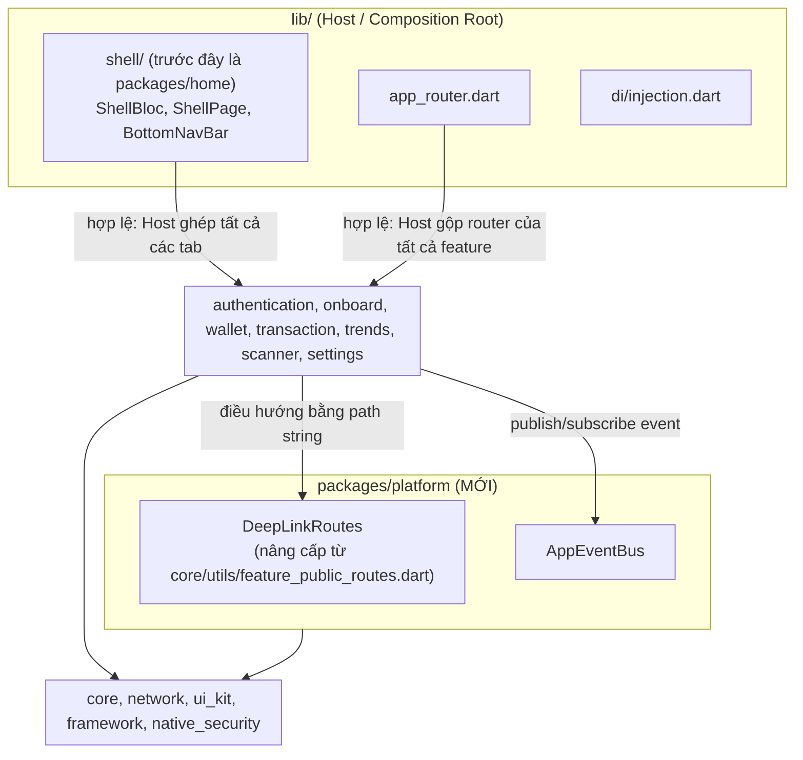
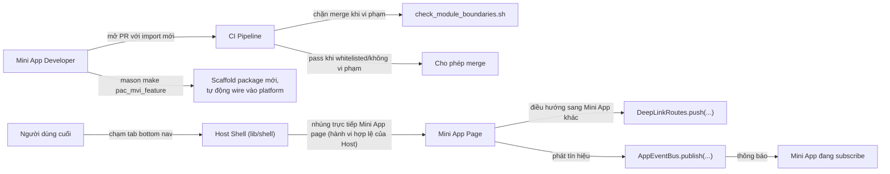
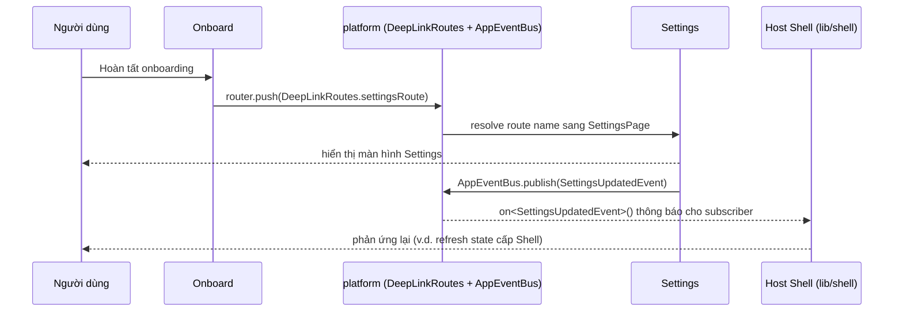

# Epic: Quản trị Super App

## Meta Data
- **Tên Epic**: super_app_governance
- **Trạng thái**: Đang active — `logging-refactor` đã merge vào `develop` (PR #31); toàn bộ 8 task đã chuyển từ `backlog` sang `todo`, sẵn sàng cho `epic-implementation`.
- **Target Release**: TBD — kích hoạt phụ thuộc vào việc `logging-refactor` hoàn thành, không phải một mốc thời gian cụ thể.
- **Source Spec**: [2026-08-26-super-app-governance-design.md](2026-08-26-super-app-governance-design.md)

## Bối cảnh
`bloc_digital_wallet` là một melos monorepo với 13 package theo Clean Architecture + MVI, được scaffold bằng 2 Mason brick `pac_mvi_feature`/`pac_mvi_subfeature`. Việc đánh giá kiến trúc theo 4 trụ cột quản trị Super App (phân rã container/module, giao tiếp/định tuyến tập trung, cô lập trạng thái, quản trị vòng đời) phát hiện 2 vi phạm coupling cụ thể — `home` (không hề có `domain/`/`data/` riêng; thực chất là logic Shell/Host bị đặt nhầm chỗ trong 1 feature package) import trực tiếp và nhúng widget page của 5 Mini App, và `onboard` import trực tiếp `settings` — cộng thêm 1 cơ chế decoupling định tuyến (`FeaturePublicRoutes`) đã tồn tại sẵn trong `core` nhưng chỉ được dùng ở đúng 1 nơi trong toàn bộ codebase, và không có CI nào ngăn 2 vấn đề trên tái diễn. Xem source spec để có đầy đủ phát hiện theo từng trụ cột.

## Mục tiêu & Ngoài phạm vi

### Mục tiêu
- Loại bỏ import chéo trực tiếp `home→{wallet,transaction,scanner,trends,settings}` và `onboard→settings`.
- Nâng cấp cơ chế `FeaturePublicRoutes` (đã có sẵn nhưng ít dùng) thành DeepLink Router được enforce (package `platform`), thêm mới `AppEventBus` kiểu dữ liệu cho tín hiệu xuyên feature.
- Khóa lại kỷ luật export DI đã tồn tại không chính thức (barrel chỉ export domain/presentation, không bao giờ export `data/**`/`*_impl.dart`) bằng CI enforcement.
- Thêm CI Gate (`scripts/check_module_boundaries.sh`) chặn cứng vi phạm mới, cho phép migrate dần qua whitelist thu hẹp dần.
- Cập nhật Mason brick `pac_mvi_feature`/`pac_mvi_subfeature` để package mới tự động wire vào `platform`; đánh dấu deprecated trong mô tả các brick mồ côi nhắm vào `lib/features/` (`mvi_feature`, `mvi_subfeature`, `remove_feature`, `remove_subfeature`) — giữ lại, không xóa, theo quyết định rõ ràng của user.
- Tăng tốc vòng lặp dev/build cục bộ mà không giảm độ đúng đắn: `genChanged.sh` opt-in dựa trên diff cho lặp cục bộ, cộng thêm fix cache `.dart_tool/` cho CI — an toàn vì dựa trên content-hash staleness detection của chính build_runner, không dựa git diff.
- Migrate tuần tự: pilot = `settings` (bị cả `home` và `onboard` import, kiểm chứng cả 2 chiều phụ thuộc), sau đó chuyển Shell, rồi hardening phần còn lại.

### Ngoài phạm vi
- Dynamic/lazy-loaded feature module thật sự lúc runtime (Flutter không có cơ chế tương đương Android Dynamic Feature Module) — epic này chỉ giải quyết decoupling logic.
- DI container phân tầng/scoped `GetIt` — DI giữ nguyên 1 `GetIt.instance` phẳng; Dependency Inversion đạt được qua kỷ luật export/import, không viết lại DI runtime.
- Thay `auto_route` bằng Navigator 2.0 tự viết tay.
- Xóa các brick mồ côi `mvi_feature`/`mvi_subfeature`/`remove_feature`/`remove_subfeature` (user đã từ chối rõ ràng — chỉ đánh dấu deprecated trong mô tả).
- Cho `home`/Shell sau khi chuyển vị trí có nội dung dashboard thật — trách nhiệm tab-shell được chuyển nguyên trạng.
- Dùng `melos exec --diff` làm cơ chế skip có tính quyết định (cho CI/pre-commit) — nó không thể phát hiện generated output đã stale từ 1 commit trước mốc diff; chỉ cache content-hash của build_runner mới được dùng cho bất cứ thứ gì liên quan đến độ đúng đắn.

## Kiến trúc & Thiết kế kỹ thuật

### Kiến trúc tổng thể

**Lưu ý về tên gói (phát hiện trong lúc làm Task 9):** thư mục vẫn là `packages/platform/`, nhưng `name:` trong pubspec là `app_platform` — package thật `platform` trên pub.dev đã là transitive dependency sẵn có của workspace, và Dart pub không thể alias 1 package local trùng tên với 1 package hosted. Mọi dependency trỏ vào nó dùng key `app_platform:`; code import nó với alias `as platform`. Xem source spec để biết chi tiết đầy đủ.

### Use Cases

### Sequence Diagram (luồng chính — pilot: settings)

## Chiến lược Rollout & Giảm thiểu rủi ro
Triển khai tuần tự, 4 giai đoạn (xem Migration Plan trong source spec để biết chi tiết đầy đủ):

1. **Phase 0 — Nền tảng**: tạo `packages/platform` (chuyển DeepLinkRoutes + AppEventBus mới), CI Gate + whitelist đã seed sẵn, cập nhật Mason brick, `genChanged.sh` + fix cache `.dart_tool/` cho CI. Không đổi behavior.
2. **Phase 1 — Pilot (`settings`)**: `onboard→settings` là push-navigation thật sự, migrate sang `DeepLinkRoutes.settingsRoute` rồi gỡ khỏi whitelist. `home→settings` là 1 tab embed trong `IndexedStack`, không phải route được push — không hợp với `DeepLinkRoutes` nên vẫn nằm trong whitelist đến Phase 2, giải quyết cùng lúc với 4 tab embed còn lại của `home` trong 1 lần chuyển duy nhất.
3. **Phase 2 — Chuyển Shell**: chuyển logic tab-shell của `home` sang `lib/shell/`; retire `packages/home`. Tự động giải quyết toàn bộ entry whitelist còn lại của `home` (kể cả `settings`).
4. **Phase 3 — Hardening**: rà soát barrel của toàn bộ feature package, siết chặt kiểm tra deep-import của CI Gate, xóa file whitelist (lúc này đã rỗng).

**Giảm thiểu rủi ro**: whitelist của CI Gate chính là cơ chế rollback ở mọi giai đoạn — có thể revert 1 bước migrate bằng cách thêm lại entry vào whitelist mà không cần đụng vào script gate. Pre-commit hook (`melos genAlls` full + so sánh diff) vẫn là lưới an toàn xuyên suốt chống lại generated output bị stale.

**Lưu ý về thứ tự**: epic này đang xếp hàng chờ sau `logging-refactor` (xem Meta Data) — toàn bộ task bên dưới bắt đầu ở trạng thái `backlog`, không nên bắt đầu thực hiện cho đến khi `logging-refactor` hoàn thành, để tránh 2 refactor lớn cùng đổ vào `develop` song song.

## Phân rã Kanban Tasks
- [Task 9: Tạo package `platform` — chuyển DeepLinkRoutes](../../features/task_9_create_platform_package.md)
- [Task 10: Implement `AppEventBus`](../../features/task_10_app_event_bus.md)
- [Task 11: CI Gate — script kiểm tra ranh giới module](../../features/task_11_ci_module_boundary_gate.md)
- [Task 12: Cập nhật Mason brick cho `platform`](../../features/task_12_mason_bricks_platform.md)
- [Task 13: `genChanged.sh` + cache `.dart_tool/` cho CI](../../features/task_13_gen_changed_and_ci_cache.md)
- [Task 14: Migrate package pilot `settings`](../../features/task_14_migrate_settings_pilot.md)
- [Task 15: Chuyển Shell ra khỏi `home`](../../features/task_15_relocate_shell.md)
- [Task 16: Hardening — rà soát barrel & xóa whitelist](../../features/task_16_hardening_barrel_audit.md)
