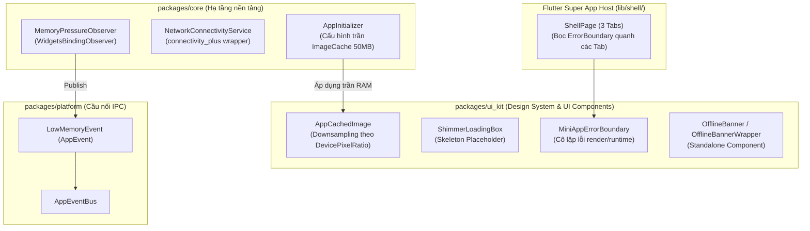

# Đặc Tả Thiết Kế Kỹ Thuật: Super App Resilience & Memory Management
## (Production Readiness, Crash Isolation & Memory Strategy)

- **Ngày tạo:** 2026-09-11
- **Trạng thái:** Approved
- **Phạm vi tác động:** `packages/ui_kit`, `packages/core`, `packages/platform`, `lib/shell/`, `bricks/pac_mvi_feature/`
- **Mục tiêu:** Xây dựng khung năng lực chống OOM, kiểm soát bộ nhớ đồ họa, cô lập crash giữa các Mini App và thông báo trạng thái kết nối mạng toàn diện cho Flutter Super App.

---

## 1. Bối Cảnh & Động Lực (Context & Motivation)

Trong kiến trúc **Super App đa module (Multi-Package Architecture)**:
1. **Nguy cơ rò rỉ và tràn bộ nhớ (OOM):** Khi ứng dụng tải nhiều hình ảnh chất lượng cao từ mạng mà không chỉ định kích thước giải mã (downsampling), Flutter Engine mặc định giải nén toàn bộ ảnh gốc vào RAM đồ họa (ví dụ: ảnh 2000x2000px ngốn tới 16MB RAM/ảnh). Với danh sách 20 ảnh, app tốn >300MB RAM, gây giật lag và OOM crash trên các thiết bị cấu hình vừa/thấp.
2. **Nguy cơ sập ứng dụng chéo (Cascading Crash / Red Screen):** Nếu một Mini App (như Scanner, Payment hay bên thứ ba) gặp unhandled exception trong hàm `build()` hoặc render, Flutter mặc định hiển thị "màn hình đỏ/xám chết chóc", khiến người dùng không thể thao tác tiếp, làm sập toàn bộ Super App Host.
3. **Thiếu cơ chế phản ứng khi hệ điều hành cảnh báo thiếu RAM:** Khi Android/iOS phát tín hiệu cảnh báo bộ nhớ nguy cấp (`didHaveMemoryPressure`), app không tự động dọn rác bộ đệm ảnh hay thông báo cho các Mini App, dẫn đến việc bị OS kill đột ngột trong nền.
4. **Trải nghiệm mạng chập chờn (Offline UX):** Khi mất kết nối internet, người dùng không được thông báo rõ ràng tại các màn hình cần thao tác dữ liệu.

Epic này giải quyết triệt để 4 vấn đề trên thông qua **4 Trụ Cột Cốt Lõi**.

---

## 2. Kiến Trúc Tổng Thể & Ranh Giới Module



---

## 3. Đặc Tả Chi Tiết 4 Trụ Cột

### Trụ Cột 1: `AppCachedImage` & Tối Ưu RAM Bộ Nhớ Đồ Họa

* **Vị trí:**
  * `packages/ui_kit/lib/widgets/app_cached_image.dart`
  * `packages/ui_kit/lib/widgets/shimmer_loading_box.dart`
  * `packages/core/lib/app_initializer/app_initializer.dart`
* **Nguyên lý hoạt động:**
  1. `AppCachedImage` nhận `imageUrl`, `width`, `height`, `fit`, `borderRadius`, `enableShimmer`.
  2. Tự động tính toán pixel hiển thị vật lý thực tế:
     ```dart
     final pixelRatio = MediaQuery.devicePixelRatioOf(context);
     final memWidth = width != null ? (width! * pixelRatio).round() : null;
     final memHeight = height != null ? (height! * pixelRatio).round() : null;
     ```
  3. Truyền trực tiếp `memCacheWidth` và `memCacheHeight` vào `CachedNetworkImage`. Nhờ vậy, ảnh được downsample ngay trong lúc decode từ đĩa vào RAM đồ họa, tiết kiệm hơn 90% bộ nhớ.
  4. Tích hợp `ShimmerLoadingBox` (sử dụng package `shimmer` sẵn có trong `ui_kit`) khi đang nạp ảnh và fallback sang `broken_image` khi ảnh hỏng.
* **Cấu hình trần bộ nhớ toàn cục:**
  * Trong `AppInitializer.init()`:
    ```dart
    PaintingBinding.instance.imageCache.maximumSize = 100; // Tối đa 100 ảnh
    PaintingBinding.instance.imageCache.maximumSizeBytes = 50 * 1024 * 1024; // Tối đa 50MB
    ```

---

### Trụ Cột 2: `MiniAppErrorBoundary` (Crash Isolation)

* **Vị trí:** `packages/ui_kit/lib/widgets/mini_app_error_boundary.dart`
* **Nguyên lý hoạt động:**
  1. Là một `StatefulWidget` bảo vệ cây widget con.
  2. Lắng nghe và chặn các lỗi render/exception trong subtree.
  3. Khi phát hiện crash:
     * Thay thế vùng hiển thị của Mini App đó bằng **Full-Screen In-Place Fallback UI**.
     * Giữ nguyên Shell Navigation Bar, các Tab khác và các Mini App khác tiếp tục hoạt động 100% không bị ảnh hưởng.
     * Nút **"Thử lại" (Retry)**: Reset state lỗi và thử re-mount lại widget con.
     * Nút **"Về Trang Chủ" (Go Home)**: Điều hướng an toàn về tab Home (`ShellRoute`).
     * Trong chế độ Debug (`kDebugMode`): Cung cấp accordion mở rộng hiển thị chi tiết Exception & StackTrace để nhà phát triển phân tích.
* **Tích hợp:**
  * Bọc quanh 3 Tab trong [lib/shell/shell_page.dart](file:///Users/danhdueexoictif/AllProjects/digital_wallet/bloc_digital_wallet/lib/shell/shell_page.dart).
  * Cập nhật template của Mason brick `pac_mvi_feature` để mọi Mini App mới được sinh ra đều tự động có Error Boundary bảo vệ.

---

### Trụ Cột 3: `MemoryPressureObserver` & Ứng Phó Cảnh Báo Thiếu RAM

* **Vị trí:**
  * `packages/platform/lib/app_event_bus.dart` (Bổ sung `LowMemoryEvent`)
  * `packages/core/lib/services/memory_pressure_observer.dart`
* **Nguyên lý hoạt động:**
  1. `MemoryPressureObserver` kế thừa `WidgetsBindingObserver` và ghi đè `didHaveMemoryPressure()`.
  2. Khi hệ điều hành Android/iOS cảnh báo RAM nguy cấp:
     * Dọn sạch cache ảnh trong RAM:
       ```dart
       PaintingBinding.instance.imageCache.clear();
       PaintingBinding.instance.imageCache.clearLiveImages();
       ```
     * Bắn tín hiệu qua EventBus: `getIt<AppEventBus>().publish(const LowMemoryEvent())`.
     * Các Mini App/Repository có thể lắng nghe `eventBus.on<LowMemoryEvent>()` để dọn dẹp các cache dữ liệu tạm trong bộ nhớ.
  3. Được khởi tạo tự động trong `AppInitializer.init()`.

---

### Trụ Cột 4: `NetworkConnectivityService` & Standalone `OfflineBanner`

* **Vị trí:**
  * `packages/core/lib/services/network_connectivity_service.dart`
  * `packages/ui_kit/lib/widgets/offline_banner.dart`
* **Nguyên lý hoạt động:**
  1. `NetworkConnectivityService`:
     * Kết hợp mô hình Hybrid: Dùng `connectivity_plus` lắng nghe sự kiện thay đổi mạng từ OS và `internet_connection_checker_plus` để kiểm tra True Internet Reachability (xác thực internet thực tế, loại bỏ 100% false positive từ Wi-Fi captive portal).
     * Cung cấp enum `NetworkStatus { online, offline, unknown }`.
     * Expose `Stream<NetworkStatus> get onStatusChanged` và `Future<bool> get isConnected`.
  2. `OfflineBannerWrapper` (Standalone Component theo Phương án B đã chọn):
     * Mỗi màn hình Mini App tự do quyết định việc bọc widget này vào layout:
       ```dart
       OfflineBannerWrapper(
         child: FeatureBodyContent(),
       )
       ```
     * Khi mất kết nối: Banner đỏ/cam trượt nhẹ nhàng từ trên xuống dưới dạng animation mượt mà.
     * Khi có kết nối lại: Chuyển sang màu xanh lá báo *"Đã kết nối lại"* trong 2 giây rồi tự động trượt thu lên.

---

## 4. Kế Hoạch Kiểm Thử (Testing Strategy)

| Thành phần | Loại kiểm thử | Mục tiêu kiểm thử |
|---|---|---|
| `AppCachedImage` | Widget Test (`packages/ui_kit/test/`) | Xác minh tính toán `memCacheWidth`/`memCacheHeight` đúng tỉ lệ `devicePixelRatio`; hiển thị Shimmer khi tải; hiển thị error fallback khi link ảnh hỏng. |
| `MiniAppErrorBoundary` | Widget Test (`packages/ui_kit/test/`) | Giả lập ném exception trong widget con; xác minh UI chuyển sang Fallback Screen; bấm nút "Thử lại" phục hồi thành công; bấm "Về Trang Chủ" kích hoạt navigation. |
| `MemoryPressureObserver` | Unit Test (`packages/core/test/`) | Kích hoạt `didHaveMemoryPressure()`; xác minh `imageCache.clear()` được gọi và `LowMemoryEvent` được publish lên `AppEventBus`. |
| `NetworkConnectivityService` | Unit Test (`packages/core/test/`) | Mock `Connectivity`; xác minh chuyển đổi trạng thái giữa online/offline đúng định dạng enum. |
| `OfflineBanner` | Widget Test (`packages/ui_kit/test/`) | Giả lập stream mất mạng $\rightarrow$ banner xuất hiện; stream có mạng $\rightarrow$ banner đổi màu và tự ẩn. |

---

## 5. Danh Mục Files Tác Động Dự Kiến

1. **`packages/ui_kit`**:
   * `lib/widgets/app_cached_image.dart` [NEW]
   * `lib/widgets/shimmer_loading_box.dart` [NEW]
   * `lib/widgets/mini_app_error_boundary.dart` [NEW]
   * `lib/widgets/offline_banner.dart` [NEW]
   * `lib/ui_kit.dart` (Barrel exports)
   * `test/app_cached_image_test.dart` [NEW]
   * `test/mini_app_error_boundary_test.dart` [NEW]
   * `test/offline_banner_test.dart` [NEW]
2. **`packages/core`**:
   * `lib/services/memory_pressure_observer.dart` [NEW]
   * `lib/services/network_connectivity_service.dart` [NEW]
   * `lib/app_initializer/app_initializer.dart` (Cấu hình RAM cap & Observer)
   * `lib/core.dart` (Barrel exports)
   * `test/memory_pressure_observer_test.dart` [NEW]
   * `test/network_connectivity_service_test.dart` [NEW]
3. **`packages/platform`**:
   * `lib/app_event_bus.dart` (Bổ sung `LowMemoryEvent`)
   * `test/app_event_bus_test.dart` (Thêm test cho `LowMemoryEvent`)
4. **Host App & Bricks**:
   * `lib/shell/shell_page.dart` (Bọc `MiniAppErrorBoundary` quanh các Tab)
   * `bricks/pac_mvi_feature/__brick__/lib/features/{{{name.snakeCase()}}}/presentation/page/{{{name.snakeCase()}}}_page.dart` (Tự động bọc ErrorBoundary cho feature mới)
