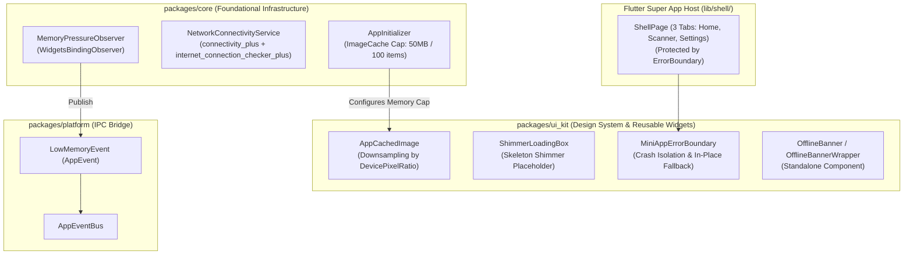
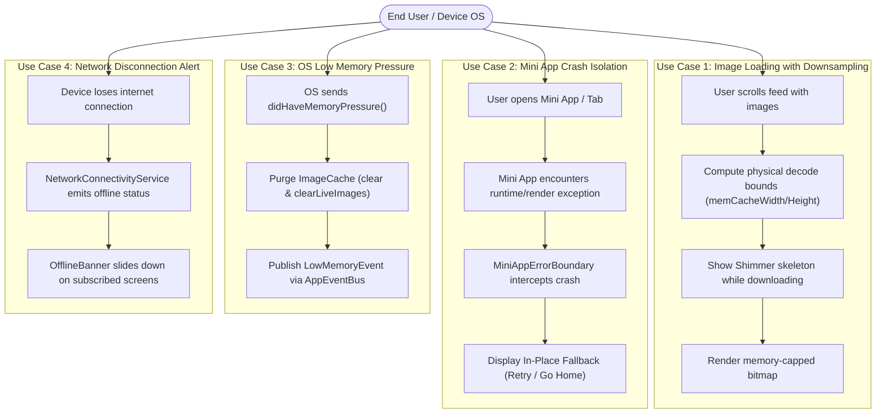
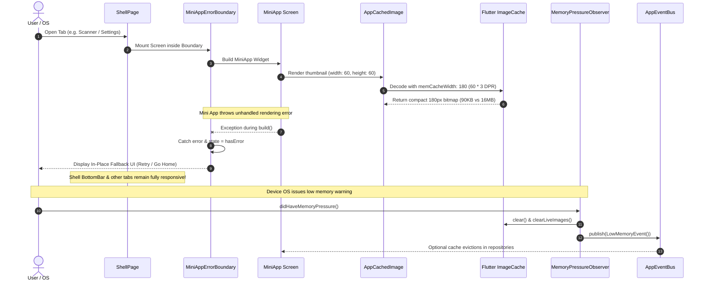

# Epic: Super App Resilience & Memory Management

## 1. Meta Data
- **Epic Name:** `super_app_resilience_and_memory`
- **Status:** Completed
- **Target Release:** v1.0.0
- **Source Spec:** [2026-09-11-super-app-resilience-and-memory-design.md](2026-09-11-super-app-resilience-and-memory-design.md)
- **Owners / Lead:** Mobile Engineering & Architecture

---

## 2. Background
In a large-scale, multi-package **Super App** architecture, Mini Apps (feature modules) run inside a shared host process and consume shared runtime resources. Without proactive defenses, four fatal failure modes jeopardize system reliability:
1. **Unconstrained Image Decoding (OOM):** Loading full-resolution remote images into small UI slots causes Flutter's rendering engine (Skia / Impeller) to unpack massive uncompressed bitmaps into graphical RAM, triggering Out-Of-Memory (OOM) crashes on low/mid-tier devices.
2. **Cascading Render Crashes:** An unhandled error or render overflow within a single Mini App causes Flutter to show the Red/Grey Screen of Death, rendering the entire Super App Shell unusable.
3. **Unmonitored OS Low Memory Pressure:** When Android or iOS signals low memory warnings (`didHaveMemoryPressure`), the app fails to trim image caches and broadcast alerts, leading to immediate process termination by the OS Low Memory Killer.
4. **Disrupted Offline Experience:** Unhandled network dropouts cause silent API failures and broken UI states when screens lack dedicated offline status awareness.

This epic introduces a 4-pillar resilience framework to safeguard the Super App against memory exhaustion, cascading failures, and network volatility.

---

## 3. Goals & Non-Goals

### Goals
- **Automated RAM Downsampling:** Provide `AppCachedImage` in `packages/ui_kit` that computes `memCacheWidth` / `memCacheHeight` based on `devicePixelRatio` at decode time, integrated with `shimmer` skeleton loading and broken-image fallbacks.
- **Global Memory Cap:** Enforce a hard ceiling on Flutter's global `PaintingBinding.instance.imageCache` (max 50MB, max 100 entries) in `AppInitializer`.
- **Mini App Crash Isolation:** Provide `MiniAppErrorBoundary` in `packages/ui_kit` wrapping mini-app entry points, displaying an in-place recovery UI with "Retry" and "Go Home" actions without disrupting other tabs or the host shell.
- **OS Low Memory Response:** Implement `MemoryPressureObserver` in `packages/core` to purge memory caches and broadcast `LowMemoryEvent` across `packages/platform`'s `AppEventBus`.
- **Decoupled Network Awareness:** Provide `NetworkConnectivityService` in `packages/core` and a standalone `OfflineBanner` / `OfflineBannerWrapper` in `packages/ui_kit` for opt-in screen-level offline notifications.

### Non-Goals
- Building an automated dynamic feature module (DFM) download manager (handled in a future phase).
- Replacing HTTP clients or network retry policies (managed by `packages/network`'s `DioFactory`).
- Enforcing mandatory global offline banners across all screens (the user explicitly approved standalone opt-in composition).

---

## 4. Architecture & Technical Design

### 4.1. High-Level Architecture

### 4.2. Use Cases

### 4.3. Sequence Diagram

### 4.4. Comprehensive BDD Test Scenarios & Living Documentation

All behavioral test specifications for this Epic are formally documented in standard Gherkin syntax (`Given - When - Then`) in:
👉 **[bdd_scenarios.md](bdd_scenarios.md)**

This document acts as:
1. **Living Documentation for Developers**: Rapid onboarding and unambiguous understanding of business logic, boundary conditions, state machines, and resilience mechanisms.
2. **AI Agent Context Injection**: Instant prompt ingestion for testing subagents during `epic-implementation` Phase 2 (QA Persona) to generate 100% deterministic test suites with zero hallucination.

---

## 5. Rollout Strategy & Mitigation

- **Zero Breaking Changes:** `AppCachedImage`, `MiniAppErrorBoundary`, and `OfflineBanner` are additive components in `packages/ui_kit`. Existing code continues to work without disruption.
- **Fail-Safe Fallbacks:**
  - If `devicePixelRatio` cannot be determined, `AppCachedImage` gracefully falls back to unconstrained decoding without crashing.
  - In `MiniAppErrorBoundary`, clicking "Retry" re-instantiates the child tree. If the error persists, the user can safely click "Go Home" to navigate to the default landing tab.
- **Gradual Adoption:**
  1. Phase 1: Deploy foundation components in `packages/core`, `packages/platform`, and `packages/ui_kit`.
  2. Phase 2: Wrap the 3 Shell tabs (`Home`, `Scanner`, `Settings`) in `MiniAppErrorBoundary`.
  3. Phase 3: Integrate `MiniAppErrorBoundary` into the `pac_mvi_feature` Mason brick so newly generated Mini Apps are safe by default.

---

## 6. Kanban Tasks Breakdown

- [ ] [Task 1: Image Cache Optimization & Downsampling Helper](task_1_app_cached_image_and_ram_cap.md) ([Kanban Board Link](../../features/task_1_app_cached_image_and_ram_cap.md))
- [ ] [Task 2: Mini App Crash Isolation & Error Boundary](task_2_mini_app_error_boundary.md) ([Kanban Board Link](../../features/task_2_mini_app_error_boundary.md))
- [ ] [Task 3: Memory Pressure Observer & Low Memory Event](task_3_memory_pressure_observer.md) ([Kanban Board Link](../../features/task_3_memory_pressure_observer.md))
- [ ] [Task 4: Network Connectivity Service & Standalone Offline Banner](task_4_network_connectivity_service_and_offline_banner.md) ([Kanban Board Link](../../features/task_4_network_connectivity_service_and_offline_banner.md))

