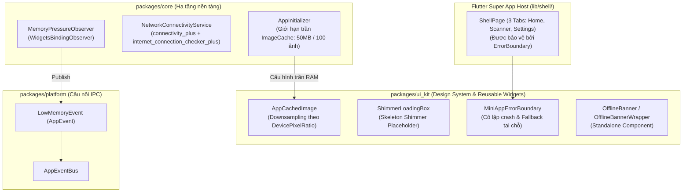
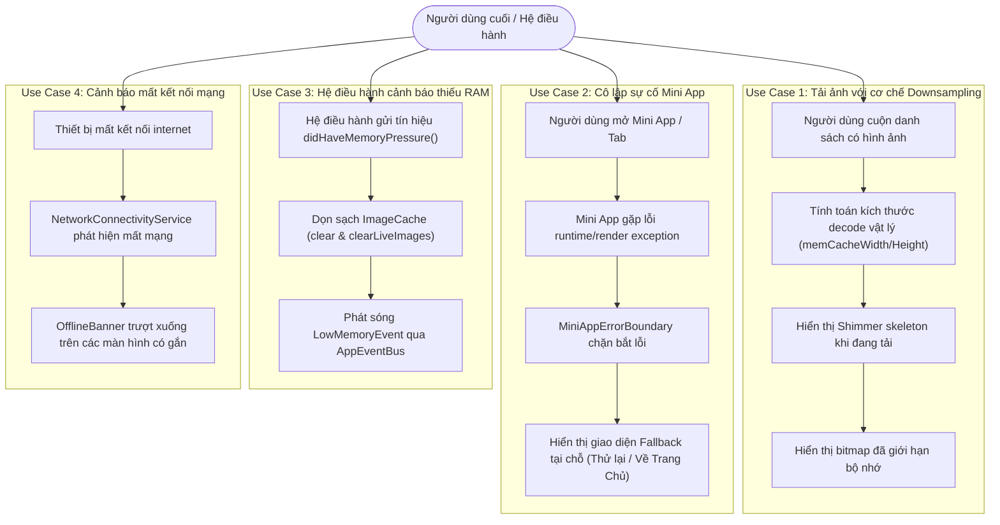
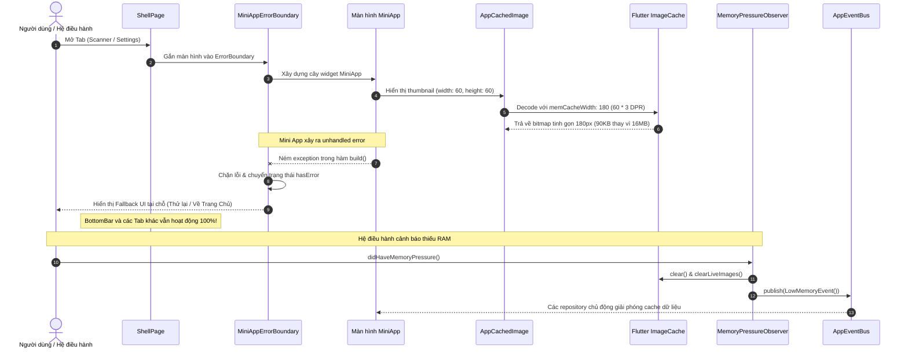

# Epic: Kiểm Soát Bộ Nhớ & Khả Năng Phục Hồi Siêu Ứng Dụng (Super App Resilience & Memory Management)

## 1. Thông Tin Chung (Meta Data)
- **Tên Epic:** `super_app_resilience_and_memory`
- **Trạng thái:** Đang tiến hành (Lập kế hoạch)
- **Bản phát hành mục tiêu:** v1.0.0
- **Tài liệu đặc tả nguồn (Source Spec):** [2026-09-11-super-app-resilience-and-memory-design.md](2026-09-11-super-app-resilience-and-memory-design.md)
- **Đội ngũ phụ trách:** Kỹ thuật & Kiến trúc Ứng dụng Di động

---

## 2. Bối Cảnh (Background)
Trong kiến trúc **Super App đa module (Multi-Package Architecture)** quy mô lớn, các Mini App (module tính năng) cùng vận hành trong một tiến trình host chung và chia sẻ tài nguyên runtime. Nếu không có các cơ chế phòng vệ chủ động, bốn dạng sự cố nghiêm trọng có thể đe dọa sự ổn định của hệ thống:
1. **Giải mã hình ảnh không kiểm soát (OOM):** Nạp ảnh độ phân giải cao vào các khung hiển thị nhỏ khiến Flutter Engine (Skia / Impeller) giải nén các bitmap khổng lồ không nén vào RAM đồ họa, dẫn đến lỗi tràn bộ nhớ (Out-Of-Memory) trên các thiết bị cấu hình vừa/thấp.
2. **Sập ứng dụng dây chuyền (Cascading Render Crashes):** Một exception không bắt được hoặc lỗi tràn layout trong một Mini App duy nhất sẽ khiến Flutter hiển thị "màn hình đỏ/xám chết chóc", làm sập khả năng sử dụng của toàn bộ Super App Shell.
3. **Thiếu cơ chế phản ứng khi hệ điều hành thiếu RAM:** Khi Android hoặc iOS phát tín hiệu cảnh báo bộ nhớ nguy cấp (`didHaveMemoryPressure`), app không tự động dọn rác bộ đệm ảnh và không thông báo cho các Mini App, dẫn đến việc bị OS kill đột ngột trong nền.
4. **Trải nghiệm mạng chập chờn:** Mất kết nối internet đột ngột gây ra các lỗi gọi API ngầm và làm vỡ giao diện nếu màn hình không có cơ chế nhận biết trạng thái ngoại tuyến.

Epic này xây dựng khung năng lực chịu lỗi 4 trụ cột nhằm bảo vệ Super App trước các nguy cơ cạn kiệt bộ nhớ, crash dây chuyền và biến động kết nối mạng.

---

## 3. Mục Tiêu & Ngoài Phạm Vi (Goals & Non-Goals)

### Mục Tiêu (Goals)
- **Tự động Downsampling RAM:** Cung cấp `AppCachedImage` trong `packages/ui_kit` tự động tính toán `memCacheWidth` / `memCacheHeight` dựa trên `devicePixelRatio` ngay lúc decode, tích hợp sẵn Shimmer skeleton loading và fallback khi ảnh hỏng.
- **Trần giới hạn bộ nhớ toàn cục:** Áp đặt trần bộ nhớ cứng cho `PaintingBinding.instance.imageCache` của Flutter (tối đa 50MB, tối đa 100 ảnh) trong `AppInitializer`.
- **Cô lập sự cố Mini App (Crash Isolation):** Cung cấp `MiniAppErrorBoundary` trong `packages/ui_kit` bọc lấy các entry point của Mini App, hiển thị giao diện phục hồi tại chỗ với 2 thao tác "Thử lại" và "Về Trang Chủ" mà không làm ảnh hưởng tới các Tab khác hay Host Shell.
- **Phản ứng cảnh báo thiếu RAM từ OS:** Xây dựng `MemoryPressureObserver` trong `packages/core` để dọn sạch cache ảnh và phát sóng sự kiện `LowMemoryEvent` qua `AppEventBus` của `packages/platform`.
- **Nhận biết trạng thái mạng phân tách:** Cung cấp `NetworkConnectivityService` trong `packages/core` và component độc lập `OfflineBanner` / `OfflineBannerWrapper` trong `packages/ui_kit` để mỗi màn hình chủ động gắn cảnh báo mất mạng khi cần.

### Ngoài Phạm Vi (Non-Goals)
- Xây dựng trình quản lý tải mã động runtime DFM (sẽ thực hiện ở giai đoạn sau).
- Thay thế HTTP client hoặc chính sách retry mạng (đã do `DioFactory` của `packages/network` đảm nhiệm).
- Ép buộc hiển thị banner mất mạng toàn cục ở mọi màn hình (người dùng đã duyệt phương án component độc lập tùy chọn).

---

## 4. Kiến Trúc & Thiết Kế Kỹ Thuật (Architecture & Technical Design)

### 4.1. Kiến Trúc Tổng Thể (High-Level Architecture)

### 4.2. Sơ Đồ Use Cases

### 4.3. Sơ Đồ Tuần Tự (Sequence Diagram)

### 4.4. Kịch bản Kiểm thử Hành vi BDD Tổng hợp & Living Documentation

Toàn bộ đặc tả kịch bản kiểm thử hành vi cho Epic này được viết theo chuẩn quốc tế Gherkin (`Given - When - Then`) tại:
👉 **[bdd_scenarios.md](bdd_scenarios.md)**

Tài liệu này mang lại giá trị kép:
1. **Tài liệu sống (Living Documentation) cho Developer**: Bất kỳ kỹ sư nào tham gia bảo trì sau này đều có thể nắm bắt ngay logic nghiệp vụ, các giá trị biên, máy trạng thái (state machine) và các kịch bản chịu tải/chịu lỗi mà không phải đọc hàng ngàn dòng code.
2. **Nạp ngữ cảnh tức thì cho AI Agent (Context Injection)**: Đóng vai trò bản giao kèo hành vi (behavioral contract) chuẩn xác tuyệt đối để nạp thẳng vào context window của AI Agent khi thực thi Phase 2 (QA Persona) của `epic-implementation`, loại bỏ hoàn toàn hiện tượng hallucination (ảo giác).

---

## 5. Chiến Lược Triển Khai & Giảm Thiểu Rủi Ro (Rollout Strategy & Mitigation)

- **Không gây breaking change:** `AppCachedImage`, `MiniAppErrorBoundary` và `OfflineBanner` là các component bổ sung trong `packages/ui_kit`. Mã nguồn hiện tại không bị ảnh hưởng tiêu cực.
- **Cơ chế phòng hộ an toàn:**
  - Nếu không thể xác định `devicePixelRatio`, `AppCachedImage` tự động chuyển sang giải nén mặc định mà không gây crash.
  - Trong `MiniAppErrorBoundary`, bấm "Thử lại" sẽ tạo lại cây widget con. Nếu lỗi vẫn tiếp diễn, người dùng có thể bấm "Về Trang Chủ" để quay về tab mặc định an toàn.
- **Lộ trình áp dụng từng bước:**
  1. Giai đoạn 1: Triển khai các component nền tảng trong `packages/core`, `packages/platform` và `packages/ui_kit`.
  2. Giai đoạn 2: Bọc 3 tab của Shell (`Home`, `Scanner`, `Settings`) trong `MiniAppErrorBoundary`.
  3. Giai đoạn 3: Tích hợp `MiniAppErrorBoundary` vào Mason brick `pac_mvi_feature` để mọi Mini App sinh mới đều mặc định được bảo vệ.

---

## 6. Phân Rã Công Việc Kanban (Kanban Tasks Breakdown)

- [ ] [Task 1: Tối ưu bộ nhớ đệm ảnh & Helper Downsampling](task_1_app_cached_image_and_ram_cap.md) ([Kanban Board Link](../../features/task_1_app_cached_image_and_ram_cap.md))
- [ ] [Task 2: Cô lập sự cố Mini App & Error Boundary](task_2_mini_app_error_boundary.md) ([Kanban Board Link](../../features/task_2_mini_app_error_boundary.md))
- [ ] [Task 3: Giám sát áp lực bộ nhớ & Sự kiện Low Memory](task_3_memory_pressure_observer.md) ([Kanban Board Link](../../features/task_3_memory_pressure_observer.md))
- [ ] [Task 4: Dịch vụ kết nối mạng & Standalone Offline Banner](task_4_network_connectivity_service_and_offline_banner.md) ([Kanban Board Link](../../features/task_4_network_connectivity_service_and_offline_banner.md))

