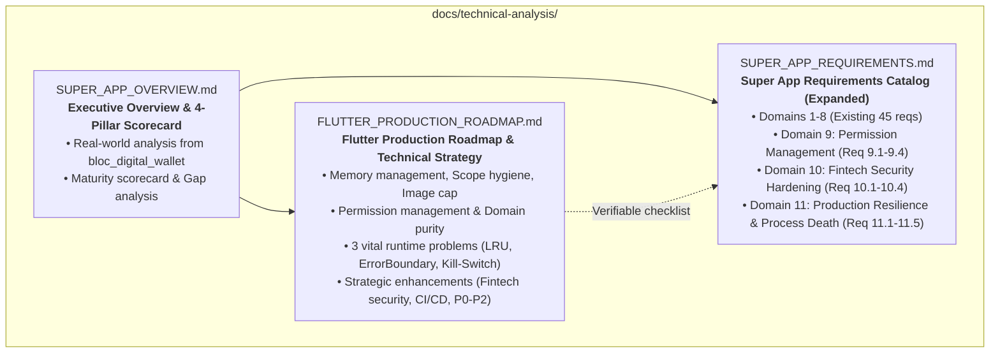

# Design Spec: Flutter Super App Production Roadmap & 4-Pillar Governance Synthesis

## Meta Data
- **Topic:** Super App Production Roadmap & 4-Pillar Governance Synthesis
- **Date:** 2026-09-16
- **Status:** Approved Draft (Brainstorming Complete)
- **Author:** Antigravity / d3nexus
- **Source Inputs:**
  - 4 Core Governance Pillars (Container & Modules, Central Routing & Communication, State Isolation, Lifecycle & CI/CD Governance)
  - Existing Reference: `docs/technical-analysis/PRODUCTION_ROADMAP.md` (Android Native perspective)
  - Monorepo Codebase: `bloc_digital_wallet` (Flutter, BLoC, Melos, Mason)
- **Target Deliverables:**
  1. `docs/technical-analysis/SUPER_APP_OVERVIEW.md` (New Executive Overview & 4-Pillar Scorecard)
  2. `docs/technical-analysis/FLUTTER_PRODUCTION_ROADMAP.md` (New in-depth technical roadmap for Flutter)
  3. `docs/technical-analysis/SUPER_APP_REQUIREMENTS.md` (Updated: expanded with Domains 9, 10, 11)
  4. `docs/README.md` (Updated: category navigation index)

---

## 1. Background & Context

The `bloc_digital_wallet` repository is a Flutter super-app monorepo carrying Clean Architecture + MVI, BLoC, Melos, FVM, and Mason automation.

While an existing `PRODUCTION_ROADMAP.md` in `docs/technical-analysis/` documents deep production-readiness strategies for Android Native (Compose, DFM, Dagger/Hilt, Coil, Room Paging 3), developers and AI agents building and extending the **Flutter Super App Template** require a dedicated, comprehensive synthesis that:
1. Grounded in the **4 Core Governance Pillars** (Container & Modules, Central Routing, State Isolation, Lifecycle CI/CD).
2. Translates every production criterion from `PRODUCTION_ROADMAP.md` into concrete, idiomatic **Flutter/Dart/BLoC** architectures.
3. Provides an **Executive Overview & Scorecard** reflecting actual implementation status and gap analysis in this monorepo.
4. Extends the verifiable checklist in `SUPER_APP_REQUIREMENTS.md` with explicit acceptance criteria.

---

## 2. Deliverable Architecture & File Structure

---

## 3. Detailed Specification of Deliverables

### Deliverable 1: `docs/technical-analysis/SUPER_APP_OVERVIEW.md`

#### Purpose
Executive-level assessment evaluating how the Flutter Super App Template implements the 4 Core Governance Pillars, highlighting critical factors for a production super-app, and presenting an honest gap analysis derived from the actual codebase.

#### Table of Contents
1. **Khung Quản Trị Cốt Lõi (The 4 Core Governance Pillars)**
   - Pillar 1: Kiến trúc Phân rã (Container & Modules)
     - Host App (`lib/`) as thin container: Auth, Network, Storage, Shell, DI composition.
     - Mini Apps (`features/*`) as independent packages scaffolded via Mason `pac_mvi_feature`.
     - Dual-Mode operational capability (`configure_mode.sh`: Enterprise 3-tab vs Lean 2-tab).
   - Pillar 2: Cơ chế Giao tiếp & Định tuyến tập trung (Communication & Central Routing)
     - DeepLink Router Engine: Zero cross-imports between Mini Apps; URL Schema & DeepLink routing via `DeepLinkCoordinator` & `DeepLinkRegistry`.
     - Event Bridge: Decoupled stateless `AppEventBus` in `packages/platform`.
     - DeepLinkAuthGuard: Protected routes, unauthenticated payload staging, post-login replay.
   - Pillar 3: Cô lập Trạng thái (State Isolation & Layered DI)
     - Localized State in BLoC (MVI, immutable state, unidirectional data flow).
     - DI Inversion: Host GetIt composition root, packages consume abstract domain interfaces.
     - Cross-package locale synchronization without leaking package internals (`LocalizationManager`).
   - Pillar 4: Quản trị Vòng đời (Lifecycle Governance & CI/CD)
     - Sandbox Development: Isolated package testing via `melos test` and `bloc_test`.
     - Module boundary enforcement via `scripts/check_module_boundaries.sh` blocking forbidden imports.
2. **Bảng Điểm Trưởng Thành Kiến Trúc (Super App Maturity Scorecard)**
   - Matrix scoring each mechanism: Design Goal vs Codebase Reality vs Maturity % (Container: 95%, Dual-Mode: 100%, Routing: 90%, Event Bus: 100%, State Isolation: 95%, DI: 90%, CI Boundaries: 100%, Sandbox: 75%).
3. **Phân Tích Khoảng Trống Thực Tế (Gap Analysis: Theory vs Flutter Reality)**
   - Dynamic Feature Modules (DFM) vs Flutter AOT Single Binary: Explaining why code push/dynamic APK splits don't apply to Flutter production (App Store / Play Store compliance) and how package modularization + OTA dynamic localization provides the practical equivalent.
   - Memory allocation churn & Image caching in Flutter engine (Skia/Impeller).
   - Hardware permission delegation.
4. **Định Vị Template: Dual-Mode (Lean Startup vs Enterprise Super App)**
   - How `scripts/configure_mode.sh` and `scripts/rename_project.sh` provide zero-friction adoption.

---

### Deliverable 2: `docs/technical-analysis/FLUTTER_PRODUCTION_ROADMAP.md`

#### Purpose
A production-readiness roadmap for Flutter monorepos, translating the criteria from `PRODUCTION_ROADMAP.md` into Flutter/Dart/BLoC architecture.

#### Table of Contents
1. **I. Triết Lý Thiết Kế: Core Tinh Gọn (Lean Core trong Flutter)**
   - Zero-bloat host container.
   - Well-defined extension seams (`packages/platform`, `packages/core`, `packages/network`).
   - On-demand adoption via Mason bricks and Melos packages.
2. **II. Chiến Lược Quản Lý Bộ Nhớ Toàn Diện (Memory Management Strategy)**
   - Scope Hygiene: Object scope lifecycle (Singleton vs Factory vs BLoC scope); StreamSubscription cancellation in BLoC `close()`.
   - UI Allocation Churn in Flutter: `const` constructor discipline, `buildWhen` in `BlocBuilder`, `ListView.builder(itemKey, addAutomaticKeepAlives: false)`, `AutomaticKeepAliveClientMixin` control.
   - Image Caching RAM Cap: `PaintingBinding.instance.imageCache.maximumSizeBytes` cap (25% heap), `memCacheWidth`/`memCacheHeight` decode downsampling in `AppCachedNetworkImage`.
   - OS Memory Pressure Handling: `WidgetsBindingObserver.didHaveMemoryPressure` broadcasting `LowMemoryEvent` on `AppEventBus`, clearing image/ephemeral RAM caches.
   - Large Dataset Pagination: Chunking, cursor pagination, avoiding loading 1000+ entities into RAM.
   - Leak Detection & Profiling: Flutter DevTools Memory Profiler, allocation tracking, leak detection practices.
3. **III. Chiến Lược Quản Lý Quyền Chuẩn Mực (Permission Management Strategy)**
   - Permission Classification on Modern Mobile (Install-time, Runtime, Special, Media).
   - Clean Architecture Domain Purity: Strict ban on importing `package:permission_handler` in Domain layer; abstract domain models (`PermissionStatus`).
   - UX Flow: In-context rationale, permanent denial handling, graceful degradation.
   - Super App Permission Gatekeeper: Host controls hardware permissions before invoking native plugins.
   - Permissionless Alternatives: Modern PhotoPicker (`image_picker`) avoiding `READ_MEDIA_IMAGES`.
4. **IV. Ba Bài Toán Sống Còn Cho Flutter Super App (Runtime Resilience)**
   - 1. LRU Mini App State Hibernation: Limiting concurrent active Mini Apps in `IndexedStack` / Navigator, saving state snapshot to Hive/CacheStore, hydrating on back navigation.
   - 2. Crash Isolation (Error Boundary) & Security Gatekeeper: `MiniAppErrorBoundary` widget preventing Mini App exceptions from crashing Host; Scoped Token Exchange (preventing master token leakage over EventBus).
   - 3. Router Kill-Switch & Remote Feature Flags: `FeatureFlagGuard` integrated into `DeepLinkCoordinator`, dynamic maintenance screens without app store submission.
5. **V. Danh Mục Nâng Cấp Chiến Lược (Strategic Enhancements Backlog)**
   - 1. Fintech Security Hardening: Biometrics (`local_auth` + Secure Storage), Device Integrity (Jailbreak/Root detection), Screen Privacy (`FLAG_SECURE` native bridge), SSL Pinning.
   - 2. Resilience & Offline-First: Realtime connectivity observer + `OfflineBanner`, Exponential backoff retry interceptor.
   - 3. Design System & UI Kit: Shimmer loading skeleton, Design Tokens standardization, Global Feedback Coordinator.
   - 4. DevOps & Release Automation: CI PR checks (`check_module_boundaries.sh`, `melos analyze`), Obfuscation (`--obfuscate --split-debug-info`), Flavors (dev, stg, prd).
   - 5. Telemetry & Observability: `AnalyticsTracker` seam in Platform, BLoC action/event breadcrumbs for crash telemetry.
   - 6. Process Death & State Restoration: `RestorableProperty` and saved state snapshots.
6. **VI. Ma Trận Phân Kỳ Triển Khai (Prioritized Execution Matrix: P0 / P1 / P2)**
   - Phased adoption matrix with architectural impact and triggering conditions.
7. **VII. Tổng Kết & Lộ Trình Hành Động (Action Roadmap)**
   - 8 concrete next steps to elevate the template to enterprise production grade.

---

### Deliverable 3: Updates to `docs/technical-analysis/SUPER_APP_REQUIREMENTS.md`

#### Additions
- **Domain 9: Permission Management & Domain Purity (Requirements 9.1 – 9.4)**:
  - 9.1: Domain layer permission purity (Zero `permission_handler` imports in domain).
  - 9.2: Host permission gatekeeper & rationale UX flow.
  - 9.3: Permissionless media picker integration.
  - 9.4: Multi-platform permission declaration synchronization.
- **Domain 10: Fintech Security Hardening (Requirements 10.1 – 10.4)**:
  - 10.1: Biometric authentication with secure storage key wrapping.
  - 10.2: Device integrity & root/jailbreak detection interface.
  - 10.3: Screen & memory privacy guard (`FLAG_SECURE`).
  - 10.4: Certificate pinning & TLS 1.2+ security configuration.
- **Domain 11: Production Resilience & Process Death (Requirements 11.1 – 11.5)**:
  - 11.1: LRU active mini app state hibernation and hydration.
  - 11.2: Remote config feature flag & router kill-switch.
  - 11.3: Mini app error boundary crash isolation (Already implemented).
  - 11.4: Scoped token exchange protocol for inter-module auth.
  - 11.5: UI state restoration on process death.
- **Update Implementation Summary Table**:
  - Reflect 11 total domains and 58 total requirements (showing implemented, in-progress, and planned status).
  - Add reference links to `SUPER_APP_OVERVIEW.md` and `FLUTTER_PRODUCTION_ROADMAP.md`.

---

### Deliverable 4: Navigation Updates in `docs/README.md`

- Update Technical Analysis category table in `docs/README.md` to list:
  - `SUPER_APP_OVERVIEW.md`: Executive overview and 4-pillar scorecard.
  - `FLUTTER_PRODUCTION_ROADMAP.md`: Flutter production readiness & memory strategy.
  - `PRODUCTION_ROADMAP.md`: Android native production roadmap.
  - `SUPER_APP_REQUIREMENTS.md`: 58-point governance requirements checklist.

---

## 4. Verification Plan

1. **Link Integrity & Cross-Reference Check**:
   - Verify that all relative links between `docs/README.md`, `SUPER_APP_OVERVIEW.md`, `FLUTTER_PRODUCTION_ROADMAP.md`, `PRODUCTION_ROADMAP.md`, and `SUPER_APP_REQUIREMENTS.md` resolve accurately.
2. **Ast & Linter Check**:
   - Zero markdownlint / mermaid syntax issues (`flowchart TD`, ` ` for line breaks, valid code fences).
   - Zero impact on Dart compiler/analyzer (`melos run analyze`).
3. **Consistency Verification**:
   - Ensure requirement numbers and domain titles match 1:1 between `SUPER_APP_OVERVIEW.md`, `FLUTTER_PRODUCTION_ROADMAP.md`, and `SUPER_APP_REQUIREMENTS.md`.
